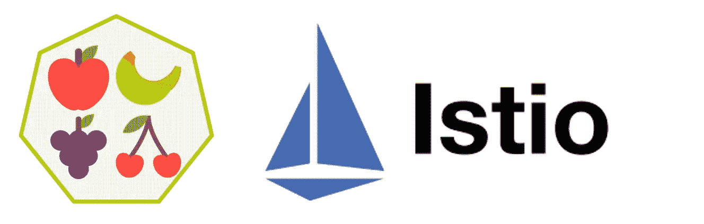
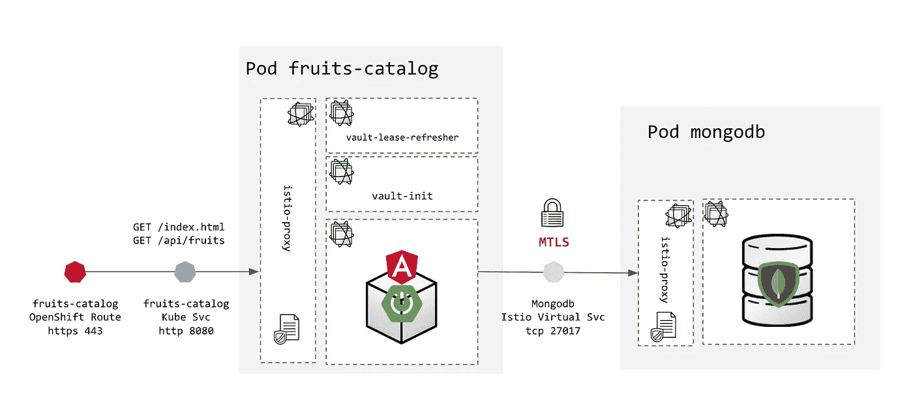
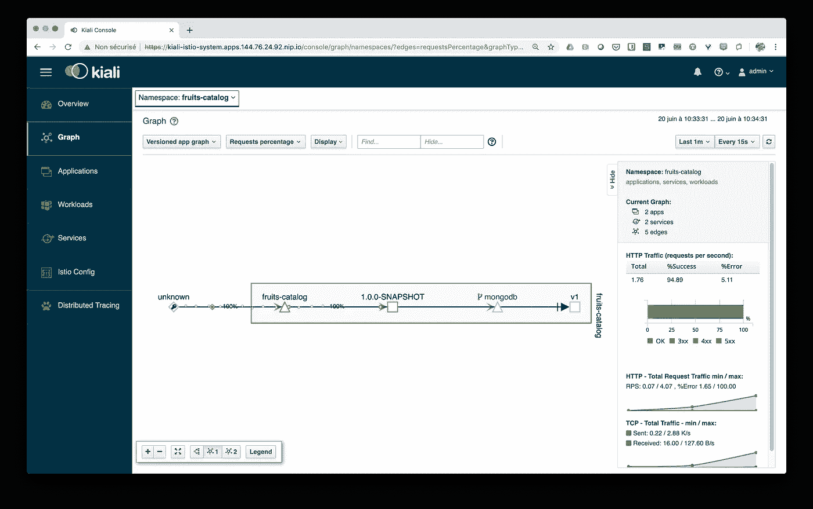
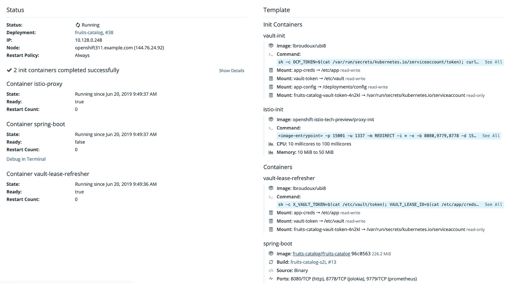
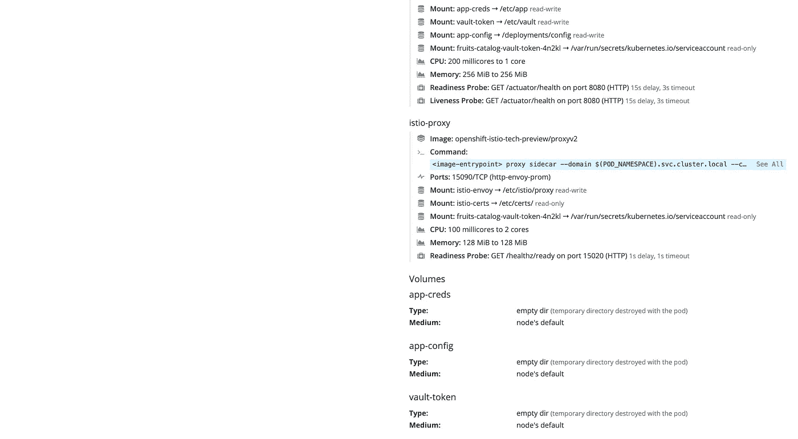
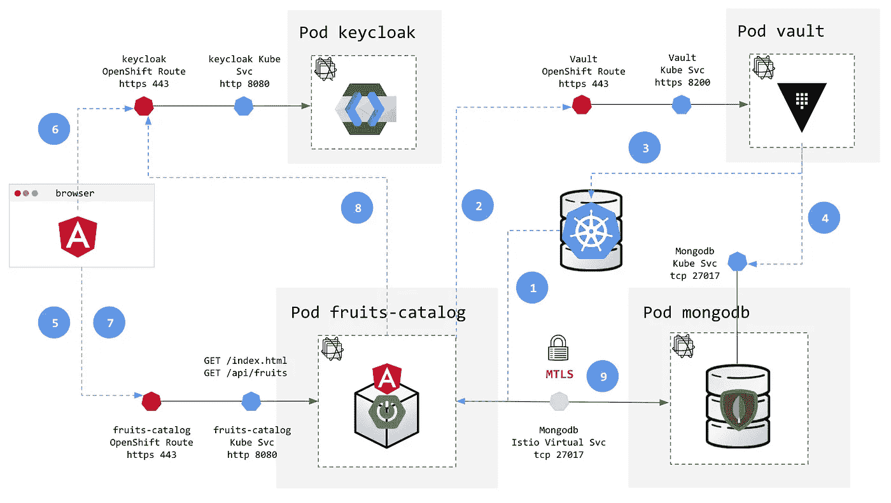

# 在 OpenShift 上为您的应用添加安全层—第 5 部分:使用 Istio 的 Mutual TLS

> 原文：<https://itnext.io/adding-security-layers-to-your-app-on-openshift-part-5-mutual-tls-with-istio-a8800c2e4df4?source=collection_archive---------2----------------------->

今天，保护你的应用程序是必须的，但是如果你没有在一开始就考虑它，那么在不修改代码的情况下引入它是很困难的。幸运的是，像 [Kubernetes](http://kubernetes.io) 这样的容器和平台带来的新的云原生模式提供了简单的方法来解决安全问题，而无需接触代码。

在保护我们的`fruits-catalog`应用程序的过程中，我们经历了许多主题:隔离和隔离、外部暴露、用户认证和授权、机密管理、数据库动态凭证生命周期，以及谈论容器云本机模式。但是等等…云原生模式不仅仅是关于容器的！

云原生模式来自于应用程序固有的高度分布式特性，这些应用程序可能托管在混合基础架构(不同的云提供商或内部)和架构风格上，如面向服务的架构及其称为[微服务](https://en.wikipedia.org/wiki/Microservices)的新演进步骤。然而，高度分布意味着众所周知的分布式计算的谬误[我们通常在应用程序中添加弹性和安全策略…](https://en.wikipedia.org/wiki/Fallacies_of_distributed_computing)

从安全的角度来看，云的原生采用也意味着要应用的安全模式发生了转变:从分离不可信和可信区域的外围安全-这种模式也称为城堡和壕沟-到**零信任网络**。这种转变是必要的，因为以下事实加剧了明显的中间人脆弱性:

*   越来越多的公司将数据分散在混合基础架构中，这使得很难建立单一的安全控制区域，
*   财务优化问题意味着应用程序资源的整合、共享和弹性，这使得持续调整和监控安全区域变得更加困难。

幸运的是，我们有一些新的工具来解决这个问题！一个[服务网格](https://enterprisersproject.com/article/2019/6/service-mesh-plain-english)是容器和分布式架构的关键组件，因为它完全是为了解决这个问题和实现零信任网络策略。在高层次上，服务网格确保应用程序服务之间的通信。它提供诸如流量路由、负载平衡以及服务发现、加密、认证和授权等功能。这篇文章将使用 [Istio 服务网格](https://istio.io)，并展示它如何保护并大大提高我们的`fruits-catalog`应用程序的加固水平。



第 5 部分—使用 Istio 服务网格通过 MTLS 保护集群内部传输

*这篇文章是一个更大的系列文章的一部分，讲述了如何给现有的应用增加安全层。目前公布的其他部分有:*

*   [*第 1 部分—部署和 TLS 入口*](https://medium.com/@lbroudoux/adding-security-layers-to-your-app-on-openshift-part-1-deployment-and-tls-ingress-9ef752835599)
*   [*第二部分——使用 Keycloak 的认证和授权*](https://medium.com/@lbroudoux/adding-security-layers-to-your-app-on-openshift-part-2-8320018bcdd1)
*   [*第三部分——金库秘密管理*](https://medium.com/@lbroudoux/adding-security-layers-to-your-app-on-openshift-part-3-secret-management-with-vault-8efd4ec29ec4)
*   [*第四部分——带金库的动态秘密*](https://medium.com/@lbroudoux/adding-security-layers-to-your-app-on-openshift-part-4-dynamic-secrets-with-vault-b5fe1fc7709b)
*   *第 5 部分——与 Istio 的共同 TLS(此职位)*
*   [*第 6 部分— PKI 即服务，带保险库和证书管理器*](https://medium.com/@lbroudoux/adding-security-layers-to-your-app-on-openshift-part-6-pki-as-a-service-with-vault-and-cert-e6dbbe7028c7)

# 我们想在这部分实现什么？

在这一部分中，我们将把 Istio 服务网格特性应用到我们的 pod`fruits-catalog`和`mongodb`中。虽然 Istio 提供了大量与[请求路由](https://istio.io/docs/tasks/traffic-management/request-routing/)、[弹性](https://istio.io/docs/tasks/traffic-management/circuit-breaking/)或[可观察性](https://istio.io/docs/tasks/telemetry/)相关的特性，但我们在这里将重点关注与[安全性](https://istio.io/docs/tasks/security/)相关的特性。

我们在这里特别关注启用 [Mutual TLS](https://istio.io/docs/concepts/security/#mutual-tls-authentication) 功能，以便在我们的 pod 之间进行通信。通过使用此功能，我们将实现两个要点:

*   **服务到服务认证** : Istio 为每个服务提供一个强身份，代表其角色，以实现跨集群和云的互操作性。因此，服务到服务的通信经受服务命名验证，防止恶意程序冒充目标服务(例如用于检查或窃取发送到数据库的数据)，
*   **服务到服务加密**:Istio 基础设施提供了一个 PKI，以及密钥和证书的自动生成、分发和在不同单元之间的轮换。如果通过身份验证，则使用分发到通信端的密钥对服务到服务的通信进行加密。

Istio 使用[边车容器](https://kubernetes.io/docs/concepts/workloads/pods/pod-overview/#understanding-pods)模式在我们的 pod 上操作，这个模式我们已经在本系列的第 3 部分和第 4 部分中遇到过。`istio-proxy`容器可以被注入到每个 pod 中，并充当 TCP 代理，拦截 pod 中的所有入站和出站流量。它将处理自定义证书，并负责应用我们为 pod 配置的不同策略。这就是下图所示的内容:



为了应用策略，我们将不得不切换到 Istio 带来的新概念，并用 Istio 中所谓的`VirtualService`取代之前的`mongodb` Kubernetes 服务。这样，在不对代码做任何修改的情况下，我们将把 Mutual TLS 引入我们的应用程序。

让我们看看如何轻松地应用这一点；-)

# 如何应用？

如果您已经阅读了本系列的第一部分，那么您可能已经克隆了包含所有资源和资产的 [my GitHub repository](https://github.com/lbroudoux/secured-fruits-catalog-k8s) 。如果没有，我敦促你这样做；-)从笔记本电脑上的克隆中，切换到`master`分支。

首先，我们需要在 OpenShift 集群上安装并激活 Istio。当使用 OpenShift 容器平台时，Istio 被称为 OpenShift 服务网格，关于如何部署它的说明可以在这里找到[。安装非常简单，因为它使用了一个](https://docs.openshift.com/container-platform/3.11/servicemesh-install/servicemesh-install.html)[操作器](https://blog.openshift.com/introducing-the-operator-framework/)，但是请注意[更新您的主配置，以允许我们正在使用的自动边车注射](https://docs.openshift.com/container-platform/3.11/servicemesh-install/servicemesh-install.html#updating-master-configuration)。

当将应用程序部署到在 OpenShift 环境中运行的 Istio 中时，当前有必要放松其服务帐户对应用程序的安全约束，以确保应用程序能够正确运行。让我们开始授予`anyuid`和`privileged`安全上下文约束，以使边车能够正确运行:

```
$ oc adm policy add-scc-to-user anyuid -z fruits-catalog-vault -n fruits-catalog
$ oc adm policy add-scc-to-user privileged -z fruits-catalog-vault -n fruits-catalog
```

然后，我们将简单地向现有部署添加注释`sidecar.istio.io/inject`。这是我们在 OpenShift 中添加的细粒度选择加入机制:Istio 在默认情况下不启用，也不针对特定项目，我们必须为每个部署启用它。以下是命令:

```
$ oc patch dc/mongodb --type=json -p '[{"op":"add", "path":"/spec/template/metadata/annotations/sidecar.istio.io~1inject ", "value":"true"}]' -n fruits-catalog$ oc patch dc/fruits-catalog --type=json -p '[{"op":"add", "path":"/spec/template/metadata/annotations/sidecar.istio.io~1inject", "value":"true"}]' -n fruits-catalog
```

修补这两个部署会触发新的部署部署，因为它被视为配置更改。一旦准备好，新的豆荚现在应该嵌入`istio-proxy`容器。我们还必须向`mongodb`部署添加一个新的`version`标签，以便稍后定义一些策略:

```
$ oc patch dc/mongodb --type=json -p '[{"op":"add", "path":"/spec/template/metadata/labels/version", "value":"v1"}]' -n fruits-catalog
```

最后，我们只需创建两个新的 Istio 定制资源(或 [CRD](https://kubernetes.io/docs/concepts/extend-kubernetes/api-extension/custom-resources/) ),名为`DestinationRule`和`VirtualService`。简而言之:一个虚拟服务允许定义一个抽象，其他多个工作负载托管在豆荚上，一个目的地规则允许定义流量或访问虚拟服务的策略。我们必须为`mongodb`应用服务创建两者:

```
$ oc apply -f k8s/mongodb-istio-destinationrule.yml -n fruits-catalog$ oc apply -f k8s/mongodb-istio-virtualservice.yml -n fruits-catalog
```

就是这样！我们刚刚启用了 Mutual TLS 来保护我们的应用程序的两个 pod 之间的通信；只需注释/标记我们的部署并创建 Istio 配置。不错！

# 检查它是否按预期工作

像所有以前的帖子一样，首先要做的显然是使用`fruits-catalog`路线的 URL 打开浏览器，并检查应用程序是否仍在工作。但是如果你想/需要深潜，这里有一些其他的检查。

服务网格通常由两部分组成:数据流动的数据平面(它由我们应用程序中的`istio-proxy`集合组成)和我们定义/应用/监控策略的控制平面。Istio 控制平面带有 [Kiali](https://www.kiali.io/) ，这是一个控制台，用于观察、测量和控制 Istio 服务网格中发生的事情。这样我们就能检索出 Kiali 进入控制台的路线:

```
$ oc get route/kiali -n istio-system                                                                     NAME      HOST/PORT                                     PATH      SERVICES   PORT      TERMINATION   WILDCARD
kiali     kiali-istio-system.apps.144.76.24.92.nip.io             kiali      20001     reencrypt     None
```

从之前的命令结果中获取 URL 并打开浏览器选项卡。您应该在访问控制台之前验证自己的身份。凭证依赖于你的安装，但是默认的只是`admin`/`admin`——我们也应该加强这个凭证的秘密管理；-)



Kiali 的控制台允许我们通过只选择来自`fruits-catalog`名称空间的元素来发现我们的应用程序。调整图形选项可以让我们看到通过服务网格的实时网络流量。您可以访问大量信息，如响应时间、吞吐量、错误率、分布式跟踪和 Istio 定制资源配置(稍后将详细介绍)。

然后，我们可以看看`fruits-catalog`吊舱部署，并检查我们是否一切就绪。以下是 OpenShift web 控制台的屏幕截图，显示了:

*   我们已经成功完成了一个初始化容器。我们还可以访问这个`vault-init`容器发出的命令，
*   我们有了名为`vault-lease-refresher`的第一个容器，并且仍然可以访问后一个容器发出的命令，
*   我们有第二个也是主要的容器，它是我们的应用程序，使用由 Init 容器编写的`application.properties`配置，
*   我们最终得到了第三个容器，即应用流量路由和安全策略的`istio-proxy`。
*   我们实际上还得到了一个`istio-init` Init 容器，它在启动时获取代理配置，并确保一切就绪，可以运行代理。



还记得我们最近谈到的`DestinationRule`吗？您可以使用 CLI 或通过 Kiali 控制台来访问`mongodb`服务的规则定义。您可以在这里简单地检查在到达 mongodb / v1 目的地时是否启用了`ISTIO_MUTUAL` TLS 策略:

```
apiVersion: networking.istio.io/v1alpha3
kind: DestinationRule
metadata:
  name: mongodb
spec:
  host: mongodb
  trafficPolicy:
    tls:
      mode: ISTIO_MUTUAL
  subsets:
  - name: v1
    labels:
      version: v1
```

最后，您还可以使用`istioctl` CLI 工具检查配置。通过执行以下命令，当数据从连接到`fruits-catalog`部署配置的 pod 流出时，我们将获得与`mongod.fruits-catalog.svc.cluster.local`通信的真实状态:

```
$ istioctl authn tls-check $(oc get pod -l deploymentconfig=fruits-catalog -o jsonpath={.items..metadata.name}) mongodb.fruits-catalog.svc.cluster.localHOST:PORT                                          STATUS     SERVER        CLIENT     AUTHN POLICY     DESTINATION RULE
mongodb.fruits-catalog.svc.cluster.local:27017     OK         HTTP/mTLS     mTLS       default/         mongodb/fruits-catalog
```

# 结论

在这第五部分中，我们已经看到了服务网格对于将安全特性引入其他现有应用程序是多么的强大。 [Istio](http://www.istio.io) 提供了一个服务网格实现，该实现现已嵌入并完全支持 [OpenShift 容器平台版本 4.1](https://access.redhat.com/announcements/4180011) 。我们已经看到，使用它的 Mutual TLS 特性只需要向我们的部署添加一个注释，就可以选择进入网格并声明一个目的地规则！

通过这个系列，我们已经在现有的`fruits-catalog`应用程序中增加了许多安全层，这些应用程序在开发时没有考虑到安全问题。现在，让我总结一下:

*   首先，我们通过将组件打包并部署在 [OpenShift](http://www.openshift.com) 上，将组件与外界隔离开来。我们还使用 TLS 路由来保护他们的暴露，
*   然后，在第二部分中，我们添加了 IAM 层，在 UI 和 API 端点上添加了身份验证和授权，在 OpenShift 上部署和配置了 [Keycloak](http://www.keycloak.org) ，
*   在第三和第四部分中，我们解决了秘密管理的问题，使用 [Hashicorp Vault](http://www.vaultproject.io) 实现了一个健壮的、动态的和短暂的凭证生成过程。该过程防止了凭证泄露，
*   最后，我们展示了如何使用服务网格的概念来实现安全问题，如服务之间的认证和加密通信，从而实现真正的零信任网络，能够跨越其他混合基础架构。

因为一个小图片比一个长的演讲更有意义，下面的图表代表了我们实现的所有架构，在不接触代码库的情况下完成了我们的应用程序的新部署！



我希望您喜欢和我一起阅读这个系列，并学习或发现一些增强应用程序安全性的技术。通过评论或鼓掌反馈是非常受欢迎的！