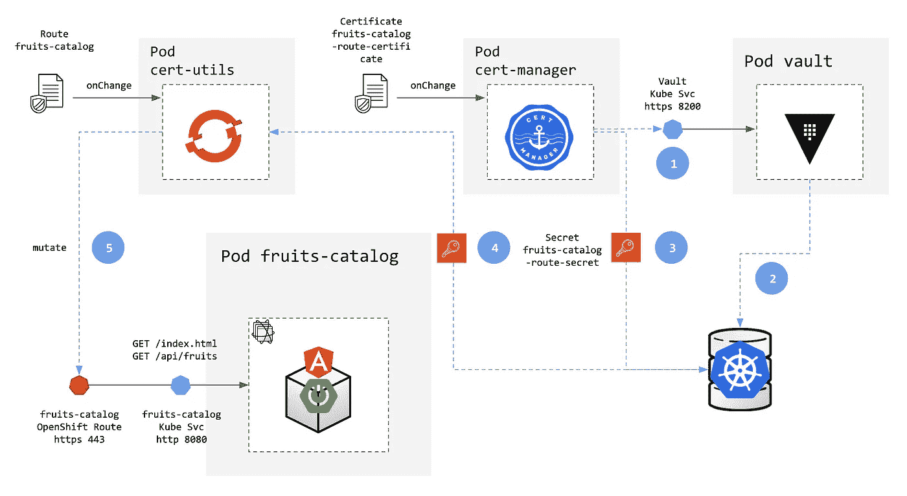
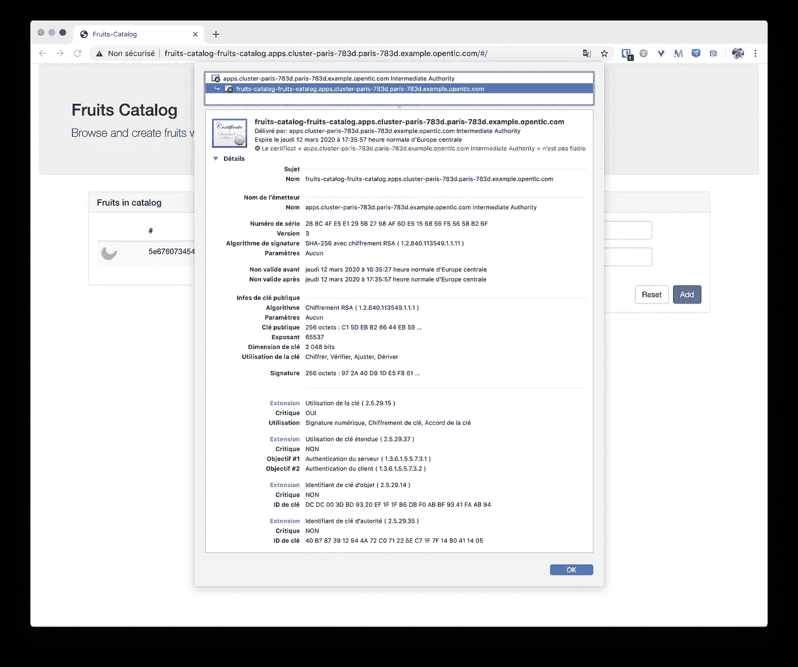
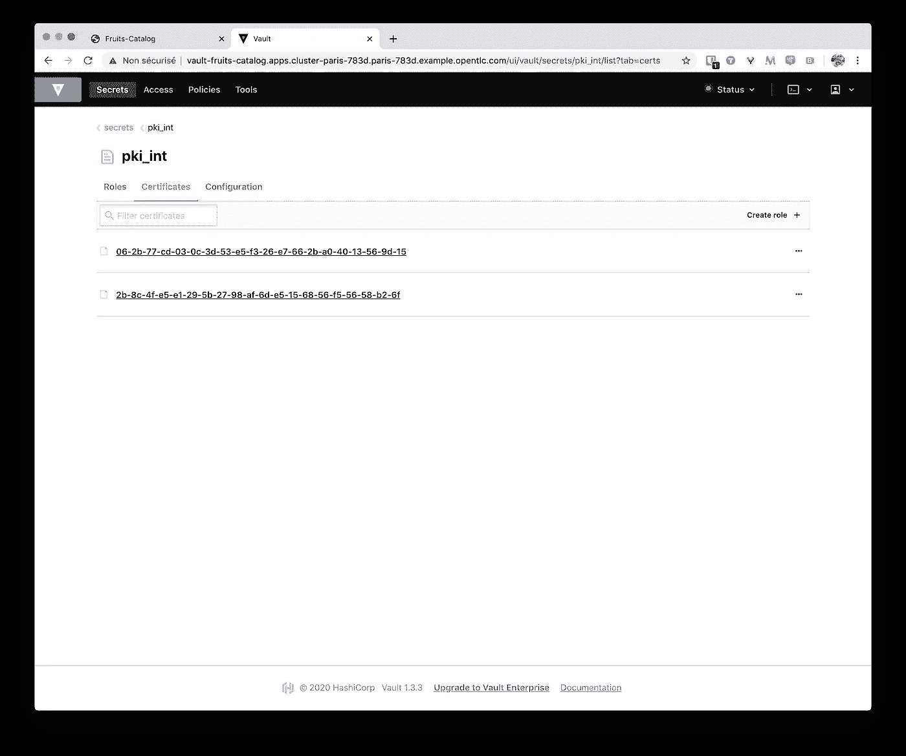

# 在 OpenShift 上向您的应用程序添加安全层-第 6 部分:使用 Vault 和 Cert Manager 的 PKI 服务

> 原文：<https://itnext.io/adding-security-layers-to-your-app-on-openshift-part-6-pki-as-a-service-with-vault-and-cert-e6dbbe7028c7?source=collection_archive---------0----------------------->

今天，保护你的应用程序是必须的，但是如果你没有在一开始就考虑它，那么在不修改代码的情况下引入它是很困难的。幸运的是，像 [Kubernetes](http://kubernetes.io/) 这样的容器和平台带来的新的云原生模式提供了简单的方法来解决安全问题，而无需接触代码。

在本系列的第一部分中，我们已经学习了如何将我们的`fruits-catalog`应用程序部署为容器。我们已经在 Red Hat Kubernetes 发行版 [OpenShift](http://www.openshift.com/) 上展示了容器化的好处，并完成了我们如何在 TLS 支持下通过 [Route](https://docs.openshift.com/container-platform/3.11/dev_guide/routes.html) 轻松保护对应用程序的访问。

但是，我们并没有深入研究 TLS 证书是如何颁发和分发的……我们应用了使用通配符证书的默认配置——这对于任务关键型平台来说可能是一个非常糟糕的想法。这个新的部分是关于如何在这个高度不稳定的云本地环境中自动化证书管理。我们将使用 [Cert-Manager](https://cert-manager.io/) 和 [Hashicorp Vault](http://vaultproject.io/) 来部署一个 [PKI](https://en.wikipedia.org/wiki/Public_key_infrastructure) 作为服务方法，从而深入研究证书发布的细节。

> 这部分由 Hashicorp 的 [Nicolas Ehrman](https://medium.com/@nehrman) 实现并校对。感谢 Nico 的帮助和建议！


第 6 部分—使用 Vault 和证书管理器的 PKI 服务

*这篇文章是一个更大的系列文章的一部分，讲述了如何给现有的应用程序增加安全层。到目前为止公布的其他部分有:*

*   [*第 1 部分——部署和 TLS 入口*](https://medium.com/@lbroudoux/adding-security-layers-to-your-app-on-openshift-part-1-deployment-and-tls-ingress-9ef752835599)
*   [*第二部分——使用 Keycloak 进行认证和授权*](https://medium.com/@lbroudoux/adding-security-layers-to-your-app-on-openshift-part-2-8320018bcdd1)
*   [*第三部分——金库秘密管理*](https://medium.com/@lbroudoux/adding-security-layers-to-your-app-on-openshift-part-3-secret-management-with-vault-8efd4ec29ec4)
*   [*第四部分——带金库的动态秘密*](https://medium.com/@lbroudoux/adding-security-layers-to-your-app-on-openshift-part-4-dynamic-secrets-with-vault-b5fe1fc7709b)
*   [*第 5 部分——与 Istio*](https://medium.com/@lbroudoux/adding-security-layers-to-your-app-on-openshift-part-5-mutual-tls-with-istio-a8800c2e4df4) 的相互 TLS
*   *第 6 部分—使用保管库和证书管理器的 PKI 服务(本文)*

# 我们想在这部分实现什么？

如上所述，默认的 OpenShift 设置使用通配符证书来保护所有需要 TLS 传输的路由。因为这在许多情况下可能是一个真正的好主意，比如非生产环境、只有很少终端可以公开的初创公司或对成本感到困扰的公司(即使 [Let's Encrypt 现在提供免费的通配符证书](https://community.letsencrypt.org/t/acme-v2-and-wildcard-certificate-support-is-live/55579))；对于大多数公司来说，这通常不是一个好主意。事实上，通配符证书与安全原则相矛盾，即[降低风险](https://searchdisasterrecovery.techtarget.com/definition/risk-mitigation)。一旦通配符证书遭到破坏或损坏，或者需要刷新，所有子域以及使用它的应用程序都会受到影响！

另一方面，管理每个应用程序的证书颁发、撤销和续订(尤其是在高度不稳定的环境中)可能是一项艰巨的任务，如果不是自动化的话。这就是[证书管理器](https://cert-manager.io/)出现的原因！Cert Manager 是一款自动化软件，用于在云环境中自动管理证书。它允许发布、刷新和撤销证书，并与我们想要存储根证书和中间证书颁发机构的 Vault 很好地集成。

因此，我们将为 OpenShift 部署名为 [Cert Utils](https://github.com/redhat-cop/cert-utils-operator) 的 Cert Manager 及其配套工具。该组件将在部署时用于发布关于即将到来的部署请求的证书，并将它们注入我们的资源。新组件将对我们部署链上的两个新事件做出反应:

*   名为`Certificate`的新 Kubernetes 资源的创建/更新/删除(这实际上是一个证书发布请求)，
*   创建/更新/删除我们已经存在的`Route`



完整流程可以描述如下:

1.  在应用程序`Certificate`上发生“变更事件”时，Cert Manager 将负责发布与请求参数相对应的新证书。为此，Cert Manager 将调用拥有我们的根私钥基础结构和一些中间私钥基础结构的 Vault，
2.  在颁发新证书之前，Vault 将使用 Kubernetes 作为身份验证提供者来检查证书管理器的真实性和权限。然后，它将创建一个由根 CA 签名的特定证书，
3.  证书管理器将把这个新证书存储为 Kubernetes [秘密](https://kubernetes.io/docs/concepts/configuration/secret/)。证书信息确实由三个属性表示到这个秘密中:`ca.crt`、`tls.crt`和`tls.key`
4.  在应用程序`Route`上的“变更事件”中，Cert Utils 将检索先前创建的秘密，
5.  然后，它将变异—在这里意味着“注入”—使用这个新证书的路由。该路由被重新配置为使用这个新生成的证书来使用和公开对应用程序端点的访问。

# 如何应用？

> 在开始动手操作之前，我们假设您已经部署并配置了 Vault 来使用 Kubernetes 身份验证。如何做到这一点在本系列的第 3 部分中有详细介绍。

现在让我们开始配置 Vault 来托管我们的 PKI。第一步是安装一个新的`pki`后端。接下来，必须使用 CA 证书和关联的私钥来配置 Vault。我们将利用后端的自签名根生成支持，但 Vault 也支持生成中间 CA(带有用于签名的 CSR)或直接在后端设置 PEM 编码的证书和私钥包。

在我们的设置中，我们将使用一个根证书来签署 CA 中间证书。因为它是一个根，我们想为证书设置一个长的最大生命周期；因为它支持最大装载 TTL，所以在生成与我们的全局集群 URL 相对应的新 CA 证书之前，我们首先对其进行调整——这是`$COMMON_NAME`:

```
$ vault secrets enable -tls-skip-verify pki
Success! Enabled the pki secrets engine at: pki/$ vault secrets tune -tls-skip-verify -max-lease-ttl=8760h pki
Success! Tuned the secrets engine at: pki/$ export COMMON_NAME=$(echo $(oc whoami --show-server) | sed -E -n 's=[https://api.(.*):6443=\1=p')](https://api.(.*):6443=\1=p'))$ vault write -tls-skip-verify pki/root/generate/internal \
    common_name="$COMMON_NAME Root Authority" \
    ttl=8760h
```

我们现在必须设置我们的中间 CA，为此我们将使用一个不同的名为`pki_int`的 PKI 后端。我们还可以在这里调整已颁发证书的最大 TTL，它应该小于或等于根 CA TTL。然后，我们必须要求中介生成一个证书签名请求，该请求将被存储到一个名为`pki_int.csr`的本地文件中。然后，我们从中间机构获取签名请求，并使用根机构对其进行签名；然后将得到的签名证书设置为中间机构。下面的命令就是这样做的:

```
$ vault secrets enable -tls-skip-verify -path=pki_int pki
Success! Enabled the pki secrets engine at: pki_int/$ vault secrets tune -tls-skip-verify -max-lease-ttl=30m pki_int
Success! Tuned the secrets engine at: pki_int/$ vault write -tls-skip-verify -field=csr pki_int/intermediate/generate/internal \
    common_name="apps.$COMMON_NAME Intermediate Authority" \
    ttl=4760h >> [pki_int](http://twitter.com/pki_int).csr$ vault write -tls-skip-verify -field=certificate pki/root/sign-intermediate csr=[@pki_int](http://twitter.com/pki_int).csr format=pem_bundle ttl=4760h >> [signed_certificate](http://twitter.com/signed_certificate).pem$ vault write -tls-skip-verify pki_int/intermediate/set-signed certificate=[@signed_certificate](http://twitter.com/signed_certificate).pem
Success! Data written to: pki_int/intermediate/set-signed
```

最后，我们必须配置使用这个中间 PKI 的 URL 端点。我们还必须配置一个角色——一个映射到用于生成新证书的策略的逻辑名称。例如，我们在这里使用了一个由第三个命令创建的策略`cert-manager-vault-issuer-pki-policy`引用的`example-opentlc-com`角色:

```
$ vault write -tls-skip-verify pki_int/config/urls \
    issuing_certificates="$VAULT_ADDR/v1/pki_int/ca" \
    crl_distribution_points="$VAULT_ADDR/v1/pki_int/crl"
Success! Data written to: pki_int/config/urls$ vault write -tls-skip-verify pki_int/roles/example-opentlc-com \
    allowed_domains="apps.$COMMON_NAME" \
    allow_subdomains=true \
    max_ttl=1h
Success! Data written to: pki_int/roles/example-opentlc-com$ vault policy write -tls-skip-verify cert-manager-vault-issuer-pki-policy ./k8s/cert-manager-vault-issuer-policy-pki.hcl
Success! Uploaded policy: cert-manager-vault-issuer-pki-policy
```

现在，保险库部分是确定的，让我们处理证书管理器的东西！我们将开始创建一个新项目来托管我们的新组件`cert-manager`和`cert-utils`。我们需要注释这个新的名称空间，告诉 Cert Manager 不要验证这个项目。

```
$ oc new-project cert-manager
$ oc label namespace cert-manager certmanager.k8s.io/disable-validation=true
$ oc apply --validate=false -f [https://github.com/jetstack/cert-manager/releases/download/v0.13.0/cert-manager-openshift.yaml](https://github.com/jetstack/cert-manager/releases/download/v0.13.0/cert-manager-openshift.yaml)
```

对于 OpenShift，我们需要部署 Cert Utils 配套组件。这可以使用 Helm 打包实用程序来完成:您需要在工作站上安装`helm` CLI 工具。

```
$ helm version
version.BuildInfo{Version:"v3.0.3", GitCommit:"ac925eb7279f4a6955df663a0128044a8a6b7593", GitTreeState:"clean", GoVersion:"go1.13.7"}$ export CERT_UTILS_CHART_VERSION=$(helm search repo cert-utils-operator/cert-utils-operator | grep cert-utils-operator/cert-utils-operator | awk '{print $2}')$ helm fetch cert-utils-operator/cert-utils-operator --version ${CERT_UTILS_CHART_VERSION}$ helm template cert-utils-operator-${CERT_UTILS_CHART_VERSION}.tgz --namespace cert-manager | oc apply -f - -n cert-manager
```

在 Cert Manager 上，我们必须声明一个`Issuer`，它将能够使用一些 PKI 来处理证书创建。幸运的是，证书管理器有一个保险库实现。为了只允许此颁发者向 Vault 请求新证书，我们必须创建一个专用服务帐户，其令牌和相关证书将用于配置此`vault-issuer`。在保险库端，在实际创建发行者之前，我们必须声明这个`cert-manager-vault-issuer`服务帐户可以用来触发之前声明的策略:

```
$ oc create sa cert-manager-vault-issuer -n cert-manager$ export CERT_MANAGER_ISSUER_TOKEN=$(oc get sa/cert-manager-vault-issuer -n cert-manager -o yaml | grep cert-manager-vault-issuer-token | awk '{print $3}')$ export VAULT_LISTENER_CERT=$(oc exec -n fruits-catalog -it $(oc get pods -n fruits-catalog | grep vault | awk '{print $1}') -- /bin/sh -c "cat /var/run/secrets/kubernetes.io/certs/tls.crt")# Report this values in vault-issuer.yml
$ sed -i '' 's=CERT_MANAGER_ISSUER_TOKEN='"$CERT_MANAGER_ISSUER_TOKEN"'=' k8s/vault-issuer.yml
$ sed -i '' 's=VAULT_LISTENER_CERT='"$(echo $VAULT_LISTENER_CERT | base64)"'=' k8s/vault-issuer.yml$ vault write -tls-skip-verify auth/kubernetes/role/cert-manager-vault-issuer \
  bound_service_account_names=cert-manager-vault-issuer \
  bound_service_account_namespaces=cert-manager \
  policies=cert-manager-vault-issuer-pki-policy \
  ttl=24h
Success! Data written to: auth/kubernetes/role/cert-manager-vault-issuer$ oc apply -f ./k8s/vault-issuer.yml -n cert-manager
```

现在应该可以运行了！

# 检查它是否按预期工作

现在，最后创建一个`Certificate`资源，该资源将由证书管理器处理，以颁发新证书并创建请求的机密:

```
$ export FRUITS_CATALOG_ROUTE=$(oc get routes fruits-catalog -n fruits-catalog | grep fruits-catalog | awk '{print $2}')$ sed -i '' 's=FRUITS_CATALOG_ROUTE='"$FRUITS_CATALOG_ROUTE"'=g' k8s/fruits-catalog-route-certificate.yml$ oc apply -f ./k8s/fruits-catalog-route-certificate.yml -n fruits-catalog
```

几秒钟后，检查是否创建了新的`fruits-catalog-route-secret`密钥，并保存了密钥和 ca.crt 条目:

```
$ oc get secrets fruits-catalog-route-secret -o yaml -n fruits-catalog
apiVersion: v1
data:
  ca.crt: LS0tLS1CRUdJTiBDRVJUSUZJQ0FURS0tLS0tCk1JSURsRENDQW55Z0F3SUJBZ0lVYitML1luZStaNGhLcUFNRXZwaW0wcDRsSnZVd0RRWUpLb1pJaHZjTkFRRUwKQlFBd1N6RkpNRWNHQTFVRUF4TkFZMngxYzNSbGNpMXdZWEpwY3kweVltUTBMbkJoY21sekxUSmlaRFF1WlhoaApiWEJzWlM1dmNHVnVkR3hqTG1OdmJTQlNiMjkwSUVGMWRHaHZjbWwwZVRBZUZ3MHlNREF6TURZeE16VTBOREphCkZ3MHlNREE1TWpBeU1UVTFNVEphTUZneFZqQlVCZ05WQkFNVFRXRndjSE11WTJ4MWMzUmxjaTF3WVhKcGN5MHkKWW1RMExuQmhjbWx6TFRKaVpEUXVaWGhoYlhCc1pTNXZjR1Z1ZEd4akxtTnZiU0JKYm5SbGNtMWxaR2xoZEdVZwpRWFYwYUc5eWFYUjVNSUlCSWpBTkJna3Foa2lHOXcwQkFRRUZBQU9DQVE4QU1JSUJDZ0tDQVFFQXdKb1RabGtSCkNPWDBNdHBzVitpaHdQeHRFOG1vVTZMVVpsd2FLR2NuNk5CVWRDdHhpdGpoTGpqLzliTjdFT3I0ZkYxQXIxL1QKcFlodThPSEdaNDZNQlhzZjVJOUE1dmJIVlBLZnhDMFZsckgzd1dPend1M2pFRGFPdE11NDZFYjlMeWhNRXk5QQpMaXYyalhSdEFhRWpOU0F5WlJtRTF0RWRNWTdha2xjVkc3a21jLy9qblN3NUJwSEpuNElnZVFoQTgzSDl1WWoxCmN6Y3ZnL1pMbk0zTmVJY01mTFhtZDFSN2NZZEhBam1adDdFMGZuVTBkaDdQajlmRnZ4MUIraDFMYnRRQ1J3a2oKeXAvbmlrb0tIQkJLZk41SkxwYkJ6TXFpNm1uVmdlbzJjNUx2Y0t2WmlmUEMzTlFodFBRODRoYWNmWUtMVm5ESApKN2ZybS83VzV3aW9zd0lEQVFBQm8yTXdZVEFPQmdOVkhROEJBZjhFQkFNQ0FRWXdEd1lEVlIwVEFRSC9CQVV3CkF3RUIvekFkQmdOVkhRNEVGZ1FVa0daN3l1Rm1pcGl3a2JNdDdOUGxIQTdTNlZjd0h3WURWUjBqQkJnd0ZvQVUKVElUZVBtMUdQT0tFbXpyTjhSaGJBUm9IQ0VFd0RRWUpLb1pJaHZjTkFRRUxCUUFEZ2dFQkFEcVE5cWhaTHJ3bwpISXE0YlJOUTJYODI4WTZsYno0V3BrdDNGalQyNCtwMWVFaGdLYVhvV2d5RmlxekxxRnZoSmhRUFRhZ2JYL1JUCmgyODgwd2hvYTROUExxR2pZK0hUdjRkcnZNaVJWY0I3S0F3WUFLbWxiamluRk9MNS9abzROVFJESUJPWGpQWVcKcVFBRUxtb1FvNVpXQ01HOC8ycWFoRWVYM3dvV293Mm5oRW1DLzNFTTV4NEhLRGZuOXA3azYvZFU4NmN3TnhPNwpYcVJZcExyQ2xnUUpLS09aYWJPeHdSVk02TmNGUTR0c3ZGRGZGOXJEdjNXc0VhV1JkRlA0RzdjeUhSOGk2a1J3CmFHUFdaTHQyRk9xZ1locWNWU094V3pMbWhEaFg4bkN2S1pEUHhWa1pBcUFyVGVidlRHZDhyZkVsVDdrVDkrTFQKMVVRSWN4ZmNCcm89Ci0tLS0tRU5EIENFUlRJRklDQVRFLS0tLS0=
[...]
```

现在是时候注释您的路由了，这样这个秘密条目将被注入到您的路由中，以便向访问应用程序的用户提供这个特定的证书:

```
$ oc annotate routes/fruits-catalog cert-utils-operator.redhat-cop.io/certs-from-secret=fruits-catalog-route-secret -n fruits-catalog
```

同样，在检查路线详细信息和获取证书信息之前，请等待几秒钟:

```
$ oc get route fruits-catalog -o yaml -n fruits-catalog
apiVersion: route.openshift.io/v1
kind: Route
metadata:
  annotations:
    cert-utils-operator.redhat-cop.io/certs-from-secret: fruits-catalog-route-secret
    [...]
  labels:
    app: fruits-catalog
    expose: "true"
    group: com.github.lbroudoux.msa
    provider: fabric8
    version: 1.0.0-SNAPSHOT
  name: fruits-catalog
  namespace: fruits-catalog
  [...]
  port:
    targetPort: 8080
  tls:
    caCertificate: |-
      -----BEGIN CERTIFICATE-----
    MIIDlDCCAnygAwIBAgIUb+L/Yne+Z4hKqAMEvpim0p4lJvUwDQYJKoZIhvcNAQEL
    BQAwSzFJMEcGA1UEAxNAY2x1c3Rlci1wYXJpcy0yYmQ0LnBhcmlzLTJiZDQuZXhh
    bXBsZS5vcGVudGxjLmNvbSBSb290IEF1dGhvcml0eTAeFw0yMDAzMDYxMzU0NDJa
    Fw0yMDA5MjAyMTU1MTJaMFgxVjBUBgNVBAMTTWFwcHMuY2x1c3Rlci1wYXJpcy0y
    YmQ0LnBhcmlzLTJiZDQuZXhhbXBsZS5vcGVudGxjLmNvbSBJbnRlcm1lZGlhdGUg
    QXV0aG9yaXR5MIIBIjANBgkqhkiG9w0BAQEFAAOCAQ8AMIIBCgKCAQEAwJoTZlkR
    COX0MtpsV+ihwPxtE8moU6LUZlwaKGcn6NBUdCtxitjhLjj/9bN7EOr4fF1Ar1/T
    pYhu8OHGZ46MBXsf5I9A5vbHVPKfxC0VlrH3wWOzwu3jEDaOtMu46Eb9LyhMEy9A
    Liv2jXRtAaEjNSAyZRmE1tEdMY7aklcVG7kmc//jnSw5BpHJn4IgeQhA83H9uYj1
    czcvg/ZLnM3NeIcMfLXmd1R7cYdHAjmZt7E0fnU0dh7Pj9fFvx1B+h1LbtQCRwkj
    yp/nikoKHBBKfN5JLpbBzMqi6mnVgeo2c5LvcKvZifPC3NQhtPQ84hacfYKLVnDH
    J7frm/7W5wioswIDAQABo2MwYTAOBgNVHQ8BAf8EBAMCAQYwDwYDVR0TAQH/BAUw
    AwEB/zAdBgNVHQ4EFgQUkGZ7yuFmipiwkbMt7NPlHA7S6VcwHwYDVR0jBBgwFoAU
    TITePm1GPOKEmzrN8RhbARoHCEEwDQYJKoZIhvcNAQELBQADggEBADqQ9qhZLrwo
    HIq4bRNQ2X828Y6lbz4Wpkt3FjT24+p1eEhgKaXoWgyFiqzLqFvhJhQPTagbX/RT
    h2880whoa4NPLqGjY+HTv4drvMiRVcB7KAwYAKmlbjinFOL5/Zo4NTRDIBOXjPYW
    qQAELmoQo5ZWCMG8/2qahEeX3woWow2nhEmC/3EM5x4HKDfn9p7k6/dU86cwNxO7
    XqRYpLrClgQJKKOZabOxwRVM6NcFQ4tsvFDfF9rDv3WsEaWRdFP4G7cyHR8i6kRw
    aGPWZLt2FOqgYhqcVSOxWzLmhDhX8nCvKZDPxVkZAqArTebvTGd8rfElT7kT9+LT
     1UQIcxfcBro=
      -----END CERTIFICATE-----
[...]
```

您甚至可以验证路由的`caCertificate`是在`ca.crt`秘密条目中找到的 base64 解码字符串:

```
$ echo LS0tLS1CRUdJTiBDRVJUSUZJQ0FURS0tLS0tCk1JSURsRENDQW55Z0F3SUJBZ0lVYitML1luZStaNGhLcUFNRXZwaW0wcDRsSnZVd0RRWUpLb1pJaHZjTkFRRUwKQlFBd1N6RkpNRWNHQTFVRUF4TkFZMngxYzNSbGNpMXdZWEpwY3kweVltUTBMbkJoY21sekxUSmlaRFF1WlhoaApiWEJzWlM1dmNHVnVkR3hqTG1OdmJTQlNiMjkwSUVGMWRHaHZjbWwwZVRBZUZ3MHlNREF6TURZeE16VTBOREphCkZ3MHlNREE1TWpBeU1UVTFNVEphTUZneFZqQlVCZ05WQkFNVFRXRndjSE11WTJ4MWMzUmxjaTF3WVhKcGN5MHkKWW1RMExuQmhjbWx6TFRKaVpEUXVaWGhoYlhCc1pTNXZjR1Z1ZEd4akxtTnZiU0JKYm5SbGNtMWxaR2xoZEdVZwpRWFYwYUc5eWFYUjVNSUlCSWpBTkJna3Foa2lHOXcwQkFRRUZBQU9DQVE4QU1JSUJDZ0tDQVFFQXdKb1RabGtSCkNPWDBNdHBzVitpaHdQeHRFOG1vVTZMVVpsd2FLR2NuNk5CVWRDdHhpdGpoTGpqLzliTjdFT3I0ZkYxQXIxL1QKcFlodThPSEdaNDZNQlhzZjVJOUE1dmJIVlBLZnhDMFZsckgzd1dPend1M2pFRGFPdE11NDZFYjlMeWhNRXk5QQpMaXYyalhSdEFhRWpOU0F5WlJtRTF0RWRNWTdha2xjVkc3a21jLy9qblN3NUJwSEpuNElnZVFoQTgzSDl1WWoxCmN6Y3ZnL1pMbk0zTmVJY01mTFhtZDFSN2NZZEhBam1adDdFMGZuVTBkaDdQajlmRnZ4MUIraDFMYnRRQ1J3a2oKeXAvbmlrb0tIQkJLZk41SkxwYkJ6TXFpNm1uVmdlbzJjNUx2Y0t2WmlmUEMzTlFodFBRODRoYWNmWUtMVm5ESApKN2ZybS83VzV3aW9zd0lEQVFBQm8yTXdZVEFPQmdOVkhROEJBZjhFQkFNQ0FRWXdEd1lEVlIwVEFRSC9CQVV3CkF3RUIvekFkQmdOVkhRNEVGZ1FVa0daN3l1Rm1pcGl3a2JNdDdOUGxIQTdTNlZjd0h3WURWUjBqQkJnd0ZvQVUKVElUZVBtMUdQT0tFbXpyTjhSaGJBUm9IQ0VFd0RRWUpLb1pJaHZjTkFRRUxCUUFEZ2dFQkFEcVE5cWhaTHJ3bwpISXE0YlJOUTJYODI4WTZsYno0V3BrdDNGalQyNCtwMWVFaGdLYVhvV2d5RmlxekxxRnZoSmhRUFRhZ2JYL1JUCmgyODgwd2hvYTROUExxR2pZK0hUdjRkcnZNaVJWY0I3S0F3WUFLbWxiamluRk9MNS9abzROVFJESUJPWGpQWVcKcVFBRUxtb1FvNVpXQ01HOC8ycWFoRWVYM3dvV293Mm5oRW1DLzNFTTV4NEhLRGZuOXA3azYvZFU4NmN3TnhPNwpYcVJZcExyQ2xnUUpLS09aYWJPeHdSVk02TmNGUTR0c3ZGRGZGOXJEdjNXc0VhV1JkRlA0RzdjeUhSOGk2a1J3CmFHUFdaTHQyRk9xZ1locWNWU094V3pMbWhEaFg4bkN2S1pEUHhWa1pBcUFyVGVidlRHZDhyZkVsVDdrVDkrTFQKMVVRSWN4ZmNCcm89Ci0tLS0tRU5EIENFUlRJRklDQVRFLS0tLS0= | base64 -D-----BEGIN CERTIFICATE-----MIIDlDCCAnygAwIBAgIUb+L/Yne+Z4hKqAMEvpim0p4lJvUwDQYJKoZIhvcNAQEL
BQAwSzFJMEcGA1UEAxNAY2x1c3Rlci1wYXJpcy0yYmQ0LnBhcmlzLTJiZDQuZXhh
bXBsZS5vcGVudGxjLmNvbSBSb290IEF1dGhvcml0eTAeFw0yMDAzMDYxMzU0NDJa
Fw0yMDA5MjAyMTU1MTJaMFgxVjBUBgNVBAMTTWFwcHMuY2x1c3Rlci1wYXJpcy0y
YmQ0LnBhcmlzLTJiZDQuZXhhbXBsZS5vcGVudGxjLmNvbSBJbnRlcm1lZGlhdGUg
QXV0aG9yaXR5MIIBIjANBgkqhkiG9w0BAQEFAAOCAQ8AMIIBCgKCAQEAwJoTZlkR
COX0MtpsV+ihwPxtE8moU6LUZlwaKGcn6NBUdCtxitjhLjj/9bN7EOr4fF1Ar1/T
pYhu8OHGZ46MBXsf5I9A5vbHVPKfxC0VlrH3wWOzwu3jEDaOtMu46Eb9LyhMEy9A
Liv2jXRtAaEjNSAyZRmE1tEdMY7aklcVG7kmc//jnSw5BpHJn4IgeQhA83H9uYj1
czcvg/ZLnM3NeIcMfLXmd1R7cYdHAjmZt7E0fnU0dh7Pj9fFvx1B+h1LbtQCRwkj
yp/nikoKHBBKfN5JLpbBzMqi6mnVgeo2c5LvcKvZifPC3NQhtPQ84hacfYKLVnDH
J7frm/7W5wioswIDAQABo2MwYTAOBgNVHQ8BAf8EBAMCAQYwDwYDVR0TAQH/BAUw
AwEB/zAdBgNVHQ4EFgQUkGZ7yuFmipiwkbMt7NPlHA7S6VcwHwYDVR0jBBgwFoAU
TITePm1GPOKEmzrN8RhbARoHCEEwDQYJKoZIhvcNAQELBQADggEBADqQ9qhZLrwo
HIq4bRNQ2X828Y6lbz4Wpkt3FjT24+p1eEhgKaXoWgyFiqzLqFvhJhQPTagbX/RT
h2880whoa4NPLqGjY+HTv4drvMiRVcB7KAwYAKmlbjinFOL5/Zo4NTRDIBOXjPYW
qQAELmoQo5ZWCMG8/2qahEeX3woWow2nhEmC/3EM5x4HKDfn9p7k6/dU86cwNxO7
XqRYpLrClgQJKKOZabOxwRVM6NcFQ4tsvFDfF9rDv3WsEaWRdFP4G7cyHR8i6kRw
aGPWZLt2FOqgYhqcVSOxWzLmhDhX8nCvKZDPxVkZAqArTebvTGd8rfElT7kT9+LT
1UQIcxfcBro=
-----END CERTIFICATE----
```

现在，您只需使用路由的 URL 打开一个浏览器窗口，该 URL 已被修改为使用由我们的 PKI 颁发的自定义证书。你会看到，申请现在是使用 TLS 与此证书信息。



您还可以查看 Vault 后端 UI —转到中间 PKI 详细信息—以检查它是否确实生成了新证书。第一个是先前由我们的根 CA 生成和签名的引用。



# 结论

在这一部分中，我们已经看到了像云原生应用程序这样快速移动的应用程序是如何受益于完全自动化的公钥基础设施的。设置完成后，您的开发人员或部署人员可以完全自主地请求和使用为其应用程序定制的证书。此外，这些请求和使用通过常规的 Kubernetes 资源进行管理，这些资源可以使用 [GitOps](https://blog.openshift.com/introduction-to-gitops-with-openshift/) 方法轻松地进行版本控制和保护！

这种配置非常好的一部分——如果您已经部署了演示并等待大约 45 分钟，您将能够检查它😉—Vault+Cert Manager+Cert Utils 自动管理已颁发证书的续订。在证书到期之前，证书管理器将向 Vault 发出新的颁发请求，并将使用新证书更新机密。Cert Utils 将收到秘密更新的通知，并进而更新路由。最后，OpenShift 路由器将使用滚动更新机制重新部署一个新的`Route`，保证应用程序用户不会遭受任何停机时间。

感谢你花时间阅读这篇文章:我知道这是一篇又长又复杂的文章。我希望你在这里学到了一些东西。通过鼓掌或评论来获得反馈或鼓励是很受欢迎的🙏