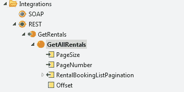
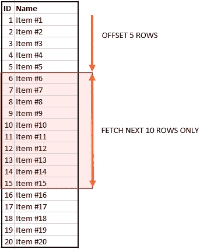
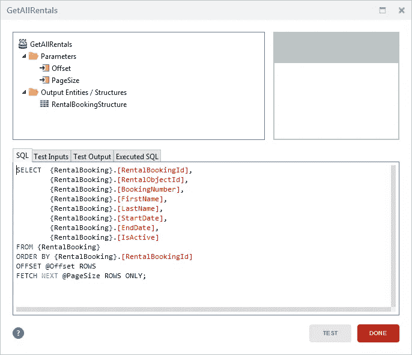
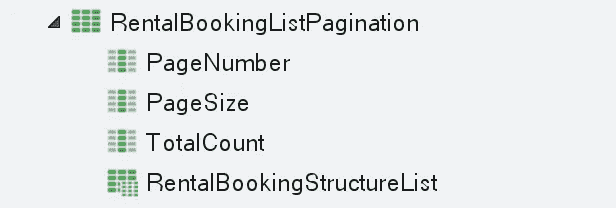
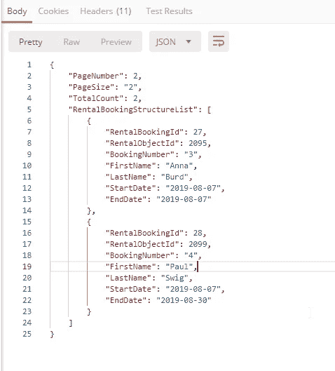

# 向 Outsystems REST API 方法添加 SQL Server 分页

> 原文：<https://itnext.io/adding-sql-server-pagination-to-an-outsystems-rest-api-method-f1a4aa8f2aac?source=collection_archive---------1----------------------->

# **为什么要分页？**

在构建返回数据的 API 时，您必须时刻牢记响应的大小。一个从数据库中获取数据的 API 方法，即使有一些适当的过滤，也可能返回数百万条记录，导致巨大的网络流量并最终超时。

**如何实施？**

有许多方法可以处理 SQL 分页，但自 SQL Server 2012 以来，有了一种新的语法:FETCH { FIRST | NEXT }，它提供了一种超级简单的处理方法。我将向您展示这种方法以及通常用于 ROW_NUMBER()函数的变通方法。

假设您想要公开一个 REST API，它从您的应用程序返回大量数据，这些数据将用于与另一个系统的集成。然后，您可以使用以下步骤:

# 创建 REST API:

**首先**，您需要在 Outsystems 中创建一个 REST API([阅读更多内容](https://success.outsystems.com/Documentation/11/Extensibility_and_Integration/REST/Expose_REST_APIs/Expose_a_REST_API#Create_the_REST_API_Service))，在您的新 GET 方法中有 2 个输入。将它们命名为 PageSize 和 PageNumber，并将它们都设置为整数类型。



REST API 方法示例

**输入:**

*   页面大小:页面的大小。所以，如果你想返回 10 条记录，这将是页面大小。
*   PageNumber:这将是开始搜索的偏移量或页面。这由请求者控制。

# 向 SQL 查询添加分页:

**第二个**，您将需要使用 SQL 查询来获取数据。我现在将向您展示两个高级查询示例。

让我们检查**偏移量并获取**分页:

# 使用 OFFSET 和 FETCH 来限制返回的行数

> 使用 OFFSET and FETCH 作为分页解决方案需要对返回给客户端应用程序的每一“页”数据运行一次查询。例如，要以 10 行为增量返回查询结果，必须执行一次查询以返回第 1 行到第 10 行，然后再次运行查询以返回第 11 行到第 20 行，依此类推。每个查询都是独立的，彼此之间没有任何关系。这意味着，与使用只执行一次查询并在服务器上维护状态的游标不同，客户端应用程序负责跟踪状态。[阅读更多](https://docs.microsoft.com/en-us/sql/t-sql/queries/select-order-by-clause-transact-sql?view=sql-server-2017)



`OFFSET`和`FETCH` [阅读更多](http://www.sqlservertutorial.net/sql-server-basics/sql-server-offset-fetch/)

因此，要实现这一点，查询必须按 ASC 排序，最好是按 ID 排序(如果添加了新记录，返回的数据将是一致的。如果您按另一个属性或不同的顺序(DESC)排序，如果添加了新记录，您将会错过这些记录。)
然后你只需要加上偏移量，接下来取如下图:



`OFFSET`子句指定了跳过的**行数。
`FETCH`子句指定在** `OFFSET`子句被处理后返回的**行数。
`OFFSET`条款为强制条款，而`FETCH`条款为可选条款。
`FIRST`和`NEXT`分别是同义词，所以可以互换使用。
[阅读更多](http://www.sqlservertutorial.net/sql-server-basics/sql-server-offset-fetch/)**

**如何计算偏移量？**

```
PageSize*(PageNumber-1)
```

有了这个表达式集，就可以将偏移量作为输入参数发送给查询。输入页面大小，您从 API 方法的输入参数中获得。

# 使用 ROW_NUMBER()

> 对结果集的输出进行编号。更具体地说，返回结果集的分区中某一行的序号，每个分区中第一行从 1 开始。[阅读更多](https://docs.microsoft.com/en-us/sql/t-sql/functions/row-number-transact-sql?view=sql-server-2017)

以下示例计算按 RentalBookingId 排序的 RentalBooking 表中所有行的行号，并只返回偏移量和偏移量限制之间的行。


**如何计算上例中的极限？**

```
(PageSize*PageNumber)
```

**还有抵消？**

```
PageSize*(PageNumber-1)+1
```

所以，当你有了输入:
PageSize:10
page number:5

那么 **WHERE 子句**将看起来像:

```
WHERE RowNumber >= 41 AND RowNumber <= 50
```

# **客户请求示例:**

客户端将不得不控制状态，因此，例如，他将开始请求页面编号 1，大小为 20。随后将请求下一页的页码。

API/rest/get rentals/getall rentals？PageSize = 20 & page number = 1 API/rest/get rentals/get all rentals？PageSize = 20 & page number = 2
API/rest/get rentals/get all rentals？PageSize=20 &页码=3

# API 响应示例:

除了接收所请求的业务数据之外，客户端还应该接收一些关于他正在接收的数据集的信息，例如返回的页码、页面大小和总计数。



REST API 方法返回的结构示例

JSON 响应会是这样的:
**调用**:/rest/get rentals/getall rentals？PageSize=2 &页码=2

**响应**:



# 结论

在我看来，OFFSET and FETCH NEXT 是实现分页最简单的方法。语法清晰，干净，易于理解。
ROW_NUMBER 方法使用 CTE 表，你需要一些 T-SQL 方面的经验才能完全理解那里发生的事情。

关于性能，即使对于大约 3 M 记录的大型数据集，我也没有注意到两种方法有很大的不同。

我发现的每一个文档都指出 FETCH NEXT 方法的速度是 ROW_NUMBER 的两倍。但老实说，我无法从测试中得到这些结果。根据我所做的测试，两个查询的性能几乎相同(我确信我需要更深入地分析 SQL 执行计划——也许我会在另一篇文章中讨论这个问题！)**这让我基于使用的简单性推荐了 FETCH NEXT。**

确保您的开发和生产环境至少有 SQL Server 2012，以便能够使用偏移量并进行下一步提取。

下一个故事再见！