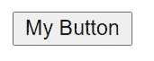
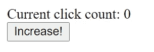
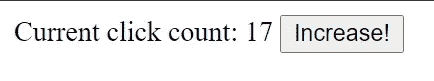
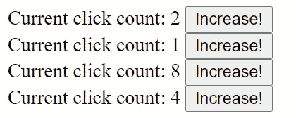

# 向自定义 HTML 元素添加状态

> 原文：<https://itnext.io/adding-state-to-custom-html-elements-639961c7c529?source=collection_archive---------3----------------------->

## 带有状态管理的反应式 HTML 元素？深入 web 组件的世界。

在本文中，我们将使用状态管理和事件处理程序创建自己的 HTML 元素框架。我们将通过实际例子探索 Web 组件的世界。

由[克里斯托弗·高尔](https://unsplash.com/@cgower?utm_source=medium&utm_medium=referral)在 [Unsplash](https://unsplash.com?utm_source=medium&utm_medium=referral) 上拍摄的照片

# 什么是 HTML 自定义元素？

首先，我们来了解一下自定义元素。如果您已经知道它们是什么，请随意跳过文章的这一部分，继续下面的*向定制元素添加状态*。

自定义元素是 2011 年引入的 Web 组件的一部分。这与影子 DOM 和 HTML 模板一起。让我们深入一些，边开发边学习！

## 创建第一个自定义元素

自定义元素是控制 HTML 元素的 JavaScript 类。假设我们想为按钮`<my-button></my-button>`添加一个定制的 HTML 元素，我们可以用下面的方法来实现。

首先，我们定义一个类`MyButton`，它扩展了`HTMLElement`类。它需要一个调用超级构造函数的构造函数。

然后使用`customElements` API，我们可以为我们的类定义一个定制的 HTML 标签。`customElements.define('html-tag', ComponentClass);`。

最后，我们的 HTML 组件已经可以使用了！只需在网页上添加一个`<my-button></my-button>` HTML 标签。

试一试并运行它。你会看到什么都没发生。这是因为我们还没有在这个 HTML 元素中做任何事情。

## 使用阴影 DOM

使用*影子 DOM* 和它的 API 可以操作这个组件的 DOM。不通过影子 DOM，我们不能直接修改这个定制元素的内容。

例如，`this.attachShadow({mode: "open"});`将返回这个组件的一个影子 Dom 根节点。

然后我们可以使用这个影子根来更新它的`innerHTML`，添加孩子，等等。任何 DOM 操作都是可能的。

让我们更新我们的组件，以实际显示一个按钮。

如果我们现在试一试，我们实际上会在页面上看到一个`<my-button>`元素。

这就是我们的第一个 HTML 定制元素！

# 向自定义元素添加状态

我们前面的例子有点简单。就我们所见，定制元素本质上是非常原始和空洞的。使用它可以做任何事情，但是，这种灵活性也使得 HTMLElement 类非常抽象。

如果我们想包含类似 react 的状态管理，该怎么办？如果我们想有一个更干净的方法来更新组件的 HTML 呢？我们可以很容易地扩展`HTMLElement`类来为我们处理更多的事情。

## 我们的目标是什么？

先介绍状态管理。我们想让它做什么？我们希望能够`getState(path)`和`setState(path, value)`。每当状态改变时，我们也想重新呈现我们的元素。一种方法是将组件的呈现抽象成一个`render`方法。到目前为止，API 都是受 React 的启发。

在开始之前，我们需要为我们的元素取一个名字。让我们来看看这个，把我们的自定义元素类叫做`EchoElement`。

这就是 HTMLElement 的一个非常简单的实现，它允许我们处理状态，类似于 React！让我们尝试一下，做一个点击计数器组件。

## 开发点击计数器

你看到那有多快了吗？这种方式很容易建立新的组件。只需很少的设置，就可以设置类似 React 的组件。

现在你会发现，我们的按钮没有链接到任何`onclick`处理程序。单击该按钮现在不会做任何事情。但是，该组件应该可以成功地呈现在我们的页面上。

## 设置点击处理程序

在我们的`EchoElement`类中设置一个全局`onclick`方法怎么样？这样，任何未来的`EchoElement`组件都可以利用我们的点击处理程序。

在我们的构造函数中，让我们绑定`onclick`函数，如果它是由子组件定义的。

接下来，我们还需要更新我们的`_doRender`函数来设置`onclick`处理程序，如果它被定义的话。

我们的`EchoElement`都准备好了！接下来让我们更新我们的`ClickCounter`类，加入一个`onclick`来更新我们的点击计数器。

## 最后试验

现在，试一试，你应该看到计数更新。

即使页面上有多个点击计数器，它们也会彼此独立工作。

# 与 React 的比较

这是需要提一下的。虽然我们围绕状态管理使用了一些基本的 React 概念，但这根本无法与整个 React 生态系统相比，后者要大得多。我们创建的`EchoElement` 类只有 30 行长！

相反，我们受到 React 中的状态管理的启发，在 React 中，一切都被很好地划分为组件。我们只是试图模仿这一点，并向您展示如何在定制元素的世界中尽情发挥您的创造力。如果这是可能的，想象一下我们可以围绕定制元素创建什么样的其他库和框架！

# 结论

自定义元素有优点也有缺点。首先，自定义元素确实以一种很好的方式将所有东西分开。正如我们所见，设置成本非常低，创建新的`EchoElement`组件非常快速和容易。扩展`HTMLElements`非常容易。

与 React 生态系统相比，它提供的功能非常少。有了围绕定制元素的适当框架，这就不仅仅是一个简单的 HTML 扩展了。Web 组件的一个流行框架是[聚合物](https://polymer-library.polymer-project.org/3.0/docs/devguide/feature-overview)。

你对自定义元素有什么看法？你喜欢《T2》的制作吗？请在评论中告诉我们！

# 进一步阅读

[Mozilla MDN 上提供了关于 Web 组件的更多信息。](https://developer.mozilla.org/en-US/docs/Web/Web_Components)

[聚合物网络组件库。](https://polymer-library.polymer-project.org/3.0/docs/devguide/feature-overview)

# 完整代码

您可以在以下要点中找到本文的完整工作代码。将其保存为 HTML 文件，在浏览器中打开，应该就可以开始了。

[订阅我的媒体](https://kevinvr.medium.com/membership)到**解锁** **所有** **文章**。通过使用我的链接订阅，你是支持我的工作，没有额外的费用。你会得到我永远的感激。