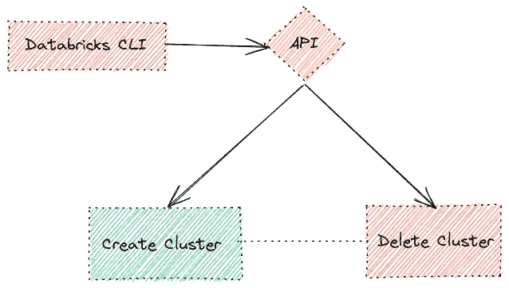
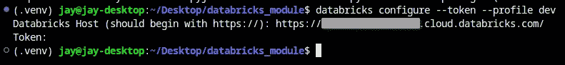
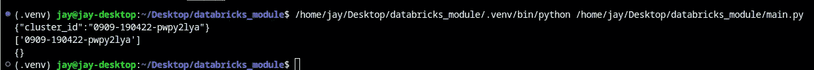
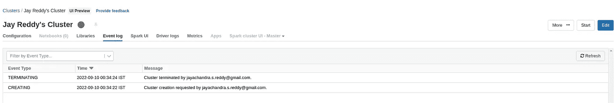

# 通过 Databricks API 管理集群—第 1 部分

> 原文：<https://itnext.io/administering-clusters-via-databricks-api-342f5463378c?source=collection_archive---------1----------------------->

为管道和工作流构建预定义的集群变得很容易。


[乔·杜德克](https://unsplash.com/@joetography?utm_source=unsplash&utm_medium=referral&utm_content=creditCopyText)在 [Unsplash](https://unsplash.com/s/photos/bricks?utm_source=unsplash&utm_medium=referral&utm_content=creditCopyText) 上的照片

# 介绍

Databricks 是一家站在大数据行业前沿的数据和 AI 公司。创新是平台的核心。Databricks platform 擅长管理来自不同数据源的复杂集成，只需几次输入和鼠标点击。

Databricks 上的大量 API 端点可以与平台通信并执行联合功能。当有效地实现这些功能以促进业务增长时，它们将具有巨大的价值。

Databricks API 的存在背后的动机是让团队以编程方式创作和管理他们的工作流，以执行一组不同的用例，并记录 API 返回的所有关键信息。

API 可以成为 Databricks 平台开发人员的强大工具。这个 API 为团队提供了开箱即用的广泛的项目交付产品。

这篇文章是我们可以通过添加 API 组来扩展功能，从而开发复杂的管道/工作流的基础框架。本文的范围围绕着您(Databricks 用户/开发人员)如何利用 API 组来处理特定于业务的用例。



# 先决条件

**1。数据块的访问令牌。**

令牌是访问 Databricks API 和查询端点的一种方式，也是一种推荐的身份验证选择。

在 UI 中生成访问令牌的步骤:

**设置~访问令牌~创建新令牌**

**2。配置 Databricks CLI。**

Databricks-CLI 是一个位于所有 API 组之上的交互式 shell，提供了与 API 命令组通信的通道。我们可以选择配置我们的资源，通过 Databricks-CLI 与平台上的隔离环境进行通信。

要配置令牌，您需要一台主机和一个令牌。我建议加`--profile`标志，区分工作区和多个环境。



`.databrickscfg`是本地保存配置的地方。Databricks-CLI 在对端点进行 API 调用时会引用这些配置。

# 集群 API

Databricks 平台运行在基于 Databricks API 构建的基础上。UI 上的每一个可用特性都会在后台触发 API 来执行这项工作。

Databricks 提供的 API 组之一是集群 API 组，使用集群 API 的唯一目的是从管理级别管理集群，如以编程方式创建、列出、修改和删除。

## 创建集群:

该特性可通过 2.0 版 API 调用 api/2.0/clusters/create 获得。端点需要完成操作的强制部分、带有访问令牌的头部和 JSON 有效负载(节点数量、策略、配置和其他特定于环境的信息)。

集群创建的签名如下:

```
curl --netrc -X POST --header "Authorization: Bearer your_token"
https://dbc-a1b2345c-d6e7.cloud.databricks.com/api/2.0/clusters/create 
--data @create-cluster.json
```

我们将使用承载访问令牌和 JSON 有效负载向平台提交 POST 调用。如果返回代码为 200，则接收 cluster_id 的 JSON 响应，如果不成功，则返回详细的错误跟踪。

让我们使用选择的编程语言:Python 来重写 curl 命令。通过查看 curl 命令，我们需要传递数据和头。让我们打开配置文件并阅读。最好将变量中的输入模块化，以便在 POST 调用中传递它们。

```
import requestsjson_file = "configs/policy.json"
config_file = open(json_file, 'r')
header = {'Authorization': 'Bearer your_token'}
response = requests.post('https://dbr_url/api/2.0/clusters/create',
                          data=config_file, headers=header)
```

**响应:**

```
{"cluster_id": 1234-ax908t6-foods123}
```

## 删除集群

如果在作业完成后不关闭 Databricks 使用的按需集群，它们的成本会很快变得很高。通过在操作完成后终止群集，我们可以控制我们的计算成本。如果管理不当，集群创建可能会导致意外成本和意外行为。正如我们已经看到的，可以创建和删除集群。我们可以在操作之间增加等待时间，为集群提供更多功能，并在作业完成时终止。

当我们需要手动启动和关闭几个集群时，这个操作很快就会变得非常耗时和昂贵。通过删除所有集群，可以节省时间和成本。

集群删除 API 的签名如下:

```
curl --netrc -X POST "Authorization: Bearer your_token"
https://dbc-a1b2345c-d6e7.cloud.databricks.com/api/2.0/clusters/delete 
--data '{ "cluster_id": "1234-ax908t6-foods123" }'
```

将 curl 重写为 python，并将收集的集群 id 作为 JSON 数据显式传递，

```
data = {"cluster_id": 1234-567890-foods123}
header = {'Authorization': 'Bearer {}'.format(self.token)}
response = requests.post('https://dbr_url/api/2.0/clusters/delete',
                           headers=header, json=data)
```

我们的策略是有效的，但它是不安全和不灵活的。需要手动收集 cluster_id，并在下一个 API 调用中传递它们。

通过将我们的方法封装到一个类中，我们可以添加类似列表的数据集合，并收集迭代的返回值以调用后续操作。

## 完全码

将完整的操作包装到一个类中可以提供代码结构、安全性和对象隔离。

我们的项目结构如下:


我们将使用 python 的 configparser 库来获取配置，以保持安全性最佳实践，并避免硬编码秘密。

```
import logging
import requests
from configparser import ConfigParserclass databricks_AV(object): def __init__(self, url, token) -> Any:
       self.url = url
       self.token = token
       self.cluster_id_list = [] def cluster_creation(self):
       config_json = "configs/policy.json"
       config_file = open(config_json, 'r')
       header = {'Authorization': 'Bearer {}'.format(self.token)}
       response = requests.post(f'https://{self.url}/api/2.0/clusters/create',
                                 data=config_file, headers=header)
       cluster_id = response.json()['cluster_id']
       self.cluster_id_list.append(cluster_id)
       creation_status = response.text
       logging.info(creation_status)
       logging.info(self.cluster_id_list)
       return response def cluster_deletion(self):
       for id in self.cluster_id_list:
       data = {"cluster_id": id}
       header = {'Authorization': 'Bearer {}'.format(self.token)}
       response = requests.post(f'https://{self.url}/api/2.0/clusters/delete',
                                 headers=header, json=data)
       deletion_status = response.text
       logging.info(deletion_status)
       return responseif __name__ == '__main__':
   parser = ConfigParser()
   parser.read('properties.cfg')
   AV = databricks_AV(parser.get('URL','dev_url'), parser.get('TOKEN','dev_token'))
   AV.cluster_creation()
   AV.cluster_deletion()
```



# 结论

我们已经讨论了平台的主要部分，它处理所有的重物。所有的处理和计算都在集群中完成，集群构成了它的中枢。当您的基础设施包括工作流和自动化管道时，按需启动集群并关闭它们将是一个富有成效的步骤。平台开发人员可以拓宽他们对 Databricks API 如何工作以及端点如何相关的内部理解。

*   配置是 API 连接的关键，标记概要文件有助于分解基于工作区的开发。
*   通过 API 组，我们能够按需创建和删除集群。通过将代码包装到类中以实现可重用性，从而将代码模块化。
*   端点从平台返回详细的响应，我们使用 python JSON 库对这些响应进行解析，并在类定义中使用配置解析从安全角度获取令牌和 URL。

在 LinkedIn 或 T2 Twitter 上关注我，了解更多关于 DataOps 和 MLOps 相关的参考资料，如果你想了解这个框架或为其添加更多功能，请联系我。

快乐编码。