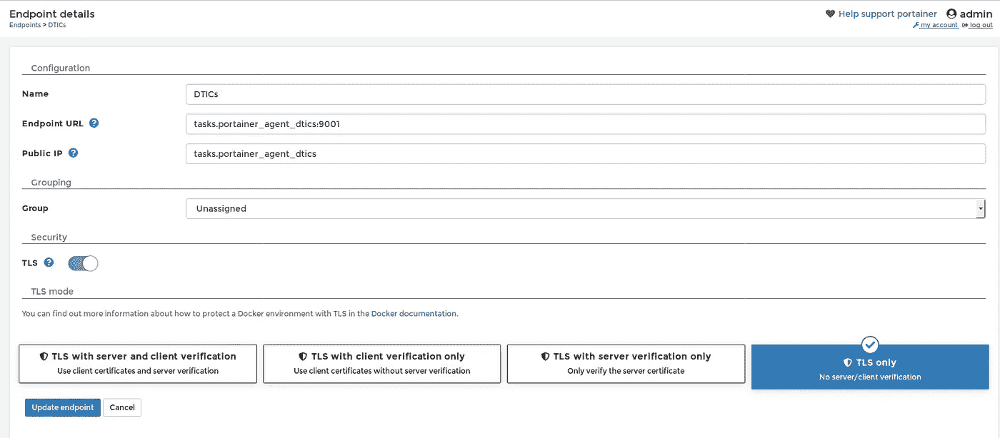
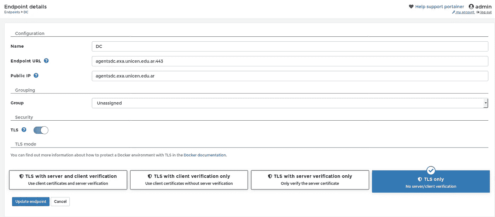
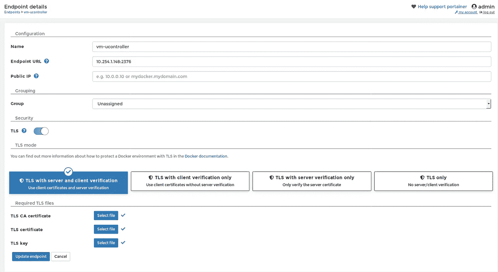
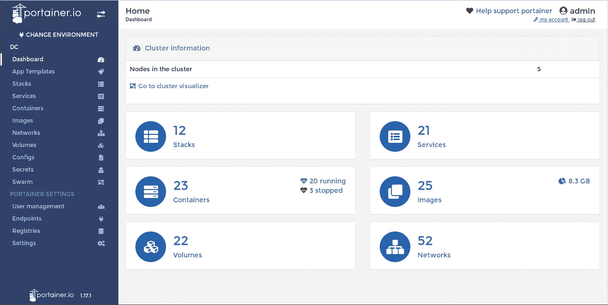
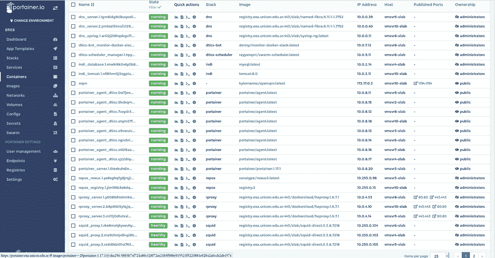
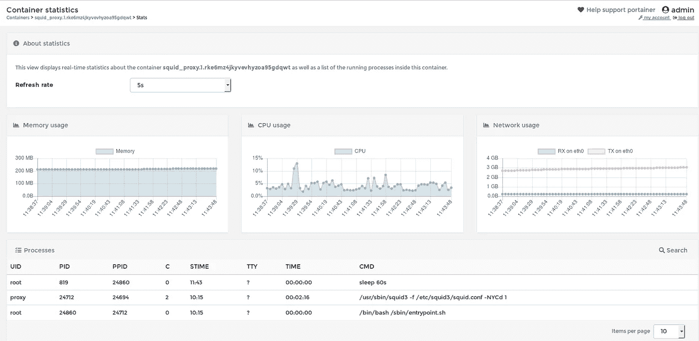

# 使用 Portainer 管理两个或更多 Docker 集群

> 原文：<https://itnext.io/administering-two-or-more-docker-swarm-clusters-with-portainerio-682d01a92b25?source=collection_archive---------2----------------------->

从版本 [1.17.0](https://store.docker.com/community/images/portainer/portainer) 开始，伟大的开源工具[***Portainer***](https://portainer.io/)使用部署在每个节点上的简单[代理](https://store.docker.com/community/images/portainer/agent)提供了一种简单的方式来管理您的 Swarm 集群，默认情况下使用[安装指南](https://portainer.readthedocs.io/en/stable/agent.html#deploy-it-as-a-stack)它将没有任何问题地工作。

但是如果你想控制两个或更多独立的蜂群，这需要一些调整，这是我们的图表


集群和虚拟机

这个部署使用几个栈来实现，首先是用于 ***Portainer*** 及其本地代理(在同一个集群上运行的代理，DTICs)的栈

上面的堆栈将部署一个服务 ***agent_dtics*** ，该服务使用 [portainer/agent](https://store.docker.com/community/images/portainer/agent) 映像，并使用内部 DNS Docker 条目 ***tasks 定位。portainer_agent_dtics，*** due 以全局模式部署。该代理在群集群的每个节点上运行，使用名为 ***agent_network_dtics，*** 的覆盖网络相互连接。该网络还用于连接要部署该堆栈，只需在 DTICs 集群管理器中运行如下命令:

```
*docker stack deploy -c docker-compose.yml portainer*
```

在 ***Portainer*** 实例后面有一个用 ***HAProxy*** 实现的负载均衡器，这个负载均衡器使用 ***rproxy*** 网络连接到 ***Portainer*** ，并使用 ***VIRTUAL_HOST*** 环境变量定义的 URL 公开。

要连接到我们的第二个 swarm 集群，我们需要执行两个步骤:

*   创建一个指向第二个集群的负载平衡器的 DNS 条目
*   仅在第二个集群上部署代理

***DNS*** 条目**agentsdc . exa . unicen . edu . ar**会是这样的:

```
# nslookup agentsdc.exa.unicen.edu.ar
Server: 10.1.1.5
Address: 10.1.1.5#53Name: agentsdc.exa.unicen.edu.ar
Address: ***10.254.0.155***
Name: agentsdc.exa.unicen.edu.ar
Address: ***10.254.0.156***
```

这两个 IP 是 DC 集群中 HAProxy 负载均衡器的公共 IP

为了在 DC 集群部署代理，我们定义了这个堆栈:

使用以下命令在 DC 集群的主节点上部署代理:

```
*docker stack deploy -c* ***portainer-agent-stack.yml******portainer_agent***
```

与前一个堆栈一样，所有代理将运行在集群的每个节点上，并使用 ***agent_network_dc*** 覆盖网络进行互连。

在 DC 集群也有一个负载均衡器， ***HAProxy*** 将使用在 ***虚拟主机*** 变量和 ***服务端口*** 值定义的 URL 公开代理服务； ***HEALTH_CHECK*** 值是定义一个 ***TLS*** 通信通道 ***HAProxy*** 和代理之间的一个诡计。

最后，我们需要在 Portainer 控制台定义 DTICs 和 DC 集群的端点，屏幕截图如下:



DTICs 集群端点—与 Portainer 相同的集群



DC 集群端点

最后，我们有一个卫星 ***VM*** 运行 Docker，也可以使用 ***Portainer*** 进行监控，方法是使用 ***TLS*** 证书添加它，这里是端点:



使用 TLS 证书的虚拟机端点

仅此而已， ***Portainer*** 将管理集成在一个全功能控制台中的所有堆栈、服务、容器和其他相关资源



DC 集群主控制台



DTICs 集群中所有正在运行的停靠站的容器列表



在 DTICs 集群上运行的任何 Docker 容器的示例容器统计信息

此处为并行堆栈、HAProxy 负载平衡器堆栈(rproxy DTICs 负载平衡器/ haproxy DC 负载平衡器):