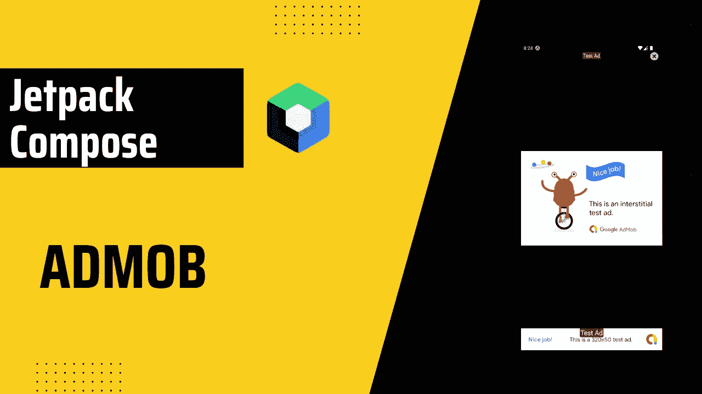

# Jetpack 中的 AdMob 横幅和间隙广告构成

> 原文：<https://itnext.io/admob-banner-interstitial-in-jetpack-compose-47a1b700198c?source=collection_archive---------0----------------------->



不幸的是，Jetpack Compose 还不支持 AdMob，但这并不意味着我们不能添加 AdMob。

# 入门指南

我假设你已经向 AdMob 注册了你的应用。所以，你要准备好你的 [AdMob App ID](https://support.google.com/admob/answer/7356431?utm_source=developers.google.com) 。

我们需要首先添加播放服务依赖。

```
implementation 'com.google.android.gms:play-services-ads:21.3.0'
```

现在，我们需要 AdMob 应用程序 ID。打开`AndroidManifest.xml`文件并添加这一行。

```
<manifest>
    <application>
        <!-- Sample AdMob app ID: ca-app-pub-3940256099942544~3347511713 -->
        <meta-data
            android:name="com.google.android.gms.ads.APPLICATION_ID"
            android:value="ca-app-pub-xxxxxxxxxxxxxxxx~yyyyyyyyyy"/>
    </application>
</manifest>
```

最后，初始化广告。(可以在`MainActivity` `onCreate`中初始化)

```
MobileAds.initialize(this)
//Optional if you want to add test device
val configuration = RequestConfiguration.Builder()
            .setTestDeviceIds(Collections.singletonList("DEVICE ID"))
            .build()
MobileAds.setRequestConfiguration(configuration)
```

# 旗帜

```
@Composable
fun BannerAdView() {
    AndroidView(
        modifier = Modifier
            .fillMaxWidth(),
        factory = { context ->
            AdView(context).apply {
                setAdSize(AdSize.BANNER)
                // Add your adUnitID, this is for testing.
                adUnitId = "ca-app-pub-3940256099942544/6300978111"
                loadAd(AdRequest.Builder().build())
            }
        }
    )
}
```

由于我们没有本地支持，我们将把`AdView`包装在`[AndroidView](https://developer.android.com/reference/kotlin/androidx/compose/ui/viewinterop/package-summary#AndroidView(kotlin.Function1,androidx.compose.ui.Modifier,kotlin.Function1))`中。你可以再从[这个链接](https://support.google.com/admob/answer/7356431?utm_source=developers.google.com)找到你的`adUnitId`。

班纳到此为止。


# 空隙的

*我已经想出了我的方法，你可以修改和优化它。*

这个不同于横幅广告，需要不同的逻辑。我们将为 Interstitial 创建单独文件。

`loadInterstitial`功能加载间隙广告。

`showInterstitial`功能将显示广告。广告被用户取消后，它会重新加载广告。`onAdDismissed`功能可选。当用户取消广告时，它将被触发。

`removeInterstitial`用于防止内存泄漏。

另外，`findActivity`是一个自定义扩展函数。

```
fun Context.findActivity(): Activity? = when (this) {
    is Activity -> this
    is ContextWrapper -> baseContext.findActivity()
    else -> null
}
```

现在，让我们在 UI 内部实现它。在`MainActivity`中，

```
class MainActivity : ComponentActivity() {
    override fun onCreate(savedInstanceState: Bundle?) {
        //...
        loadInterstitial(this)
    }

    override fun onDestroy() {
        removeInterstitial()
        super.onDestroy()
    }
}
```

最后，您可以从任何想要的组合中调用`showInterstitial`,

```
showInterstitial(context) {
    //On Ad Dismiss Lambda Function
    //e.g. you can show dialog to the user or redirect them etc.
}
```

就是这样！我希望它是有用的。👋👋


## 来源:

*   [入门|安卓|谷歌开发者](https://developers.google.com/admob/android/quick-start)
*   [使用 Android Compose 添加 AdMob 广告横幅| Andres Sandoval | Medium](https://andresand.medium.com/add-admob-ad-banner-using-android-compose-9ba78c8f1591)

你可以联系我，

*   [领英](https://www.linkedin.com/in/burak-fidan/)
*   [Github](https://github.com/MrNtlu)
*   [推特](https://twitter.com/BurakFNtlu)