# 使用本地 Swift 包和 UIKit/AppKit 的高级跨平台应用

> 原文：<https://itnext.io/advanced-cross-platform-apps-using-local-swift-packages-and-uikit-appkit-2a478e8b05cd?source=collection_archive---------1----------------------->

在 SwiftUI 发布和大肆宣传之前，我们必须为 iOS 使用普通 UIKit，为 macOS 界面使用 app kit……即使核心应用程序完全相同。很自然，你的跨平台应用程序会随着时间的推移而不断增长，最终你会将代码重构为模块。

本教程向您展示了如何利用 Swift Package Manager (SPM)的强大功能，为您的大规模应用程序创建一个干净、可扩展且特别共享的 UI 结构。

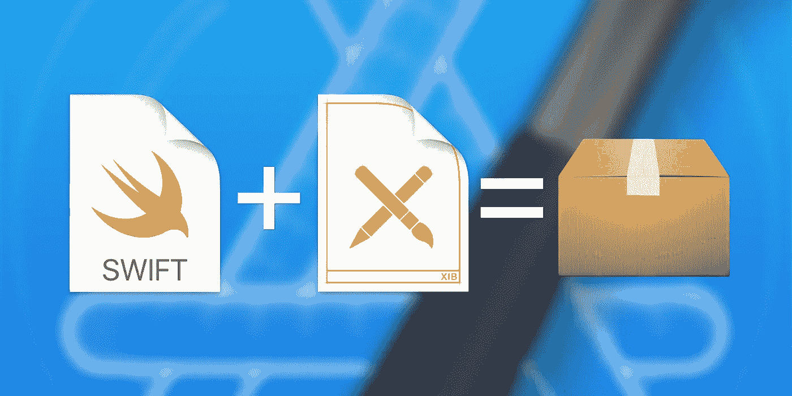

将 Swift 文件和 XIB 界面构建器文件组合成包

**注意:**这是[使用本地 Swift 包](https://link.medium.com/S4Rn5ggwofb)模块化 Xcode 项目的后续教程，并建立在那里提到的主题之上。如果你已经是 iOS/macOS/SPM 的高级用户，请继续，但是如果你对这个主题相当陌生，我强烈建议你先阅读我的另一篇文章。

# Swift 和 Xcode 中 UI 构建的背景故事

在撰写本文时，构建用户界面有四种主要选择:

1.  **明码:**
    你完全掌控 UI 元素，自动布局引擎和连接的逻辑……没有任何隐藏的魔力。
    另一方面，它更加冗长，更难迭代，尤其是没有实时预览。
2.  **单视图界面构建器(XIB/NIB):** 可视化构建，完全支持自动布局、IB 接口和 IB 设计，将 UI 与代码连接起来。它消除了很多痛苦，可以很好地与应用程序连接起来。
    *重要旁注* : macOS 和 iOS XIB 不一样！
3.  **多视图界面构建器(故事板):**
    与界面构建器功能相同，另外允许使用导航片段将多个视图链接在一起。
    *重要旁注:* macOS 和 iOS 故事板不一样！
4.  *SwiftUI DSL(我们不会在本文中涉及它，因为它对于具有向后兼容性需求的大规模应用程序来说还不太适合生产)*

从我个人的经验来看，故事板对于最初的开发非常有用。特别是由于使用 segues 的简单视图导航，您可以相当快地得到一个运行的原型。随着时间的推移，越来越多的视图被添加进来，最终 Xcode 开始努力渲染/处理/编译文件。慢慢地，它开始变得越来越难以处理(不要让我开始谈论如何处理那些数千行 XML 配置的合并冲突)。

当您只想迭代单个视图，但是大的故事板不断改变多个视图时(例如，由于布局更新)，情况会变得更糟。或者当使用 IBDesignables 时，需要一次又一次地更新每一个视图。

哦，你不喜欢导航到一个嵌套很深的子视图。单身。时间？您想在不同的应用程序目标中只使用故事板中的单个视图吗？当然，您总是可以让它出列，但是要确保包含所有必要的资产(甚至是您现在没有使用的资产)，否则它可能无法编译/运行。🙃

那么…我们如何改进我们的工作流程呢？我们回到更简单的 UI 构建！

# 创建我们的时钟应用

在本教程中，我们将构建一个简单的时钟应用程序，要求如下:

*   iOS 和 macOS 应用程序
*   无 SwiftUI(使用 UIKit/AppKit)
*   模块化、可扩展的架构
*   在单一视图中显示当前时间
*   当用户与应用程序交互时，时间会手动更新

正如你所看到的，这是一个(愚蠢的)简单的应用程序，但是主要的焦点是使用 Swift 包管理器来构建 UI 组件，所以这就足够了。

第一步，创建一个**空 Xcode 项目**作为我们的起点，并将其命名为**时钟**:

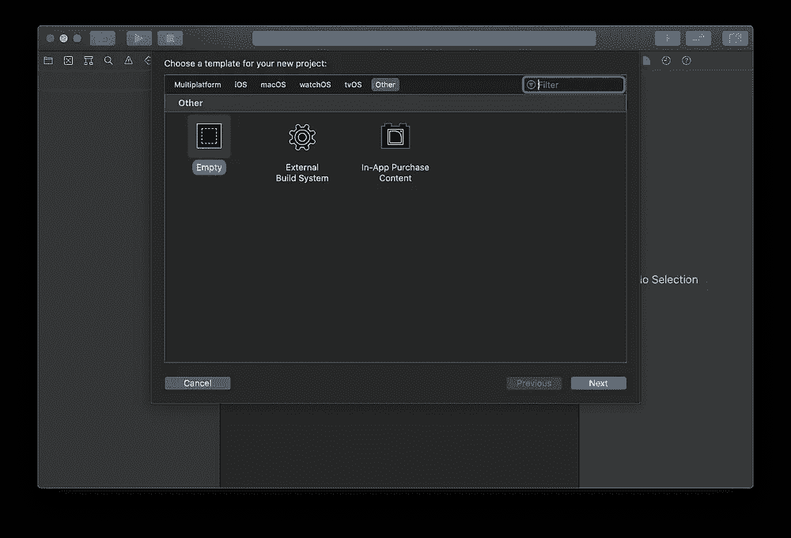

创建名为 Clock 的空 Xcode 项目

现在你有了一个干净的起点，在项目设置中，你需要通过点击左下角的小**加号**来添加 iOS 和 macOS 应用目标:

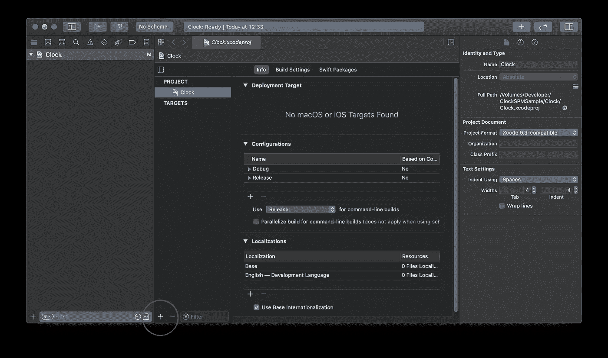

向 Xcode 项目添加新目标可以通过单击加号来完成

对于 iOS 目标，使用默认的 **App** 模板和**ui kit App Delegate life cycle**，并将其命名为 *Clock_iOS。*

> 对于捆绑包标识符，使用您自己的反向域名，例如，对我来说是`*com.techprimate*` ，因为我的移动应用代理的域名是[techprimate.com](http://techprimate.com)

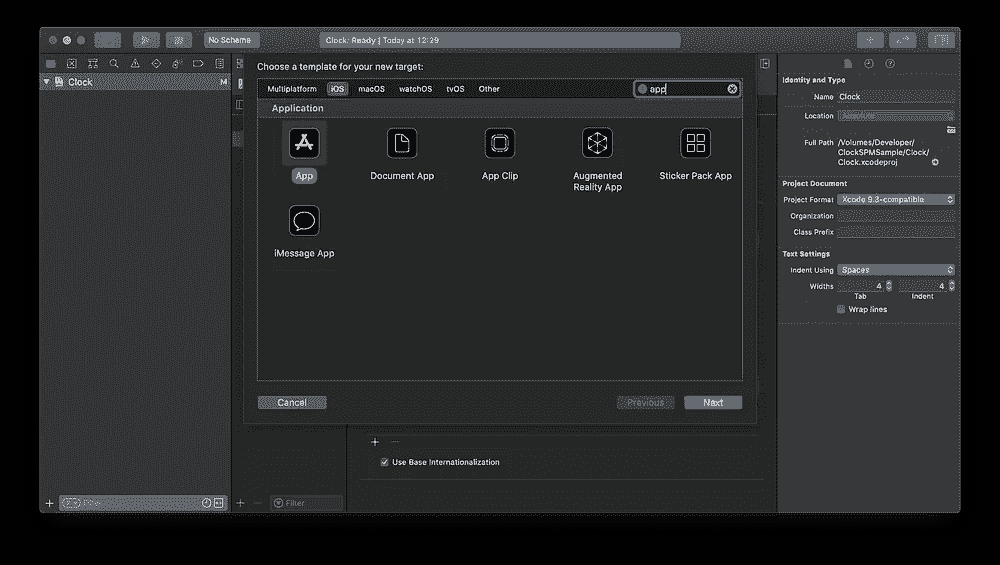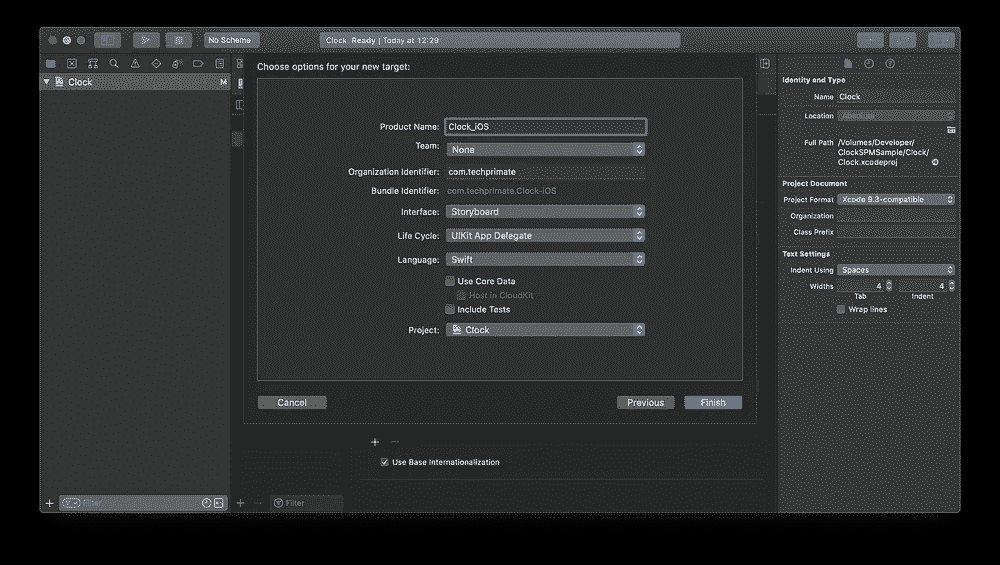

使用 UIKit 应用程序代理生命周期在 Xcode 中创建 iOS 应用程序目标

同样，对于 macOS 应用程序，使用默认的**应用程序**模板和 **AppKit 应用程序委托生命周期**，并将其命名为 *Clock_macOS。*和以前一样，使用您自己的组织标识符:

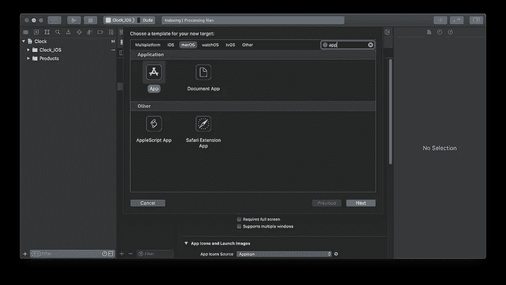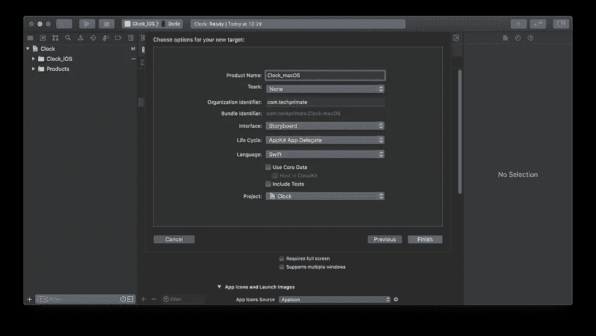

使用 AppKit 应用程序委托生命周期在 Xcode 中创建 macOS 应用程序目标

在最后的项目设置步骤中，禁用自动代码签名(我们现在不需要它，通常它会通过创建不需要的预置描述文件和应用程序标识符来扰乱您的 Apple 开发者帐户)。您应该仍然能够运行 macOS 应用程序，设置**符号为本地运行**，以及模拟器中的 iOS 应用程序。

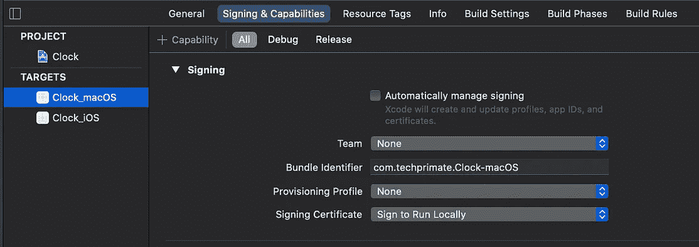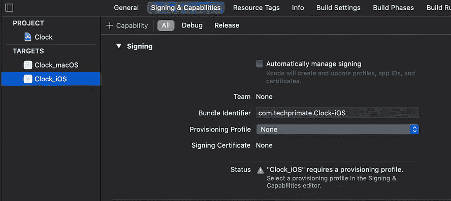

禁用代码签名的设置

恭喜你创建了你的跨平台应用*时钟*！至少运行两个应用程序一次，以确保它们工作正常。别担心，两个屏幕都将是空白的，因为还没有 UI 显示，但我们接下来会解决这个问题。

# 创建共享用户界面库

由于时钟逻辑必须由两个应用程序共享，我们创建了一个本地 Swift 包库`ClockPackage`并将其拖到我们的 Xcode 项目中。详细的分步说明可以在[我之前的文章](https://link.medium.com/S4Rn5ggwofb)中找到。

```
$ cd root/of/my/project
$ mkdir ClockPackage
$ cd ClockPackage
$ swift package init --type library
```

之后，您的项目应该如下所示:

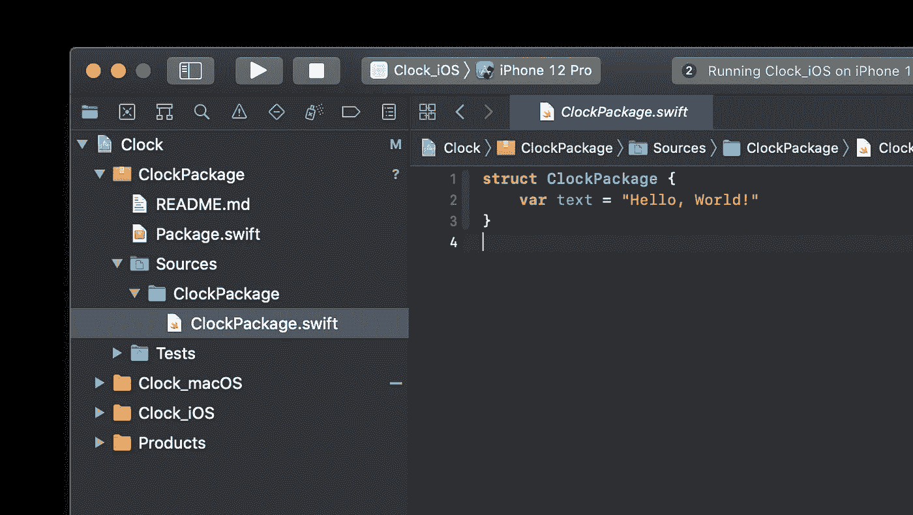

添加 Swift 包 *ClockPackage* 后的 Xcode 项目

为了简单起见，通过更改文件夹名和包清单`Package.swift` *中的声明，将`ClockPackage` 目标重命名为`ClockUI`。另外，我们不会在本教程中使用测试，所以继续删除文件夹`Tests`和测试目标。*

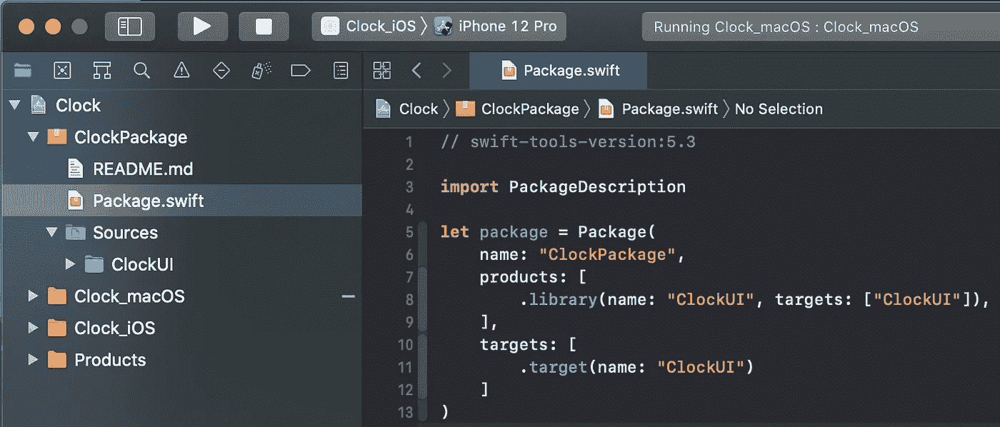

清理后的包配置

# 添加 XIB 资源(错误的方式)

现在我们的 UI 包已经设置好了，您将创建 XIB 界面构建器文件。这两个应用程序都应该为用户提供一个按钮来更新当前时间，并显示在一个标签中。

在 wolf vision[的一个 iOS/macOS 项目中使用 SPM 概念时，我意识到 macOS 和 iOS 的 XIB 接口文件是不可互换的。为了将我的经历形象化给你，我们现在将以错误的方式来做，然后再修复它。](https://wolfvision.com)

从 Swift 5.3 开始，可以向 Swift 包中添加资源。苹果创建了一个[非常详细的文档](https://developer.apple.com/documentation/swift_packages/bundling_resources_with_a_swift_package)关于如何处理它们，但是为了教程的缘故，我会给你一个快速的总结:

1.  在`Sources/ClockUI`中创建一个文件夹`Resources`

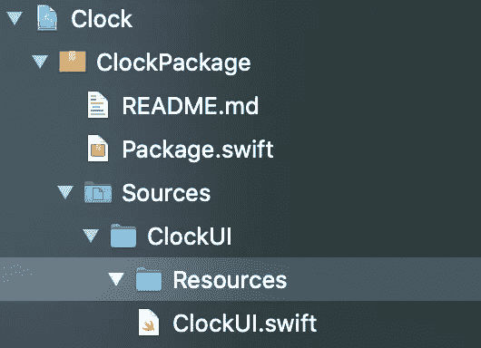

添加资源文件夹后的文件夹结构

2.创建一个 iOS 视图`ClockViewController_iOS.xib`

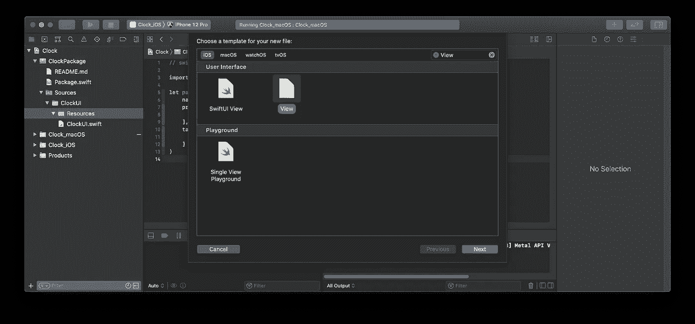

在 iOS 类别中选择模板“视图”

3.创建 macOS 视图`ClockViewController_macOS.xib`

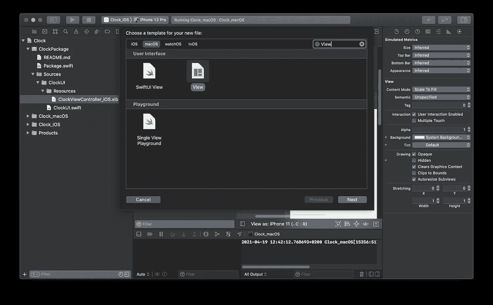

在 macOS 类别中选择模板“视图”

4.将这两个文件作为资源添加到包清单的*目标*部分:

```
...
    targets: [
        .target(name: "ClockUI", resources: [
            .process("Resources/ClockViewController_iOS.xib"),
            .process("Resources/ClockViewController_macOS.xib"),
        ])
    ]
...
```

正如您在这里看到的，我们使用`process(path: String)`在编译时将 XIB 文件编译成 NIB 文件，然后在运行时用于加载 UI。

要测试包的编译，在 Xcode 顶部工具栏中选择`ClockUI`作为运行方案。尝试为任何 Mac 电脑构建一次，为任何 iOS 设备构建一次。两次都会失败。

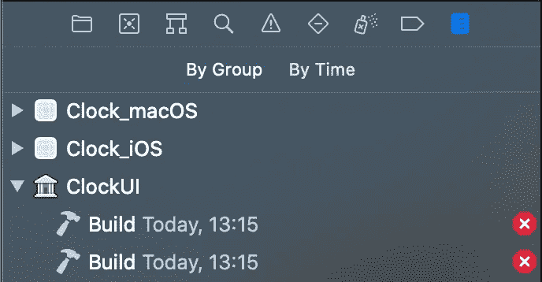

显示 ClockUI 失败构建的报告导航器

在*报告导航器*中，您可以仔细查看两个失败的构建日志。您将看到 macOS 构建由于 iOS XIB 文件而失败，反之亦然。

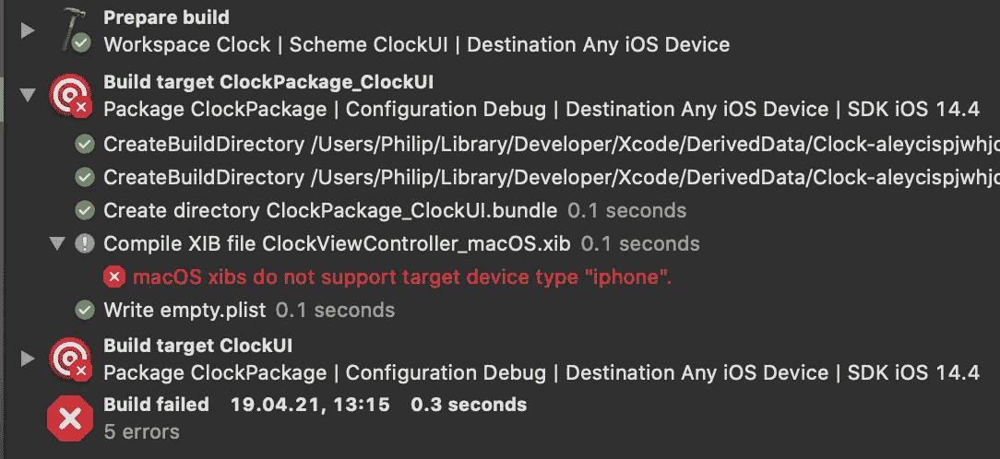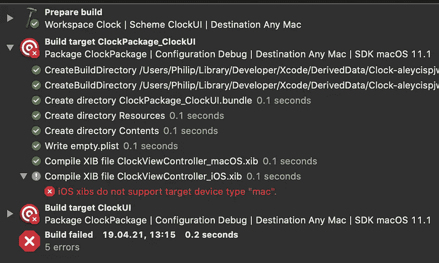

由于平台特定的 XIB 接口文件导致的构建错误

由于 Swift 包不支持条件资源编译，我们不能再使用这种精确的项目结构，必须改变我们的库。

# 添加 XIB 资源(正确的方式)

创建两个额外的库`ClockUI_iOS`和`ClockUI_macOS`，每个库里面都有一个文件夹`Resource`。然后将`*.xib`文件移动到它们各自的文件中，并改变`Package.swift`清单以反映我们的新结构:

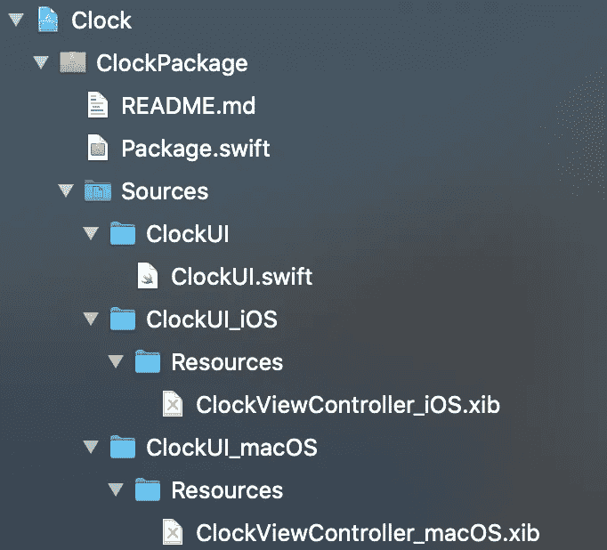

更改为基于平台的包后的 Swift 包结构

```
let package = Package(
    name: "ClockPackage",
    products: [
        .library(name: "ClockUI", targets: ["ClockUI"]),
        .library(name: "ClockUI_iOS", targets: ["ClockUI_iOS"]),
        .library(name: "ClockUI_macOS", targets: ["ClockUI_macOS"]),
    ],
    targets: [
        .target(name: "ClockUI"),
        .target(name: "ClockUI_iOS", resources: [
            .process("Resources/ClockViewController_iOS.xib"),
        ]),
        .target(name: "ClockUI_macOS", resources: [
            .process("Resources/ClockViewController_macOS.xib"),
        ])
    ]
)
```

现在你可以成功地为任何 iOS 设备*建立方案`ClockUI_iOS`，为任何 Mac 设备*建立方案*和为两者建立方案`ClockUI`🎉*

# 创建接口

希望你不要介意我跳过了在我们的 iOS/macOS XIB 文件中创建 UI 界面的详细解释(那里有这么多 UIKit/AppKit 教程),而是专注于构建架构。
当然，你可以在 [GitHub 库](https://github.com/philprime/ClockSPMSample)中查看全部代码。

## iOS 界面

首先在`ClockUI_iOS/ClockViewController.swift`的一个新文件中创建一个类`ClockViewController`，用一个 IBOutlet 访问时间标签，用一个 IBAction 作为按钮的目标动作。

```
import UIKit

public class ClockViewController: UIViewController {

    // MARK: - IB Outlets

    @IBOutlet weak var timeLabel: UILabel!

    // MARK: - IB Actions

    @IBAction func didTapFetchButtonAction() {
        print("did tap fetch")
    }
}
```

之后，您需要将`File's Owner`连接到视图控制器。确保模块`ClockUI_iOS`被选中，否则它将无法稍后解析该类。这也允许将 IBOutlet/I action 连接到代码(不要忘记设置`view` outlet！！)

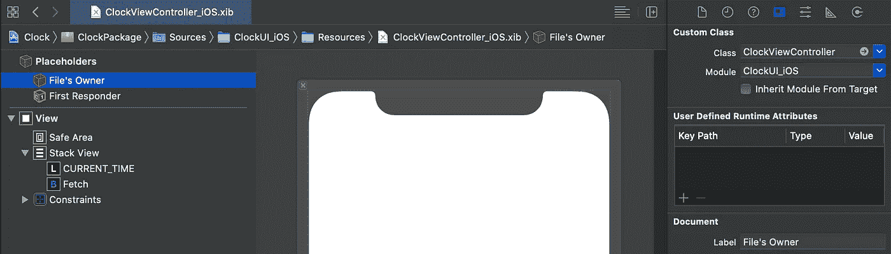

XIB 视图控制器类是在文件的所有者设置中设置的

在继续介绍 macOS 等价物之前，让我们在我们的 iOS 应用程序中展示这个界面。为此，我们首先需要将`ClockUI_iOS`模块作为框架添加到我们的 iOS 目标中:

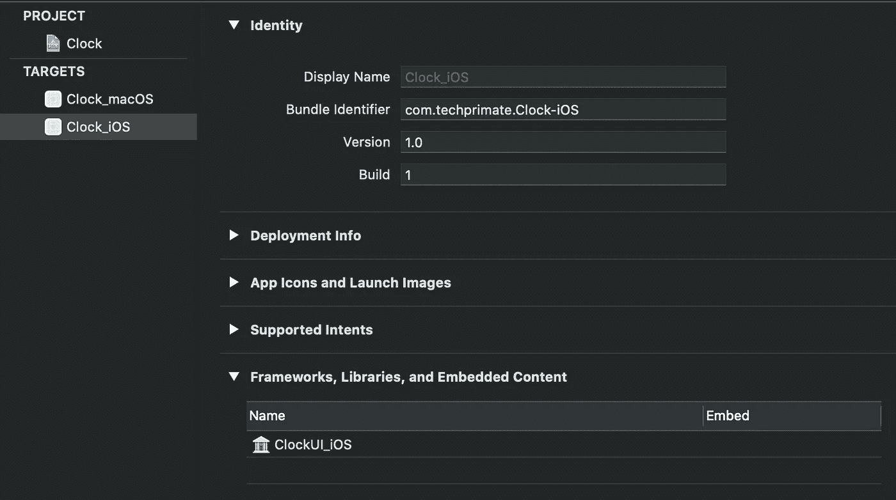

如果您做得很好，现在您可以在`Clock_iOS/ViewController.swift`文件中创建`import ClockUI_iOS`并创建`ClockViewController`的一个实例:

```
import UIKit
import ClockUI_iOS

class ViewController: UIViewController {

    override func viewDidAppear(_ animated: Bool) {
        super.viewDidAppear(animated)

        let clockVC = ClockViewController()
        self.addChild(clockVC)
        // set a debug background color so we can see the view
        clockVC.view.backgroundColor = .orange
        clockVC.view.autoresizingMask = [
           .flexibleWidth, .flexibleHeight
        ]
        self.view.addSubview(clockVC.view)
    }
}
```

正如你所看到的，整个视图现在是橙色的，但仍然是空的。我们不需要创建一个`ClockViewController`的实例，而是需要通过修改下面的代码行从 XIB 文件中加载它

```
...
let clockVC = ClockViewController()
// becomes
let clockVC = ClockViewController.loadFromNib()
...
```

并将`loadFromNib()`方法添加到`ClockViewController`中:

```
// MARK: - Nib Loading

public static func loadFromNib() -> ClockViewController {
    // Loads the compiled XIB = NIB file from the module 
    // resources bundle. Bundle.module includes all resources
    // declared in the Package.swift manifest file
    ClockViewController(nibName: "ClockViewController_iOS", 
                        bundle: Bundle.module)
}
```

再次运行应用程序，你的按钮和标签就会出现🎉

## macOS 接口

幸运的是，macOS 实现的工作方式完全相同，但是使用了相应的 macOS 类和模块等价物:

创建`ClockPackage/ClockUI_macOS/ClockViewController.swift`

```
public class ClockViewController: NSViewController {

    // MARK: - IB Outlets

    @IBOutlet weak var timeLabel: NSTextField!

    // MARK: - IB Action

    @IBAction func didClickFetchButtonAction(_ sender: Any) {
        print("did click fetch")
    }

    // MARK: - Nib Loading

    public static func loadFromNib() -> ClockViewController {
        ClockViewController(nibName: "ClockViewController_macOS", 
                            bundle: Bundle.module)
    }
}
```

同样，不要忘记连接`view`插座，否则它无法实例化笔尖。

> 如果 Xcode 没有向您显示链接`view`的选项，请将其作为`@IBOutlet weak var view: NSView!`添加到视图控制器 Swift 类中，然后它应该会显示在 Xcode 界面构建器中。链接后，您可以简单地删除 line，它仍然可以正常工作，因为 NSViewController 已经拥有了一个同名的属性。

1.  将 macOS XIB 与班级联系起来
2.  将`ClockUI_macOS`框架添加到`Clock_macOS`应用目标中
3.  在`Clock_macOS/ViewController.swift`中增加`import ClockUI_macOS`
4.  将 iOS 包中的`loadFromNib`复制到 macOS 包中
5.  将视图控制器添加到视图层次结构中:

```
import Cocoa
import ClockUI_macOS

class ViewController: NSViewController {

    override func viewDidAppear() {
        super.viewDidAppear()

        let clockVC = ClockViewController.loadFromNib()
        self.addChild(clockVC)
        clockVC.view.autoresizingMask = [.width, .height]
        self.view.addSubview(clockVC.view)
    }
}
```

干得好！现在，您已经拥有了一个正在运行的 iOS 和 macOS 应用程序，使用 Swift 软件包中的接口资源🚀

# 共享 UI 逻辑

最后一步，我们想要创建一个在`ClockUI_iOS`和`ClockUI_macOS`包之间共享的服务。由于我们从一个`ClockUI`包开始，它完全符合我们的需求，因此将文件`.../ClockUI/UI.swift`重命名为`.../ClockUI/ClockService.swift`，并在其中创建一个同名的类:

```
import Foundation
import Combine

public class ClockService {

    // subject to subscribe for updates
    public var currentTime = PassthroughSubject<String, Never>()

    public init() {}

    public func updateTime() {
        let formatter = DateFormatter()
        formatter.timeStyle = .full
        currentTime.send(formatter.string(from: Date()))
    }
}
```

正如前面的教程中所解释的，将`ClockUI`作为依赖项添加到包清单中的`ClockUI_macOS`和`ClockUI_iOS`库中。

实现逻辑的快速总结:

1.  我们的服务可以负责“更新”时间
2.  我们使用`Combine`,因为它是一个现代的反应式框架，用于订阅时间变化和更新我们的 UI

要在我们的视图控制器中使用服务，创建一个本地实例并订阅`currentTime`发布者。例如，这里的最终 iOS 视图控制器:

```
import UIKit
import ClockUI
import Combine

public class ClockViewController: UIViewController {

    // MARK: - Services

    private let service = ClockService()
    private var timeCancellable: AnyCancellable!

    // MARK: - IB Outlets

    @IBOutlet weak var timeLabel: UILabel!

    // MARK: - IB Actions

    @IBAction func didTapFetchButtonAction() {
        service.fetchTime()
    }

    // MARK: - View Life Cycle

    public override func viewDidLoad() {
        super.viewDidLoad()
        timeCancellable = service.currentTime
            .sink(receiveValue: { self.timeLabel.text = $0 })
    }

    // MARK: - Nib Loading

    public static func loadFromNib() -> ClockViewController {
        // Load the compiled XIB = NIB file from the
        // module resources bundle
        ClockViewController(nibName: "ClockViewController_iOS", 
                            bundle: Bundle.module)
    }
}
```

运行这两个应用程序，瞧……你可以在每个应用程序中按下按钮时更新时间标签，它们以相同的方式运行！

你可以在 [GitHub 库](https://github.com/philprime/ClockSPMSample)中找到完整的代码。

# 结论

我们做到了。我们使用具有相同 UI 逻辑的不兼容接口构建器创建了两个应用程序。

如果你还在疑惑，为什么要经历将项目分割成如此分散的包的麻烦，让我进一步解释一下:

*   假设您的应用程序达到了 20、50、100 甚至更多模块的大规模。使用这种高度模块化的结构，您可以轻松地创建另一个应用程序目标(类似于我们为 macOS & iOS 所做的)，并简单地导入您正在处理的特定功能。
*   构建过程应该变得更有性能，因为未更改的包被缓存了(*不幸的是，我现在没有任何可用的统计数据来证明这一点)*
*   由于 Swift 包的内置隔离，我们有一个强大的[关注点分离](https://en.wikipedia.org/wiki/Separation_of_concerns)，并且可以单独使用我们代码的一个小的子集(例如，用他们自己的单元测试创建共享的实用程序)
*   创建一个干净的架构变得更加容易，比如 VIPER，其中 UI 呈现(视图)和逻辑(呈现者)是使用协议/接口完全抽象的。

如果你想了解更多，请查看我的其他文章，在 [Twitter](https://twitter.com/philprimes) 上关注我，并随时给我发短信。你有具体的话题想让我介绍吗？让我知道！😃