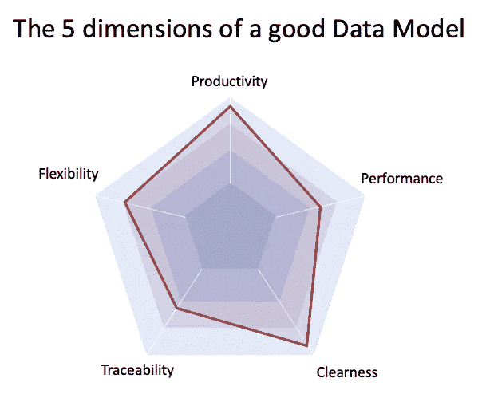
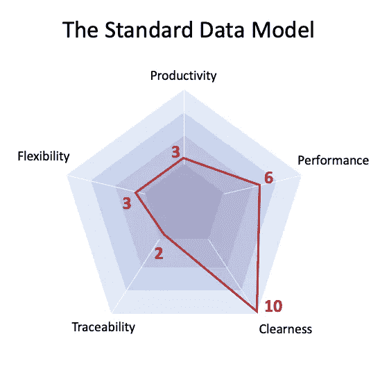
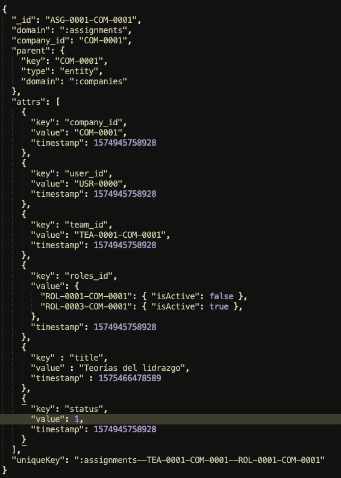
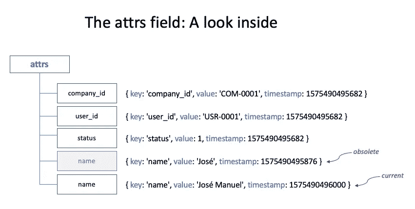
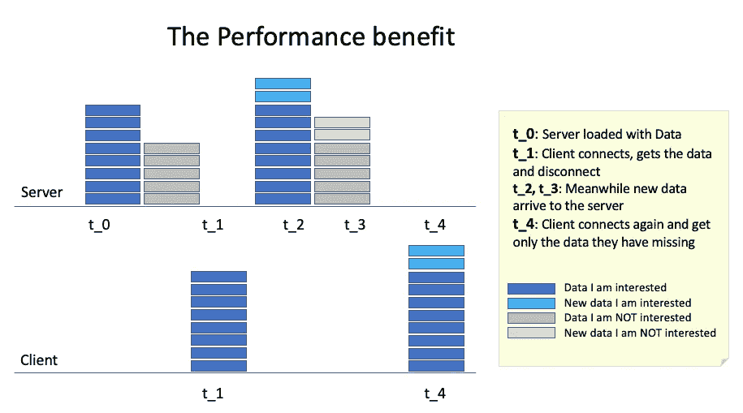
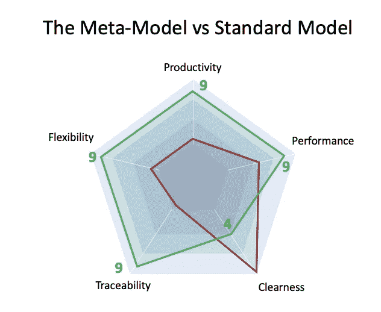

# 高级数据建模技术

> 原文：<https://itnext.io/advanced-data-modeling-techniques-6d8148d1b734?source=collection_archive---------2----------------------->

## 在领域模型和元模型之间选择

每个应用程序的数据模型都是它的核心。

最后，一切都与数据有关:数据来自用户键盘或外部来源，数据按照一些业务规则进行处理，最后，数据以某种方便的方式呈现给用户(或外部应用程序)。

照片由 [Eric Prouzet](https://unsplash.com/@eprouzet?utm_source=medium&utm_medium=referral) 在 [Unsplash](https://unsplash.com?utm_source=medium&utm_medium=referral) 上拍摄——一个数据模型就像有许多盒子可以存储一样

你的应用程序的每一个方面，你写的每一个函数，都涉及到数据，使整个系统有意义。

所以，问题是:

***好的数据建模有哪些关键方面？***

我们将在本文中回答这个问题，但首先，我们需要两个定义:

## 定义 1:什么是数据模型？

数据模型是组织应用程序数据的一种方式。不是数据本身，不是你用来存储数据的设备(你选择的数据库系统)。所以下面的断言是正确的:

*   您可以使用不同的数据模型存储相同的数据。
*   您可以使用相同的数据模型存储不同的数据。
*   应该可以将数据从一个数据模型转换到另一个数据模型(这个过程通常称为“数据迁移”)。

## 定义 2:我们如何定义什么是好的数据模型？

换句话说:我们如何比较不同的数据建模选项？应该考虑哪些方面？

良好数据模型的 5 个维度

我提出 5 个最相关的维度:

*   **清晰**:数据模型的容量，人们看着它就能理解。你可能听说过，大多数时候开发人员是读代码而不是写代码，所以我们需要清楚地了解我们在用数据做什么。
*   **灵活性**:模型进化的能力，而不必对我们的代码产生巨大的影响。你所工作的创业公司正在发展，所以系统也在变化，它们背后的数据模型也需要随着时间的推移而发展。
*   **性能**:这是一个非常宽泛的话题，我们在这里不是在谈论数据库供应商、数据索引或一些提高读写速度的技术调整。我认为我们可以将性能优势完全归因于我们如何对数据建模。稍后我们将深入探讨这一方面。
*   **生产力**:从开发人员的角度来看，我们希望有一个易于使用和推理的模型，这样我们就可以“产生很多好的代码”而不用花费很多时间(生产力的定义😄)
*   最后，我们不仅希望拥有与用户相关的数据，还希望拥有与系统本身相关的数据。能够知道过去发生了什么，实体在某个时间点有什么值，在时间上后退和前进，等等。

换句话说:

> 给我一个易于理解、易于扩展或更改的数据模型，具有良好的性能，同时对开发人员的工作效率也有好处，并且能够知道过去发生了什么…
> 
> 嘣！每个人都会非常非常开心🎊 🎉…

# 主要数据建模技术

现在你可能已经猜到了，在本文中，我们将提出一种通用的数据建模方法，以满足我们所有的需求。

我坚信没有灵丹妙药，大多数情况下正确的答案是“视情况而定”，但是我已经使用了这种新技术，它看起来很有希望。

所以，我提前为我在这个问题上如此固执己见的借口😉。

但是首先，让我告诉你关于建模数据的“正常方式”,我认为你应该看起来很熟悉。

## 标准数据模型(又称领域模型)

非常简单:您根据您正在解决的问题的领域来定义您的实体及其属性。因此，每个实体将与同一域中的其他实体相似，而与另一个域中的实体非常不同。比如为我们想要存放的每种物品准备不同的盒子。

[Clem Onojeghuo](https://unsplash.com/@clemono2?utm_source=medium&utm_medium=referral) 在 [Unsplash](https://unsplash.com?utm_source=medium&utm_medium=referral) 上的照片——标准数据模型:一种盒子一种用途

假设您正在开发一个会议软件解决方案。您的域将类似于以下列表:

*   **会议**:关于地点、时间、持续时间的基本信息，并作为下面列出的其余实体的容器。
*   **人员**:会议成员可能具有某种特定的角色(组织者、秘书、演示者等)
*   **主题**:会议议程是一个主题列表，有一定的顺序、描述、持续时间等。
*   **Agreements** :对话的主要输出，可能带有一些附加标记，以便以后搜索。
*   **备注**:话题内的主要对话。
*   **动作**:短期内分配给一个人的一些职责。
*   *你明白了…*

很明显，这种建模非常清晰，因为它的定义就像我们思考问题的方式一样。

因此，让我们首先检查我们的 5 个分析维度(从 1 到 10):

*   🔟**清澈度** : 10 分。是的，模型超级清晰，就像人类想的那样。
*   3️⃣ **灵活性** : 3 分。不过，这里不太好。每一个新的领域需要，将需要一个模型的变化🤷🏻‍♂️.
*   6️⃣ **表现** : 6 分。这种模型没有最好的性能，我们将在后面解释为什么。
*   3️⃣ **生产率** : 3 分。嗯，每个集合(或表)都需要自己的方法来更新每个字段中的值，对吗？这对开发人员的生产力没有好处，除非你开发一个中间件以“参数化的方式”与数据库对话，但这也是不自然的。我们将提出一个更好的方法来实现这一点。
*   2️⃣ **可追溯性** : 2 分。这种建模就地更新字段，因此地址改变时，您丢失了旧地址，对吗？解决方法是用一个单独的表来记录所有的变更(一个日志表)，但是它将与模型的其余部分分开，因此是“嘈杂的”。

5 个分析维度下的标准数据模型

# 元建模方法

好了，我们现在就直奔主题。

## 模型的结构

> 建议是只有一个表(或集合)，在相同的结构下存储所有的域数据，并且不丢失任何数据(没有更新，没有删除)*。

**此规则有两个例外，我们将在后面介绍。*

元模型中记录的形状

这个“通用记录”的结构是:

*   **_id** :实体的唯一标识符。
*   **uniqueKey** :(可选)这也是实体的唯一标识符，但它由一些业务规则驱动。例如:电子邮件地址必须是唯一的，否则两个实体之间的关系可能会产生一个新实体，该实体具有唯一关键字“*entity _ id _ 1-entity _ id _ 2*”。
*   **域**:或者我们存储的实体的类型。最重要的是，当开发人员查看数据库时，它对数据获取、过滤和清晰非常有用。
*   **company_id** :这个领域可能有争议，但是在我开发的应用程序中，公司(你的用户所属的组织)的概念总是存在的，所以它有利于索引、清晰以及为所有域提供一个“容器实体”。
*   父母:好的，我们现在正在考虑关系。假设有一个表，在模型级别没有显式关系(在数据级别有)。在这里，我们标识当前实体的父实体，因此当我们可以访问父实体时，我们也可以访问这个实体。根据我的经验，这里大多数情况下是 company_id 或 user_id。
*   **attrs** :这里是“肉”在哪里(实际数据)。这是一个形式为 *{ key，value，timestamp }* 的对象数组。

“元实体”的一个例子

## **属性字段**

所以，整个模型实际上都在这个字段下，每个键可能不止一次(对于不同的时间戳)。

例如:

*   { key: 'name '，value: 'José'，时间戳:1575490495682 }。
*   { key: 'name '，value: 'José Manuel '，时间戳:1575490495795 }。

指示相同的键**名**在时间戳 **1575490495682** 处具有值“**何塞”**，但是之后在 **1575490495795 处变为“**何塞·曼努埃尔”**。**假设这个时间戳比前一个时间戳大，我们认为这个值是当前值。

此外，在 attrs 字段中，我们将始终有 3 个特殊字段:

*   **company_id** :已经说明。
*   **user_id** :或者负责创建实体的用户。
*   **状态**:活动实体为 1，删除实体为-1(我们从未真正删除过实体！)

“属性”字段的详细信息

注意，每个属性中的**值**属性的“形状”可以是任何类型。如果我们用 javascript 术语思考(我用过 Mongo，但我认为同样的结构也适用于其他 db)，我们可以有:字符串、布尔、数字、日期、数组、对象等。

现在，我们将详细介绍分析的 5 个维度。

## 明白

这并不是这个模型最大的特点，因为每次查看一条记录，都需要深入到 attrs 字段内部。这是我们付出的代价，是拥有其他好处的代价。

我应该提到的是，在使用这个*键值*心智模型一段时间后，你会“非常清楚地看到这个模型”，但是对于读者来说，乍一看这可能听起来很混乱。

当我们像这样建模时，我们还有一个好处:我们可以用一个查询描述所有模型。因此，如果我们需要一个文档(或者更好的是一个网页)来显示每个实体的“真实”字段，我们可以很容易地实现。

雅各布·萨普在[Unsplash](https://unsplash.com?utm_source=medium&utm_medium=referral)—**Clearness**上拍摄的照片

现在，让我们来看看灵活性。

## 灵活性

灵活性内置于元模型中，它是核心概念:我们不需要预先为每个域定义实体的字段(也称为“模式”)，我们只需要定义这个可以容纳任何模式的通用结构。

在这种情况下，这一点非常重要:

*   您系统需要在给定的实体或者新的实体中保存新类型的数据。没问题，您已经知道任何实体都可以用一个简单的键值定义来建模，所以您不会因为做这个更改而破坏任何代码。 ***问题是模型真的在数据里面，而不是在数据库里面！***
*   你需要改变实体之间的关系，也许一个依赖于一个用户的实体现在需要依赖于一组用户…没问题，你只需要用一个查询更新父字段。在这种情况下，您可能需要更改代码，但是您(再次)没有更改模型。

**有这个功能真是太神奇了，真的**。你参加的下一个会议叫做“数据模型需要的改变”，你可以带着自信和灿烂的笑容走进去😁

照片由[韦斯利·廷吉](https://unsplash.com/@wesleyphotography?utm_source=medium&utm_medium=referral)在[Unsplash](https://unsplash.com?utm_source=medium&utm_medium=referral)—**Flexibility**

## 表演

这是这种建模方式最不明显的好处。你可以争辩说(你会是对的)这种模式比传统模式更占空间。是的，它是。

但是现在储存不是问题。我们有很多，而且很便宜。

主要性能与*键值*存储方式无关，但与*时间戳*字段相结合，我们从不更新或删除任何东西。

正因为如此，从这个模型(实际感知性能的地方)读取数据的客户不需要得到所有的实体，也不需要得到他们感兴趣的所有实体字段，因为他们可能已经有了！

例如:

*   在数据库中的*时间戳* **t_0** 处创建了一些数据。
*   客户端在 **t_1** 请求一些数据，服务器响应客户端感兴趣的数据(只有模块需要/可以访问的数据)。然后客户端在时间戳注销应用。
*   稍后，在时间戳 **t_2** 和 **t_3** 处，服务器获得新数据，例如，为与应用程序交互的其他用户提供的数据。
*   在那之后，在 **t_4** 客户端再次连接，而不是再次拥有所有数据(加上新信息)，他只获得新信息，避免通过网络传输他已经拥有的数据。

我们每次都只得到我们需要的数据

这对性能有好处！！我们不是调整一些小细节，而是在每次去数据库的时候，通过说:只要给我你从这一点开始给我的东西，我们就削减了很多工作。

这不仅在实体级(新实体将被完全发送)起作用，而且在字段级(我们将只发送旧实体的新字段)起作用，从长远来看减少了通过线路发送的字节量。

换句话说，我们在这里实现了一个**本地缓存**，这只有**才有可能，因为我们不更新字段**，我们总是追加新数据。

[摄哈雷戴维森](https://unsplash.com/@harleydavidson?utm_source=medium&utm_medium=referral)在 [Unsplash](https://unsplash.com?utm_source=medium&utm_medium=referral) — **表演**

**在这种情况下，我们打破了“仅追加”规则？**

有两种情况我们不追加，以防你想知道如何管理它们:

1.  **字段只是状态**，是易变的。假设您已经向用户发送了通知。用户可能希望将其标记为已读或未读，并且可以多次执行该过程。因此，由于数据的性质，保留所有的“点击历史”没有真正的价值。
2.  **该字段代表一个子实体**，例如，您可能有一个名为“技能”的域，其“等级”从 1 到 n。您可以创建一个名为“技能等级”的新域，但作为子实体，将其嵌套在父实体中更简单。要点是，每次添加或删除一个分数时，不是有多个 key='grades ',而是只有一个 key='grades ',并在其中添加内容。

在这两种情况下，我们都在每次更新中更新这个字段的时间戳，所以下次客户机请求时，它会被识别为新信息。

## 生产力

如果你的模型中有 20-30 种类型的实体(达到这个数目并不难)，你需要为每个实体准备一些 CRUD(创建-读取-更新-删除)方法，对吗？所以，你将 100 个左右的方法一一写出来。

我以前有过这种感觉:从一个方法中复制现有代码，更改文件名，将其添加到索引文件中，更改方法的内容，添加/删除字段，等等。每次你改变实体的字段，你猜怎么着？找到文件，更改字段，重启服务器…🤯

当你有一个元模型时，你会很快意识到你需要建立一些效用函数来与它交互。但是！与上面提到的 100 种方法的区别在于，实用程序的集合更小，并且不依赖于域的大小(20-30 种类型的实体将具有与 90 种类型的实体相同的实用程序功能)。

以下是其中的一些功能:

*   **createEntity** :构建基本结构，它是实体不可知的(就像下面所有其他函数一样)。
*   **addAttrsToEntity** :“更新”功能，允许在不丢失先前数据的情况下向实体添加新数据。
*   **addParentKey** :添加实体的“关系方”，能够决定以后谁可以访问它。
*   **getEntities** :通过选择器、by _id 或 uniqueKey，获取实体数据。
*   大多数时候，我们只对每个字段的最后(当前)值感兴趣，所以我们传递一个实体给这个方法和一些要返回的键，我们得到一个对象，每个键都有最后的值。
*   **getRelatedEntities** :允许返回公司级(所有用户都可以访问)或用户级或其他级别的实体(例如路由、查询参数)。

根据我现在从事的一个项目，你应该预计会少写 50%到 70%的代码，但是由于标准化，错误也会更少。

图片由 [Andreas Klassen](https://unsplash.com/@schmaendels?utm_source=medium&utm_medium=referral) 在 [Unsplash](https://unsplash.com?utm_source=medium&utm_medium=referral) — **生产力**上拍摄

## 可追踪性

如果您删除(物理地)数据或就地更新数据(最常见的方法)，您将失去了解过去发生了什么的能力。有时这是你真正想要的(例如上面提到的两种情况)，但有时你只是觉得更安全。

您知道数据库不仅保存着与您的用户相关的数据，还保存着与每条数据相关的事件。这对以后有好处:

*   **调试**:你能够“真实地看到发生了什么”
*   **分析**:您还可以通过查看数据库来了解应用程序的使用情况。

照片由[威尔·斯图尔特](https://unsplash.com/@wilstewart3?utm_source=medium&utm_medium=referral)在 [Unsplash](https://unsplash.com?utm_source=medium&utm_medium=referral) — **溯源**上拍摄

好了，现在让我们用新方法来看看我们的数字:

分析的 5 个方面，比较 2 种技术

元模型在每个维度上都有明显的优势，除了不太清晰(尽管你可以随着时间的推移让你的大脑适应这个模型)。把这张照片仅仅作为比较两种选择的一种方式，我知道这些数字是任意的，并不是基于严肃的研究。

## 额外收获:在浏览器中也使用这个模型怎么样？

这很容易成为本文的“第 2 部分”,但是概括起来，关键方面是:

*   我们将在 LocalStorage(或者更好的是在 IndexedDB 中)拥有从服务器接收的数据的本地副本。我们只会在新数据到达时接触这些数据。
*   然后，我们将用所有数据填充一个对象(一个大的 JS 对象),进行两次转换:
*   1)我们将只有每个字段的最后一个值(不再需要时间戳)
*   2)不是以 *[ { key: 'name '，value: 'José }，{ key: 'city '，value: 'Santiago' } ]* 的形式存储数据，而是像 *{ name: 'José'，city: 'Santiago'}。*所以这更符合我们的思维模式。
*   这是非常重要的，因为我们要照顾客户代码的“可访问性”。
*   当用户产生新数据时，我们会很乐观:我们会将它添加到我们的大型 JS 对象中，并向服务器发出请求，因此我们的 UI 会立即反映变化。

最后但同样重要的是，在元模型上构建一个**管理模块**(创建、删除、更新新数据)也非常简单。您将为每个集合编写更少的特殊代码，提高代码的一致性，并且编写更少的 UI 组件。

如果你觉得这个方法有用，请告诉我你的想法！

来自智利的欢呼！！🇨🇱