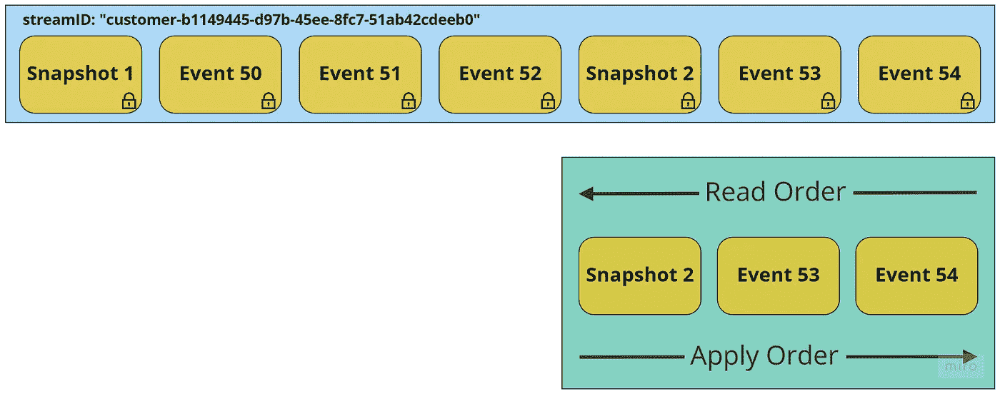
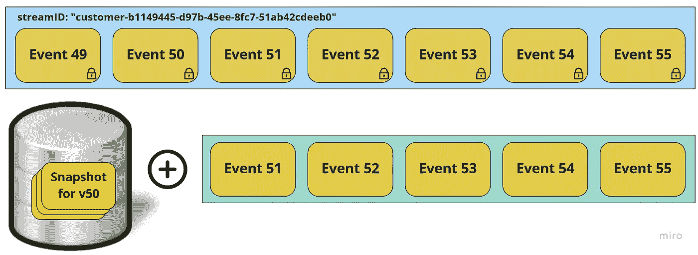

# 用于事件源的事件存储的高级功能

> 原文：<https://itnext.io/advanced-features-of-an-event-store-for-event-sourcing-a457ebd77692?source=collection_archive---------2----------------------->

## 无论是现成的解决方案还是定制的，通用事件存储都应该提供一些高级功能。

**这是我上一篇文章的后续:**

 [## 用于事件源的事件存储的基本特性

### 无论是定制的开箱即用解决方案，事件存储都需要提供某些基本功能和…

itnext.io](/essential-features-of-an-event-store-for-event-sourcing-13e61ca4d066) 

所有的基础知识和基本功能都在那里解释！

# 高级功能

除了这些基本功能，专业活动商店还应该提供高级功能，提供**附加功能**和**灵活性**。

## 发布没有两阶段提交的事件

不使用两阶段提交来发布事件的能力对于事件存储来说是一个有用的高级特性。这在被划分为*有界上下文*的**分布式系统**中尤其重要，比如在微服务架构中。在这些系统中，能够发布 ***域事件*** 让其他上下文知道重要的变化是很重要的。发布的事件可能与*事件源事件*相同，也可能在*中增加了*附加信息。

**两阶段提交的快速**描述**:**事件成功存储但发布失败。我们不能永远重试出版，但我们最终必须出版它。所以我们希望这是原子的。两阶段提交不是一个简单的问题。

一种可能是使用[发件箱模式](http://www.kamilgrzybek.com/design/the-outbox-pattern/)。我只链接了 Kamil 的这篇文章，因为我知道他知道他的东西。外面有更多的(好)文章。我以前工作的团队已经通过 PostgreSQL 支持的定制事件存储实现成功实现了这种模式。要做到这一点比运营 Twitter 更简单——但是细节决定成败。特别难的是实现 ***恰好一次* *交付***——至少我不知道一种方法可以做到。

一个**抽象**并**去除**的事件存储库——用一个可靠的开箱即用的解决方案——帮助我们减少需要编写的代码量，并避免**意外的复杂性**。

EventStoreDB 提供了一个很棒的特性叫做[订阅](https://developers.eventstore.com/clients/grpc/subscriptions.html#subscribing-from-the-start)，相当灵活。我想上面提到的一些图书馆也提供订阅支持，但是你必须自己做研究。

“发布事件”的另一种框架是*得到关于新事件的通知*。

## 内置投影

通常，用于从事件流(或交叉流)获得当前状态的**投影**在**应用逻辑**中实现。然而，EventStoreDB 和一些库提供了在事件存储本身中运行这些投影的能力。对于 EventStoreDB，这是通过创建一段 JavaScript 代码来完成的。然后，这些预测被馈送给它们订阅的所有事件，并随着每个新事件而更新。这可用于写和读模型，尽管它通常仅用于读模型。

这种方法有几个潜在的缺点:

1.  应用程序逻辑从应用程序移到数据库，这类似于在传统数据库中使用存储过程。这可以通过将投影代码存储在代码库中并在那里更新它来部分缓解，但这将需要某种类型的**迁移**代码来将更改推送到事件存储中。这类似于传统的数据库模式迁移，但是具有能够以*非破坏性*方式实现的优势(例如，创建新的投影而不是更新现有的投影)。
2.  这种预测可能比常规的应用程序逻辑更难测试，因为它们在事件存储中运行，并且只有最终一致。

## 支持快照

一些事件存储提供了对快照的支持，这是一种有效的方式来提高基于事件的系统的性能和效率。我的朋友 **Oskar Dudycz** 写了几篇关于这个主题的文章，提供了更多关于快照概念的信息和细节:

 [## 保持你的小溪短！用于快速读取和最佳数据保留的时态建模

### 做模特很难。我们需要考虑很多事情。这篇文章将解释时态…

www.eventstore.com](https://www.eventstore.com/blog/keep-your-streams-short-temporal-modelling-for-fast-reads-and-optimal-data-retention)  [## 事件来源中的快照

### 事件采购的最大好处之一是您不会丢失任何业务数据。每项业务运营都以…

www.eventstore.com](https://www.eventstore.com/blog/snapshots-in-event-sourcing)  [## 快照策略

### 查看来自互联网的资源，您可能会得出结论，快照是活动采购的重要组成部分…

www.eventstore.com](https://www.eventstore.com/blog/snapshotting-strategies) 

> *💡* ***警告№1*** *快照是* ***缓存*** *并且缓存给系统增加了* ***复杂度*** *。还有* ***多代码*** *维护，* ***多逻辑*** *理解，附加* ***故障来源*** *，* ***偶然复杂性*** *。重要的是* ***避免*** *过早地使用快照***，尤其是在由于性能原因实际上并不需要快照的时候。还记得****YAGNI****吗？**
> 
> **💡* ***警告№2*** *快照是* ***加上*** *它们缓存的实体的实现，所以要改变实现可能更难，或者至少要做更多的工作。**
> 
> **💡* ***警告№3*** *与其引入快照来提高非常长的流(数千个事件)的读取性能，不如考虑一种与* ***不同的应用程序设计，使流保持较短*** *(er)。**

*快照有两种存储方式:*带外*和*带内。**

*带外快照与它们所基于的事件流分开存储，通常存储在不同的数据库中。这允许在存储方面的灵活性，但是需要**两个查询**来首先检索快照，然后检索它所基于的事件流。检索带外快照时，事件流应该只从快照所基于的版本读取到当前版本。*

*相反，**带内**快照作为事件**存储在它们所基于的流**中。这意味着只需要**一个查询**就可以将流从快照检索到当前版本。*

> **💡如果向下滚动一点，您会发现显示带外和带内快照的图形。**

## *带内和带外快照的优缺点*

***增加—2022 年 12 月 22 日***

*基于我在 Twitter 上得到的反馈(感谢 **Alexander Berl** )和这篇文章的评论(感谢 **Greg Young** ),我想**再强调一下带内和带外的优缺点**。*

***带内快照的优势***

*   *不需要单独的存储(或流)*
*   *由于只有一个查询，所以性能最佳(另见下文)*

***带内快照的缺点***

*   *原始流被快照事件污染*
*   *如果模型(投影)改变，很难去掉过时的快照(流中的单个事件不应该被删除或更新)*
*   *如果需要多种快照类型或版本，这会对原始流造成更大的污染*

***带外快照的优势***

*   *存储方面更大的灵活性*
*   *如果模型(投影)发生变化，很容易去掉过时的快照——只需删除它们*
*   *可能有一个表、流等。对于每个快照类型或版本*

***带外快照的缺点***

*   *性能稍低(两个查询)*
*   *单独存储(或流)是必要的*

*通常**建议**使用带外快照，因为这样可以保留原始流并提供更大的灵活性。*

*EventStoreDB 提供了一种存储快照的好方法:为每个快照创建一个单独的流，并将流大小限制为 1。这样，新的快照事件将有效地覆盖以前的事件。如果流没有上限，检索最新快照的一个好方法是向后读取，并且只读取 1 个事件。每个快照类型(对于不同的预测)或快照版本(如果您对变更建模)有一个流可能是有益的。*

*以下两个功能描述了如何有效地使用快照:*

## *向后阅读流*

***通常**，流被**向前读取**，从最早的事件开始，向最近的事件移动。然而，在某些情况下，从**相反的方向**解读事件可能更有用。例如，当使用带内快照存储时，向后读取流可以方便地检索最新的快照。通过在到达第一个快照时停止，可以轻松地访问流的最新状态。*

**

*具有带内快照的事件流有效地向后读取，直到找到最新的快照。快照和事件需要以相反的顺序应用，以反映当前状态。*

## *从版本 X 到版本 Y 读取部分流*

> **💡这很可能被认为是一个重要的特性——对我来说这是一个艰难的决定。**

*读取部分流，或者只是流的一部分，有一些潜在的用例。例如，如果使用**带外快照**，可以从快照之后的版本开始读取流，而不是读取整个流。这可以节省时间和资源。读取部分流的另一个用例是**及时回顾**，并投射特定版本的状态。在某些情况下，基于**时间戳**而不是版本来读取部分流可能更合适。例如，如果您想要预测一个**财政年度**结束时的状态，您可能不知道那个时间点的流版本，但是您知道时间戳。类似地，通过使用开始和结束时间戳作为过滤器，可以读取特定**时间段**的所有`OrderFullfilled`事件。再次注意时间戳并不总是可靠的，这一点很重要，因此使用时间戳时应小心**。***

******

***带外快照存储在不同数据库中的示例。快照需要包含它是在哪个流版本(v50)上拍摄的信息，并且只有在 v50 之后发生的事件必须在快照之后应用。***

# ***最后的话***

***这是我关于事件商店应该提供的功能的两部分系列的结论。肯定有更多的功能和细节，但在某些地方我必须划清界限。亲爱的读者，我希望这篇文章对你有所帮助，如果你想从事件源开始，并需要选择一个存储事件的解决方案。***

***最后，我想向您推荐另一篇关于这个主题的精彩介绍文章，作者是阿列克谢·齐马列夫(Alexey Zimarev):***

*** [## 正确的方式

### 活动采购做得很好，因为它意味着什么。不要误以为活动采购是一样的…

eventuous.dev](https://eventuous.dev/docs/prologue/the-right-way/) 

> *💡* ***免责声明*** *请注意，我在这篇文章中提到过 EventStoreDB，过去也为他们的博客写过付费文章。虽然我写这篇文章没有得到任何奖励，但我确实使用并喜欢他们的产品。此外，我认识几个现在或曾经为这家公司工作的人，其中一些我认为是泛泛之交。因此，我对 EventStoreDB 特性的描述可能有点偏颇。**** 

## ***感谢您的时间和关注！:-)***

> ****非常欢迎提问和评论，如果你为这篇文章鼓掌(如果你喜欢的话)或者在 Medium 上关注我，* [*Twitter*](https://twitter.com/TonyBologni) *，或者* [*乳齿象*](https://mastodon.social/@TonyBologni) *！****

*** [## 通过我的推荐链接加入 Medium—Anton str ckl

### 阅读我和其他伟大的科技作家的每一个故事！你的会费直接支持我和其他…

medium.com](https://medium.com/@TonyBologni/membership)  [## 每当安东·施特克尔发表文章时，都会收到电子邮件。

### 每当安东·施特克尔发表文章时，都会收到电子邮件。通过注册，您将创建一个中型帐户，如果您还没有…

medium.com](https://medium.com/subscribe/@TonyBologni)***