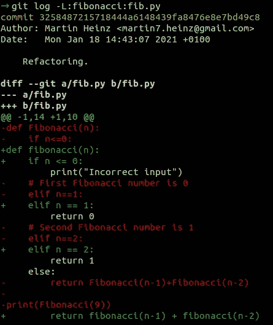
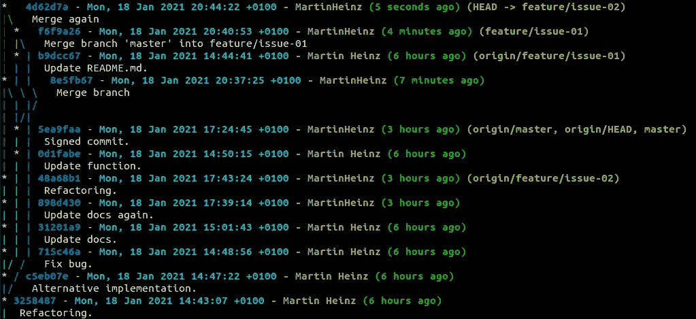
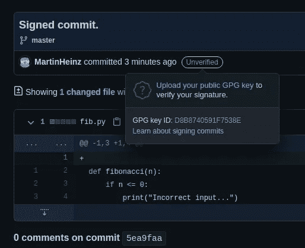
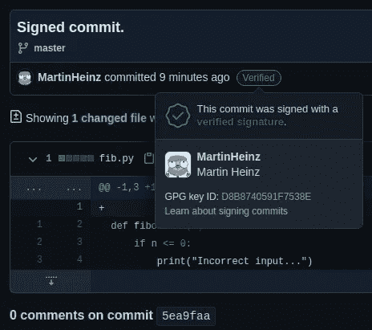

# 您不知道自己需要的高级 Git 特性

> 原文：<https://itnext.io/advanced-git-features-you-didnt-know-you-needed-ed8455c45495?source=collection_archive---------2----------------------->

## 你错过了一些很棒的`git`功能，比如单词区分、自动更正、插件或提交签名，是时候改变它了…

`git`是一个非常强大的工具，几乎每个开发人员每天都需要使用，但是对我们大多数人来说，它的使用减少到只有几个命令，比如`pull`、`commit`和`push`。然而，为了高效、多产并充分发挥`git`的威力，人们需要知道更多的命令和技巧。因此，在本文中，我们将探索一些易于使用、记忆和配置的`git`特性，这些特性可能会让您处理版本控制的时间变得更加愉快。

[David Z](https://unsplash.com/@davezeidler?utm_source=unsplash&utm_medium=referral&utm_content=creditCopyText) 在 [Unsplash](https://unsplash.com/?utm_source=unsplash&utm_medium=referral&utm_content=creditCopyText) 上的照片

# 改进基本工作流程

在我们使用最基本的命令如`pull`、`commit`和`push`之前，我们需要了解我们的分支和更改的文件发生了什么。为此，我们将使用`git log`，这是相当普遍的知识，但不是每个人都知道如何使它的输出*实际上*可读和漂亮:

git 日志图

这种图表可以给你一个很好的概述，但通常你可能需要挖掘得更深一点。例如，查看特定文件甚至单个功能的历史/演变，并且`git log`(带有`-L :<funcname>:<file>`参数)也可以这样做:

git 日志功能

既然我们对存储库中发生的事情有了更好的了解，我们可能想要检查我们更新的文件和最近提交的文件之间的差异。为此我们将使用`git diff`，这里也没有什么新的东西，但是`diff`有一些你可能不知道的选项和标志。例如，你可以用`git diff branch-a..branch-b`比较两个分支，或者用`git diff <commit-a> <commit-b> -- <path(s)>`比较不同分支中的特定文件。

有时,`git diff`的输出可能变得很难阅读。为了帮助解决这个问题，你可以尝试使用`-w`标志，它会忽略所有的空格，让 diff 更多地处理单词而不是整行。

如果 shell 中的基本静态输出对您来说不够好，那么您可以使用`git difftool=vimdiff`启动`difftool`，这将在 vim 编辑器中并排打开 diff。Vim 显然不是这里唯一的选择，您可以运行`git difftool --tool-help`来查看您可以使用的所有有效区分工具的列表。

我们已经看到了如何使用`git log`查看文件中特定零件/行的历史。类似的事情也很方便——例如——暂存文件的各个部分，对吗？这可以在 IDE 中很容易地完成，比如 IntelliJ，但是使用`git` CLI 就不那么简单了，但是使用`git add --patch`是可能的:

这将打开一个编辑器，显示一个*“hunk”*，这是一段代码，其中有一些不同的行。你可以对这一大块做很多事情，但最重要的选项是`y` -接受更改(展示大块)`n` -不接受(不展示大块)和`e` -在展示前编辑大块(选项的完整列表[在此](https://git-scm.com/book/en/v2/Git-Tools-Interactive-Staging#_staging_patches))。

完成交互式暂存后，您可以运行`git status`，您将看到部分暂存的文件同时位于`Changes to be committed:`和`Changes not staged for commit:`部分。您也可以运行`git add -i`(交互式暂存)，然后使用`s`(状态)命令，该命令将显示哪些行已暂存，哪些未暂存。

# 纠正常见错误

上传文件后，我(也是)经常意识到我添加了一些我不想添加的东西。`git`没有实际的命令去*卸载*一个文件。为了避开这个限制，我们可以使用`git reset --soft HEAD somefile.txt`重置存储库。您还可以将`-p`与`git reset`包含在一起，这将为您提供与`git add -p`相似的用户界面。此外，不要忘记在这里添加`--soft`标志，否则您将擦除您的局部更改！

# 使用(少一点)力量

现在我们已经准备好了一切，剩下的就是提交和推动了。但是，如果我们忘记添加一些东西或者我们犯了一个错误，我们想修改已经提交的提交，该怎么办呢？使用`git commit -a`和`git push --force`有一个简单的解决方案，但是如果我们在像`master`这样的共享分支上工作，这可能是相当危险的。因此，为了避免用我们的强制推送覆盖其他人的工作，我们可以使用`--force-with-lease`标志。这个标志——与`--force`不同——只有在没有其他人同时向分支添加任何变更的情况下才会推送变更。如果分支被更改，我们的推送将被拒绝，这表明我们必须在推送之前获取最新的更改。

# 合并的正确方式

如果您在涉及不止一个开发人员的存储库上工作，假设您在您单独的分支而不是在`master`上工作是安全的。这也意味着迟早你将不得不把你的代码合并到代码库中(`master`分支)。很有可能，当你在你的分支上工作的时候，其他人已经把他们的代码添加到了`master`分支中，使得你的特性分支落后了几个提交。现在，您可以继续使用`git merge`将您的代码合并到`master`中，但是这将创建额外的*合并提交*，并使历史(不必要的)更加复杂和难以阅读:

分支历史

更好的方法(尽管和我争论，这是一个我愿意死在上面的象征性的小山)是首先将特征分支重新放在`master`上，然后执行所谓的*快速*合并(`git merge --ff`)。这维护了易于阅读的线性历史，并且使得以后查找引入了某些特定特性或错误的提交变得更加容易。

但是我们如何做这个*重定基数*的事情呢？嗯，您可以用`git rebase master feature/branch`以最基本的形式执行 rebase，这通常就足够了(接着是 force-push)。为了最大限度地利用`git rebase`,你还应该包括`-i`来开始一个*交互式* rebase 会话，这是一个方便的工具，例如重新措辞、压缩或通常清理你的提交和整个分支。作为一个小小的演示，我们甚至可以将分支重新定位到其自身上:

上面有效地允许我们重新应用最后 4 个提交，同时对它们进行修改。例如，压缩一些内容并改写其他内容:

上述示例显示了一个重定基础会话的示例。在顶部，我们可以看到该分支在重设基础之前的样子。代码片段的第二部分显示了运行`git rebase ...`后我们得到的提交列表，每个提交都带有`pick`动作。我们可以改变每一项的操作，也可以完全重新排序。如示例的第三部分所示，您可以使用的一些操作是- `reword`指示`git`为您打开提交消息编辑器，`squash`将提交合并到它前面的一个中，`fixup`与`squash`相同，但它也将丢弃一个提交消息。在我们应用这些更改并改写修改后的提交后，我们将在上面的例子的底部显示历史。

如果在重设基础的过程中你遇到了一些冲突，那么你可以运行`git mergetool --tool=vimdiff`来解决它们，然后用`git rebase --continue`继续重设基础。你可能对`git mergetool`不熟悉，第一次看它可能会感到害怕。这真的和你在 IntelliJ 这样的 IDE 中看到的一样，只是在*“Vim style”*中。与任何使用 vim 的工具一样，如果您不知道至少几个快捷方式，就很难导航和使用它，在这种情况下，甚至很难意识到您实际上在看什么。所以，如果你在这方面需要一些帮助，我推荐阅读这篇全面的文章。

如果以上感觉太复杂或者你只是害怕使用`rebase`你可以在 GitHub 中创建拉请求，使用 *Rebase 和 merge* 按钮至少做简单的快进 Rebase/merge。

# 效率是关键

我认为上面的例子展示了一些漂亮的技巧和诀窍，但是要记住所有这些可能很难，尤其是当涉及到像`git log`这样的命令时。幸运的是，我们可以使用`git`的全局配置和别名来克服这个问题，使事情使用起来更加方便。全局 git 配置位于`~/.gitconfig`中，每次运行`git config --global ...`时都会更新。即使你没有尝试建立这个文件，它可能包含一些基本的东西，如`[user]`部分，但是你可以放入更多的东西:

上面你可以看到一些可用的配置选项的例子。特别是别名为`git graph`的 looong `git log`命令。自动更正设置为`10`，这将启用它，并使它等待 1 秒钟，然后执行错误键入的正确命令，最后配置 GPG 提交签名(更多内容见下文)。

设置带有一堆别名的`.gitconfig`将保证一篇独立的文章，并且也有相当多的好资源和例子可以包含在您的`.gitconfig`中，所以我不会给你所有选项和别名的详尽列表，我将在这里留下这些资源:

*   [https://github.com/jessfraz/dotfiles/blob/master/.gitconfig](https://github.com/jessfraz/dotfiles/blob/master/.gitconfig)
*   [https://gist.github.com/pksunkara/988716](https://gist.github.com/pksunkara/988716)
*   [https://github.com/mgedmin/dotfiles/blob/master/gitconfig](https://github.com/mgedmin/dotfiles/blob/master/gitconfig)

命令自动完成也可以实现与别名类似的生产率提升。您可以使用以下方法简单地安装它:

# 临时演员

除了建立自己方便的别名，你还可以使用`git-extras`插件，它引入了很多有用的命令，可以让你的生活变得更简单。我不打算详细介绍这个插件的所有特性——你可以查看它的[命令列表](https://github.com/tj/git-extras/blob/master/Commands.md)——只是给你一个内部的快速样本:

*   `git delta` -列出不同于另一个分支的文件。
*   `git show-tree` -显示来自所有分支的提交的装饰图视图，类似于前面显示的`git log`。
*   `git pull-request` -通过命令行创建拉取请求。
*   `git changelog` -从标签和提交消息生成变更日志。

当然，这不是唯一的酷插件。例如，另一个方便的工具是，它允许您直接从 CLI 在浏览器中打开回购。您可能还想在终端提示符下配置存储库状态，这可以通过`zsh`或`bash-it`来完成。

# 签名提交

即使你从未参与过任何 OSS 项目，你也可能浏览过一个这样项目的提交历史。在提交历史中，您很可能已经看到了提交签署和/或签名/验证提交徽章。但是这些是什么，为什么你可能想使用它们？

第一个是“提交签署”,一些项目使用它来证明您已经创建了有问题的代码，或者证明就您所知，它是在适当的开源许可下创建的。这是出于与代码版权状态相关的法律原因而使用的。您通常不需要使用它，但是如果您想在某个时候向需要它的项目贡献代码，那么下面是如何使用它:

从上面我们可以看到，运行带有`--sign-off`选项的`git commit`会根据您在`git`配置中的用户名自动在提交消息的末尾添加`Signed-off-by: ...`行。

至于你可能在一些存储库中注意到的签名/验证徽章——它是存在的，因为在 GitHub 上冒充其他用户非常容易。你所需要做的就是在你的配置中更改提交者的名字和电子邮件，并推送你的代码更改。为了防止这种假冒，您可以使用 GPG 键使用提交歌唱，这验证了提交和推送提交中的代码的人确实是他们所声称的人。这比提交签署更常见，因为知道谁真正贡献了代码是很重要的。

如果您想开始使用此功能，或者在您的团队中强制使用，那么您可以执行以下操作:

您将首先生成 GPG 密钥对(假设您还没有)，然后使用`git config ...`设置您的签名密钥，最后在提交代码时添加`-S`选项。当您在 GitHub 中查看提交信息时，您会看到如下图所示的徽章。

签名的未验证提交

正如图片所示，签名未经验证，因为 GitHub 不知道 GPG 密钥属于你。为了解决这个问题，我们需要将密钥对中的公钥添加到 GitHub 中。为此，我们使用`gpg --export`导出密钥，如您在此处所示:

然后你可以把这个密钥粘贴到 https://github.com/settings/gpg/new 的字段中。添加密钥后，如果您检查之前签名的提交，您会看到它现在已经过验证，假设您添加到 GitHub 的密钥与您用于签名的密钥相同:

签名验证提交

# 结束语

是一个非常强大的工具，它有太多的子命令和选项，无法在一篇文章中全部涵盖。如果你想深入一些与`git`相关的话题，我推荐你阅读[用 Git](https://blog.bitsrc.io/debugging-with-git-84b3cd53e587) 调试以获得关于`blame`和`bisect`的信息，或者[在 Git rebase vs. merge](https://medium.com/@porteneuve/getting-solid-at-git-rebase-vs-merge-4fa1a48c53aa) 中获得关于`rebase`和`merge`的更深入的解释。除了互联网上的许多有用的文章，当你寻找关于`git`的一些复杂信息时，通常最好的办法是使用`--help`选项浏览`man`页面，或者在[https://git-scm.com/doc](https://git-scm.com/doc)浏览它的在线版本。

*本文原帖*[*martinheinz . dev*](https://martinheinz.dev/blog/43?utm_source=medium&utm_medium=referral&utm_campaign=blog_post_43)

 [## 每个开发人员都需要知道的网络工具

### 让我们学习被忽视的网络技能，如检查 DNS 记录，扫描端口，排除连接故障…

towardsdatascience.com](https://towardsdatascience.com/networking-tools-every-developer-needs-to-know-e17c9159b180)  [## 你不用再用 Docker 了

### Docker 不是唯一的集装箱工具，可能会有更好的替代工具…

towardsdatascience.com](https://towardsdatascience.com/its-time-to-say-goodbye-to-docker-5cfec8eff833)  [## 从死亡中拯救你的 Linux 机器

### 恢复您的根密码和更多

medium.com](https://medium.com/better-programming/save-your-linux-machine-from-certain-death-24ced335d969)