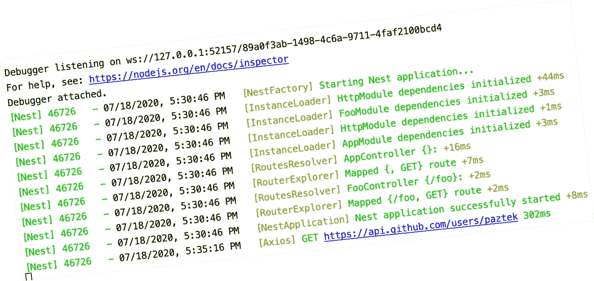

# 高级 NestJS 技术—第 2 部分—记录传出的 HTTP 请求

> 原文：<https://itnext.io/advanced-nestjs-techniques-part-2-logging-outgoing-http-requests-3c75d47c5768?source=collection_archive---------1----------------------->

在微服务架构中，您的 NestJS 后端很可能通过 HTTP 联系其他微服务或 API。如果您想更深入地了解这些请求需要多长时间，请继续跟进。

NestJS 提供了一个非常方便的 HttpService，由来自“@nestjs/common”的 HttpModule 公开来执行 HTTP 请求。这项服务由 Axios 提供支持，Axios 是目前 Nodejs / browser 世界中最流行的 HTTP 客户端。

Axios 最强大的特性之一是可以定义请求和响应拦截器。

# 履行

关于如何用 Axios 记录响应时间，有很多例子，我们在这里就不再重复了。我们将重点介绍一种将它与 NestJS 集成的方法。

我们希望:

*   抓取**现有的 HttpService**
*   访问底层的 **Axios 实例**
*   添加我们的日志拦截器
*   **将 HttpService** 重新导出到应用程序的其余部分

代码本身就说明了问题，但这里有一些附加注释:

*   我不能 100%肯定“onModuleInit”是放置注册拦截器的代码的最佳位置，但它在那里可能是无害的。
*   只要至少 AppModule 导入了 HttpModule，那么我们的其他模块是从 NestJS 导入 HttpModule 还是从我们的模块导入 HttpModule 就无关紧要了，因为我们的 http module 重新导出了来自 NestJS 的模块，并且 HttpService singleton 已经被修改了。
*   我希望我们可以将 AXIOS 实例本身注入到 HttpModule 构造函数(而不是 HttpService)中，但不幸的是，即使 AXIOS_INSTANCE_TOKEN 注入令牌看起来是导出的，Axios 实例却不是。

现在，如果您使用/foo，您应该会看到一行漂亮的日志，如下所示:

你可以在这里找到完整的代码:[https://github.com/paztek/nestjs-http-service-example](https://github.com/paztek/nestjs-http-service-example)