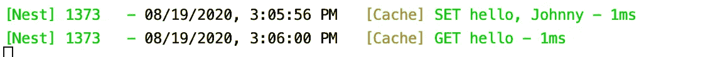

# 高级 NestJS 技术—第 4 部分—记录 Redis 命令

> 原文：<https://itnext.io/advanced-nestjs-techniques-part-4-logging-redis-commands-7a93b7a309bd?source=collection_archive---------2----------------------->

“不管天气如何，黑足猫都会在 10 到 35 摄氏度的温度下夜间捕猎。”~维基百科

为了记录我们的 NestJS 应用程序所依赖的服务的每个调用，今天我们将看看如何记录 Redis 命令。

NestJS 提供了一个带有一些有用的装饰器和拦截器的 [CacheModule](https://docs.nestjs.com/techniques/caching) ,可以非常容易地为 HTTP 路由和响应提供缓存。但是，如果您想要缓存不一定或不直接是 HTTP 响应内容的内容，它还提供了对底层缓存管理器和 Redis 实例的访问。
在幕后，CacheModule 使用节点包 [cache-manager](https://www.npmjs.com/package/cache-manager) ，无论您使用哪种底层存储或客户端(内存、Redis、Redis + ioredis 等),它都会提供一致的接口。).在这个例子中，我们将使用 ioredis，但是它可以很容易地适用于其他 redis 客户机。

# 基础应用程序

今天的用例是一个高性能、并发、高可伸缩、可配置的“Hello World！”app-).让我们从下面开始，接下来我们将添加 Redis 命令的日志记录。

旁注:如果你知道一个很好的方法来防止 NestJS 应用程序在连接 Redis 失败时启动，请在评论中告诉我，我真的很感兴趣。
IMHO，我觉得 app 连不上 Redis 就允许启动是个缺陷。

# 添加日志记录

按照我们在[第 2 部分](https://medium.com/@paztek/advanced-nestjs-techniques-part-2-logging-outgoing-http-requests-3c75d47c5768)和[第 3 部分](https://medium.com/@paztek/advanced-nestjs-techniques-part-3-logging-elasticsearch-queries-ae118a7a9d4c)中建立的模式，我们将创建一个单独的缓存模块，导入、修改和重新导出核心缓存模块:

仅此而已。代码是很容易解释的。它生成如下所示的日志:

这里是 Github 知识库的链接:[https://github.com/paztek/nestjs-redis-example](https://github.com/paztek/nestjs-redis-example)。一旦我找到一个好方法来解决这个“NestJS 应用程序可以从一个错误/错误配置的 Redis 开始”的问题，我可能会提交更改。

这篇文章是“高级 NestJS 技术”的最后一篇。