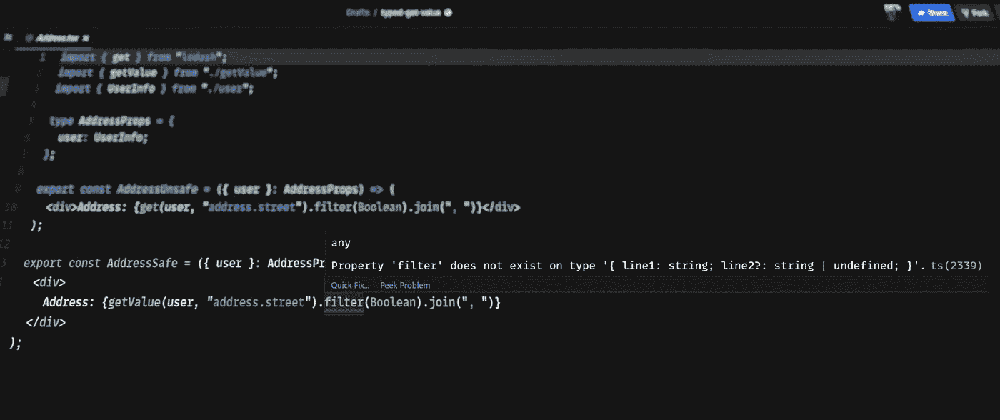
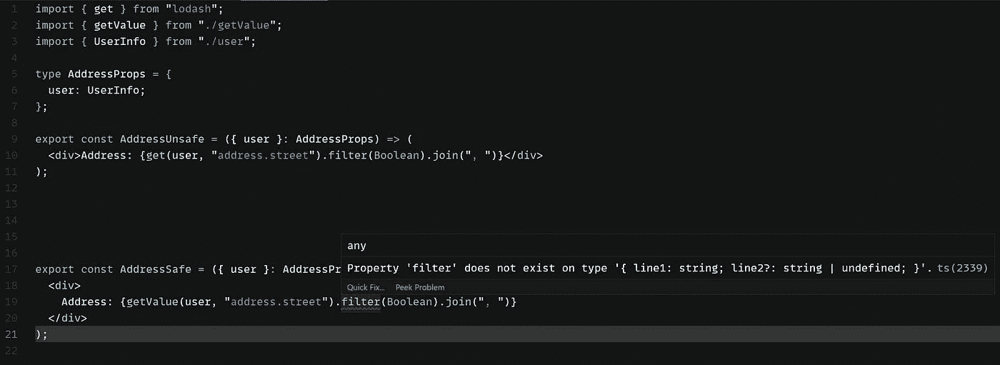

# 高级类型脚本:重塑 lodash.get

> 原文：<https://itnext.io/advanced-typescript-reinventing-lodash-get-db82eac3345e?source=collection_archive---------4----------------------->



TypeScript 能够使用属性路径推断正确的类型

作为 Revolut 后勤团队的一员，我必须处理大量复杂的数据结构:客户个人数据、交易，应有尽有。有时，您需要呈现一个深藏在数据对象内部的值。为了使生活更简单，我可以使用 [lodash.get](https://lodash.com/docs/#get) ，它允许我通过路径访问一个值，并避免无休止的`obj.foo && obj.foo.bar`条件(尽管在可选链接出现后就不再是这样了)。

# 这种方法有什么问题？

虽然`_.get`在运行时工作得非常好，但是当与 TypeScript 一起使用时，它有一个巨大的缺点:在大多数情况下，它不能推断值类型，这可能导致重构期间的各种问题。

假设一个服务器向我们发送数据，其中存储了客户的地址

```
type Address = {
  postCode: string
  street: [string, string | undefined]
}type UserInfo = {
  address: Address
  previousAddress?: Address
}const data: UserInfo = {
  address: {
    postCode: "SW1P 3PA",
    street: ["20 Deans Yd", undefined]
  }
}
```

现在我们想要渲染它

```
import { get } from 'lodash'type Props = {
  user: UserInfo
}
export const Address = ({ user }: Props) => (
  <div>{get(user, 'address.street').filter(Boolean).join(', ')}</div>
)
```

稍后，在某个时候，我们想要重构这个数据结构，并使用稍微不同的地址表示

```
type Address = {
  postCode: string
  street: {
    line1: string
    line2?: string
  }
}
```

由于`_.get`总是为路径字符串返回`any`，TypeScript 不会注意到任何问题，而代码将在运行时抛出，因为`filter`方法在我们的新`Address`对象上不存在。

# 添加类型

自 2020 年 11 月发布的 v4.1 以来，TypeScript 有一个名为[模板文字类型](https://www.typescriptlang.org/docs/handbook/release-notes/typescript-4-1.html#template-literal-types)的特性。它允许我们用文字和其他类型来构建模板。让我们看看它能如何帮助我们。

# 解析点分隔的路径

对于最常见的场景，我们希望 TypeScript 通过对象内部的给定路径来正确地推断值类型。对于上面的例子，我们想知道一种类型的`address.street`，以便能够及早发现更新数据结构的问题。我还将使用[条件类型](https://www.typescriptlang.org/docs/handbook/2/conditional-types.html)。如果你不熟悉条件类型，就把它想象成一个简单的三元运算符，它告诉你一个类型是否匹配另一个。

首先，让我们检查我们的路径是否实际上是一组用点分隔的字段

```
type IsDotSeparated<T extends string> = T extends `${string}.${string}`
  ? true
  : falsetype A = IsDotSeparated<'address.street'> // true
type B = IsDotSeparated<'address'> // false
```

看起来很简单，对吧？但是我们如何提取真正的密钥呢？这里有一个神奇的关键字 [infer](https://www.typescriptlang.org/docs/handbook/2/conditional-types.html#inferring-within-conditional-types) ，它将帮助我们获取字符串的各个部分

```
type GetLeft<T extends string> = T extends `${infer Left}.${string}`
  ? Left
  : undefinedtype A = GetLeft<'address.street'> // 'address'
type B = GetLeft<'address'> // undefined
```

现在，是时候添加我们的对象类型了。让我们从一个简单的案例开始

```
type GetFieldType<Obj, Path> = Path extends `${infer Left}.${string}`
  ? Left extends keyof Obj
    ? Obj[Left]
    : undefined
  : Path extends keyof Obj
    ? Obj[Path]
    : undefined type A = GetFieldType<UserInfo, 'address.street'> // Address, for now we only taking a left part of a path
type B = GetFieldType<UserInfo, 'address'> // Address
type C = GetFieldType<UserInfo, 'street'> // undefined
```

首先，我们检查我们传递的路径是否匹配`string.string`模板。如果是这样，我们取它的左边部分，检查它是否存在于我们对象的键中，并返回一个字段类型。

如果路径与模板不匹配，它可能是一个简单的键。对于这种情况，我们正在做类似的检查并返回字段类型，或作为后备的`undefined`。

# 添加递归

好了，我们得到了顶级字段的正确类型。但是它给了我们一点价值。让我们改进我们的效用类型，并沿着所需的值前进。

我们将:

1.  查找顶级密钥
2.  通过给定的键获取值
3.  把这把钥匙从我们的道路上拿走
4.  对我们解析的值和其余的键重复整个过程，直到没有匹配的`Left.Right`

```
export type GetFieldType<Obj, Path> =
  Path extends `${infer Left}.${infer Right}`
    ? Left extends keyof Obj
      ? GetFieldType<Obj[Left], Right>
      : undefined
    : Path extends keyof Obj
      ? Obj[Path]
      : undefinedtype A = GetFieldType<UserInfo, 'address.street'> // { line1: string; line2?: string | undefined; }
type B = GetFieldType<UserInfo, 'address'> // Address
type C = GetFieldType<UserInfo, 'street'> // undefined
```

完美！看来这正是我们想要的。

# 处理可选属性

嗯，我们还有一个需要考虑的情况。`UserInfo`类型有一个可选的`previousAddress`字段。让我们试着得到`previousAddress.street`型

```
type A = GetFieldType<UserInfo, 'previousAddress.street'> // undefined
```

哎哟！但是在`previousAddress`被设置的情况下，`street`肯定不会未定义。

让我们看看这里发生了什么。由于`previousAddress`是可选的，所以它的类型是`Address | undefined`(我假设你已经打开了`strictNullChecks`)。显然，`street`在`undefined`上是不存在的，所以没有办法推断出一个正确的类型。

我们需要改进我们的`GetField`。要检索正确的类型，我们需要移除`undefined`。然而，我们需要在最终类型上保留它，因为该字段是可选的，并且该值实际上可能是未定义的。

我们可以用两个 TypeScript 内置实用程序类型来实现这一点:`Exclude`从给定的联合中移除类型，而`Extract`从给定的联合中提取类型，或者在没有匹配的情况下返回`never`。

```
export type GetFieldType<Obj, Path> = Path extends `${infer Left}.${infer Right}`
  ? Left extends keyof Obj
    ? GetFieldType<Exclude<Obj[Left], undefined>, Right> | Extract<Obj[Left], undefined>
    : undefined
  : Path extends keyof Obj
    ? Obj[Path]
    : undefined// { line1: string; line2?: string | undefined; } | undefined
type A = GetFieldType<UserInfo, 'previousAddress.street'>
```

当`undefined`出现在值类型中时，`| Extract<>`将其添加到结果中。否则，`Extract`返回`never`,它将被忽略。

这就是了！现在我们有了一个很好的实用程序类型，这将有助于使我们的代码更加安全。

# 实现效用函数

既然我们已经教会了 TypeScript 如何获得正确的值类型，那么让我们添加一些运行时逻辑。我们希望我们的函数将一个用点分隔的路径分成几部分，并简化这个列表以获得最终值。功能本身真的很简单。

```
export function getValue<
  TData,
  TPath extends string,
  TDefault = GetFieldType<TData, TPath>
>(
  data: TData,
  path: TPath,
  defaultValue?: TDefault
): GetFieldType<TData, TPath> | TDefault {
  const value = path
    .split('.')
    .reduce<GetFieldType<TData, TPath>>(
      (value, key) => (value as any)?.[key],
      data as any
    ); return value !== undefined ? value : (defaultValue as TDefault);
}
```

我们必须添加一些难看的`as any`型铸件，因为

1.  中间值实际上可以是任何类型；
2.  `Array.reduce`期望初始值为相同类型的结果。然而，这里的情况并非如此。此外，尽管有三个泛型类型参数，我们不需要在那里提供任何类型。由于所有泛型都映射到函数参数，因此 TypeScript 在函数调用时从实际值中推断出这些参数。

# 使组件类型安全

让我们重新看看我们的组件。在最初的实现中，我们使用了`lodash.get`，它不会对不匹配的类型产生错误。但是有了我们的新`getValue`，TypeScript 将立即开始抱怨



TypeScript“属性筛选器不存在”错误

# 添加对[]符号的支持

`_.get`支持`list[0].foo`等按键。让我们在我们的类型中实现同样的功能。同样，文字模板类型将帮助我们从方括号中获取索引键。这次我不会一步一步来，而是将最终类型和一些评论贴在下面。

```
type GetIndexedField<T, K> = K extends keyof T 
  ? T[K]
  : K extends `${number}`
    ? '0' extends keyof T
      ? undefined
      : number extends keyof T
        ? T[number]
        : undefined
    : undefinedtype FieldWithPossiblyUndefined<T, Key> =
  | GetFieldType<Exclude<T, undefined>, Key>
  | Extract<T, undefined>type IndexedFieldWithPossiblyUndefined<T, Key> =
  | GetIndexedField<Exclude<T, undefined>, Key>
  | Extract<T, undefined>export type GetFieldType<T, P> = P extends `${infer Left}.${infer Right}`
  ? Left extends keyof T
    ? FieldWithPossiblyUndefined<T[Left], Right>
    : Left extends `${infer FieldKey}[${infer IndexKey}]`
      ? FieldKey extends keyof T
        ? FieldWithPossiblyUndefined<IndexedFieldWithPossiblyUndefined<T[FieldKey], IndexKey>, Right>
        : undefined
      : undefined
  : P extends keyof T
    ? T[P]
    : P extends `${infer FieldKey}[${infer IndexKey}]`
      ? FieldKey extends keyof T
        ? IndexedFieldWithPossiblyUndefined<T[FieldKey], IndexKey>
        : undefined
      : undefined
```

为了从元组或数组中检索值，有一个新的`GetIndexedField`实用程序类型。它通过给定的键返回元组值，如果键超出元组范围，则返回 undefined，或者返回常规数组的元素类型。`'0' extends keyof T` condition 检查一个值是否是一个元组，因为数组没有字符串键。*如果你知道更好的区分元组和数组的方法，请告诉我。*

我们使用`${infer FieldKey}[${infer IndexKey}]`模板来解析`field[0]`部件。然后，使用与之前相同的`Exclude | Extract`技术，我们检索关于可选属性的值类型。

现在我们需要稍微修改一下我们的`getValue`函数。为了简单起见，我将用`.split(/[.[\]]/).filter(Boolean)`代替`.split('.')`来支持新的符号。这可能不是理想的解决方案，但是更复杂的解析超出了本文的范围。

这是最终的实现

```
export function getValue<
  TData,
  TPath extends string,
  TDefault = GetFieldType<TData, TPath>
>(
  data: TData,
  path: TPath,
  defaultValue?: TDefault
): GetFieldType<TData, TPath> | TDefault {
  const value = path
    .split(/[.[\]]/)
    .filter(Boolean)
    .reduce<GetFieldType<TData, TPath>>(
      (value, key) => (value as any)?.[key],
      data as any
    ); return value !== undefined ? value : (defaultValue as TDefault);
}
```

# 结论

现在，我们不仅有了一个很好的提高代码类型安全性的实用函数，而且对如何在实践中应用模板文本和条件类型有了更好的理解。

我希望这篇文章是有帮助的。感谢您的阅读。

所有代码都可以在[这个代码沙箱](https://codesandbox.io/s/typed-get-value-wmcmm?file=/src/getValue.ts)中获得