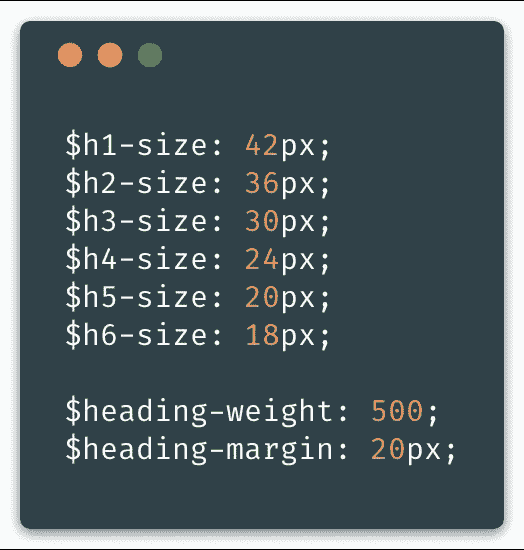
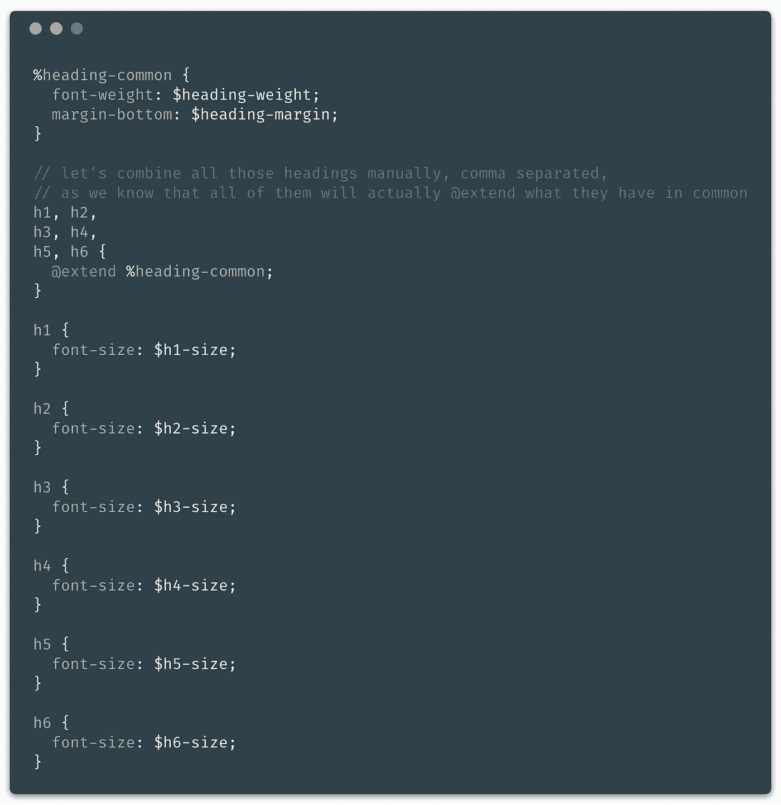
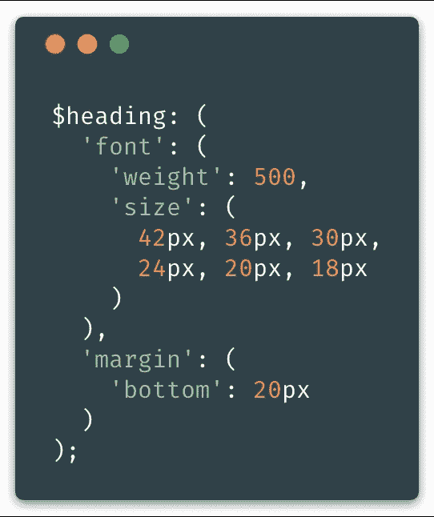
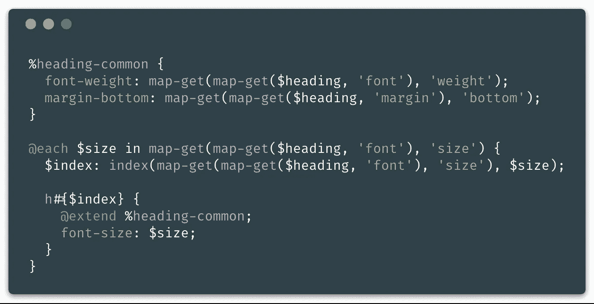
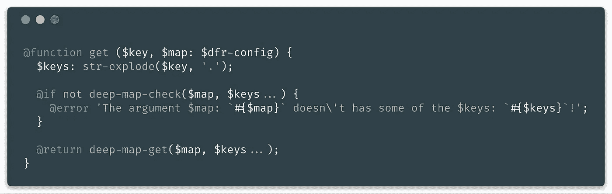
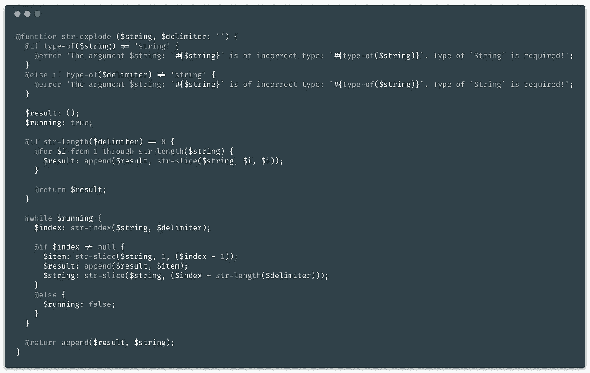
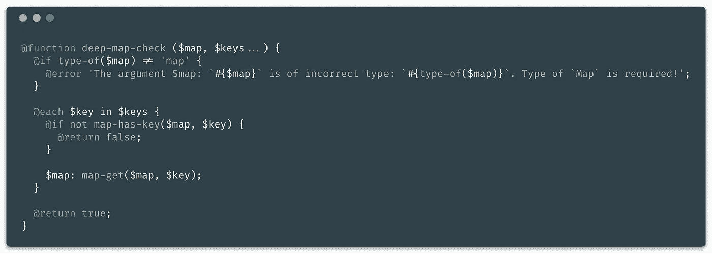
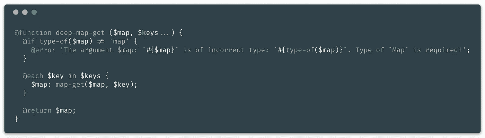
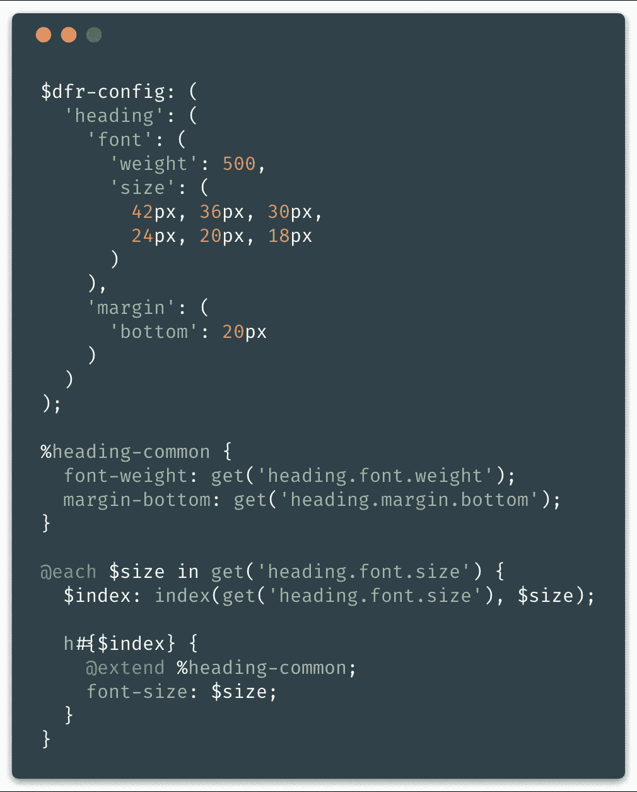

# Sass 映射的高级使用

> 原文：<https://itnext.io/advanced-use-of-sass-maps-bd5a47ca0d1a?source=collection_archive---------4----------------------->


封面图像…

我已经使用 [Sass](https://sass-lang.com/) 很长时间了，我得出了一个结论……当我开始开发前端 CSS 框架时，我有大量的变量，我必须努力思考**“如何摆脱它们”**，但仍然为*最终用户保持灵活性*。

你见过 Bootstrap v4 的一个[变量文件吗？如果您没有，请继续，快速看一下…他们想让一切都如此灵活，以便用户可以覆盖变量，并在编译时应用更改。](https://github.com/twbs/bootstrap/blob/v4-dev/scss/_variables.scss)

这是一件体面的事情，但它只是使变量文件如此凌乱，无组织；一个字——泛滥。如果您的文件与此有些相似，那么如果您打算继续使用变量，您至少可以将它们分成不同的文件，以便每个文件都包含用于特定元素/组件的变量。无法形容这个更短，对不起…希望这是明确的！🤔

> 关于这一点，我会给你指明方向，并希望教你一些东西…

# 变量与地图

在每个 Sass 项目中，仍然应该使用变量，但是不要用得太多……我想说明这一点。把 Sass 中的变量想象成应该被定义为**基**或**根**的东西。可以在地图中使用或操作的公共值。

为了提供一个最简单的例子，我将以“定义标题大小、边距和粗细”为主题。如你所知，在 HTML 中总共有 6 个标题可用…

## 变量示例



使用 Sass 变量的示例…

通过看这个例子，你可以看出我并不清楚这个变量的用途。显然，我们可以假设，但这是不好的…如果我说得更具体一点，它最终会有很长的变量名，比如:

```
$h1-font-size$heading-font-weight
$heading-margin-bottom
```

就个人而言，我不喜欢在变量名中使用数字，比如`h1`，但是将数字定义为一个单词更糟糕…

> **现在我们如何用这些变量构建标题元素呢？**
> —这个答案很简单，**我们不能**！不是自动循环…手动循环，是的，我将在下面展示。否则，我们可以将这些值复制到另一个变量中，这个变量可以是一个列表，也可以是一个映射，然后遍历这个变量并构建它。但是谁想要复制呢？没人！



## 地图示例



使用 Sass 映射的示例…

从这个例子中我们能看出什么？

*   我没有用复数，有两个原因。当您想要获取这些值中的任何一个并且嵌套的地图属性跟在 css 属性名称后面时，这听起来更自然
*   它看起来自然又干净
*   我将所有的“变量”组合成一个单一的“地图”，现在它属于一个单一的元素/组件
*   我非常明确地说明了这些键，现在我们确切地知道了这些值将用于什么

> **我们现在如何用这张地图建立我们的标题元素？**
> ——好吧，让我给你演示一下……非常简单，但也有点乱。



从 1 到 6，动态构建 HTML 标题标签…

> 等等，等等…把那该死的东西举起来！
> —我知道动态建筑看起来并不漂亮，但是我们可以进一步简化它，引入一些新的**功能**。

> 请容忍我，我保证这是值得的！

# 简化地图使用的功能

我已经为我的一个开源项目写了一些函数。我会在最后留下一个链接，因为如果你碰巧喜欢这种方法，学习它会非常有用。

因此，我将与您分享这些函数，并展示它如何显著改进您的 Sass 代码…函数将以图像形式发布，但我还会将每个标题链接到我编写的原始函数，以便您可以将它添加到您当前或未来的项目中。

我要感谢 [Hugo Giraudel](https://medium.com/u/89fc108ec0c7?source=post_page-----bd5a47ca0d1a--------------------------------) 的一些功能思路和灵感！✌️

## [获取](https://github.com/dvlden/differs/blob/master/src/abstracts/functions/_get.scss)



Sass 函数-通过使用点符号作为关键参数来搜索嵌套地图中包含的任何值

以上功能是我的神奇功能。我从 [Laravel 框架](https://laravel.com/docs/5.6/helpers#method-array-dot)中得到启发。虽然，我没有把函数命名为`config()`，而是决定命名为`get()`，因为它**更好看，而且更短**！😂

如你所见，我的函数已经依赖于*另外三个我也写的函数*

## [弦爆](https://github.com/dvlden/differs/blob/master/src/abstracts/functions/helpers/_str-explode.scss)



Sass 函数—按分隔符拆分字符串

## [深度地图检查](https://github.com/dvlden/differs/blob/master/src/abstracts/functions/helpers/_deep-map-check.scss)



Sass 函数-通过键检查嵌套映射是否有值

## [深度地图获取](https://github.com/dvlden/differs/blob/master/src/abstracts/functions/helpers/_deep-map-get.scss)



Sass 函数-通过键从嵌套映射中获取值

这些函数的每一个**标题**都链接到了原始源代码……如果你喜欢，可以随意更好地看看。扔给我一个🌟或许你在 GitHub 上的时候可以跟踪他？🙏

好了，是时候看看`get()`的作用了。我将使用上面的同一个例子，只是稍微改进一下地图，然后向你解释我们最终实现了什么。



Sass 示例—地图的简化使用

我本可以用不同的方式命名`$dfr-confg`地图，也许只命名为`$config`，但出于某种原因，我没有这样做。因为`get()`函数已经默认将`$dfr-config`作为第二个参数。用我们不同的名称`$map`传递第二个参数，会使这个例子看起来比想象的要大一些。但是您可以复制/粘贴/下载该函数，并修改默认值以匹配您自己的自定义`$map`变量。

> 不是已经大幅提升了吗！？

# 覆盖地图默认值

我甚至更喜欢将地图配置分成几个不同的文件…

*   标题
*   颜色
*   容器
*   断点
*   字体
*   间隔

但是你可能会问…

> 如何使用这个`get()`函数来访问许多不同地图中的所有属性？
> —我不创建多个地图，只创建一个，并且每次都扩展它…

我会留下一些关于这种情况的链接，你可以看看我到底是如何使用它的。

*   [所有变量](https://github.com/dvlden/differs/blob/master/src/abstracts/_variables.scss)
*   [所有配置导入](https://github.com/dvlden/differs/blob/master/src/abstracts/_config.scss)
*   [导入变量、配置等的主文件](https://github.com/dvlden/differs/blob/master/src/differs.scss)
*   [我扩展地图的例子](https://github.com/dvlden/differs/blob/master/src/abstracts/config/_breakpoint.scss)

> 通过这些例子，您已经可以看出带有一些“基/根”变量和函数的 Sass 映射是多么强大！

我不会再打扰你了……✌️
显然，这里有很多内容要讲，我希望你也能从我提供的所有例子中学习。

在我开发了这个之后，我就不能再回到普通变量的混乱状态了。

> 我正在做的开源项目叫做 [**不同于**](https://github.com/dvlden/differs) ，你可以在我的 GitHub 库上看看。这仍然是一项进行中的工作，我正试图获得更多的动力，但我很难找到它…

非常感谢您的阅读。如果你有任何问题，随时问我。我会很感激在[媒体](https://medium.com/@dvlden)、[推特](https://twitter.com/dvlden)和/或 [GitHub](https://github.com/dvlden) 上的关注。

# 直到下次

如果你喜欢这个并且学到了新的东西，请分享一些爱。
为此，点击拍手图标👏或者拿着它等待更多的掌声！👏👏👏

非常感谢。你是最棒的！