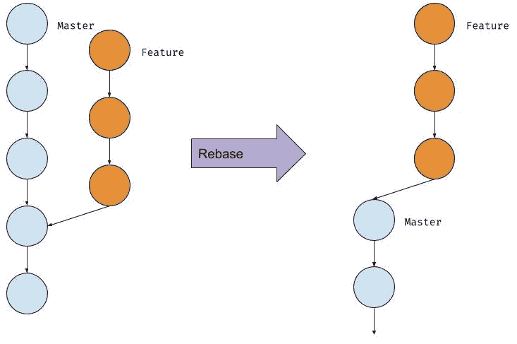

# Git Rebase 的优势

> 原文：<https://itnext.io/advantages-of-git-rebase-af3b5f5448c6?source=collection_archive---------1----------------------->


关于 *git rebase* 的一篇文章鼓励不要这么做。本文建议重定基础的唯一目的是获得一个好看的 git 日志历史。

> 我得出的结论是，这是虚荣心作祟。重置基础是一个纯粹的美学操作。

我想列出几个好理由，说明为什么在我看来，改变基础是一个好的实践，可以给你的工作流带来很多好处。

# rebase 是什么意思？

假设您有一个正在处理的特性分支，以及一个从其分支出来的主分支。您应该有这样的日志历史:

```
$ git log --graph --oneline* f7d389gc (feature) — lorem ipsum
* 6hy982dx — dolor sit
* aer3ou71 — amet consecutur
* nfk62s3z (master) — adipiscing elit
* …
```

假设你没有独自完成这个项目，其他开发人员正在为代码库做贡献。因此，当您处理您的分支时，主分支已经在远程 git 服务器上向前移动了。



git rebase —图 1

为了继承在主分支上引入的变更，您可以改变基础，基本上将您的提交移动到主分支之上。
假设您的特性分支名为`feature`，您可能想要运行:

```
$ git checkout feature
$ git rebase master
```

在重定基础过程之后，您可能会有如下状态:

```
* e2r3fa05 (feature) — lorem ipsum
* qc85lx4w — dolor sit
* ui9o7xpa — amet consecutur
* i52dxqs3 (master) — proin sagittis
* nfk62s3z — adipiscing elit
* …
```

# 副作用

在 git 中，所有提交(除了初始提交)都包含对其父提交的引用。git 在重定基础时所做的是，在分支提交历史的第一次提交中更改对父级的引用，这与主分支历史不同(在我们的例子中是`aer3ou71`)。

考虑每个提交的散列是几个组件散列的结果，其中包括父提交的散列。

因此，假设新的父对象的散列将会不同，我们的重定基础提交将会得到一个新的散列。属于我们分支历史的其他提交也是如此。你可以在上面的片段中看到。

如果在运行 rebase 命令之前已经将分支推送到远程，您应该考虑这一点。在这种情况下，您的远程提交散列将与本地提交散列不同，所以如果现在您只是运行`git push` ，您将得到一个错误，说明操作无法完成，因为您的分支的本地和远程版本有分歧。为了解决这个问题，你只需要用力:

```
git push --force-with-lease
```

# 好的，明白了。但是我为什么要重定基数呢？

我有三个理由来说明为什么它值得争论。

**增加测试可靠性**

再看一下图 1。如果您在重新基础化之前在您的特性分支上运行您的测试(左边的图)，您没有在您的代码基础中包括 master 的最后 3 次提交，所以您不能确定您的测试没有受到它们的影响。

因此，如果您的测试通过了，您不确定在将您的分支合并到主测试中之后，它们是否还会通过。

相反，重定基础允许您从 master 的最新提交中继承代码。

**使调试更容易**

如果您想将应用程序回滚到以前的版本，以检查哪里引入了错误，如果您有一个干净的历史记录，您可以很容易地做到这一点。

在提交可以有多个父提交的“意大利面条”历史中，主分支包含带代码的提交和合并提交，要发现引入 bug 的提交是非常棘手的。

我在我的另一篇文章“[有意义提交的重要性](https://medium.com/@alessiopieruccetti/the-importance-of-making-meaningful-commits-fd68e869f185)”中更详细地解释了这个话题，因为有意义地提交也有助于这个操作。

**合并前解决冲突**

解决冲突可能是痛苦和无聊的，尤其是当特性花了太长时间才准备好，并且它影响了代码库的许多不同部分时。

如果你一下子解决了所有的冲突，解决起来可能会很棘手。相反，如果您在重定基时解决了冲突，git 将提示冲突消息 commit by commit，因此跟踪更改并找出如何解决冲突会更容易。

# 小澄清

在反对 git rebase 的同一篇文章中，我发现了一个让我高兴的说法:

> 通过调整基数，你是在欺骗自己和你的团队。你假装提交是今天写的，而事实上它们是昨天写的…

我不确定这是什么意思，我猜这是因为作者在他的提交历史中或者可能在 Github 上看到的是最后的修改日期而不是创建日期。

Git 保存创建日期和最后修改日期:

```
git show 007e3aecommit 007e3ae4ab751f8ab2d9cebef87983a320399acc
Author:     Alessio Pieruccetti <[alessio@xxx.com](mailto:alessio@xxx.com)>
AuthorDate: Tue Jul 23 10:26:39 2019 +0100
Commit:     Alessio Pieruccetti <[alessio@xxx.com](mailto:alessio@xxx.com)>
CommitDate: Fri Aug 9 09:14:20 2019 +0100 Replaced exception type in User class
```

有几种不同的方法来显示提交历史中的创建日期，例如:

```
git log --pretty=fuller
```

在我的`.gitconfig`里我有一个`git history`的别名，像这样:

```
[alias]
    history = log --graph --pretty=format:'%Cred%h%Creset %d -%Cblue %s%Creset %Cgreen(%ar) %Cblue<%an>%Creset' --abbrev-commit --date=relative
```

这将显示您的日志很好地与相对创建日期(如`2 days ago`)。

# 结论

在我们的工作中，我经常发现有人支持或鄙视这个或那个工具/编程语言/实践。我认为每个工具都适用于某些环境。

我阅读了反对 TDD、敏捷开发等的文章。我的观点是，这些实践对于某些环境或产品来说很棒，但对于其他环境或产品来说可能会失败。

git 工具也是如此。

我不想说服你用 git rebase，只是想指出它有一些优点，还有 git merge。使用哪一个取决于你，取决于你的经验，你对工具的信心以及你如何与你的队友合作。

我希望这有所帮助。