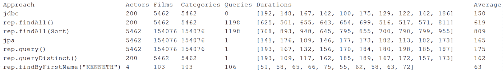
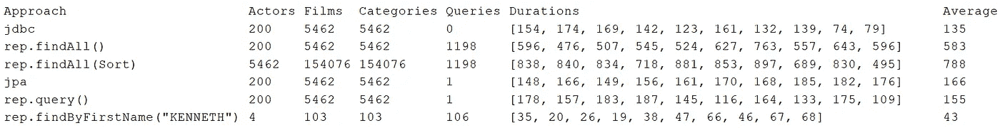
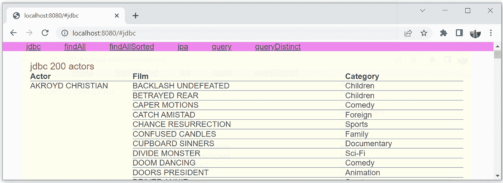
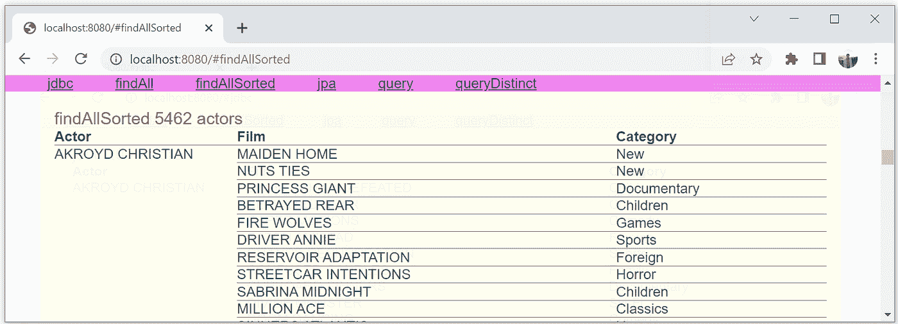
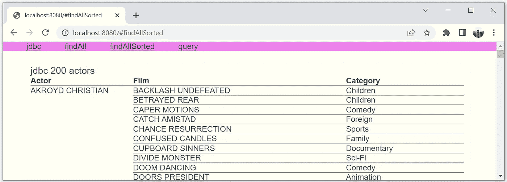
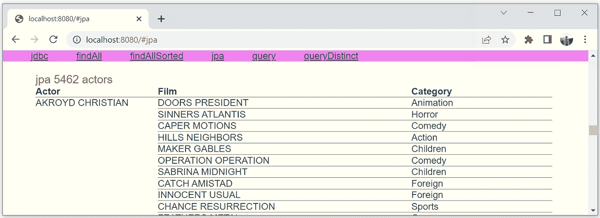
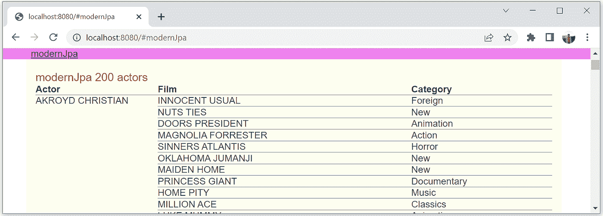
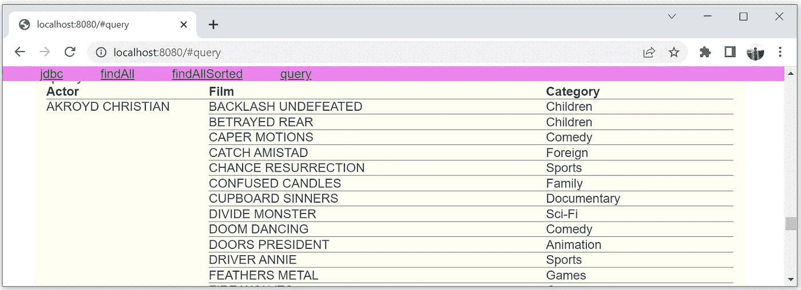
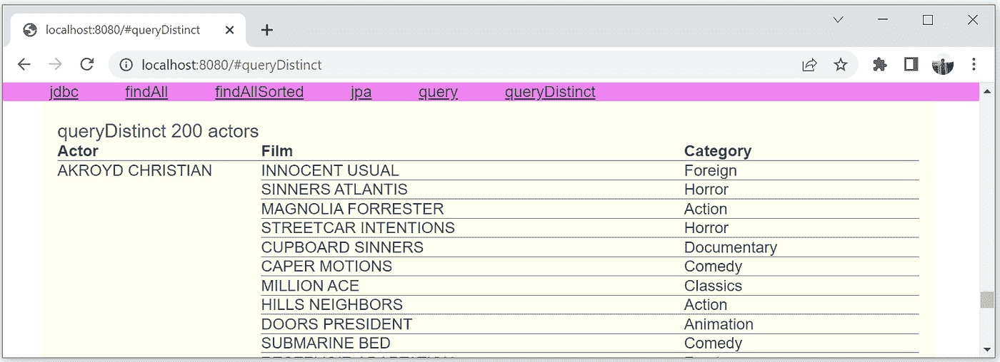

# 对关系数据不使用 Spring 数据和 Hibernate 的优势

> 原文：<https://itnext.io/advantages-of-not-using-spring-data-and-hibernate-with-relational-data-8a509faf0c48?source=collection_archive---------0----------------------->

## 为什么 Spring Data JPA 非常适合带有空数据库的演示应用程序


Spring Data 是存储数据的常用技术之上的附加层。Spring Data JPA 是 Spring Data 最常用的部分，它应该通过消除重复出现的代码来简化基于 JPA 的代码。本质上，Spring Data JPA 是一种隐藏了`EntityManager`的 JPA。

在这篇文章中，我想探讨 Spring Data JPA 对加载关系数据的支持。默认情况下，Spring Data JPA 依赖于 Hibernate。由于 Spring Data JPA 的一些限制是由 Hibernate 造成的，所以我另外用一个更强大的 JPA 实现 EclipseLink 来评估 Spring Data JPA。

我比较了几种从 MySQL 数据库的小型 Sakila 示例模式加载数据的方法。比较方法:

*   我计算执行的 SQL 查询的数量。默认情况下，JPA 实现对每个父实体执行一个查询。
*   我测量加载数据所需的时间。时间取决于不必要的`select`的数量。
*   我检查加载的数据是否被正确地转换成实体。
*   我检查数据是否分类正确。众所周知，Hibernate 会打乱加载的关系数据的顺序，但是知道`findAll(Sort)`是否与关系数据兼容是很有趣的。

在我的实验中，我使用了三个类`Actor`、`Film`和`Category`，它们被映射到 Sakila 示例模式的五个表:


关系图是指一个演员可以出演多部电影，每部电影可以包括多个演员。重复使用相同的类别来对电影进行分类。每部电影可以属于许多类别。数据包括 200 名演员，1000 部电影和 16 个类别。我用三个实体加载数据:

```
@Entity
public class Actor { @Id
    int actorId; String firstName;
    String lastName; @ManyToMany
    **Set<Film> films;**
}@Entity
public class Film { @Id
    int filmId;
    String title; @ManyToMany
    **Set<Category> categories;**
}@Entity
public class Category { @Id
    int categoryId;
    String name;
}
```

表中包含的列比我加载的多。为了简化代码，我只加载最有意义的列。

[还要注意 Hibernate 毫无意义的局限性。有了一个](https://marian-caikovski.medium.com/efficiently-loading-associations-with-jdbc-hibernate-and-eclipselink-20ee88584938) `[select](https://marian-caikovski.medium.com/efficiently-loading-associations-with-jdbc-hibernate-and-eclipselink-20ee88584938)` [，嵌套关联只能加载到](https://marian-caikovski.medium.com/efficiently-loading-associations-with-jdbc-hibernate-and-eclipselink-20ee88584938) `[Set](https://marian-caikovski.medium.com/efficiently-loading-associations-with-jdbc-hibernate-and-eclipselink-20ee88584938)` [s 中，这种像差在 EclipseLink 中是不存在的。与`Set`不同的是，`List`保存了加载数据的顺序，并允许通过方法`get()`简单地访问它们的元素。](https://marian-caikovski.medium.com/efficiently-loading-associations-with-jdbc-hibernate-and-eclipselink-20ee88584938)

## 几种不同的方法加载所有演员与相关的电影和类别

首先，作为开始和参考结果，我将使用一个纯粹的基于 JDBC 的代码。然后我评估`JpaRepository`的`findAll()`和`findAll(Sort)`方法。为了说明由于 Spring Data JPA 依赖于一个过时的 Hibernate 版本而导致存储库产生的一些偏差，我将 Spring Data 使用的 Hibernate 5.6.9 与现代的 Hibernate 6 进行了比较。然后我评估用`@Query`注释修饰的两个方法。最后，我展示了像`findByFirstName()`这样好看的存储库方法会生成大量可有可无的查询。

以下是数字结果:



冬眠



EclipseLink

Hibernate 和 EclipseLink 有一些相似之处。如果您查看标记为`rep.query()`的行，您会看到一个 JPQL 查询足以加载所有数据。`findAll()`产生大量可有可无的查询，因此速度很慢。`findAll(Sort)`另外返回异常的演员数。基本上，不管底层 JPA 实现如何，`JpaRepository`接口的两种方法对于关系数据都不是很有用。

我展示了加载数据的顺序，并在下面更详细地讨论了数值结果。但在此之前，我必须解释我是如何收集它们的，以便它们看起来可信。

## 测量方法执行时间和计数由 Hibernate 或 EclipseLink 执行的选择

在 web 应用程序中，通常加载数据以进行显示。要显示数据，必须完全加载。JPA 延迟加载*多对多*关联，也就是说，当它们被访问时会逐渐加载。为了比较加载完整数据所需的时间，我的基准测试代码访问了所有加载的 actors 中的所有嵌套类别。

有几种巧妙的方法来计算最不必要的数字。我用了最简单的方法。我通过将`spring.jpa.properties.hibernate.show_sql=true`或`spring.jpa.properties.eclipselink.logging.level=FINE`分别添加到 *application.properties* 来打开 Hibernate 或 EclipseLink 日志记录。然后，我简单地在标准输出中计算以`Hibernate: select`或`[EL Fine]: sql: SELECT`开头的行。

代码测量每个方法的执行时间 15 次。但是只有最后 10 次测量用于计算平均时间。代码很简单，但是太长了，看起来不清楚。你可以在 [GitHub](https://github.com/marianc000/SpringDataJpaRepositories) 里看到。

## 用纯 JDBC 加载关系数据

与依赖于 JPA 等其他层的代码相比，纯 JDBC 代码有一个优势——一旦开发出来，当任何依赖关系升级时，它的测试都不会失败。

使用 JDBC，所有数据都可以通过一个 SQL 查询加载:

```
select a.actor_id, a.first_name,a.last_name, f.film_id, f.title,
c.category_id, c.name from actor a
left join film_actor using(actor_id)
left join film f using(film_id)
left join film_category using(film_id)
left join category c using(category_id)
**order by a.last_name,a.first_name, f.title, c.name**
```

注意，我希望数据按演员姓名、电影名称和最终类别名称排序。如果使用 JDBC 或 EclipseLink，这可以通过`order by`子句实现。

有许多方法可以将一个连接产品分解成相关的实体。用 Java 流可以很方便地做到这一点。使用定制的泛型收集器，代码变得更加简单。你可以在 [GitHub](https://github.com/marianc000/SpringDataJpaRepositories) 中看到代码。我没有在这里展示它，因为代码仍然相对较长，正如您在基准测试结果中看到的，它并不比类似的基于 JPA 的代码快多少。流是方便的，但是与大量的通用辅助代码相关联，因此很慢。

加载并正确排序的数据的第一行:



这与本文无关，但请注意，尽管模式包括电影和类别之间的多对多关系，但 Sakila 数据库中没有一部电影与多个类别相关联。

## 由于不合理的选择数，findAll()很慢

通常情况下，`JpaRepository`中的`findAll()`应该只用于没有关系的实体。如果加载的实体有关联，`findAll()`可能会成功导致应用程序挂起。在我对不切实际的微小数据的实验中，`findAll()`方法只需要比 JDBC 或 JPA 方法多 4 倍的时间。它的大部分执行时间都花在执行 1198 个`select`上(1 个`select`加载演员，200 个`select`加载影片，997 个`select`加载类别)。如果数据库包含更真实的数据量，或者如果数据库不在*本地主机上，*执行时间会长得多。可有可无的渐进查询不是 Spring 数据的问题，而是 JPA 的一个奇怪特性——每个父实体执行一个查询。

## findAll(Sort)不会排序并返回太多

我猜像低效的`findAll()`返回的数据那样加载未排序的数据是很少被接受的。即使数据在浏览器中被重新排序以响应用户输入，对于第一次呈现来说，拥有排序的数据也是很好的。Spring 数据存储库提供了一个方法`findAll(Sort)`,用于检索排序后的数据。在执行时间上，和`findAll()`一样低效。奇怪的是，它返回一个有 5462 个参与者的`List`,而不是预期的 200 个。

在我的代码中，调用该方法时使用:

```
@GetMapping("/findAllSorted")
List<Actor> findAllSorted() {
    return **rep.findAll(Sort.by("lastName", "firstName", "films.title", "films.categories.name"));**
}
```

它能成功地按作者的姓和名对他们进行分类，但不能按电影名对其进行分类。



这一个问题是由 Hibernate 引起的，因为用 EclipseLink 的顺序是正确的:



## 现代 Hibernate 不正确地处理提取连接

在讨论用 JPQL 查询获得的结果之前，我需要演示 Spring 数据使用的现代 Hibernate 6 和过时的 Hibernate 5 之间的一个重要区别。Hibernate 6 不兼容 Spring 数据，勉强兼容 Spring。

JPA 有时确实可以简化代码。所有作者都可以加载一个比上面等价的 SQL 查询更短的 JPQL 查询。加载所有角色的代码比基于 JDBC 的代码要短得多。

```
@Repository
public class ActorJpaRepository { @Autowired
    private EntityManager em; public List<Actor> getAll() {
        return em.createQuery("**SELECT a FROM Actor a LEFT JOIN FETCH a.films f LEFT JOIN FETCH f.categories c order by a.lastName, a.firstName, f.title,c.name**", Actor.class).getResultList();
    }
}
```

除了 *fetch joins* 之外，Hibernate 没有提供其他有效加载相关实体的方法。不幸的是，同样的代码在 Hibernate 6 和 Hibernate 5 中会产生不同的结果。

在上面的结果表中可以看到，Spring Data 使用的过时 Hibernate 使用一个`select`来加载所有数据，它与 JDBC 代码一样快，但是它返回一个具有 5462 个参与者而不是 200 个参与者的`List`。这是 JPA 的一个特性——根据 JPA 规范， *fetch joins* 必须产生和 joins 一样多的结果。



相比之下，Hibernate 6 返回正确的参与者数量。根据常识，这是方便和正确的，但是根据 JPA 规范，这是不正确的。



Hibernate 的两个版本都没有保留由`order by`子句设置的顺序。

## 为什么要使用存储库接口来执行 JPQL 查询

可以使用存储库接口来执行 JPQL 查询。在存储库中，可以用`@Query`注释指定查询。

```
@Repository
public interface ActorRepository extends JpaRepository<Actor, Integer> { @Query("SELECT a FROM Actor a LEFT JOIN FETCH a.films f LEFT JOIN FETCH f.categories c order by a.lastName, a.firstName, f.title, c.name")
    List<Actor> query();
}
```

代码看起来并不比上面等价的基于 JPA 的代码短。与上面的 JPA 方法一样，它产生了 5462 个异常的`List`。

EclipseLink 不支持嵌套的*获取连接*，但是可以使用*查询提示*。使用 EclipseLink，结果要好得多——200 个正确排序的演员。让我们看看 JPA 代码之间是否有很大的区别:

```
@Repository
public class ActorJpaRepository { @Autowired
    EntityManager em; public List<Actor> getAll () {
        return em.createQuery("**SELECT a FROM Actor a LEFT JOIN a.films f LEFT JOIN f.categories c order by a.lastName, a.firstName, f.title, c.name**", Actor.class).setHint("**eclipselink.left-join-fetch**", "**a.films.categories**").getResultList();
    }
}
```

和等效的弹簧数据 JPA 代码:

```
@Repository
public interface ActorRepository extends JpaRepository<Actor, Integer> { @Query("SELECT a FROM Actor a LEFT JOIN a.films f LEFT JOIN f.categories c order by a.lastName, a.firstName, f.title, c.name")
    @QueryHints({@QueryHint(name = "eclipselink.left-join-fetch", value = "a.films.categories")})
    List<Actor> query();
}
```

当然，与 Hibernate 不同，EclipseLink 返回有序数据:



所以看起来 Spring Data JPA 并没有用 JPQL 查询简化代码。在 JPQL 查询中使用 Spring 数据 JPA 是没有意义的。

## 如何对 Spring 数据 JPA 使用 fetch 连接

在 Spring Data JPA 开始支持更现代的 Hibernate 之前， *fetch joins* 的异常结果可以通过在 JPQL 查询中添加关键字`distinct`来改善。

```
@Repository
public interface ActorRepository extends JpaRepository<Actor, Integer> { @Query("SELECT **distinct** a FROM Actor a LEFT JOIN FETCH a.films f LEFT JOIN FETCH f.categories c order by a.lastName, a.firstName, f.title, c.name")
    List<Actor> queryDistinct();
}
```

现在，查询产生了预期数量的实体。但是正如 Hibernate 所预期的，它们没有被正确排序。



## 好看但低效的查询方法

我的数字结果表中的最后一行只是用来说明查询方法是有代价的——它们会产生大量不必要的耗费时间的渐进`select`。

# 结论

如果你知道如何使用它，JPA 可以简化代码，而且比纯 JDBC 慢不了多少。Spring 帮助处理事务。Spring Data JPA 是 JPA 和 Spring 之上的附加层。除了用接口中的方法名定义低效查询的奇特方式之外，还不清楚它带来了什么。

存储库接口可以有两种类型的方法——名称定义 JPQL 查询的方法(例如`findByFirstName()`)和返回用`@Query`注释指定的 JPQL 查询结果的方法。

当使用几乎没有数据的内存中的 H2 数据库时，这并不明显，但是花哨的存储库接口方法是有代价的——它们最慢。如果使用关系数据库存储关系数据，低效的名称查询方法不能替代 JPQL 查询。

但是使用额外的 Spring 数据 JPA 依赖来执行 JPQL 查询是没有意义的。没有 Spring 数据的等价代码 JPA 不会更长，有时可以使用不可或缺的`EntityManager`方法，比如缺少存储库接口的`detach()`或`persist()`。

Spring Data JPA 的一些问题是 Hibernate 的局限性造成的。当与关系数据一起使用时，Hibernate 不保留 JPQL 查询中由`order by`子句设置的顺序。因此，低效的方法`findAll(Sort)`不会排序，除非用 EclipseLink 替换 Hibernate。奇怪的是，Spring Data JPA 依赖的 JPA 实现似乎并不完全兼容 Spring Data JPA 提供的方法。

总的来说，Spring Data JPA 最适合带有空数据库的演示应用程序。

代码可以从[https://github.com/marianc000/SpringDataJpaRepositories](https://github.com/marianc000/SpringDataJpaRepositories)下载

不要犹豫留下评论