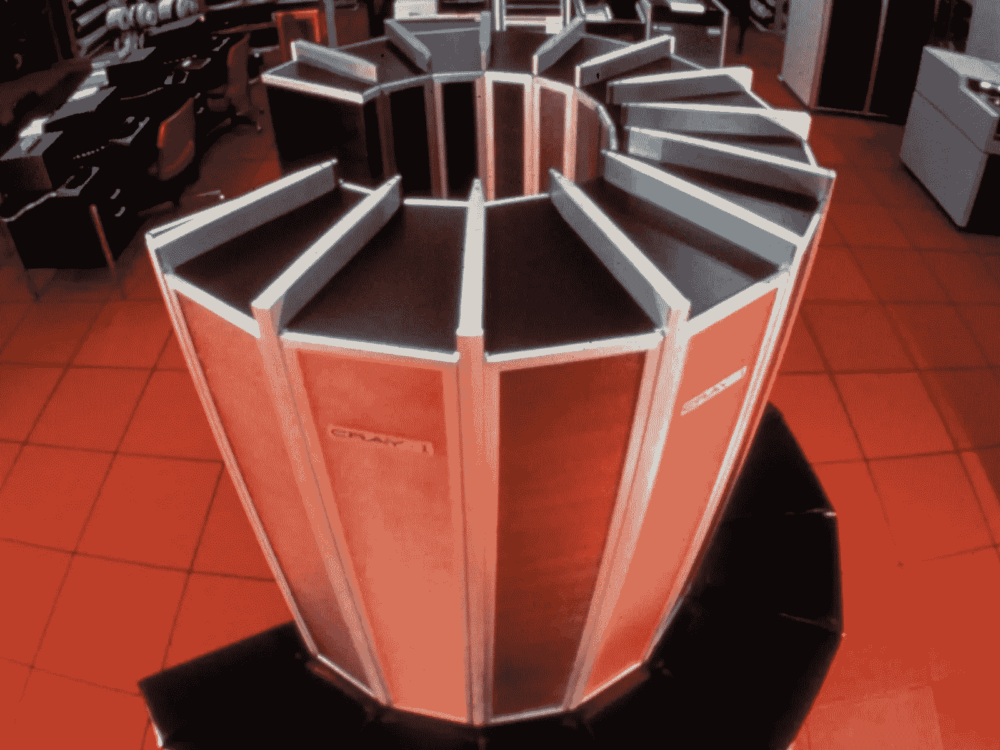
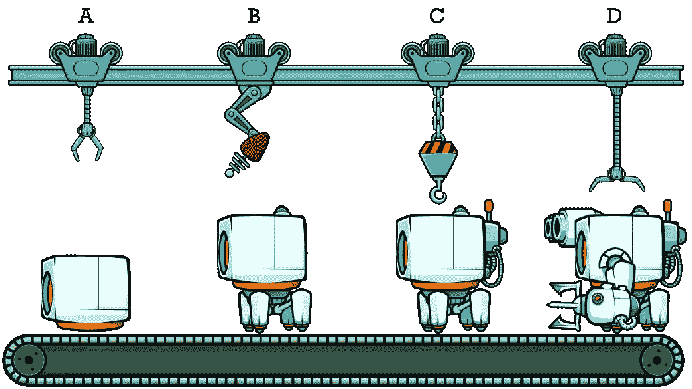
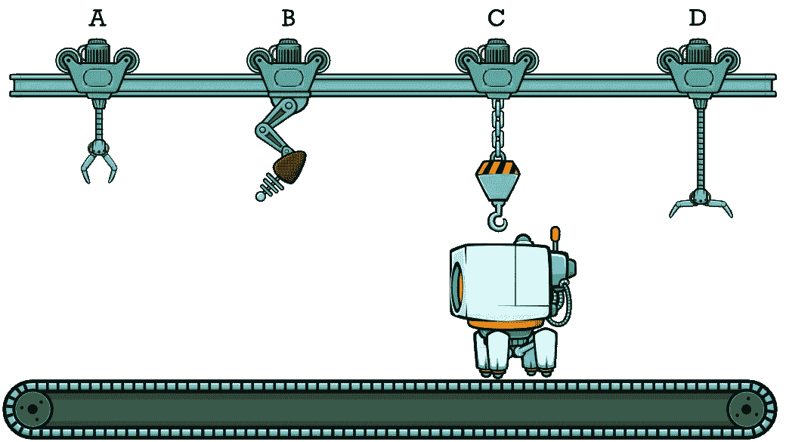
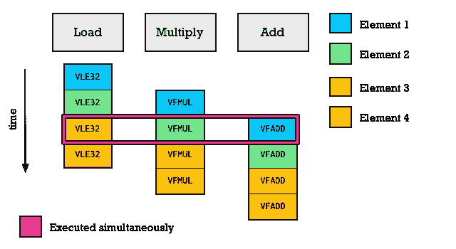
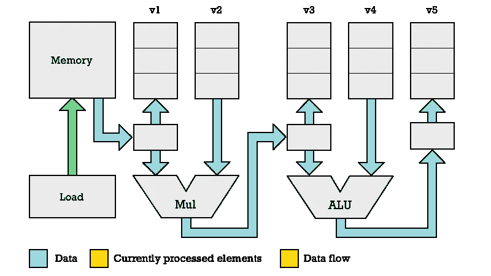
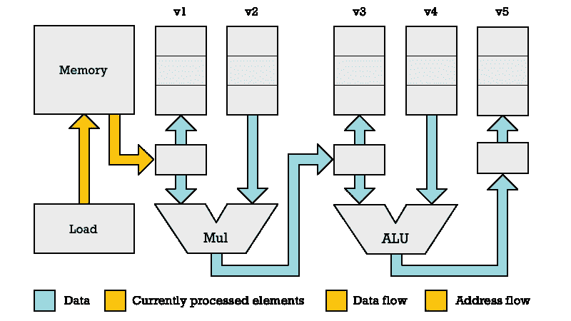
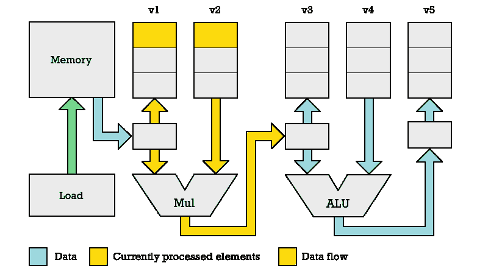
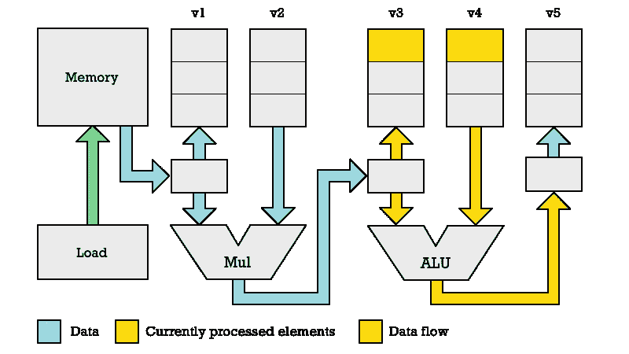
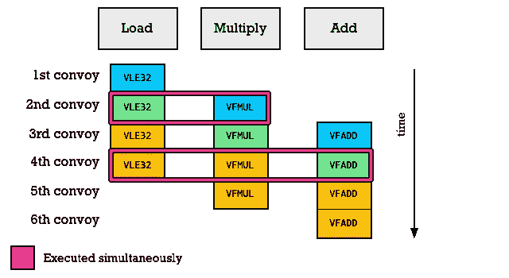
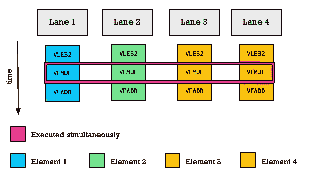

# RISC-V 向量处理优于 x86 风格的 SIMD

> 原文：<https://itnext.io/advantages-of-risc-v-vector-processing-over-x86-simd-c1b72f3a3e82?source=collection_archive---------2----------------------->

## RISC-V 的设计者不再添加 MMX、SSE、AVX 或 Neon 等 SIMD 指令，而是专注于向量处理。

并行处理多个数据流的一种众所周知的方式是通过使用 SIMD 指令。20 世纪 90 年代末，所有主要的芯片制造商都开始在处理器中加入 SIMD 指令。MMX 于 1997 年加入英特尔奔腾处理器。它旨在加速图像、音频和视频处理。


图 1:单指令多数据和单指令单数据处理的区别。

向量处理是并行处理多个数据流的另一种方式，但通常被认为是一种更古老、更过时的数据并行方法。这种看法的一个原因是，早在 20 世纪 80 年代，在[克雷](https://en.wikipedia.org/wiki/Cray)矢量处理超级计算机上，这是并行处理数据的主要方式。当我在 20 世纪 80 年代和 90 年代初长大时，Cray 是超级计算的代名词。我记得和我的朋友一起幻想在克雷电脑上运行《T4:毁灭战士》(1993 年发行)会有什么样的帧率。



Cray-1 矢量处理超级计算机

然而，向量处理在现代 SIMD 指令集之前存在并消亡的事实给出了错误的年代观念。在计算机科学领域，就像在时尚界一样，旧的趋势往往会被重新利用。SIMD 的指示实际上是一个更古老的想法。早在 1958 年，画板，被广泛认为是第一个运行在能够执行 SIMD 指令的[林肯 TX-2](https://en.wikipedia.org/wiki/TX-2) 计算机上的带有图形用户界面的计算机硬件解决方案。向量处理机在 20 世纪 70 年代才出现。最著名的是 1975 年发布的 [Cray-1](https://en.wikipedia.org/wiki/Cray-1) 。

向量处理是更高层次的抽象。SIMD 风格处理充当构建向量处理器架构的更基本的构建块。现在，你可能会问，如果这是一个优越的系统，那么为什么克雷的灭绝了？

PC 革命基本上扼杀了克雷矢量处理器。克雷缺乏音量。对于大量的个人电脑，只需在一个集群中使用大量的个人电脑就可以获得克雷式的计算能力。然而，就通用处理器的性能而言，今天我们已经走到了路的尽头。

在 20 世纪 80 年代和 90 年代，通用处理器战胜了专用硬件，因为摩尔定律允许简单的单线程计算每年都有巨大的性能提升。然而，那个世界早已远去。专用硬件卷土重来。如今，提升性能的唯一方法是通过定制硬件。这就是为什么像苹果的 M1 这样的片上系统(SoC)拥有加密、图像处理、神经引擎、GPU 等特殊硬件，所有这些都在同一个硅芯片上。

曾经只存在于 Cray 超级计算机中的复杂处理现在可以构建到单个硅芯片中。因此，现在是时候重温向量处理，并试图了解是什么使向量处理比简单得多的 SIMD 风格计算如此强大。为了理解向量处理，我们首先需要了解 SIMD 指令是如何工作的。

# SIMD 指令如何工作

在一个简单的处理器中，寄存器和 ALU 的结构如下图所示。一些寄存器`r1`和`r2`用作输入，结果存储在另一个寄存器`r2`中。当然，可以使用任何寄存器。根据建筑的不同，它们可能被命名为`x0`、`x1`、...，`x31`或者它们可以是`r0`，`r1`，...，`r15`如 32 位 ARM 架构上的情况。


图 2:以 SISD 方式使用算术逻辑单元。

为了支持 SIMD 指令，我们在 CPU 中增加了更多的 alu，并将寄存器分割成多个元素。因此，我们可以将一个 32 位寄存器拆分成两个 16 位元素，然后将这两个 16 位元素馈送给一个独立的 alu。现在，我们突然能够将每个时钟周期执行的算术运算数量增加一倍。


图 3:使用多个 alu 实现数据的 SIMD 处理。

我们不需要局限于两个 alu，我们可以添加更多。如果我们有四个 alu，我们可以并行处理四个数字对。与 ALU 结合的每个元素对被称为 SIMD 通道。有了两个通道，我们可以处理两对数字。有了八个通道，我们可以并行处理八个数字。

我们可以并行处理多少个数字受到通用寄存器或向量寄存器的位长度的限制。在某些 CPU 上，您可以对常规通用寄存器执行 SIMD 操作。在其他情况下，您使用特殊寄存器进行 SIMD 操作。

但是让我们以 RISC-V 为例，因为它提供了一个相当简单的指令集。我们将在 RISC-V P 扩展中使用`ADD16`和`ADD8`指令。

`LW` (Load Word)指令将在 32 位 RISC-V 处理器(RV32IP)上加载 32 位值。我们可以将这个值视为两个 16 位的值，并分别将它们相加。这就是`ADD16`所做的。

```
# RISC-V Assembly: Add two 16-bit values.

LW    x2, 12(x0)   # x2 ← memory[x0 + 12]
LW    x3, 16(x0)   # x3 ← memory[x0 + 16]
ADD16 x4, x2, x3   
SW    x4, 20(x0)   # x4 → memory[x0 + 20]
```

作为替代，我们可以使用`ADD8`,它会将我们从地址 12 和地址 16 加载的 32 位值视为 4 个 8 位值。

```
# RISC-V Add four 8-bit values.

ADD8  x4, x2, x3
```

# 用 SIMD 引擎进行矢量处理

我们希望能够增加更多的 SIMD 通道和更大的向量寄存器。然而，在遵循打包 SIMD 方法时，如果不添加新的指令，我们就无法做到这一点。

克雷超级计算机使用的解决方案是定义矢量 SIMD 指令。有了这些指令，向量寄存器被认为是无类型的。向量指令没有说我们有多少元素和它们的大小。

这是 RISC-V 矢量扩展(RVV)使用的策略。对于 RVV se，使用一个名为`VSETVLI`的指令来配置元素的大小和数量。我们每次执行一个 SIMD 运算，比如`VADD.VV`(带有两个向量寄存器参数的向量加法)，用我们想要处理的元素数填充一个寄存器。

例如，这条指令告诉 CPU 配置为处理 16 位元素。`x2`包含了我们要处理多少个元素。然而，我们的 SIMD 硬件可能没有足够大的寄存器来处理这么多的 16 位元素，这就是为什么每次我们调用向量 SIMD 指令时，指令都会在`x1`中返回我们能够处理的元素的实际数量。

```
VSETVLI  x1, x2, e16
```

实际上，我们必须在加载和存储时指定元素的大小，因为它会影响位的排序。因此，我们发出一个`VLE16.V`来加载`x1`个 16 位值。`VLSE16.V`用于存储`x1`个 16 位数值。

```
# RISC-V Vector processing (adding two vectors)

VSETVLI  x1, x2, e16 # Use x2 no. 16-bit elements
VLE16.V  v0, (x4)    # Load x1 no. elments into v0
VLE16.V  v1, (x5)    # Load x1 no. elments into v1
VADD.VV  v3, v0, v1  # v3 ← v0 + v1
VLSE16.V v3, (x6)    # v3 → memory[x6]
```

使用矢量 SIMD 指令，我们可以从指令集中抽象出多少条 SIMD 通道。下图显示了矢量处理的工作原理。每个寄存器有 16 个元素，但只有两个 SIMD 通道。这不是问题，因为向量处理器会简单地遍历所有元素，直到完成。在压缩 SIMD 中，我们会在一个时钟周期内处理两对数字。使用向量 SIMD，我们花费四个 CPU 时钟周期来处理八对数字。


图 4:具有 8 个元素向量寄存器的向量处理，每个时钟周期处理 2 个元素。

如果我们有四个 SIMD 通道(四个 alu ),我们可以在两个时钟周期内处理八对数字。这种方法的美妙之处在于，你可以在不同的 CPU 上运行完全相同的代码，这些 CPU 有不同数量的 SIMD 通道。

因此，你可以拥有一个只有一个通道的廉价微控制器，或者一个复杂的高端 CPU，用于 64 个 SIMD 通道的科学计算。两者都能够运行相同的代码。唯一的区别是高端 CPU 能够更快地完成。

# 用流水线技术加速矢量处理

到目前为止，我已经在过去的各种文章中提到过。然而，向量处理包含更多的技巧来加快处理速度，这是用压缩 SIMD 指令所不能达到的。

向量处理器独有的技巧之一是流水线。你可能听说过与执行常规 CPU 指令相关的流水线，但这是流水线的另一种形式。流水线的原理与现代流水线生产的工作原理非常相似。让我用制造机器人的例子来说明。

我们可以想象有不同的工作站命名为 A，B，C 和 D，在那里不同的操作和机器人机器人的组装被执行。您将注意到，当腿在工位 B 连接时，我们可以看到机器人臂在工位 d 连接。多个机器人的工作是并行进行的，但这不是并行执行的相同操作。



图 5:机器人的流水线装配

我们可以将这种工作交错与组装机器人的非流水线方法进行对比。在这里，所有的组装都是在一个机器人上完成的，然后一个新的机器人被带到装配线上。



图 6:机器人的非流水线装配

现实世界中有很多使用管道的例子。在杂货店里，前一个顾客打包完行李后，下一个顾客才开始处理。相反，当一个顾客付款时，另一个顾客把他们的商品放在传送带上。与此同时，一位先前的顾客正在将食品杂货装进他们的袋子里。

流水线技术利用了这样一个事实，即我们在构建东西时不需要同时执行相同的任务和使用相同的工具。在车库里，当你把发动机放进一辆汽车时，其他工人可能正在用工具把轮子装到另一辆汽车上。

微处理器制造商发现了同样的机会。当获取一条指令时，可以解码更早的指令。当一条指令被解码时，另一条指令可以被执行，以此类推。

有了矢量处理，我们将这种流水线思维推进了一步。考虑这些简单的操作:

```
# RISC-V Vector processing

VLE32.V   v1, (x1)    # v1 ← memory[x1]
VFMUL.VV  v3, v1, v2  # v3 ← v1 * v2
VFADD.VV  v5, v3, v4  # v5 ← v3 + v4
```

假设我们用 4 个元素处理向量，而我们的向量处理器只有一个通道。在这种情况下，我们将花费 4 个周期将所有元素加载到`v1`，然后 4 个周期将`v1`乘以`v2`，最后 4 个周期将`v3`加到`v4`。总共我们将花费 12 个时钟周期。

然而，向量处理要快得多，因为当第二个元素被加载到`v1`时，我们将前一个时钟周期加载的第一个元素与`v2`的第一个元素相乘。下面你可以看到这个过程的图解。我们只花费了 6 个时钟周期，而不是 12 个时钟周期。



图 7:链接向量操作。粉红色的轮廓组成了一个*车队*

请注意，在第 3 个时钟周期，流水线已满，我们正在并行执行加载、乘法和加法。请记住，我们是在不同的元素上这样做的。每种颜色代表向量寄存器中的不同元素。蓝色是向量寄存器中的第一个元素。绿色是第二个，以此类推。

在矢量处理硬件中实现这一点的方法是通过一种叫做链接的东西。来自一个功能单元的结果可以直接传递到下一个功能单元，而无需首先存储在向量寄存器中。

诸如加载/存储单元、乘法器和加法器(ALU)之类的不同功能单元可以被配置成由向量处理单元链接在一起。从概念上讲，你可以想象一个如下图所示的安排。注意，在这个例子中，我将向量元素的数量从四个减少到三个。



图 8:向量处理系统显示了操作如何被链接

## 第一个时钟周期

我们从执行`VLE32.V`指令开始，该指令需要 3 个时钟周期才能完成。加载程序指定一个要读取的内存位置(橙色箭头),我们从这个内存位置提取数据(黄色)。

请注意，这是对事物工作方式的粗略简化。实际上，内存读取比其他操作延迟更高，需要更多的时钟周期。另外，你不是一次读取一个字节，而是通常读取 64 个字节。

然而，为了掌握向量处理器中流水线操作的原理，我有意简化。



图 9:加载程序的时钟周期 1

## 第二时钟周期

在第二个时钟周期，加载程序正在加载第二个字节。然而，在这张图中，我展示了与乘法器*并行发生的情况。当加载第二个元素时，我们将第一个元素`v1`和`v2`相乘。`v1`中的第一个元素不是直接从那个寄存器中读取，而是直接从加载器中链接。我们有一个寄存器临时存储先前加载的元素。*



图 10:ALU 的时钟周期 2

## 第三时钟周期

在第三个周期中，我们从内存中加载第三个元素，但是下图显示了在*乘法器*和*加法器* (ALU)中发生的情况。`v1`和`v2`的第二个元素相乘。


图 11:乘法器的时钟周期 3

在前一个时钟周期中，我们将乘法的乘积作为 ALU 的第一个参数。因此，我们将第一个元素`v4`加到乘法器在前一个时钟周期(第二个周期)计算的值上。



图 12:ALU 的时钟周期 3

需要注意的是，我画的图并不理想。很难用合理的方式画出这些东西。我画的方式让它看起来像是加载器、乘法器和加法器连接在一个固定的链中。事实并非如此。这些计算单元可以根据正在执行的指令以任何顺序排列。

重要的一点是，一个操作的结果被转换为下一个操作的输入，而不需要直接从向量寄存器中读取所有输入。

## 向量指令车队

你也会注意到，我没有解释寄存器`v2`和`v4`是如何获得数据的。这些当然也要加载。

实际上，向量处理器在读取指令时发生的事情是，我们称之为*的车队*被创建。在我们的例子中，`VLE32`、`FMUL`和`FADD`组成了一个车队。护卫队中的指令在同一时钟周期内同时执行。

然而，重要的是要注意，一个护卫队中的指令在不同的元素上工作。当`VFMUL`正在添加第 2 个元素`v1`和`v2`时，加载指令`VLE32`正在加载第 3 个元素，而`VFADD`正在添加第 1 个元素`v3`和`v4`。

澄清一下`VFADD`不是直接从`v3`读取第一个元素。它从乘法器*的输出寄存器中获取。一个操作的输入链接到前一个操作的输出。*

因此，当我们的程序运行时，将会有不同的车队在不同的时间点形成，这取决于并行运行的可能性。在矢量处理中，执行一次护送所需的时间称为*钟响*。

从前面的例子中可以看出，第一批车队并行工作的工作量会减少，因为我们还没有足够的数据让所有功能单位同时忙碌起来。



图 13:车队的组成

使用车队进行表演会有什么后果？我们可以用时钟周期来衡量，但在现实世界中，每个向量操作可能需要多个时钟周期，所以说钟响更准确。对于 4 元素向量，将需要 4 个时钟来加载所有元素。然后另外 4 个钟声相乘，然后另外 4 个钟声相加。

```
4 × 3 = 12  # Chimes when only one operation in each convoy
```

然而，我们可以看到，在一个管道结构中，车队可以进行多项操作，最终，您可以用 6 个编钟对 4 个元素执行 3 项操作。

# 向量处理优于数组处理(SIMD)

使用压缩 SIMD 指令，我们可以进行数组处理。没有流水线。我们在每个时钟周期对多个元素进行相同的操作。相反，向量 SIMD 指令通常与向量处理一起使用，其中我们使用流水线。

当我们向矢量处理器添加多个 SIMD 通道时，我们获得了卓越的性能。假设我们有一个具有 4 个 SIMD 通道的阵列处理器和一个具有 4 个 SIMD 通道的向量处理器，每个处理器执行 3 条指令`VLE32`、`VFMUL`和`VFADD`。

在加载完成之前，阵列处理器无法执行乘法。相比之下，向量处理器在 3 个时钟之后开始并行执行 3 个不同的操作，每个操作处理 4 个元素。这意味着实际上你是在 12 个元素上并行执行计算，而一个阵列处理器(打包 SIMD)在相同数量的 SIMD 通道上只能并行进行 4 次运算。

等等，你怎么能在数据加载之前执行乘法呢？这就是我在上一节中解释的。我们不是将当前加载的数据与之前加载的数据相乘(参见图 13)。阵列处理器不能以这种方式交错数据和操作。



图 14:阵列处理器(SIMD 引擎)中的每个通道处理来自向量寄存器中相同位置的元素。因此，SIMD 通道 1 和通道 2 正在处理独立的数据。

然而，这只是等式的一部分。使用向量处理器，我们可以拥有比每个时钟周期处理的元素数量长得多的向量寄存器。使用压缩 SIMD 指令可以并行处理 4 个整数的处理器不能有超过 128 位的向量寄存器。相比之下，向量处理 CPU 可以拥有 1024 位向量寄存器，没有任何问题。

**有了更大的向量寄存器，你可以在从指令流中读取下一条指令之前处理更多的数据。每个向量 SIMD 指令比一个压缩 SIMD 指令处理更多的元素。这意味着需要解码的指令更少。更高级的 CPU 可以使用微操作缓存来缓解这种情况。然而，这增加了复杂性。向量处理不需要大量的硅。这一点很重要，因为如果你可以构建小型内核，就意味着你可以构建大量内核，这样你就可以并行完成更多工作。**

# **为什么矢量处理打败了 x86 风格的 SIMD**

**我们涵盖了很多细节，因此很容易忽略整体情况。我们已经介绍了使用向量 SIMD 指令相对于使用 MMX、SSE3 和 AVX 等在 x86 体系结构上占主导地位的压缩 SIMD 指令的优势。让我总结一下优点:**

*   ****向量长度不可知代码** —您可以在向量寄存器长度完全不同、SIMD 通道数量不同的处理器上运行相同的代码。在 x86 上，如果英特尔想要更多的 SIMD 通道，他们必须添加新的指令并扩展向量长度。旧代码不能利用新通道和更长的寄存器。**
*   ****向量指令流水线** —你可以在同一个向量寄存器的不同元素上交错操作。当加载第三个元素(黄色，见图 7)时，第二个元素(绿色)相乘，第一个元素(蓝色)相加。**
*   ****更小的代码** —向量处理倾向于给出更短的代码，这从缓存的角度来看更好。原因是你不需要特殊的代码来处理数组的末尾，尽管 SIMD 指令支持掩码可以减少这个问题。**
*   ****发布的指令更少** —相对于打包 SIMD，矢量处理减少了需要处理的指令数量。这降低了能源消耗。**

**向量处理当然更复杂，因此早期的芯片设计者采取了捷径，增加了压缩 SIMD 指令。但是，现在我们已经在 x86 芯片上获得了 MMX、SSE、SSE2、SSE3、AVX、AVX-512，其复杂性早已超过了简单添加单个向量 SIMD 指令集的复杂性。**

# **矢量处理相对于 GPU 的优势**

**今天，许多人高效处理大量元素的自然选择是使用 GPU，如 Nvidia 的 Hopper H100。**

**阅读更多信息:**

*   **[引擎盖下的图形处理器(GPU)](/graphics-processors-gpus-under-the-hood-4522dbec777d)**
*   **[CPU 和 GPU 上的矢量处理比较](https://erik-engheim.medium.com/vector-processing-on-cpus-and-gpus-compared-b1fab24343e6)**

**GPU 只是松散地基于 SIMD 风格的处理。更准确的描述是 SIMT(单指令多线程)。在这个模型中，每个 SIMD 通道都像一个线程一样工作，有自己的状态、程序计数器和一切。我不会进入 GPU 线程，扭曲和其他复杂性的细节。您可以通过查看一个 GPU 核心如何管理两个线程(每个线程都有一个 ALU)的图表来了解其中的差异。请注意，这是一个激进的简化，因为真实的交易将有许多不同类型的计算单元可供选择，而不仅仅是 alu。**

****

**图 15:单指令多线程**

**虽然这是一个强大的范例，但它有一些重大缺陷。这种架构的出现是因为 GPU 需要运行着色器程序。这些处理每个顶点和像素作为一种单独的线程(SIMD 巷)。对于图形来说，这是一个合理的模型。**

**然而，问题是 GPU 不是通用处理器。它们不太适合执行标量指令。我的意思是，指令操作单个元素，而不是多个元素。**

**这种限制使得 GPU 的编程变得复杂。向量处理可以更容易地应用于科学计算和机器学习，因为您的编译器可以自由地混合和匹配标量和向量操作。你还可以执行常规循环和控制流程，这不是 GPU 能做好的。**

# **高性能计算的未来**

**我是一名普及者，所以我的分析可能会遗漏许多技术方面，所以请自行验证我的论证是否有意义。我要说的是，对于 HPC(高性能计算)和机器学习，矢量处理将越来越多地取代 GPU。例如 Fugaku 超级计算机就是基于许多相同的想法。**

**显卡在这个领域有着巨大的领先优势，因为为游戏玩家制作真正强大的显卡是有利可图的。虽然图形卡不是为通用并行处理而制造的，但它们的 SIMT 风格架构可以适应这一目的。**

**请记住，在技术领域，赢家不总是最好的，而是获得先发优势并达到临界量的人。在 20 世纪 90 年代，英特尔 x86 处理器并不比 RISC 处理器更好，但由于更高的产量，它还是赢了。**

**更多阅读:[90 年代英特尔 x86 为什么打败 RISC 处理器？](https://onezero.medium.com/why-did-intel-x86-beat-risc-processors-in-the-1990s-3392d200c44f)**

**像英伟达这样的公司肯定会在高性能计算和机器学习领域占据更多年，因为他们有动力和雄厚的资金。**

**然而，我认为向量处理方法将开始在外围设备中获得牵引力。如今，越来越多的机器学习内容是在数据中心之外的简单设备上完成的。物联网和边缘计算是这种理念的一个例子。你让智能设备连接到网络，收集数据并在现场进行分析，而不是通过网络发送到数据中心进行处理。**

**你为什么要这么做？因为在视觉上收集的数据可能很多，并且可能对延迟敏感。一个明显的例子是自动驾驶汽车除了激光雷达之外，还从许多摄像头收集视频。将所有数据无线发送到数据中心进行处理，以便数据中心可以发回指示，告诉你的汽车应该转向哪个方向，这显然不太安全。**

**相反，您希望在车内现场处理数据。因此，在汽车中，你有一个人工智能推理引擎，这意味着一个神经网络处理输入并做出决定。然而，我们希望基于收集的数据来改进和训练这个神经网络模型。这就是为什么汽车还会收集被认为重要的数据，并将其传输到数据中心。一旦更好的人工智能模型得到训练，它们就会在稍后阶段被传输回汽车。**

**人们可以想象，现实世界中的物理设备和数据中心之间的这种关系将存在于许多其他类型的情况中:工厂、商店、发电厂、公共交通等。**

**通过矢量处理，您可以为智能设备添加强大的数据处理功能，同时保持它们相当简单和易于编程。如果我为 CPU 添加一个矢量处理扩展，这比我添加一个漂亮的 GPU 要容易得多，因为我需要在 CPU 的内存和 GPU 的内存之间来回移动着色器程序和数据。**

**随着 RISC-V 向量处理在这些专业领域获得牵引力，数量不断增长，我认为我们将在 GPU 占主导地位的领域看到更多这种技术。世界语科技公司的 ET-SOC-1 芯片就是这种策略的一个例子。虽然世界语不使用 RISC-V V 扩展，但它遵循了我概述的使用具有矢量处理能力的通用内核而不是 GPU 内核的策略。IEEE Spectrum 为好奇者提供了一篇关于这个话题的有趣文章: [RISC-V AI 芯片将无处不在](https://spectrum.ieee.org/risc-v-ai)。**

**让我听听你的想法。你觉得向量处理有前途吗？**