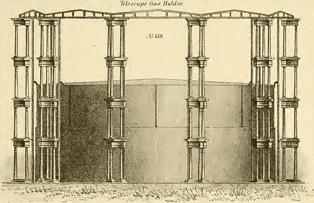

# Kubernetes 中的 Nexus 冒险:数据库损坏和存储管理

> 原文：<https://itnext.io/adventures-with-nexus-in-kubernetes-database-corruption-and-storage-management-c5c5118b5e86?source=collection_archive---------0----------------------->



望远镜储气罐第 430 号，帕斯卡铁厂，莫里斯，塔斯克公司的插图目录，第四版，1861 年

孩子们，当他们在 Kubernetes 教你们不要运行数据库时，请注意！我希望在 Kubernetes 中推出一个 [Sonatype Nexus](https://www.sonatype.com/products/repository-oss) 工件库之前，我遵循了这个建议。以下是我在维护这个安装、处理磁盘空间问题和数据库损坏问题时学到的一些经验。

我使用来自 [artifacthub.io](https://artifacthub.io/packages/helm/sonatype/nexus-repository-manager/) 的 nexus-repository-manager Helm 图表在 Kubernetes 1.18 [TKGI](https://docs.vmware.com/en/VMware-Tanzu-Kubernetes-Grid-Integrated-Edition/index.html) 集群中安装了 Nexus。我为该图表的`values.yaml`中的`persistence`部分使用的初始值是:

```
persistence:
  enabled: true
  accessMode: ReadWriteOnce
  storageSize: 100Gi
```

当我安装图表时，我使用的是 helm 版本 2。我将图表命名为`nexus`，并将其安装在`default`名称空间中。

舵图创建了一个名为`nexus-nexus-repository-manager-data`的 PVC，由 nexus pod 安装为`/nexus-data`。可以通过运行以下命令来检查 PVC:

```
$ kubectl describe pvc nexus-nexus-repository-manager-data
Name:          nexus-nexus-repository-manager-data
Namespace:     default
StorageClass:  standard
Status:        Bound
Volume:        pvc-ef01fc8d-e6e7-4888-a880-2a3c43314ff2
Labels:        app.kubernetes.io/instance=nexus
               app.kubernetes.io/managed-by=Tiller
               app.kubernetes.io/name=nexus-repository-manager
               app.kubernetes.io/version=3.22.1
               helm.sh/chart=nexus-repository-manager-21.2.0
Annotations:   pv.kubernetes.io/bind-completed: yes
               pv.kubernetes.io/bound-by-controller: yes
               volume.beta.kubernetes.io/storage-provisioner: kubernetes.io/aws-ebs
               volume.kubernetes.io/selected-node: ip-10-1-1-11.us-west-1.compute.internal
               volume.kubernetes.io/storage-resizer: kubernetes.io/aws-ebs
Finalizers:    [kubernetes.io/pvc-protection]
Capacity:      100Gi
Access Modes:  RWO
VolumeMode:    Filesystem
Mounted By:    nexus-nexus-repository-manager-7cdc447985-fvfvc
Events:        <none>
```

注意`StorageClass`是`standard`。Kubernetes 集群在 AWS 中运行，而`standard`存储类正在使用`aws-ebs` provisioner:

```
$ kubectl describe storageclass standard 
Name:            standard
IsDefaultClass:  Yes
Annotations:     kubectl.kubernetes.io/last-applied-configuration={"allowVolumeExpansion":true,"apiVersion":"storage.k8s.io/v1","kind":"StorageClass","metadata":{"annotations":{"storageclass.kubernetes.io/is-default-class":"true"},"name":"standard"},"mountOptions":["debug"],"parameters":{"fsType":"ext4","type":"gp2"},"provisioner":"kubernetes.io/aws-ebs","reclaimPolicy":"Delete","volumeBindingMode":"WaitForFirstConsumer"}
,storageclass.kubernetes.io/is-default-class=true
Provisioner:           kubernetes.io/aws-ebs
Parameters:            fsType=ext4,type=gp2
AllowVolumeExpansion:  True
MountOptions:
  debug
ReclaimPolicy:      Delete
VolumeBindingMode:  WaitForFirstConsumer
Events:             <none>
```

在这种情况下，PVC 将利用作为 AWS EBS 卷分配的 PV。PV ID 列在`kubectl describe pvc`输出的`Volume`行，可用于描述 PV:

```
$ kubectl describe pv pvc-ef01fc8d-e6e7-4888-a880-2a3c43314ff2
Name:              pvc-ef01fc8d-e6e7-4888-a880-2a3c43314ff2
Labels:            failure-domain.beta.kubernetes.io/region=us-west-1
                   failure-domain.beta.kubernetes.io/zone=us-west-1b
Annotations:       kubernetes.io/createdby: aws-ebs-dynamic-provisioner
                   pv.kubernetes.io/bound-by-controller: yes
                   pv.kubernetes.io/provisioned-by: kubernetes.io/aws-ebs
Finalizers:        [kubernetes.io/pv-protection]
StorageClass:      standard
Status:            Bound
Claim:             default/nexus-nexus-repository-manager-data
Reclaim Policy:    Delete
Access Modes:      RWO
VolumeMode:        Filesystem
Capacity:          100Gi
Node Affinity:     
  Required Terms:  
    Term 0:        failure-domain.beta.kubernetes.io/zone in [us-west-1b]
                   failure-domain.beta.kubernetes.io/region in [us-west-1]
Message:           
Source:
    Type:       AWSElasticBlockStore (a Persistent Disk resource in AWS)
    VolumeID:   aws://us-west-1b/vol-0f37482912777724e
    FSType:     ext4
    Partition:  0
    ReadOnly:   false
Events:         <none>
```

因此，按照线索 PVC -> PV -> AWS EBS，我们可以看到用于存储 Nexus 数据的确切 EBS 卷 ID:`vol-0f37482912777724e`。

Nexus 空间用完了怎么办？一种快速解决方法是编辑 PVC 对象并更改容量。您可以使用如下命令:

```
kubectl edit pvc nexus-nexus-repository-manager-data
```

Kubernetes 存储类的魔力将会影响 EBS 和正在使用它的文件系统的大小。如果增加了一个连接到 Linux EC2 实例的 EBS 卷，就不需要运行`resize2fs`或其他类似的命令。

这里的一个问题是，PVC 不会调整卷的大小，除非您重新启动装载它的 pod。在这种情况下，我需要删除 nexus pod 并等待新的 pod 启动。这个过程可能需要一段时间，因为 pod 需要装入 PVC 指定的卷。我见过很多这样的情况，当我在 nexus pod 上运行`kubectl describe pod`时，挂载操作失败，并显示如下形式的消息

```
Warning FailedMount 79s    kubelet, ip-10-1-1-11.us-west-1.compute.internal Unable to attach or mount volumes: unmounted volumes=[nexus-nexus-repository-manager-data], unattached volumes=[nexus-nexus-repository-manager-backup default-token-2m7b6 nexus-nexus-repository-manager-data]: timed out waiting for the condition
```

根据底层 EBS 卷的大小，这个操作最终会在 N 分钟后成功(对我来说，N 是 10 到 20 之间的任意值)。

我在重新启动 nexus pod 时看到的另一个错误情况是，Kubernetes 调度程序试图在 Kubernetes 节点上调度新的 pod，该节点与 EBS 卷位于不同的可用性区域。在这种情况下，错误消息的形式如下

```
Volume is already exclusively attached to one node and can't be attached to another
```

我找到的解决这个问题的唯一方法是反复删除 pod(可能带有`--force`标志),直到新的 pod 被安排在适当 AZ 中的一个节点上。

在最近的一个案例中，为`/nexus-data`调整卷的大小导致了本地 [OrientDB](https://www.orientdb.org/docs/3.0.x/) 数据库(包括 win Nexus)中的数据库损坏(在遇到这个问题之前，我根本不知道 Nexus 正在使用 OrientDB……)。

我们注意到将工件推送到 Nexus 会导致 HTTP 500 错误。当我查看 nexus pod 的日志时，我看到了以下类型的错误:

```
Caused by: com.orientechnologies.orient.core.storage.impl.local.paginated.atomicoperations.ONestedRollbackException: Atomic operation was rolled back by internal component, exception which caused this rollback is :
com.orientechnologies.orient.core.exception.OPaginatedClusterException: Error during record creation
	DB name="component"
	Component Name="asset"
```

快速的谷歌搜索揭示了这个[堆栈溢出帖子](https://stackoverflow.com/questions/42951710/orientdb-corruption-state-in-nexus-repository-version-3-2-0-01)。其中一个问题是如何停止 Nexus 以便修复数据库，特别是当 Nexus 在 Kubernetes 中作为 pod 运行时？我发现的一个解决方案如下:

*   将当前的 nexus 部署保存到 yaml 文件中:

```
$ kubectl get deployment nexus-nexus-repository-manager -o yaml > nexus-nexus-repository-manager-deployment.yaml
```

*   将`spec`部分的`replicas`值修改为`0`
*   应用新清单，这将终止正在运行的 nexus pod，并且不会启动新的 pod:

```
$ kubectl apply -f nexus-nexus-repository-manager-deployment.yaml
```

*   将上面的 yaml 清单复制为`nexus-nexus-repository-manager-deployment-bash.yaml`，将`metadata`下的`deployment`对象的名称更改为`nexus-nexus-repository-manager-bash`，并在`nexus-repository-manager`容器中添加一个`command`:

```
command: ["sh", "-c", "tail -f /dev/null"]
```

*   应用新的清单，这将启动一个与原始 nexus pod 具有完全相同的环境(容器映像、配置映射、机密、卷)的新 pod，但是运行命令`tail -f /dev/null`而不是常规的 nexus 进程:

```
$ kubectl apply -f nexus-nexus-repository-manager-deployment-bash.yaml
```

此时，您可以`kubectl exec`进入新的 pod 并在 bash 提示符下运行各种命令:

```
$ kubectl exec -it nexus-nexus-repository-manager-bash-6d6bb4776f-hcljk -- bash
```

根据上面 SO 帖子中的一个答案，我跑了:

```
bash-4.4$ cd /tmp
bash-4.4$ java -jar /opt/sonatype/nexus/lib/support/nexus-orient-console.jarOrientDB console v.2.2.36 (build d3beb772c02098ceaea89779a7afd4b7305d3788, branch 2.2.x) [https://www.orientdb.com](https://www.orientdb.com)
Type 'help' to display all the supported commands.

orientdb> CONNECT plocal:/nexus-data/db/component admin admin
```

当我试图重建索引时，我得到了一个`NullPointerException`:

```
orientdb {db=component}> REBUILD INDEX *Rebuilding index(es)...
2021-04-27 15:36:34:555 WARNI {db=component} Error deserializing record with id #37:11005 send this data for debugging: ABZicm93c2Vfbm9kZTcAAAAsPQAAADxZAAAAQ8cWAAABAAAAAP1fAAABLgAeQVRMQVMtc25hcHNob3RzDG1hdmVuMswBYXRsYXMvb3JiaXRhbC1jcnVkL29yYml0YWwtY3J1ZC1wYXJlbnQvMSetcetcetcyMDA3MTUuMjMyNjE3LTEzL2BvcmJpdGFsLWNydWQtcGFyZW50LTEuMC4wLTIwMjAwNzE1LjIzMjYxNy0xMy5wb21CioEB  [ORecordSerializerBinary]$ANSI{green {db=component}} Error during index rebuild
java.lang.NullPointerException
 at com.orientechnologies.orient.core.serialization.serializer.record.binary.ORecordSerializerBinaryV0.deserializePartial(ORecordSerializerBinaryV0.java:122)
 at
...etc...etc
com.orientechnologies.orient.core.index.OIndexAbstract.indexCluster(OIndexAbstract.java:1036)
 at com.orientechnologies.orient.core.index.OIndexAbstract.fillIndex(OIndexAbstract.java:539)
 at com.orientechnologies.orient.core.index.OIndexAbstract.rebuild(OIndexAbstract.java:500)
 ... 18 moreError: com.orientechnologies.orient.core.index.OIndexException: Error on rebuilding the index for clusters: [browse_node, browse_node_2, browse_node_3, browse_node_1]
 DB name="component"Error: java.lang.NullPointerException
```

进一步的谷歌搜索没有发现任何有用的信息。状态:死在水里。幸运的是，我们每天都在 Kubernetes 集群中运行 [Velero](https://github.com/vmware-tanzu/velero) ，备份所有名称空间中的所有 Kubernetes 对象，并将备份保存 30 天:

```
$ velero describe schedule
Name:         dailybackup
Namespace:    velero
Labels:       <none>
Annotations:  <none>Phase:  EnabledSchedule:  0 0 * * *Backup Template:
  Namespaces:
    Included:  *
    Excluded:  <none>

  Resources:
    Included:        *
    Excluded:        <none>
    Cluster-scoped:  auto

  Label selector:  <none>

  Storage Location:  

  Snapshot PVs:  auto

  TTL:  720h0m0s

  Hooks:  <none>Last Backup:  2021-04-27 17:00:29 -0700 PDT
```

对于 AWS 中的 PV，Velero 将为 PV 对象下的所有 EBS 卷创建 EBS 快照。

此时，我可以尝试直接从 Velero 备份中恢复，但我更喜欢手动检索 Nexus PV 的 EBS 快照，这样我就可以更多地尝试从 EBS 卷手动创建 PV 和 PVC，以应对我可能没有启动和运行 Velero 的其他情况。

我用 EBS 快照为 nexus pod 装载的 PV 创建了一个常规 EBS 卷。我确保新的 EBS 卷与 nexus PV 使用的原始 EBS 卷创建在同一个可用性区域中。我记下了新的卷 ID (vol-007a71c14f3571a43)。

我以 YAML 格式保存了 nexus 现有 PV 和 PVC 的清单:

```
$ kubectl get pv pvc-ef01fc8d-e6e7-4888-a880-2a3c43314ff2 -o yaml > pv.yaml
$ kubectl get pvc pvc-ef01fc8d-e6e7-4888-a880-2a3c43314ff2 -o yaml > pvc.yaml
```

我复制了名为`pv-from-snapshot.yaml`和`pvc-from-snapshot.yaml`的 YAML 清单，并更改了卷 ID 和`pv-from-snapshot.yaml`中 PV 的名称，以引用从快照创建的新 EBS 卷的卷 ID:

```
$ cat pv-from-snapshot.yaml
apiVersion: v1
kind: PersistentVolume
metadata:
  annotations:
    kubernetes.io/createdby: aws-ebs-dynamic-provisioner
    pv.kubernetes.io/bound-by-controller: "yes"
    pv.kubernetes.io/provisioned-by: kubernetes.io/aws-ebs
  labels:
    failure-domain.beta.kubernetes.io/region: us-west-1
    failure-domain.beta.kubernetes.io/zone: us-west-1b
  name: pv-007a71c14f3571a43
spec:
  accessModes:
  - ReadWriteOnce
  awsElasticBlockStore:
    fsType: ext4
    volumeID: aws://us-west-1b/vol-007a71c14f3571a43
  capacity:
    storage: 100Gi
  mountOptions:
  - debug
  nodeAffinity:
    required:
      nodeSelectorTerms:
      - matchExpressions:
        - key: failure-domain.beta.kubernetes.io/zone
          operator: In
          values:
          - us-west-1b
        - key: failure-domain.beta.kubernetes.io/region
          operator: In
          values:
          - us-west-1
  persistentVolumeReclaimPolicy: Delete
  storageClassName: standard
  volumeMode: Filesystem
```

当使用`kubectl apply`时，这个清单将创建一个名为`pv-007a71c14f3571a43`的新 PV，它使用新的 EBS 卷作为底层存储。

我修改了 PVC 清单`pvc-from-snapshot.yaml`以引用新的 PV，还将 PVC 对象的名称改为`nexus-nexus-repository-manager-data-from-snapshot`:

```
$ cat pvc-from-snapshot.yaml
apiVersion: v1
kind: PersistentVolumeClaim
metadata:
  annotations:
    pv.kubernetes.io/bind-completed: "yes"
    pv.kubernetes.io/bound-by-controller: "yes"
    volume.beta.kubernetes.io/storage-provisioner: kubernetes.io/aws-ebs
    volume.kubernetes.io/selected-node: ip-10-1-1-11.us-west-1.compute.internal
    volume.kubernetes.io/storage-resizer: kubernetes.io/aws-ebs
  labels:
    app.kubernetes.io/instance: nexus
    app.kubernetes.io/managed-by: Tiller
    app.kubernetes.io/name: nexus-repository-manager
    app.kubernetes.io/version: 3.22.1
    helm.sh/chart: nexus-repository-manager-21.2.0
  name: nexus-nexus-repository-manager-data-from-snapshot
  namespace: default
spec:
  accessModes:
  - ReadWriteOnce
  resources:
    requests:
      storage: 100Gi
  storageClassName: standard
  volumeMode: Filesystem
  volumeName: pv-007a71c14f3571a43
```

当使用`kubectl apply`时，该清单将创建一个名为`nexus-nexus-repository-manager-data-from-snapshot`的 PVC，它引用了上一步中创建的 PV `pv-007a71c14f3571a43`。

此时，我删除了用于通过`kubectl delete deploymentnexus-nexus-repository-manager-bash`挂载原始 PVC 的临时`deployment`对象，然后我修改了清单文件`nexus-nexus-repository-manager-deployment-bash.yaml`，并将 PVC 名称`nexus-nexus-repository-manager-data`替换为`nexus-nexus-repository-manager-data-from-snapshot`。我创建了一个新的`deployment`，它带有一个吊舱，现在可以通过`kubectl apply -f nexus-nexus-repository-manager-deployment-bash.yaml`安装新的 PVC。

然后，我能够`kubectl exec`进入新的 pod 并运行 OrientDB 命令，执行`component`数据库中所有索引的重建和`component`数据库的修复:

```
$ kubectl exec -it nexus-nexus-repository-manager-bash-6765d58756-bdpkz -- bashbash-4.4$ cd /tmp
bash-4.4$ java -jar /opt/sonatype/nexus/lib/support/nexus-orient-console.jarOrientDB console v.2.2.36 (build d3beb772c02098ceaea89779a7afd4b7305d3788, branch 2.2.x) [https://www.orientdb.com](https://www.orientdb.com)
Type 'help' to display all the supported commands.

orientdb> CONNECT plocal:/nexus-data/db/component admin adminorientdb {db=component}> REBUILD INDEX *
orientdb {db=component}> REPAIR DATABASE --fix-graph
orientdb {db=component}> REPAIR DATABASE --fix-links
orientdb {db=component}> REPAIR DATABASE --fix-ridbags
orientdb {db=component}> REPAIR DATABASE --fix-bonsai
orientdb {db=component}> DISCONNECT
```

这一次，所有的`rebuild index`和`repair database`命令都成功了。我有一个包含良好数据库的 PVC。是时候再次尝试调整 PVC/EBS 的大小了。我编辑了`pvc-from-snapshot.yaml`并将`storage`的值设置为`200Gi`，然后用`kubectl apply`应用这个清单。为了触发 EBS 调整大小，我必须删除`nexus-nexus-repository-manager-bash-6765d58756-bdpkz`窗格。一个新的 pod 启动了，几分钟后成功安装了现在已调整大小的 PVC。我通过`kubectl exec`进入新的 pod 并运行上面的`rebuild index`和`repair database`命令来确保数据库仍然正常。一切都很好。

此时，我删除了临时的`nexus-nexus-repository-manager-bash`部署，并修改了原来的部署清单`nexus-nexus-repository-manager-deployment.yaml`，以便将`replicas`设置回`1`(我已经将它临时设置为`0`)，并将 PVC 名称`nexus-nexus-repository-manager-data`替换为`nexus-nexus-repository-manager-data-from-snapshot`。然后我用`kubectl apply`应用清单并等待`nexus-nexus-repository-manager` pod 准备好，然后跟踪 pod 的日志并确保没有错误。

如果你跟着做，你就学会了如何:

*   停止原来的 nexus pod 并启动一个临时 pod，您可以`bash`进入该 pod，以便对原来的 PVC 运行数据库修复命令
*   从未出现数据库损坏症状的卷的 EBS 快照创建新的 PV 和 PVC
*   通过运行临时 pod 挂载新 PVC 并运行 OrientDB 数据库修复命令，确保数据库是正确的
*   增加 PVC/EBS 的大小，然后再次运行数据库修复命令，以确保没有数据库损坏错误
*   再次旋转 nexus pod，这次安装新的 PVC

如果这看起来很复杂，那确实很复杂。它强调了一个事实，即 Kubernetes 并不是真正为有状态工作负载而设计的。如果您确实在 Kubernetes 中运行这样的工作负载，那么您需要确保对您的数据库进行适当的备份，或者至少(如果您在 AWS 中)对作为这些数据库的存储的卷进行 EBS 快照。

还有一个特定于 Nexus 的任务值得研究，那就是创建一个[清理策略](https://help.sonatype.com/repomanager3/repository-management/cleanup-policies#CleanupPolicies-LastDownloadedBefore(Days))和一个每天运行清理的 Nexus 管理任务。