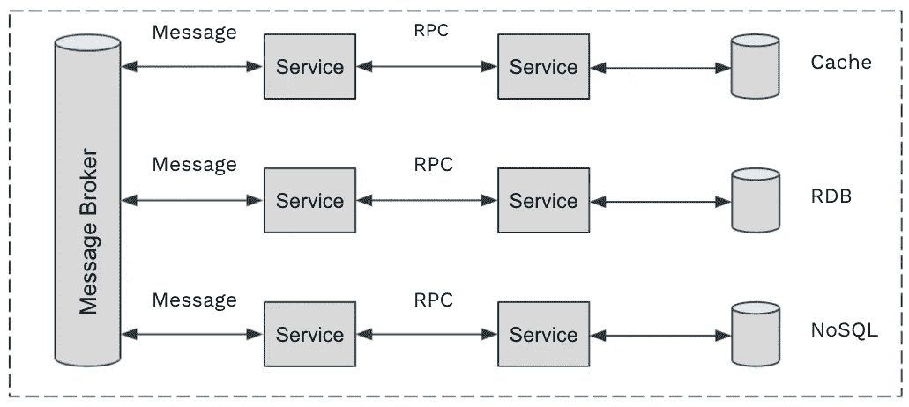
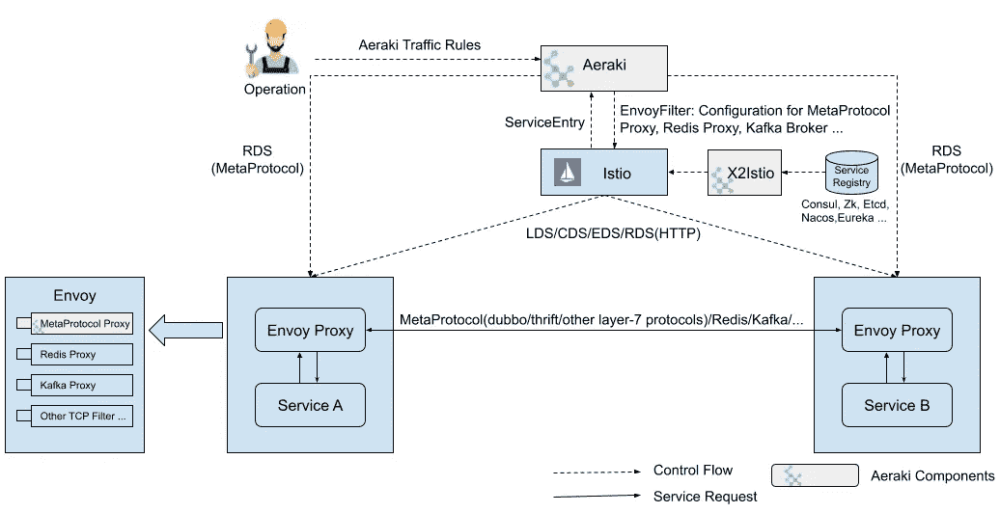
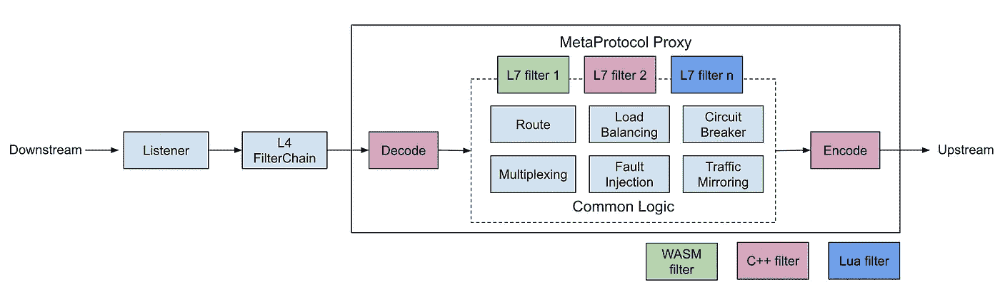
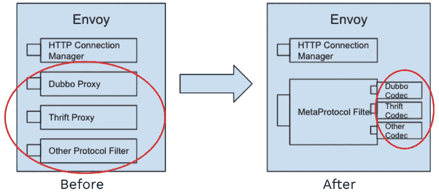
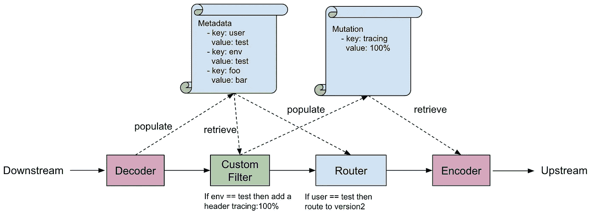
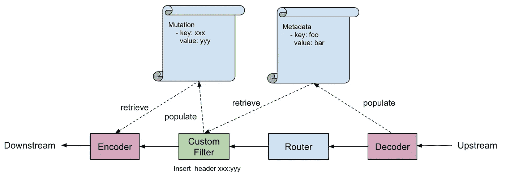
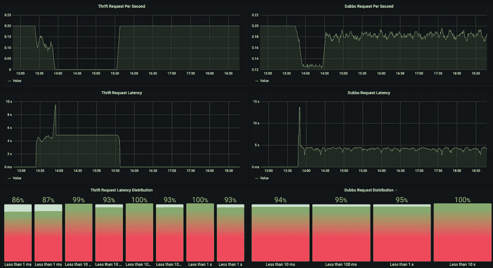
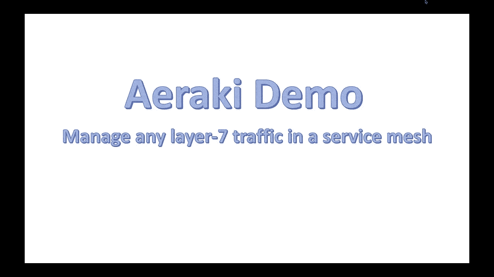

# 如何在 Istio 服务网格中管理 Thrift、Dubbo、Redis 和任何第 7 层协议？

> 原文：<https://itnext.io/aeraki-manage-any-layer-7-protocol-in-istio-service-mesh-6eca64f77adb?source=collection_archive---------5----------------------->


由 [Unsplash](https://unsplash.com/) 上的[卡拉车](https://unsplash.com/@karlacar)拍摄

Aeraki [Air-rah-ki] Mesh 是我大约一年前开始的一个开源服务 Mesh，直到最近我一直在为它工作。Aeraki 是希腊语中“微风”的意思。虽然 Istio 在服务网格中连接微服务，但 Aeraki Mesh 提供了一种非侵入性、高度可扩展的方式，允许 Istio 支持非 HTTP 开源和专有协议。希望这股微风能帮助 Istio 和 service mesh 航行得更远一点。

# 服务网格中缺乏协议支持

现在，我们在服务网格方面面临一些挑战:

*   Istio 和其他流行的服务网格实现对非 HTTP 协议的支持非常有限。
*   Envoy RDS(路由发现服务)是专为 HTTP 设计的。其他协议(如 Dubbo 和 Thrift)只能使用监听器内嵌路由进行流量管理，当路由改变时会中断现有连接。
*   将专有协议引入服务网格需要付出很大的努力。您需要编写一个特使过滤器来处理数据平面中的流量，并编写一个控制平面来管理这些特使。

这些障碍使得用户很难管理微服务中其他广泛使用的第 7 层协议的流量。例如，在微服务应用中，我们可能有以下协议:

*   **RPC:** HTTP，gRPC，Thrift，Dubbo，专有 RPC 协议…
*   **消息:**卡夫卡，RabbitMQ …
*   **缓存:** Redis，Memcached …
*   **数据库:** MySQL，PostgreSQL，MongoDB …



微服务中使用的常见第 7 层协议

如果您已经在迁移到服务网格方面投入了大量的精力，当然，您希望从中获得最大的收益——管理您的微服务中所有协议的流量，而不仅仅是 HTTP。

# Aeraki Mesh 的方法

为了解决这些问题，我创建了开源项目， [Aeraki](https://github.com/aeraki-framework) Mesh，以提供一种非侵入性的、可扩展的方式来管理 Istio 服务网格中的任何第 7 层流量。



阿拉基建筑

如图所示，Aeraki Mesh 由以下组件组成:

*   Aeraki: [Aeraki](https://github.com/aeraki-framework/aeraki) 为运营提供高级的、用户友好的流量管理规则，将规则转换为特使过滤器配置，并利用 Istio 的`EnvoyFilter` API 将配置推送到边车代理。Aeraki 还充当数据平面中元协议代理的 RDS 服务器。与专注于 HTTP 的 Envoy RDS 相反，Aeraki RDS 旨在为所有第 7 层协议提供通用动态路由功能。
*   元协议代理:[元协议代理](https://github.com/aeraki-framework/meta-protocol-proxy)为第 7 层协议提供通用功能，如负载均衡、断路器、负载均衡、路由、速率限制、故障注入和授权。第 7 层协议可以建立在元协议之上。要将新协议添加到服务网格中，您唯一需要做的事情就是实现[编解码器接口](https://github.com/aeraki-framework/meta-protocol-proxy/blob/ac788327239bd794e745ce18b382da858ddf3355/src/meta_protocol_proxy/codec/codec.h#L118)和几行配置。如果您有内置功能无法满足的特殊需求，元协议代理还有一个应用程序级的过滤器链机制，允许用户编写自己的第 7 层过滤器，将自定义逻辑添加到元协议代理中。

Dubbo 和 [Thrift](https://github.com/aeraki-framework/meta-protocol-proxy/tree/master/src/application_protocols/thrift) 已经基于元协议实现。更多的协议正在制定中。如果您使用的是封闭源代码的专有协议，那么您也可以在服务网格中管理它，只需为它编写一个元协议编解码器。

大多数请求/响应风格的无状态协议可以建立在元协议代理之上。然而，有些协议的路由策略过于“特殊”，无法在元协议中规范化。例如，Redis 代理使用插槽号将客户机查询映射到特定的 Redis 服务器节点，插槽号是由请求中的键计算的。只要在特使代理端有一个可用的特使过滤器，Aeraki 仍然可以管理这些协议。目前，对于该类别的协议，Aeraki 支持 [Redis](https://github.com/aeraki-framework/aeraki/blob/master/docs/zh/redis.md) 和 Kafka。

# 深入研究元协议

让我们看看元协议是如何工作的。在引入元协议之前，如果我们想要为特定协议代理流量，我们需要编写一个理解该协议的特使过滤器，并添加代码来操纵流量，包括路由、报头修改、故障注入、流量镜像等。

对于大多数请求/响应类型的协议，流量操作的代码非常相似。因此，为了避免在不同的特使过滤器中重复这些功能，Aeraki Mesh 在一个地方实现了第 7 层协议代理的大多数常见功能，即元协议代理过滤器。



元协议代理

这种方法大大降低了编写新的 Envoy 过滤器的障碍:现在您只需要实现编解码器接口，而不是编写一个功能完整的过滤器。除此之外，控制平面已经就位——Aeraki 在控制平面上工作，为构建在元协议之上的所有协议提供元协议配置和动态路由。



在元协议之前和之后编写特使过滤器

元协议代理中有两种重要的数据结构:元数据和变异。元数据用于路由，变异用于头操作。

在请求路径，解码器(编解码器实现的解码方法)用从请求解析的键值对填充元数据数据结构，然后元数据将被传递到元协议路由器。路由器在匹配它通过 RDS 和元数据从 Aeraki 接收的路由配置之后，选择适当的上游集群。

如果需要修改请求，定制过滤器可以用任意的键-值对填充变异数据结构:添加一个头或者改变头的值。然后，突变数据结构将被传递给编码器(编解码器实现的编码方法)。编码器负责将键值对写入有线协议。



请求路径

响应路径类似于请求路径，只是方向不同。



响应路径

# 一个例子

Dubbo 和 [Thrift](https://github.com/aeraki-framework/meta-protocol-proxy/tree/master/src/application_protocols/thrift) 已经基于元协议实现，由 Aeraki Mesh 开箱即用支持。如果您需要实现另一个协议，您可以遵循以下步骤(以[节俭](https://github.com/aeraki-framework/meta-protocol-proxy/tree/master/src/application_protocols/thrift)为例):

## 数据平面

*   实现[编解码接口](https://github.com/aeraki-framework/meta-protocol-proxy/blob/ac788327239bd794e745ce18b382da858ddf3355/src/meta_protocol_proxy/codec/codec.h#L118)，对协议包进行编解码。你可以参考 [Dubbo codec](https://github.com/aeraki-framework/meta-protocol-proxy/tree/master/src/application_protocols/dubbo) 和 [Thrift codec](https://github.com/aeraki-framework/meta-protocol-proxy/tree/master/src/application_protocols/thrift) 编写自己的实现。
*   使用 Aeraki 应用协议 CRD 定义协议，如以下 YAML 片段所示:

```
apiVersion: metaprotocol.aeraki.io/v1alpha1
kind: ApplicationProtocol
metadata:
  name: thrift
  namespace: istio-system
spec:
  protocol: thrift
  codec: aeraki.meta_protocol.codec.thrift
```

## 制导机

您不需要实现控制平面。Aeraki 监视服务和流量规则，为 sidecar 代理生成配置，并通过 EnvoyFilter 和 MetaRoute RDS 将配置发送到数据层。

## 协议选择

与 Istio 类似，协议由服务端口前缀标识。请使用此模式命名服务端口:TCP-元协议-{第 7 层协议}-xxx。例如，节俭服务端口应该命名为 tcp-metaprotocol-thrift。

## 交通管理

您可以通过马塔鲁特 CRD 机场变更路线。例如:向 v1 发送 20%的请求，向 v2 发送 80%的请求:

```
apiVersion: metaprotocol.aeraki.io/v1alpha1
kind: MetaRouter
metadata:
  name: test-metaprotocol-route
spec:
  hosts:
    - thrift-sample-server.thrift.svc.cluster.local
  routes:
    - name: traffic-spilt
      route:
        - destination:
            host: thrift-sample-server.thrift.svc.cluster.local
            subset: v1
          weight: 20
        - destination:
            host: thrift-sample-server.thrift.svc.cluster.local
            subset: v2
          weight: 80
```

# 演示

[现场演示:kiali 仪表盘](http://aeraki.zhaohuabing.com:20001/)

[现场演示:服务指标:Grafana](http://aeraki.zhaohuabing.com:3000/d/pgz7wp-Gz/aeraki-demo?orgId=1&refresh=10s&kiosk)

[现场演示:服务指标:普罗米修斯](http://aeraki.zhaohuabing.com:9090/new/graph?g0.expr=envoy_dubbo_inbound_20880___response_success&g0.tab=0&g0.stacked=1&g0.range_input=1h&g1.expr=envoy_dubbo_outbound_20880__org_apache_dubbo_samples_basic_api_demoservice_request&g1.tab=0&g1.stacked=1&g1.range_input=1h&g2.expr=envoy_thrift_inbound_9090___response&g2.tab=0&g2.stacked=1&g2.range_input=1h&g3.expr=envoy_thrift_outbound_9090__thrift_sample_server_thrift_svc_cluster_local_response_success&g3.tab=0&g3.stacked=1&g3.range_input=1h&g4.expr=envoy_thrift_outbound_9090__thrift_sample_server_thrift_svc_cluster_local_request&g4.tab=0&g4.stacked=1&g4.range_input=1h)

屏幕截图:服务指标:



录制的演示:Dubbo 和节俭交通管理



# 安装

## 先决条件:

*   正在运行的 Kubernetes 集群，可以是云中的集群，也可以是使用 kind/minikube 创建的本地集群
*   安装了 Kubectl，在第一步中,`~/.kube/conf`指向集群
*   头盔已安装，将用于安装演示中的一些组件

## 从 Github 下载 Aeraki

```
git clone [https://github.com/aeraki-mesh/aeraki.git](https://github.com/aeraki-mesh/aeraiki)
```

## 安装 Istio、Aeraki 和演示应用程序

```
make demo
```

注意:Aeraki 需要用智能 DNS 配置 Istio。如果您已经安装了 Istio，但不知道如何打开智能 DNS，请卸载它。*制作演示*将为您安装 Istio。

## 在您的浏览器中打开以下 URL 来玩 Aeraki 并查看服务指标

*   凯里`[http://{istio-ingressgateway_external_ip}:20001](/{istio-ingressgateway_external_ip}:20001/)`
*   格拉夫纳`[http://{istio-ingressgateway_external_ip}:3000](/{istio-ingressgateway_external_ip}:3000/)`
*   普罗米修斯`[http://{istio-ingressgateway_external_ip}:9090](/{istio-ingressgateway_external_ip}:9090/)`

您可以将 Aeraki 演示仪表板从文件`[demo/](https://raw.githubusercontent.com/aeraki-mesh/aeraki/master/demo/grafana-dashboard.json)`[grafana-dashboard . JSON](https://raw.githubusercontent.com/aeraki-mesh/aeraki/master/demo/grafana-dashboard.json)导入到 Grafana 中。

如果您需要在服务网格中管理 HTTP 以外的协议，希望这有所帮助。如果您有任何问题或评论，请联系([@赵华兵](https://twitter.com/zhaohuabing)[zhaohuabing@gmail.com](mailto: zhaohuabing@gmail.com))！

github:[https://github.com/aeraki-mesh](https://github.com/aeraki-mesh)

网址:[https://aeraki.net](https://aeraki.net)