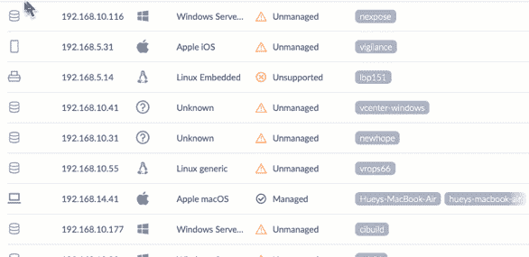

# 使用 web lottie 在 Angular 中安全集成后效动画

> 原文：<https://itnext.io/after-effects-animations-safely-integrated-in-angular-using-web-lottie-591bbef9d90d?source=collection_archive---------9----------------------->

满足 S1-Lottie:Airbnb web Lottie 库的一个轻量级包装组件。

几周前，我在 SentinelOne 的博客上发布了一篇文章，回顾了我们使用 airbnb 的 [lottie web lib](https://github.com/airbnb/lottie-web) 实现一些前沿动画的方式。

使用 s1-lottie 的 SentinelOne UI 部件

我真的推荐阅读[的文章](https://www.sentinelone.com/blog/taking-web-animations-one-step-further-with-powerful-s1-lottie/)，以便更好地理解我们决定使用洛蒂的动机，以及我们通常处理动画和微交互的方式。

在这篇文章中，我想快速回顾一下我们在 SentinelOne 领域发表的微小角度组件的一些技术部分。

s1-lottie 的目标是代理 lottie 的实例功能，以便在您的 Angular 应用程序上安全使用。(如果你不熟悉 lottie lib，简单来说:它支持在网络上渲染 after effects 动画，并使用 javascript 控制它们)。

让我们回顾一下我们用来制作 lottie 组件的技术，这种组件“成角度”且易于集成:

*   我们正在考虑 Angular 的生命周期挂钩，方法是在 lottie 的容器初始化后引用 Lottie 的播放器主机(ngAfterViewInit)。
*   我们通过在任何动画加载时逃避 Angular 的变化检测来优化性能(通过传递一个布尔输入来选择)。
*   我们在销毁组件的同时也在销毁洛蒂实例。
*   我们使用官方的 lottie/types (Typescript)进行正确的打字。
*   我们没有用多余的抽象来扼杀组件。我们只是代理洛蒂的能力/自定义事件——易于调试。
*   我们正在为你安装 web-lottie 作为对等依赖。
*   当主机元素对用户不可见时，我们暂停 lottie 播放器。

欢迎您开始回购，玩[代码](https://github.com/Sentinel-One/lottie)，如果您喜欢，可以投稿:)

干杯，

利伦。