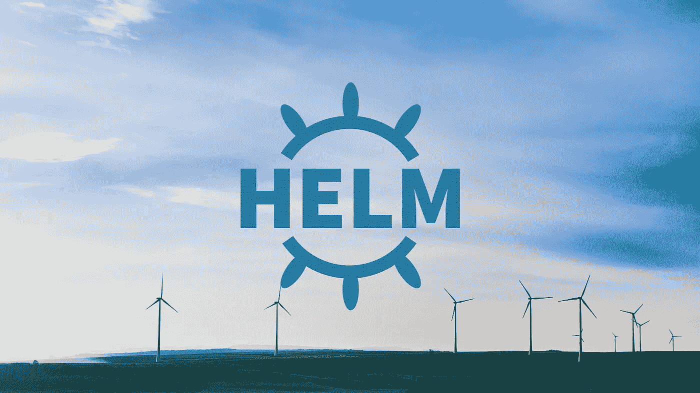
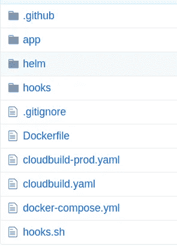
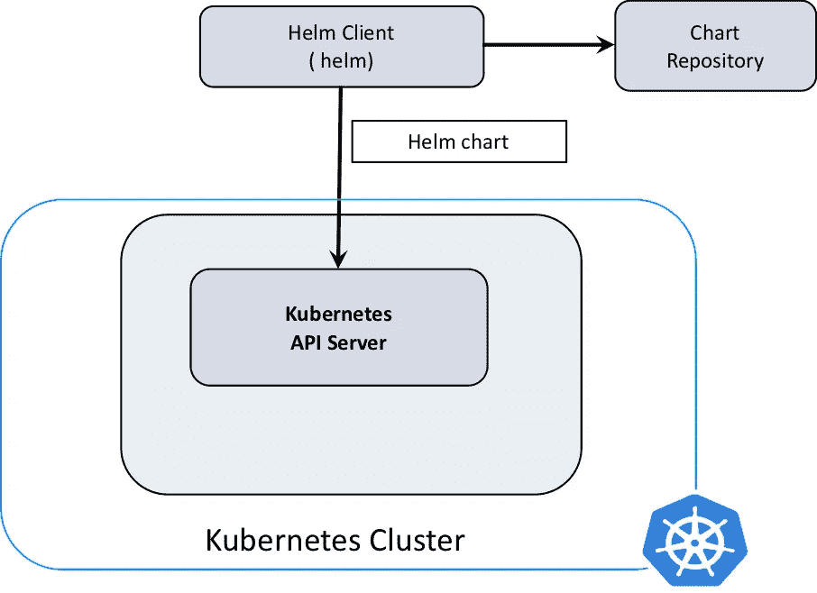

# 在生产中使用 Helm 两年后，现在 Helm3

> 原文：<https://itnext.io/after-using-helm-for-2-years-in-production-now-helm3-38461a2d8047?source=collection_archive---------2----------------------->



自从开始将 [Pagevamp 的](https://www.pagevamp.com)服务迁移到 Google Cloud——GKE 上的 Kubernetes，我们就成为了 [Helm](https://helm.sh/) 的粉丝，因为它提供了简单和方便。我们研究的另一个选项是 [Spinnaker](https://www.spinnaker.io/) ，它在基础设施代码(IaC)方面还不太成熟，我们当时不想使用 blackbox。此外，spinnaker 的资源消耗很高，我们主要关心的问题之一是通过从 Rackspace 上基于虚拟机的服务迁移到 GCP 来降低成本。

让我们讨论一下我们如何使用 Helm，我们所做的黑客攻击，面临的问题，以及 Helm3 在上下文中有什么不同。

## 1.Kubernetes 清单的清晰定义

Helm 无疑是管理 Kubernetes 资源清单文件的强大工具，如部署、服务、配置映射、机密等等。我们不需要为每个新服务从头开始重新编写清单，而是更新基于服务的不同变量。这提高了开发人员的工作效率，并大大降低了运营开销。由于定义是简单的 yaml 和模板，学习曲线并不太难。对于任何熟悉 Kubernetes 资源通过清单的一般定义的人来说，可以创建一个舵图并开始工作。

## 2.简易模板

Helm 使用的 Go 模板具有丰富的模板功能，无论是添加引用值、格式化缩进、大小写转换还是更多。制作一个结合了动态和静态变量的值是如此的方便。

```
ENVIRONMENT: {{ .Values.ENVIRONMENT | quote }}
value: {{ include "mytpl" . | lower | quote }}
DB_DATABASE: {{ .Values.segment }}staging
```

## 3.在几秒钟内创建多个分段

我们希望创建整个堆栈的多个部分，以便工程团队可以在他们自己的部分测试测试代码。比如，nepal.example.com，nepal-api.example.com，everest.example.com 等等。

一个问题是，我们不仅需要使这些网址动态一样，nepal.example.com 应该打电话到 nepal-api.example.com 和 everest.example.com 应该使用 everest-api.example.com。我们仅仅通过定义一个模板就能够实现这一点:

```
{{- define "segmentdot" -}}
{{- if .Values.segment -}}
{{ default "" .Values.segment }}.
{{- end -}}
{{- end -}}{{- define "segmentdash" -}}
{{- if .Values.segment -}}
{{ default "" .Values.segment }}-
{{- end -}}
{{- end -}}
```

然后在 configmap 上添加模板化变量:

```
APP_URL: [https://{{](/{{) {{ .Values.segment }} }}.example.com
API_URL: [https://{{](/{{) template "segmentdash" . }}api.example.com
EXTRA_VARIABLE: [https://{{](/{{) template "segmentdot" . }}example.comDB_DATABASE: {{ .Values.segment }}staging
```

然后，我们可以通过安装相同的图表来创建一个全新的服务部分。

```
helm install --name nepal-service /path/to/chart --set segment=nepal
```

## 4.谷歌云存储作为图表存储

为了使部署过程无状态，我们选择 GCS bucket 来存储所有服务的导航图。这样，我们不仅可以处理访问权限，而且不用担心维护部署服务器。甚至，我们可以仅通过引用图表路径来部署舵图表。

因此，明智的建议之一是选择任何持久存储服务，如 S3，GCS。也有插件可以让这些桶成为舵毂。

## **5。基础设施代码**



舵，docker 和撰写文件的 Git 结构

我们对待基础设施上的每一个变化就像对待源代码控制上的应用服务代码一样，这样每一个变化都可以被跟踪，我们可以知道我们部署的确切状态以及我们的服务是如何运行的。通过使用 Docker 已经简化了路径，此外使用 helm 无疑使它更加透明。我们在
“helm”文件夹内的同一个存储库中保存 helm chart，任何配置更改、环境变量的添加/删除都将在分支上进行，并通过我们的 slack bot 命令进行升级。

## 6.独立掌控基础设施的变化

入口、负载平衡器、SSL 证书、Istio 虚拟服务和路由等基础架构配置的变化并不频繁。因此，在单独的舵图上维护这些配置使维护变得容易并减少出错的机会。

# 挑战和头盔 3 如何解决

## 1.安全和访问控制

在 Helm 2 中，我们需要为 tiller 创建 ServiceAccount 和 Role，它们需要有足够的权限在 tiller 使用 Kube API 执行集群内更新时对部署进行更改。在使用 tiller 时，不可能给用户选择性的访问权限，因为任何能与 tiller 交谈的人都可以进行任何更改或发布。因此很难根据需求来维护权限。



赫尔姆建筑公司——img src:developer.ibm.com

但是头盔 3 完全改变了架构。移除 tiller 后，我们从本地运行的 helm 命令直接与 Kube API 服务器交互。因此，对任何 Kubernetes 资源的访问与运行`kubectl`相同，并且基于`kubeconfig`文件。我们甚至不需要用`helm init`安装头盔。

## 2.发布历史(计数和安全性)

默认情况下，helm 2 会保留每个版本的无限历史，这些版本曾经对我们的系统产生过非常坏的影响。甚至`helm ls`用了 20 多秒才显示安装好的图表。我们认为 EKS 的 API 服务器可能有问题，所以联系了支持团队来解决性能缓慢的问题。在他们说，磁盘 I/O 在主机上很高，并查看舵柄舱的日志后，我们发现舵柄有问题。

```
kubectl --namespace=kube-system get cm -l OWNER=TILLER| wc -l
```

有超过 3 万个发布历史。为了快速清理，我们要么删除已安装的图表并重新安装，要么删除发布版本。此外，历史以平面文本的形式存储在 helm installed 命名空间(kube-system)中的 configmap 中。

仅仅通过用`helm init — upgrade — history-max=5 — service-account tiller`重新初始化舵柄对现有的海图没有任何帮助，但必须清理历史，这需要几个小时。

但是随着 Helm 3 的引入，默认情况下只有 10 个发布历史被保留，它们作为 Kubernetes 的秘密而存在。此外，我们可以选择保持每个图表的历史计数。

```
helm3 upgrade prometheus prometheus/ --history-max 20
```

我们也可以通过删除图表来保存历史

```
helm3 uninstall --keep-history
```

## 3.分蘖去除松开资源和版本不匹配

当有大量的发布历史时，一个新的更新可能会使 tiller 消耗计算资源以及磁盘 i/o，这可能会成为瓶颈，但 Helm 3 已经解决了这个问题。

在版本方面，头盔 2 曾经有客户端和服务器。

```
$ helm version
Client: &version.Version{SemVer:"v2.16.1", GitCommit:"bbdfe5e7803a12bbdf97e94cd847859890cf4050", GitTreeState:"clean"}Server: &version.Version{SemVer:"v2.16.1", GitCommit:"bbdfe5e7803a12bbdf97e94cd847859890cf4050", GitTreeState:"clean"}
```

因此，当任何用户更新服务器版本时，所有的客户端都需要相应地升级版本。随着 Helm 3 的推出，这已经成为过去的趋势。它在版本 3 上没有客户机-服务器模型。在运行 helm 命令的机器上只有客户端和它。

暂时就这样了。如果你有任何关于 Helm 使用和迁移到 v3 的有趣的事情要分享，请随意分享。将在另一篇文章中更新从 v2 到 v3 的迁移过程。

在 [twitter](https://twitter.com/dwdRAJU) 和 [linkedin](https://www.linkedin.com/in/dwdraju/) 上与我联系。