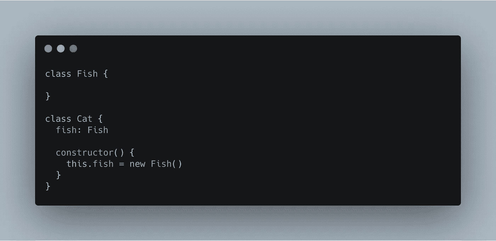
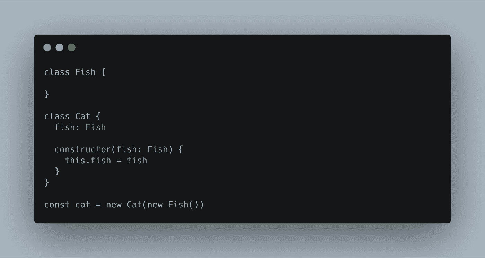
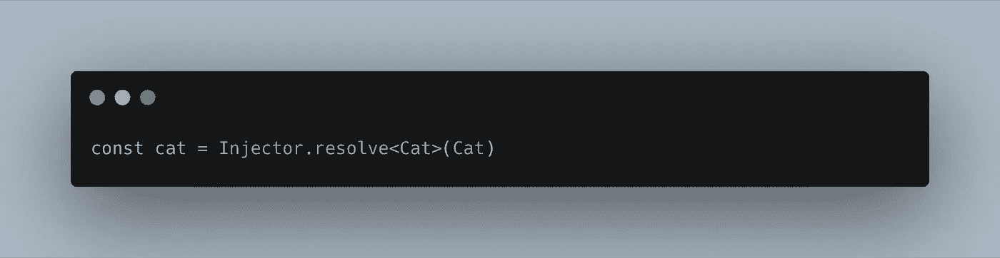
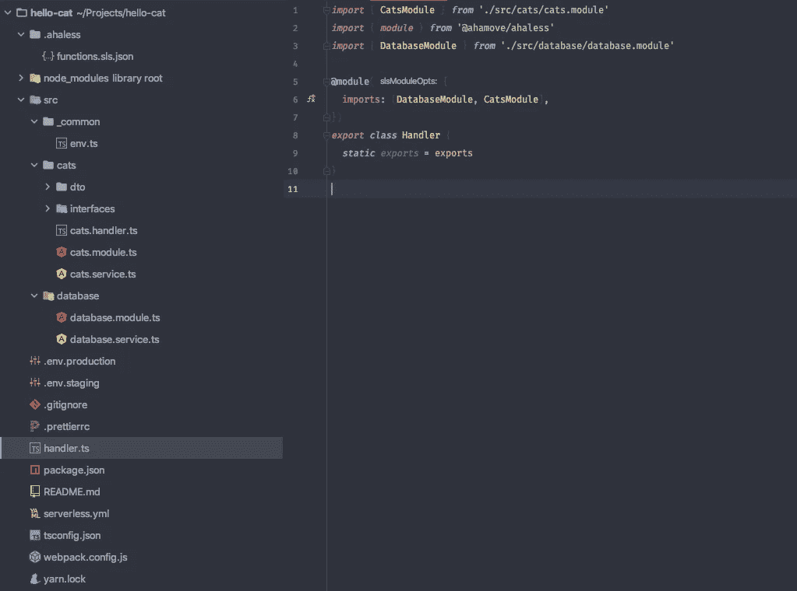
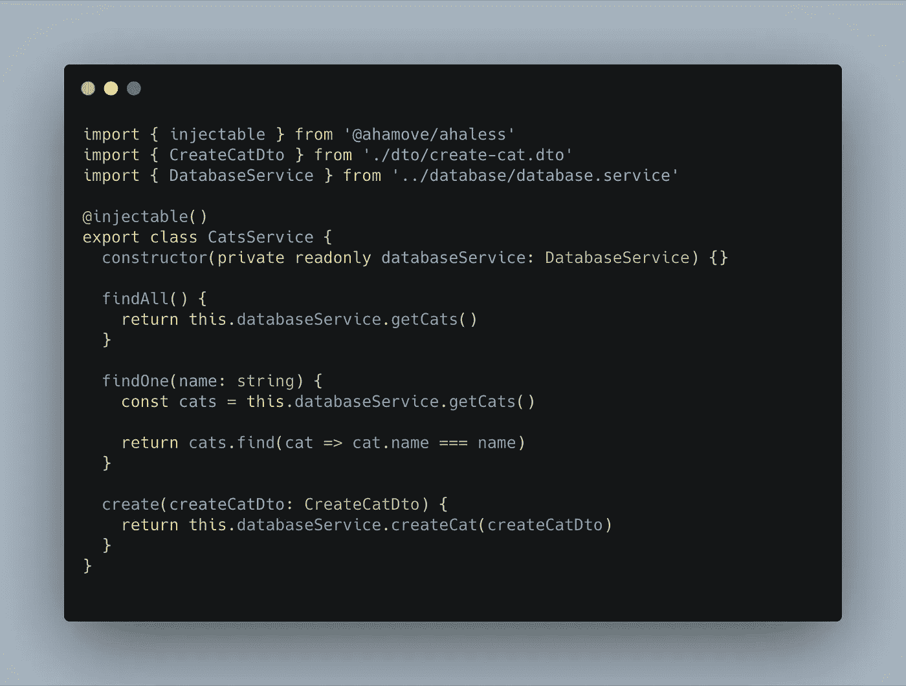
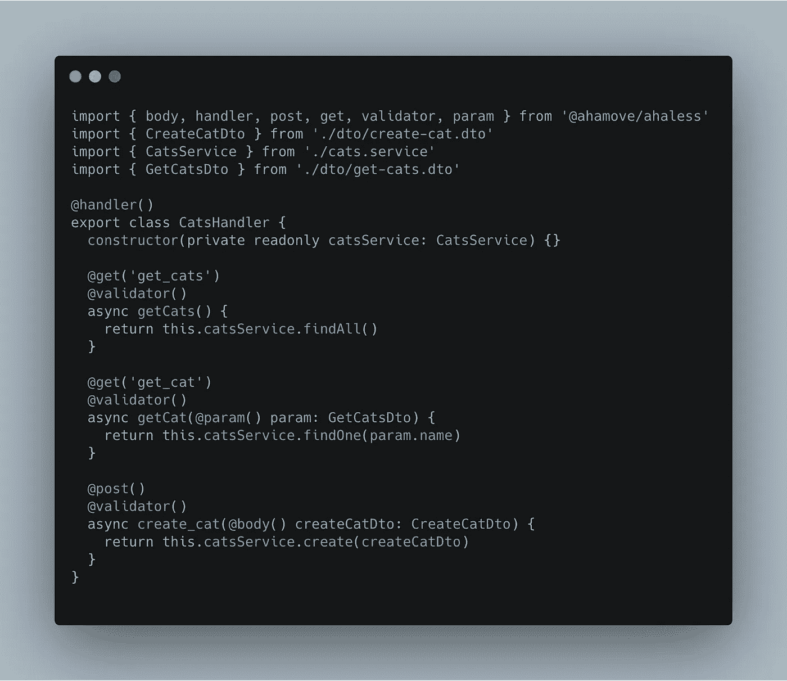
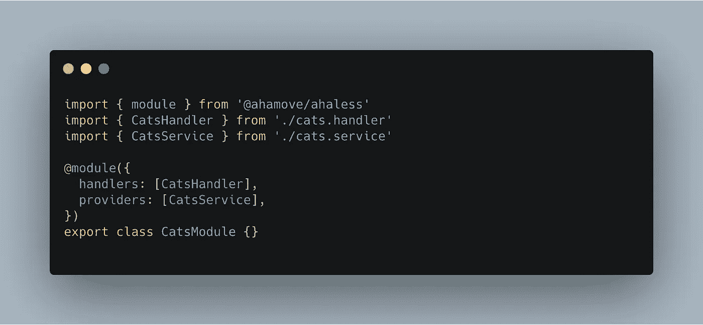
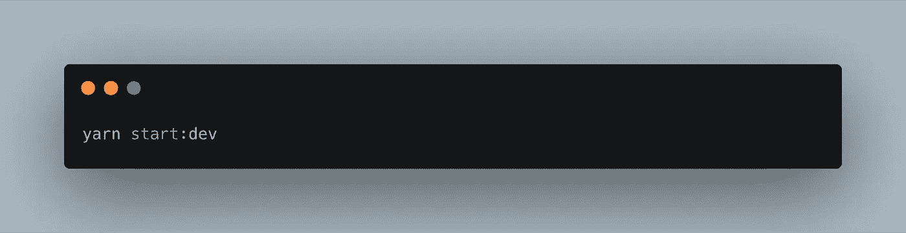

# 无服务器:在 Typescript 之上编写无服务器应用程序 OOP

> 原文：<https://itnext.io/ahaless-write-serverless-application-oop-on-top-of-typescript-ffbab8e5c4db?source=collection_archive---------1----------------------->


> *在所谓的云原生技术中，无服务器已经变得非常流行。它承诺只为您使用的东西付费，并自动扩展，这将标杆设置到了一个新的高度。你不必担心基础设施，只需担心你的代码。*
> 
> *与此同时****JavaScript****或者更准确地说 Node.js 已经成为编写无服务器应用程序最流行的语言之一。可能有很多原因，但我猜想 JavaScript 在 serverless 中的流行是由于它们的一些相似之处:都专注于快速的***上市时间，并且都在* ***前端*** *开发人员中特别受欢迎。**
> 
> **来源:*[*https://lesscodeismore.dev/serverless-typescript/*](https://lesscodeismore.dev/serverless-typescript/)*

# *我们的问题呢？*

*在[**a 移除**](https://ahamove.com/) ，我们大量使用 Javascript with Serverless。然而，用 Javascript 编写无服务器应用程序有一些缺点。例如，我们必须一次又一次地编写重复的代码。虽然我们可以为所有项目创建一个模板，但这不是一个好主意，因为这些代码仍然在我们的源代码中重复。此外，当我们添加新函数或更改这些名称时，我们必须更新`serverless.yml`文件——这是一项繁琐的任务。*

*另一方面，Javascript 是一种动态类型语言。它没有类型检查，自动补全不好用，容易出错。*

# *为什么我们使用 Typescript！*

*Typescript 解决了我们的问题，与无服务器框架和 AWS Lambdas 一起工作很好。它有类型检查、更好的 IDE 支持、严格的空检查、类、接口、装饰器等等……我们可以在开发阶段检查语法错误。*

# *什么是依赖注入？*

> *依赖注入是一种技术，通过它一个对象提供另一个对象的依赖。*
> 
> *引用自[维基](https://en.wikipedia.org/wiki/Dependency_injection)*

*那是什么意思？你的软件的某个*部分*(通常称为*注入器*)负责构建对象，而不是手动构建你的对象。*

*想象下面的代码:*

**

*这是不好的，有很多原因，比如类之间有直接和不可交换的依赖关系，测试会变得非常困难，遵循你的代码变得非常困难，组件的重用变得更加困难，等等..另一方面，*依赖注入将*依赖注入到你的构造函数中，使得所有这些*不好的*东西都过时了:安装*

**

**不凉。**

*通过使用负责创建对象的*注入器*，您可以简单地完成如下操作:*

**

**更好。**

*有很多理由说明为什么应该进行依赖注入，包括可测试性、可维护性、可读性等等..再说一遍，如果你还不知道，那是时候学习一些重要的东西了。*

> *来源:[https://nehalist.io/dependency-injection-in-typescript/](https://nehalist.io/dependency-injection-in-typescript/)*

# *我们如何解决这些问题？*

*我们决定基于[server less-plugin-typescript](https://serverless.com/plugins/serverless-plugin-typescript/)创建一个新的框架，它也有 DI 模式。我们称它为 **Ahaless***

# *装置*

```
*# Step 1: Install serverless globally
npm i -g serverless# Step 2: Create service in new folder using a custom template
serverless create --template-url [https://github.com/lynkxyz/ahaless-template](https://github.com/lynkxyz/ahaless-template) --path hello-cat# Step 3: Go to the folder and install dependencies
cd hello-cat && yarn*
```

*在这个模板中，我们使用了两个插件:*

*   *[@ahamove/ahaless](https://www.npmjs.com/package/@ahamove/ahaless) (我们会在本博客后面解释)*
*   *[@ ahamove/server less-generate-functions](https://www.npmjs.com/package/@ahamove/serverless-generate-functions)(会根据`Ahaless`生成无服务器函数)*

# *开始*

*首先，我们可以看到项目结构类似于 Angular 和 NestJS。*

**

*我们在根项目中有`handler.ts`文件。我们需要将所有子模块导入到根`module`中，让`Ahaless`知道你想要使用什么模块。在这个例子中，我们使用了两个模块。还有`DatabaseModule`和`CatsModule`。`static exports`使用 NodeJS 的全局导出对象将所有函数导出到它的。*

**

*在`cats.service.ts`文件中，我们定义了一个名为`CatsService`的类。我们在类之前添加了一个装饰器`@injectable`，让`Ahaless`知道它是一个依赖类，然后我们可以在以后注入它。这个类构造函数还注入了一个服务 is `DatabaseService`。*

**

*在`cats.handler.ts`文件中，我们创建一个名为`CatsHandler`的类。`@handler`装饰器表明这个类是一个控制器。在类体中，我们使用这些`@get`、`@post`装饰器来从`GET`和`POST`方法中调用这些函数。默认情况下，`Ahaless`将使用函数名来创建 API 路径，但是如果您想要使用自定义名称，您可以将`path`名称作为第一个参数传递。另外，你也可以使用`@medthod`、`@put`、`@delete`装饰者。*

*我们还提供了`@validator`来验证`body`和`param`参数。你可以查看[类验证器](https://github.com/typestack/class-validator)的文档以获得更多信息。*

**

*在我们的例子中，我们定义 API `create_cat`的主体必须具有`name`类型`string`。如果键`name`无效或丢失。它会向客户端抛出错误。*

**

*最后，您需要将`CatsHandler`和`CatsService`导入到`CatsModule`中。不需要将`exports`对象设置为子模块中的`static exports`。只需在根模块中完成即可。*

**

*要运行这个项目，只需运行这个命令。`Ahaless`将自动生成功能列表。你再也不需要那样了。*

# *结论*

*我们解决了我们的问题。我们可以使用 DI 模式、类型检查、更好的 IDE 支持、严格的空检查、类、接口、装饰器等等。此外，我们可以编写许多无服务器功能，但不需要编写重复的代码。干！！！*

*然而，它也有一些缺点，如:*

*   *[异步提供者](https://docs.nestjs.com/fundamentals/async-providers)*
*   *[循环依赖](https://docs.nestjs.com/fundamentals/circular-dependency)*
*   *测试*

*如果您想为我们的项目做出贡献或有任何问题，请提出您的请求并在 [Github 页面](https://github.com/lynkxyz/ahaless)中创建新问题*