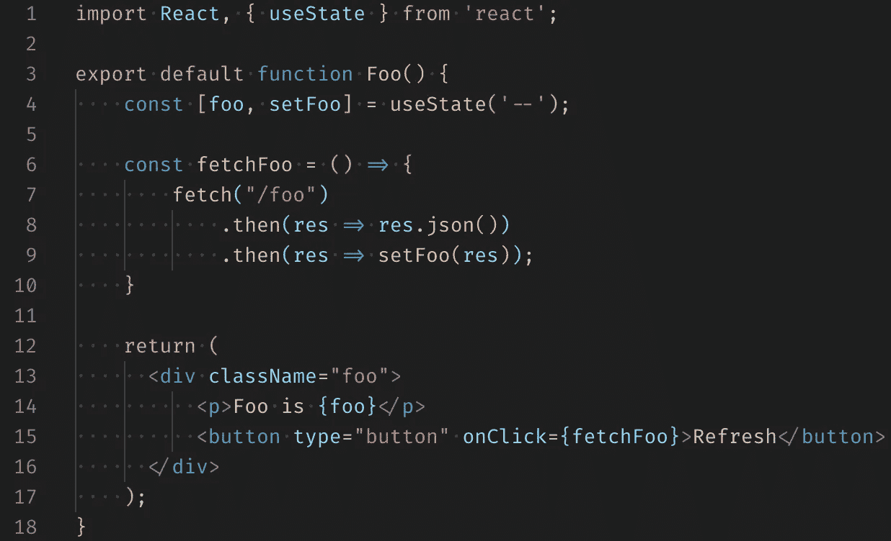
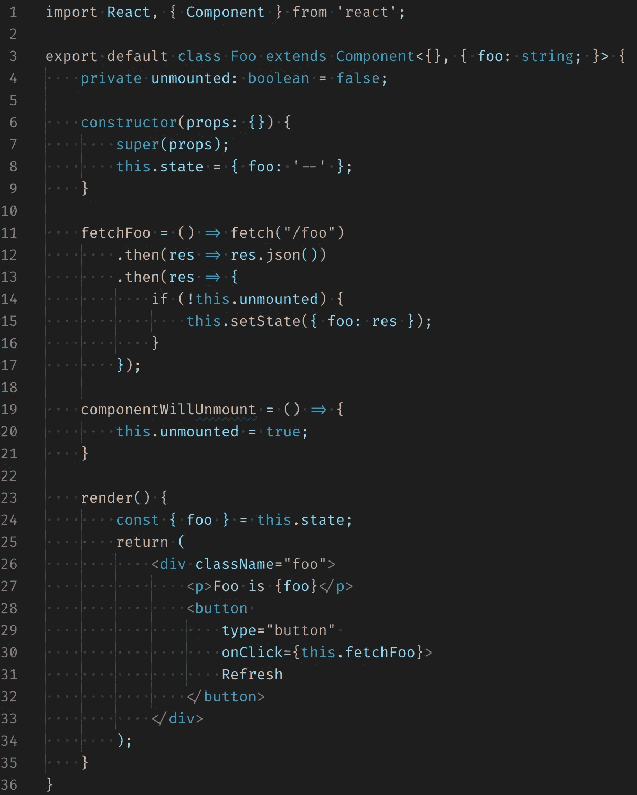
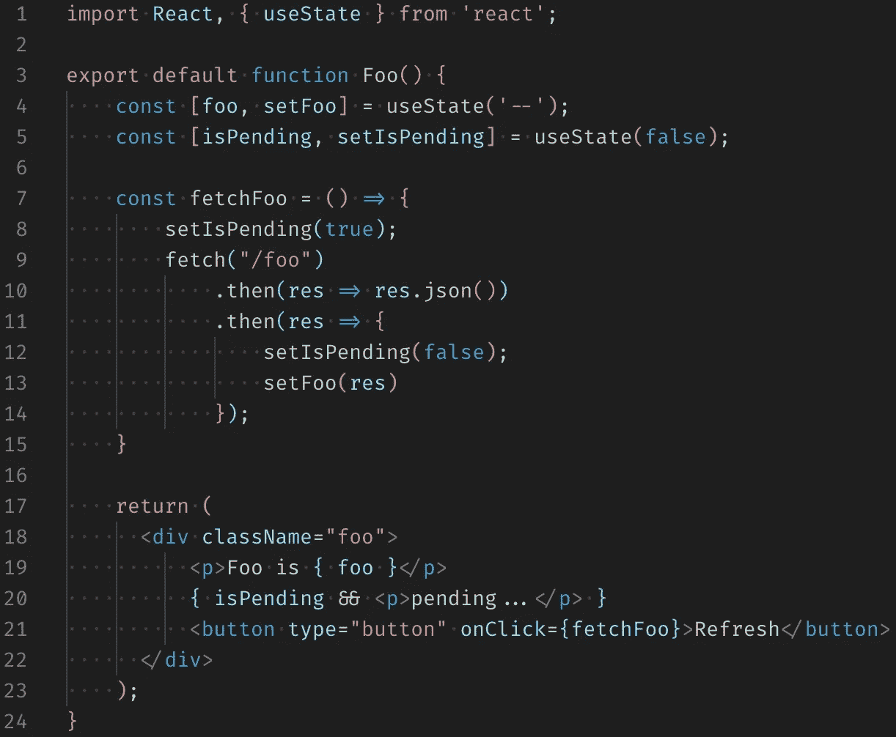
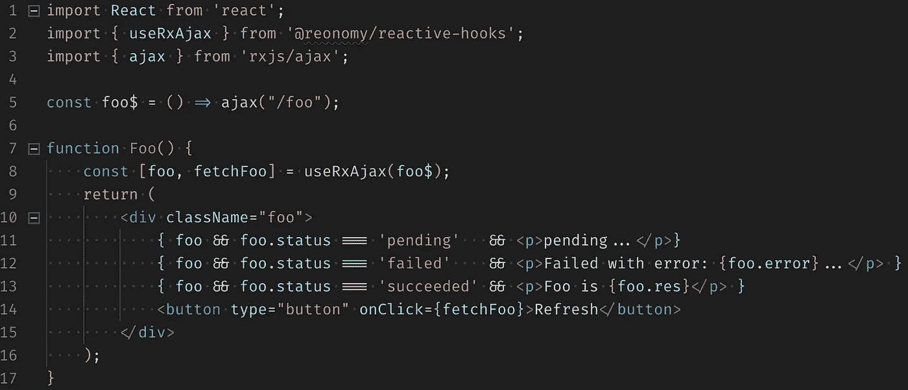
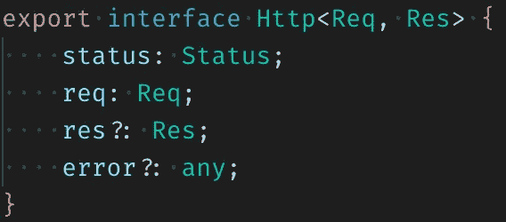
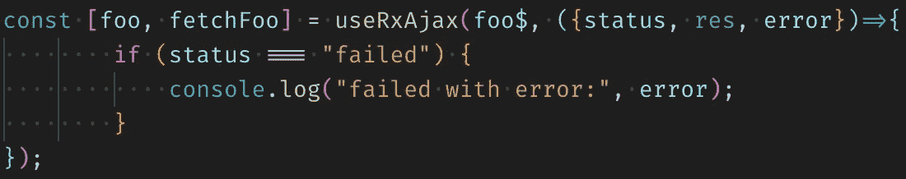

# 雾中的 Ajax 还是 React 中的 HTTP

> 原文：<https://itnext.io/ajax-in-the-fog-or-http-in-react-b04c716e97e5?source=collection_archive---------1----------------------->

迷雾中的刺猬(1975)

所有前端(FE)工程师面对 React 的第一个问题是如何调用 ajax 调用。React 是一个库，它不能建议任何特定的方式，因为它是为另一个目的设计的——渲染。React 将数据(道具、状态或上下文)转换成 HTML。

在[经济](http://reonomy.com)，我发明了[反应钩](https://www.reonomy.com/blog/post/reactive-hooks)。是一个库把 RxJS 带入了 React 生态系统。这个库提供了许多钩子，其中之一是 **useRxAjax** ，它为 React 中的 HTTP 提供了一个简单而优雅的解决方案。

在这篇博文中，我将展示一种用 ajax 获取数据的简单方法，解决缺点，然后展示如何用 **useRxAjax** 实现。

# 天真的方法

在支持 React 挂钩的 React 16 中，一个基本的解决方案是在渲染函数中调用 fetch(图 1)。

图一。React 渲染函数中 fetch 的基本实现。

但是这种实现不处理边缘情况，例如:

1.  组件在等待响应时被卸载。
2.  未决状态的指示。
3.  当响应不是 200 时，应显示一条错误消息。

如果我们试图解决这些问题，实现将变得不那么明显。

## 1.组件在等待响应时被卸载。

如果组件被卸载，所有获取请求应被取消，并且根本不应调用 **setFoo** 。但是标准的**获取**是不可取消的，所以我们需要更好的东西。

让我们试着解决这个问题的第二部分，当组件被卸载时忽略 **setFoo** 回调。唯一可用于此目的的标准挂钩是**使用效果**。

> …你可以把 useEffect 钩子想成 componentDidMount，componentDidUpdate，componentWillUnmount **组合**。

但是如果所有东西都结合在一起，我们怎么知道那是不是一个`componentWillUnmount`事件呢？答案是我们没有。没有办法用 React 钩子来处理它，所以我们必须切换回 React 组件类。

图二。使用“componentWillUnmount”处理程序对组件做出反应，该处理程序设置一个私有变量“unmounted ”,以防止对陈旧元素的 setState 调用。

因此，这一点可以通过将 React render 函数转换回 React Component 并使用更高级的 HTTP 库而不是标准 fetch 来解决。

## 2.未决状态的指示。

让我们忽略第(1)点，继续使用 React 钩子。为了显示挂起状态的指示器，我们需要再添加一个状态。

图 3。处理挂起状态。

还不错。只有几行额外的代码，但是现在由于分支和独立的状态，整个实现容易出错。很难预测几个并发请求会发生什么。考虑到 setIsPending 是异步的，我们可以在请求完成但 IsPending 仍然为真的状态下结束，反之亦然。

## 3.当响应不是 200 时，应显示一条错误消息。

让我们再创建一个状态，如果发生错误，它将保存一个错误对象；如果请求成功，它将保存一个空值。

图 4。用错误状态对象处理错误。

能不能做的简单一点，没有 bug？认识一下 useRxAjax！

# **useRxAjax**

调用数据 api 调用(获取请求)并返回一个带有响应对象和请求调度程序的元组。

图 5。基于 useRxAjax 的实现。

响应对象 foo 将实现一个 Http 接口(图 6 ),并保存关于当前状态、请求体、响应和错误的信息。

图 6。Http 接口。

如果组件被卸载，此请求将被自动取消。

## 如果我需要对反应产生另一个副作用呢？

**useRxAjax** 接收一个可选的回调，该回调将在每次请求开始、成功或失败时执行。

图 7。可选回拨。

完整的 API 参考在[反应式吊钩搭便车指南](/hitchhikers-guide-to-reactive-hooks-92c1a708ccfe)中有描述。

**GitHub:**[http://github.com/reonomy/reactive-hooks](http://github.com/reonomy/reactive-hooks)

获取数据是 FE 开发中最常见的操作，这就是为什么它应该很容易。当试图处理边缘情况和竞争条件时，任何简单的实现都会变得复杂。但这正是 RxJS 的设计目的，所以我们为什么不用它呢！Reactive Hooks 库提供了 RxJS 和 React 之间的无缝集成。它提供了 **useRxAjax** 钩子来帮助调用 HTTP 请求。这个钩子将解决陈旧元素的问题，以及保持代码简洁的竞争条件。