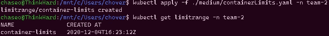
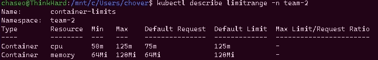
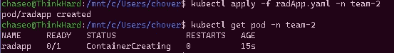
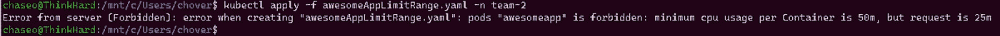

# AKS 性能:极限范围

> 原文：<https://itnext.io/aks-performance-limit-ranges-8e18cbebe351?source=collection_archive---------1----------------------->

*   [极限范围](#31c7)
*   [防止产生大豆荚](#44c3)
*   [防止产生小豆荚](#d92d)
*   [创建极限范围](#a61d)
*   [应用极限范围](#4247)
*   [验证范围](#cc05)
*   [展开吊舱](#f844)
*   [总结](#946c)

> 多少对多少

在我的上一篇文章中，我讨论了[资源配额](/aks-performance-resource-quotas-2934ce468be7),并给出了一个例子，说明有人可能会考虑如何以及为什么在他们的集群上使用它们。在上一篇文章中，您可能会想“您可以限制名称空间资源，这很好，但是如果有人创建了一个 pod 来一次性使用所有资源，会发生什么呢？”。这就是极限范围发挥作用的地方。

# 极限范围

[K8s 中的限制范围](https://kubernetes.io/docs/concepts/policy/limit-range/)在概念上类似于资源配额，因为它们是对象，并且专门用于控制名称空间中的资源。限制范围对象的目的是让您能够控制其他资源(如 pod、容器和存储请求)如何消耗资源，尽管我在这些文章中没有讨论这一点。


本质上，这是一个可以与资源配额一起使用的工具，以进一步控制命名空间上的资源消耗，或者如果您对使用资源配额不感兴趣，也可以单独使用。对许多人来说，最大的吸引力可能是防止 pod 请求大量资源的能力，这些资源会违反或消耗比你可能想要的多得多的资源**或**防止人们创建令人惊讶的小 pod，这些小 pod 最终可能会填满你的集群，这可能会被认为是绒毛 pod，并可能会使集群的 IP 地址匮乏。

在我上面提到的两个场景中，我们需要处理两个独特的问题:

1.  我们需要阻止人们创造资源饥渴的豆荚。
2.  我们需要防止人们制造小得可笑的豆荚，以及大量的豆荚。

先说第一个。

# 防止产生大豆荚

坦率地说，如果你有一个占用大量资源的 pod 的问题，那么限制范围是你应该考虑的，可能与资源配额结合起来。配额**迫使**舱/容器有明确的资源/限制，同时也防止个人、团队等使你的集群饱和。极限范围实际上可以用于应用极限，即使规范没有指定它们。如果有人来了并立即要求用一个 pod 提供所有资源，那么将一个命名空间限制为 2 个 vCores 有什么意义呢？

使用限制范围允许您控制 pod/container 可以请求的资源量以及在应用它们之前允许它们消耗的上限。这意味着你可以强迫用户尊重你的配额和你的资源。如果准入控制员发现他们的请求超出了范围的界限…那么他们得到 403，并被告知当他们想要尊重范围时再试一次。

# 防止微小豆荚的产生

一个圆荚体太大的对立面。允许创建极小的 pod 在某些情况下会导致节点过载，不是通过资源消耗，而是纯粹的对象创建。kubernetes 在任何给定时间在一个节点上允许的 pod 数量是有限制的(你可以在这里[阅读限制](https://docs.microsoft.com/en-us/azure/aks/configure-kubenet#overview-of-kubenet-networking-with-your-own-subnet))，虽然有一些方法可以在这里或那里做一些手脚，但一般来说，你不希望在一个节点上有 100 个 pod，不管你有多少可用的资源。

虽然限制范围并不完全允许您规定可以创建的 pod 的数量，但是它们可以用来防止人们创建小到可以用来填满一个集群的 pod。想象一下复制集，它有一个 pod 请求 1/10 的内核和 50 mb 的内存，然后扩展到 50mb。呸。

# 创建限制范围

创建一个限制范围是非常简单的。事实上，我们只需要做两件事。

1.  创建 yaml
2.  将 yaml 部署到一个名称空间。

让我们来看看一个基本的极限范围 yaml

```
**apiVersion: v1
kind: LimitRange
metadata:
  name: container-limits
spec:
  limits:
  - max:
      cpu: "125m"
      memory: "128Mi"
    min:
      cpu: "50m"
      memory: "64Mi"
    default:
      cpu: "125m"
      memory: "128Mi"
    defaultRequest:
      cpu: "75m"
      memory: "64Mi"
    type: Container**
```

好的，让我们稍微展开一下，这样我们就能了解发生了什么。让我们从`limits`开始，向下移动。

`max / min` =这是一个容器可以拥有的**最大**和**最小**请求。

`default` =这是**默认限制**，如果没有定义限制，将在容器上设置。

`defaultRequest` =这是**默认请求**，如果没有定义请求，将在容器上设置。

现在，您可能想知道为什么我在文章的这一部分一直键入 container 而不是 pod。朋友，这是因为你可以对不同的资源类型进行限制。您可以在容器级别设置这些限制，比如我在这里，在 Pod 级别，以及在持久卷声明级别。

我之所以选择容器，是因为我想确保在容器级别，而不是 pod 级别，均匀地分配我的资源。请记住，一个吊舱包含容器，如果我需要一个吊舱有几个容器，其中一个接近极限，而其他的没有，如果我在吊舱级别设置范围，我可能无法部署。我不是说你会遇到这种情况，只是在这一点上我更喜欢。没有对错，只是看你的需求。

在开始应用之前，我想让您知道我正在使用我在上一篇文章中用来部署资源配额的同一个集群，并且这次将使用 team-2 名称空间，而不是以前使用的 team-1。

# 应用极限范围

请记住，限制范围与资源配额非常相似，适用于命名空间，可以直接与资源配额一起使用。让我们将该范围应用于团队 2 进行测试。如果您还没有创建名称空间，我们需要创建名称空间。为此，您可以运行`kubectl create ns team-2`。让我们看看他们在跑`kubectl get ns -A`


坐在底部准备摇滚

应用运行`kubectl apply -f locationofyourfile -n team-2`的 yaml，然后让我们通过运行`kubectl get limitrange -n team-2`来验证它是否存在。



她吹喇叭没造成任何问题。

# 验证范围

现在我们已经应用了范围，让我们在开始尝试部署吊舱之前确保一切看起来都很好。运行`kubectl describe limitrange -n team-2`。



看起来不错

你可能会注意到，我没有在我的规范中定义一个`Ratio`。事实上，我自己并不倾向于玩这个选项，我还没有看到任何人试图用它来代替其他限制方法。也就是说，目的是使用一个计算值，该值是通过将`limit`除以`request`确定的，然后强制该值小于或等于该比率。如果不是，准入控制器将不允许吊舱。

代码和文档可以在这里[看到](https://github.com/kubernetes/community/blob/master/contributors/design-proposals/resource-management/admission_control_limit_range.md)如果还不清楚的话。

# 部署吊舱

> 部署没有限制设置的 Pod

让我们来看看我们实际定义默认请求。下面我们有一个 pod 规范，它是**而不是**定义任何请求或限制。让我们将它应用于团队 2，看看会发生什么。

`apiVersion: v1
kind: Pod
metadata:
name: radapp
labels:
app: sweetest
spec:
nodeSelector:
“beta.kubernetes.io/os”: linux
containers:
— name: sweetiemcsweetakinsrad
image: ubuntu
command: [‘sh’, ‘-c’, ‘while :; do echo 1; done’]`



…!

哇哦。即使我没有对这个规格设置任何要求/限制，它仍然是预定的！请记住，这是因为我设置限制范围的方式，如果没有设置，我专门将其配置为设置请求/限制。非常酷。我们去看看。下面我们可以通过描述 pod: `kubectl describe pod radapp -n team-2`来查看由限值范围设置的限值

> 如果我的`excitement`看起来很奇怪，我在那个名称空间中有一个资源配额，**强制在规范中设置**请求/限制，否则它不会调度。**这很酷的原因**是因为极限范围在击中准入控制器之前为我注入了它们。干净利落。


代表我们设定的限制！

让我们试着部署一个 pod，它有一个希望使用少于 5000 万 cpu 的容器。

`apiVersion: v1
kind: Pod
metadata:
name: awesomeapp
labels:
app: sweetest
spec:
nodeSelector:
“beta.kubernetes.io/os”: linux
containers:
— name: sweetiemcsweetakinsawesome
image: ubuntu
command: [‘sh’, ‘-c’, ‘while :; do echo 1; done’]
resources:
requests:
cpu: 25m`

我将运行`kubectl apply -f awesomeAppLimitRange.yaml -n team-2`,我得到消息说创建被禁止，因为最小 cpu 使用率是 50m，但我的请求是 25m！



来自服务器的错误(禁止):创建“awesomeAppLimitRange.yaml”时出错:pods“awesomeapp”被禁止:每个容器的最小 cpu 使用率为 50m，但请求为 25m

另一方面，如果我们提出过多的 pod 请求，我们会看到类似的消息，告诉我们离开，因为我们的请求高于我们的最大值。如果你想看这条信息，你应该去试试！请记住，您总是可以通过运行`kubectl delete limitrange -n yournamespace`来删除限制范围。

# 摘要

通过限制名称空间中的最小/最大请求/限制，限制范围可用于微调您的资源消耗。范围可以在命名空间上单独使用，也可以与资源配额结合使用，以实现额外的控制。

如果规范配置为自动应用请求/限制，则范围可以自动应用请求/限制，以帮助可能忘记将这些设置放入规范或不习惯这样做的用户。

如需更多信息，您可以在此处查看 Kubernetes 官方文档[，此外，在此处](https://kubernetes.io/docs/concepts/policy/limit-range/)查看准入控制详情[。](https://github.com/kubernetes/community/blob/master/contributors/design-proposals/resource-management/admission_control_limit_range.md)