# AKS 绩效:资源定额

> 原文：<https://itnext.io/aks-performance-resource-quotas-2934ce468be7?source=collection_archive---------0----------------------->

> 限制多团队集群的资源消耗

> 永远记住，根据你所拥有的资源来评估你的需求和要求，以确定你的最佳方法。

# 防止资源枯竭

> 当限制不够时

在我以前的文章中，我讨论了[资源请求和限制](https://d3athbymonkey.medium.com/aks-performance-resource-requests-and-limits-f76ac255fae1)，以帮助人们理解设置适当的 pod 规格以避免节点饱和的重要性。如果集群在多个团队或开发人员之间共享会怎样？如何防止一个人占用所有集群资源？

> 许多团队都有有限的资源和必须共享的特定资源需求

在这样的集群中，设置 pod spec 资源请求/限制并不足以确保所有的团队/开发人员都有可以使用的资源。因为商业并不真的是为了“以防万一”而花费大量金钱，所以我们需要明智地花钱。这通常意味着限制我们允许团队/开发人员消耗的特定资源的数量。幸运的是，Kubernetes 有一种方法来帮助划分资源消耗，以防止一个人/团队拿走所有东西。

# 资源配额

这个特定的工具旨在允许集群管理员对集群可用的资源进行有限的控制。资源配额基本上只是 K8s 中的一个对象，它允许您限制每个名称空间的资源消耗。例如，您可以将您的团队分成 K8 命名空间，然后为每个命名空间创建配额，以帮助防止过度饱和。

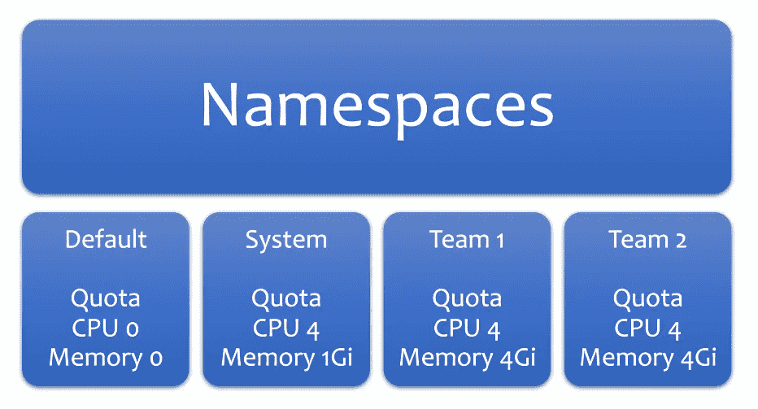

与 pod 的请求/限制不同，在这种情况下，4 基本上是 4000，即 4 个 vCores

请注意上面的图片，这是非常简单的，我们不允许在默认名称空间中部署任何资源，方法是将其限制设置为 0，但是我们可以要求我们的开发人员使用他们各自的名称空间。就像 pod spec 资源请求/限制一样，您也可以为名称空间设置它们。

现在，在我们继续创建配额之前，我想花点时间解释一下`pod resource requests/limits`和`namespace resource requests/limits`之间的区别。想法是一样的，执行和结果却不一样。

> 分离舱

Pod 请求/限制专门针对其中的 pod/容器。只要一个节点有资源提供所请求的 cpu/mem，pod 就可能被调度并启动。如果超出了限制，pod 要么被抑制(例如:cpu)，要么可能被关闭(内存不足)。

> 名称空间

另一方面，名称空间请求/限制是影响给定名称空间*中的每个 pod/容器的整体设置。想想**总计**。这意味着如果您没有正确设置您的 pod 请求/限制，您可能无法将您的 pod 部署到启用配额的名称空间**，而不管节点的可用资源**。如果配额被突破，就不允许部署，而不是限制。*

我应该提到，当您设置了名称空间配额以便部署到该名称空间时，您的 pod **必须**定义请求/限制，否则将不会安排部署该 pod。你会在下面看到更多关于这个的内容。

pod =每个 pod/集装箱请求/限制。

名称空间=所有 pod/container 请求/限制的总数。

# 创建配额

> 在创建这些之前，了解您的需求和要求

让我们继续一个简单的团队 1/团队 2 场景，并创建一些配额。在为命名空间创建配额之前，您实际上需要创建命名空间。我会跑`kubectl create namespace team-1`和`kubectl create namespace team-2`

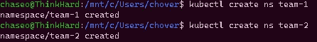

创建我们的新名称空间

为了仔细检查，我将继续运行`kubectl get ns`,并在底部看到我的新名称空间。

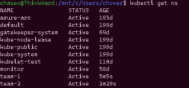

易！！

现在我需要做的是定义资源配额。让我们创建一个要使用的清单。我的集群没有你的那么强大，所以我的约束会很紧。

> API version:v1
> kind:resource quota
> metadata:
> name:compute-resources
> spec:
> hard:
> requests . CPU:500m
> requests . memory:256 mi
> limits . CPU:" 1 "
> limits . memory:512 mi

好吧，让我们继续使用`kubectl apply -f locationofyourfile --namespace=team-1`应用它，并为团队 2 重复。您将收到计算资源已创建的消息，我们应该仔细检查以确保万无一失！我们可以去`kubectl get quota -A`看看我们所有的配额。

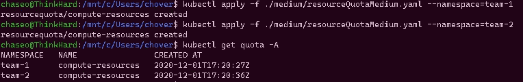

创造没有问题，显示没有问题。

很好，我们看到目前为止一切都很好。让我们运行`kubectl describe quota -A`来看看我们的输出。

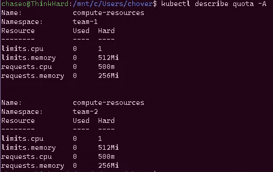

看起来不错！

在我们继续测试之前，我想以不同的方式重申我上面所说的，因为它非常重要。关于名称空间配额，我看到人们混淆了规范，认为我们在划分资源并保留它们以供使用，这阻止了其他人使用它们。这是不正确的。我们来看两个观点来锤这个家。

> 这里我只有两个重要的节点，agentpool 和 pool2，您可以放心地忽略其他任何节点。

1.  查看我们的`kubectl top nodes`输出。

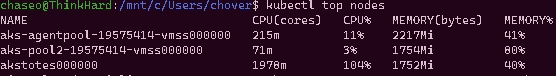

别理托特，他是 windows 机器，我对他不好。

注意到我们在这里的实际消耗了吗？我应该告诉你，我现在在这些节点上有可怜的工作负载，除了 akstotes，出于性能测试的原因，我故意把他们扔到地板上。这是一个 Windows 盒子，我们将在另一篇文章中讨论 Windows。无论如何，这两个核心盒的消耗量很低。

2.通过使用`kubectl describe nodes`查看节点资源信息，我将使用一种简单的方法来查看它。

> nodes = $(ku bectl get node-no-headers-o custom-columns = NAME:. metadata . NAME)
> 
> 对于$nodes 中的节点；do
> echo " Node:$ Node "
> kubectl describe Node " $ Node " | grep " Allocated "-a7
> echo
> done

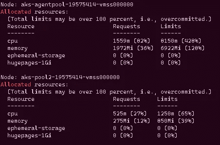

这些机器是双核 4Gb

这可能不是最好的例子，因为我已经在这个集群上做了一些事情来说明这一点**但是**这个配额没有在节点上划分出任何资源。它的设计初衷不是这样。

这样做的目的是要求所有的箱不考虑集装箱数量(例如:如果你在一个箱中有 2 个集装箱)不超过请求限制。如果我们换个角度来看:

*   request.cpu = namespace **所有容器的请求总数**
*   requests.memory = namespace **所有容器的请求总数**
*   limits.cpu =名称空间的 cpu 请求的总限制
*   limits.memory =名称空间的总内存限制

因此，控制资源的方法是通过理解您的**上限**并确保名称空间不违反您的节点能够做的事情。如果您有 2 个 4 核节点，您不希望任何组合的名称空间消耗超过这个数量。当然，有人可能会说，无论如何，你都不会想要设置节点最大资源限制*，以确保峰值使用不会使节点过饱和并导致争用。*

*你能想象在最大消费时只给自己一点点回旋的余地，并且需要做一些管理上的事情，然后楔入盒子吗？哈…我以前从来没有做过… <_> _>…..:-D*

# *配额验证*

*好了，现在我们已经部署了配额，我们应该实际测试一下，确保我们了解如何与数据交互和解释数据。让我们从尝试使用`kubectl apply -f sweetApp.yaml --namespace=team01`将我的一个应用程序部署到 team-1 名称空间开始*

*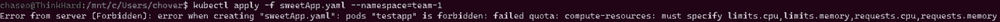*

*禁止！*

*哦该死！K8s 基本上是告诉我去磅沙，因为我没有达到这个吊舱的配额要求，所以它不会部署。正如我上面提到的，虽然我只是简单地意识到，为了成功，pod 必须遵守配额的标准！因此，从上面我们知道，我们已经指定了请求和限制。如果我们尝试应用它，我们认为会发生什么？*

*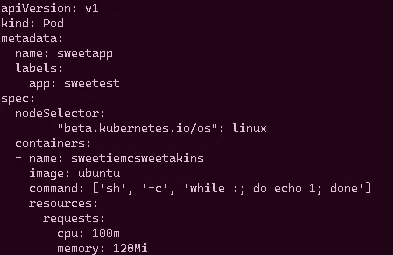*

*请求集…无限制*

*如果你猜我们会得到另一个 403，并被告知走开，你会是正确的。然而现在我们被告知我们失败的是`limits`,所以我们必须设置它们。*

*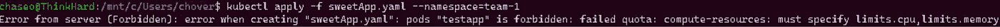*

*不再有要求投诉…现在它的极限！*

*好吧，那么让我们继续设置我们的限制，然后重新申请。*

*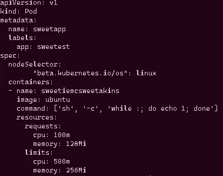*

*准备好。*

*让我们通过运行`kubectl describe quota compute-resources -n=team-1`来看看配额数据*

*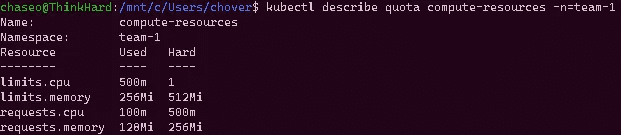*

*曾经什么都没有…*

*请注意，顶部配额图片中的`Used`列与下面的 pod 清单中的`requests and limits`相匹配。我们几乎已经达到配额的 CPU 硬限制。*

**

*比赛*

*所以理论上这意味着我们可以申请，但是**多一个**吊舱，有这些要求/限制，然后我们将返回 403 着陆…让我们试试吧。让我们部署基本相同的东西，但这一次它将是一个可怕的应用程序，而不是一个甜蜜的；).然后再检查一次配额。*

*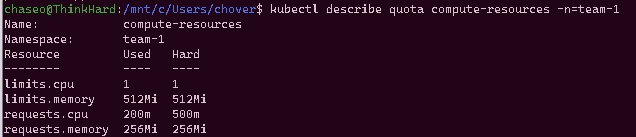*

*达到极限！*

*现在我们不能在这个名称空间中部署任何其他东西，因为我们已经达到了极限。如果我们想部署名为 radApp 的第三个应用程序，我们将无法部署，因为我们已经达到了极限，因此我们会收到 403 和超出配额的消息。让我们再看一次一些统计数据:*

**

*team-2 命名空间仍然可用！*

*我不打算在这里和第二组做任何事情，我只是想要视觉效果。:)*

# *摘要*

*正如您所看到的，资源配额可以用来锁定不同名称空间中的资源消耗。资源配额将命名空间视为一个整体，并限制其使用量。*

*在下一篇文章中，我将讨论[限制范围](https://kubernetes.io/docs/concepts/policy/limit-range/)，与请求配额不同，它将允许您针对单个容器设置资源约束。这将有助于防止用户制造可能会立即消耗您的新配额的超级大容器。更多的控制总是一件好事，对吗？….对吗？；)*

*如果您觉得这很有帮助，有任何问题、建议或想法，请随时联系我们。*