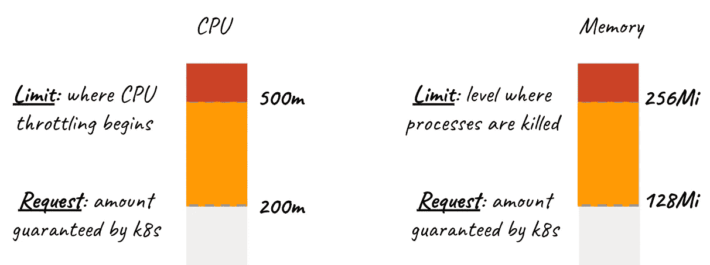

# AKS 性能:资源请求和限制

> 原文：<https://itnext.io/aks-performance-resource-requests-and-limits-f76ac255fae1?source=collection_archive---------2----------------------->

> 我需要多少，我能用多少



图片来自[http://blog.kubecost.com/](http://blog.kubecost.com/)

Kubernetes 可以为您做的最重要的事情之一是帮助确保工作负载在能够处理其资源需求的节点上运行。设置适当的请求和限制有助于防止节点饱和，这将不可避免地导致性能下降。

# 资源请求

> K8s 将向托管在节点上的 pod 保证的资源量的定义

`Resource Requests`定义 K8s 将保证给 pod 的资源量。在某种程度上，您可以将该定义视为成功创建 pod 的最低要求。让我们看一个 yaml 中的例子:

```
apiVersion: v1
kind: Pod
metadata:
  name: SuperAppOfAwesome
spec:
  containers:
  - name: appofawesome
    image: ubuntu
    **resources:
      requests:
        memory: "256Mi"
        cpu: "1000m"**
      limits:
        memory: "512Mi"
        cpu: "1500m"
```

> 这里的 CPU 单元是使用 millicpu 设置的，因此 1000m 个 vCPU/内核。500 万是半个核心，250 万是四分之一，以此类推

我们可以看到，在容器的规范下，我们已经设置了 resources 标记并定义了我们的限制，要求最少 256MB 内存和 1 个 CPU 内核。当部署时，这将确保调度器在考虑到那些资源请求需求的情况下找到能够托管 pod 的家。如果 K8s 找不到合适的宿主会怎样？该 pod 不会被安排在任何位置，并将显示为“待定”状态。

不同的应用程序会有不同的需求，那么我们如何确定我们的应用程序需要什么才能成功运行呢？这里的简短回答基本上是使用历史使用模式来帮助定义需求。这实质上意味着运行 pod 并记录其资源消耗，无论是手动还是使用 Prometheus 或 datadog 等监控工具。使用历史数据进行模式分析的原因是试图找到使用百分比，并相应地分配请求。

例如，如果我们的应用平均使用 1.5 个内核和 128MB 内存，但每天有一次 15 分钟的峰值达到 2 个内核和 256MB 内存，我们可以很好地理解我们需要 1.5 个内核和 128MB 内存才能成功。

在以后的文章中，我将一步一步地展示我们如何手动确定应该为一个工作负载设置什么样的请求，我会立即进行设计……因为在转向更自动化的解决方案之前，我可以看到手动完成，并且这可能是有用的。在同一篇文章中，我可能还会展示如何用 Prometheus 和/或 datadog 来做这件事。

在我们继续讨论极限之前，我想再提几件事。通过以这种方式定义资源，您用`Guaranteed` K8s QoS 类设置了 pod。这一点很重要，因为无论出于何种原因，系统需要获取一个 pod 来重新获得关键功能的资源，这个特定的 QoS 类别都被认为是最重要的，不会在不太重要的 pod 之前被取消。你可以在这里阅读更多关于 QoS 等级[的信息，但基本上如果你不设置任何资源或限制，你的 QoS 就是尽力而为，如果需要的话，K8s 会先干掉那个 pod 及其容器。](https://github.com/kubernetes/community/blob/master/contributors/design-proposals/node/resource-qos.md)

> 我应该在这里指出，您可以为 pod 中的每个容器设置不同的资源请求，这实际上会导致您的 QoS 等级发生变化，所以请务必查看[文档](https://github.com/kubernetes/community/blob/master/contributors/design-proposals/node/resource-qos.md)，以确保您设置的是您所期望的。

# 限制

> 不要超过这个限度…否则！

我相信你可以根据它的名字猜出这是什么。这将允许您对 pod 设置限制，并防止它们使用过多的 CPU/内存。有些人会说，这是您需要在几乎每个 pod 上设置的最重要的东西，至少您希望让您的 pod 占用一个节点可用的所有资源。

是的，你没看错。如果不设置限制，pod 可能会消耗节点的所有可用 CPU 和内存，并阻止部署其他 pod。设置限制允许您微调和控制您的 pod 能够消耗的上限… <_> _> …让我们看看之前的清单:

```
apiVersion: v1
kind: Pod
metadata:
  name: SuperAppOfAwesome
spec:
  containers:
  - name: appofawesome
    image: ubuntu
  resources:
      requests:
        memory: "256Mi"
        cpu: "1000m"
      **limits:
        memory: "512Mi"
        cpu: "1500m"**
```

您可以在这里看到，我将内存限制设置为 512 兆，将 CPU 限制设置为 1500 兆，这也是 CPU 的 1.5 兆核心。这将防止圆荚体消耗超过我们定义的量。但是这是怎么做到的，如果吊舱试图超过它的极限会发生什么呢？在 AKS 中，我们的容器编排器正在使用 cgroups，这些限制将由内核监控和执行。但是，违反 CPU 和内存限制的处理方式非常不同。

CPU 限制是通过使用[完全公平调度器](https://www.kernel.org/doc/Documentation/scheduler/sched-design-CFS.txt)来控制的。对于大多数 Linux 容器编排来说，AK 包括在内，因为它们使用 docker。基本上，CFS cgroup 使用`quota`和`period`设置来控制 CPU 带宽。当配额在一个周期内用完时，它会受到限制，并在下一个周期恢复。这很有趣，请点击上面的链接了解更多信息。这意味着你的性能可能会受到很大的影响，所以如果你重视性能，你应该避免这种情况。CPU 上的节流通常是不正确的限制，但不排除一些失控的进程—总是检查以确保:)

另一方面，内存并没有这么大。K8 和内核不会简单地限制 pod 请求和消耗内存的能力。它会杀了它。除此之外还有更多，但现在知道这些并不十分重要。请理解，试图请求超过其限制的 pod 可能会被终止/终止。

# 摘要

希望这有助于您理解使用适当的资源请求和限制来设置 pod 以确保适当的性能和稳定性的重要性。使用`requests`保证最少数量的资源给吊舱。使用`limits`有助于防止 pod 消耗过多的节点资源。

在以后的文章中，我将告诉你如何找到你的请求和限制可以/应该设置在什么位置，以及如何识别和处理违反限制的 pod。

尽管如此，下一篇文章——我将在发布后添加 who 的链接——将讨论[资源配额的](https://kubernetes.io/docs/concepts/policy/resource-quotas/),以及它们对于帮助控制和限制多个团队使用的集群的资源使用的重要性。