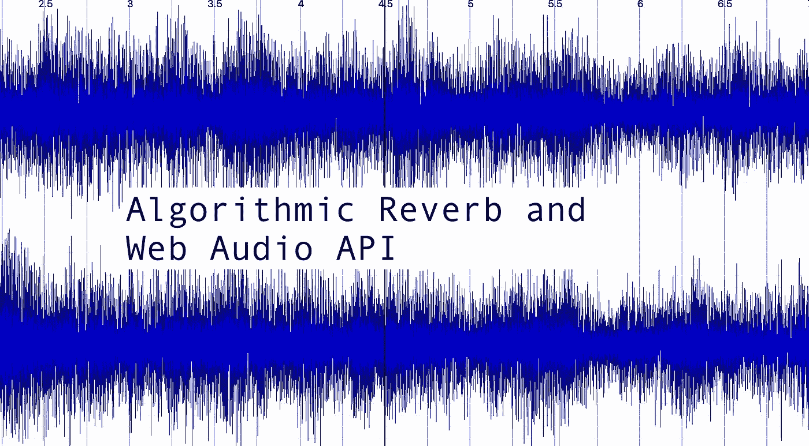
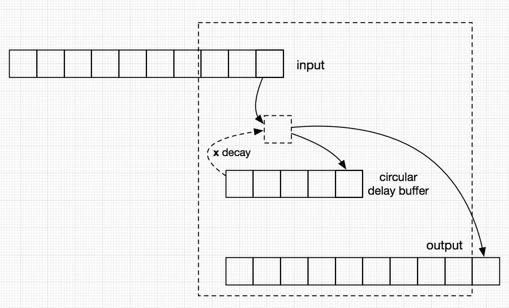
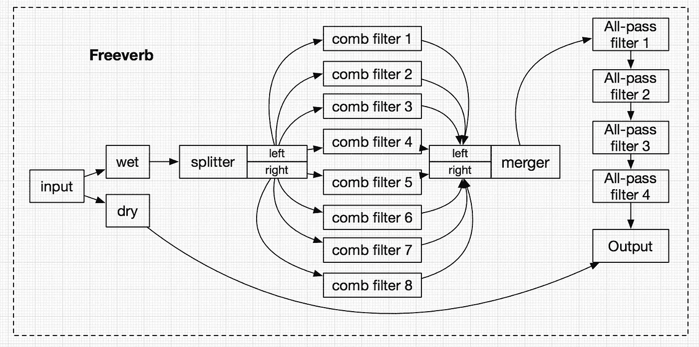
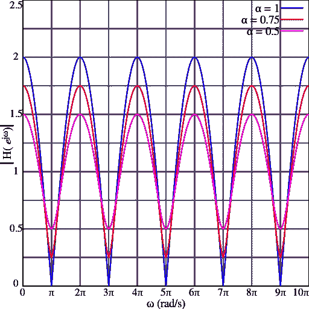

# 算法混响和网络音频 API

> 原文：<https://itnext.io/algorithmic-reverb-and-web-audio-api-e1ccec94621a?source=collection_archive---------2----------------------->

**“混响和网络音频 API”系列第二部分**

**这篇文章是[第一部分卷积混响和网络音频 API](https://medium.com/@a.miselaytes/convolution-reverb-and-web-audio-api-8ee65108f4ae) 的延续。如果你还没有读过，你也许应该从第一部分开始。在这一部分中，我们将看看如何使用 Audio Worklet 实现一个*单延迟线*并使用现有的 web 音频节点构建 *Freeverb* 。**

****

****一条单独的延迟线****

**创建数字算法混响有很多不同的方法。让我们从一个非常简单的开始，它基于[延迟线](https://en.wikipedia.org/wiki/Digital_delay_line)的想法。想象一下，如果你的朋友杰克刚刚用棍子打了一个小军鼓，声波将从振动的鼓传播到你的耳朵，但它也会传播到天花板，从那里反射并稍微延迟一会儿到达你的耳朵(因为它需要传播更长的距离)。由于部分波被空气吸收了，它也可能声音小一点。在编程中实现这种延迟的声音称为延迟线。在现实世界中，任何房间都会有很多延迟线，因为声音会从所有的墙壁、天花板反射，也许还会从你的狗尾巴反射。**

**创建单个延迟线非常简单。人们只需获取输入声音(例如麦克风)的[样本](https://en.wikipedia.org/wiki/Sampling_(signal_processing))，除了将它们直接输出到输出端(扬声器)之外，还可以将它们存储在一个数组中，因此稍后可以检索这些样本，并将其添加到模拟回声的输出中。**

**下图显示了一个叫做[循环缓冲区](https://en.wikipedia.org/wiki/Circular_buffer)的过程，它基本上是一个固定长度的数组，有一个写指针和一个读指针。每当读指针到达数组的末尾时，它又开始从头开始读。每当写指针到达数组的末尾时，它又开始写数组的开头。我们可以只使用一个动态大小的数组，但这意味着它的长度会无限增长，而我们只使用它的一小部分(尾部)。**

****

**单延迟线**

**为了实现 1 秒的延迟线(44100 个样本，如果我们的采样率是每秒 44100 个样本),我们:**

1.  **从输入信号中取样**
2.  **从我们的循环缓冲区中取一个样本，这个样本是一秒钟前(或者 44100 个样本)写在那里的**
3.  **将这两者相加(将缓冲器中的样本乘以某个小于 1 的衰减系数)**
4.  **将结果写入输出信号**
5.  **将结果写入延迟缓冲区(这样我们可以再次读取它，并在以后的第 2 点中使用它)**

**现在 JavaScript 实现:**

****肖邦&音频小作品****

**好了，现在我们有了延迟线，但是我们如何在网络音频 API 中使用它呢？答案是 Audio Worklet。要了解更多，你可以去[这里](https://developers.google.com/web/updates/2017/12/audio-worklet)和[这里](https://googlechromelabs.github.io/web-audio-samples/audio-worklet/)。简而言之，它允许你编写定制的音频处理代码，这些代码将在浏览器中的一个单独的音频线程中运行，因此具有最小的延迟。**

**在我们的例子中，我们将首先播放一段没有混响的钢琴录音，然后使用我们漂亮的单延迟线混响。所以我再次强烈建议阅读上面的参考资料，但是基本上 worklet 有两个部分:**

*   **音频线程中的实际声音处理器代码(将包括我们的延迟线代码)**
*   **在主线程中注册并调用这段代码**

**原创**

**使用单个延迟线(基本上是回声)**

**[GitHub](https://github.com/miselaytes-anton/web-audio-experiments/tree/master/packages/audio-worklet-delay-app)**

****如何改进算法****

**我们的单线混响很棒，但听起来不是很有趣。我们可以做的一个明显的改进是增加更多的延迟线。我们还需要确保这些延迟线不会相互干扰(想想延迟时间的质数)。这样我们就不会听到不同线路的回声同时出现，听起来更像是真实生活的混响。我们还可以添加所谓的*早期回声，*从附近表面反射的尖锐声音。**

**这种方法的缺点是，要获得真正真实的混响，我们需要太多的延迟线。同样的效果可以通过全通滤波器和梳状滤波器的组合来实现，这一点我们将在下一节中讨论。**

****Freeverb(只是一堆滤镜)****

**Freeverb 是一种基于[全通](https://en.wikipedia.org/wiki/All-pass_filter)和[反馈低通梳状滤波器](https://en.wikipedia.org/wiki/Comb_filter#Feedback_form)组合的算法混响。它由德国物理学家曼弗雷德·施罗德设计。**

**Freeverb 的所有元素都可以使用现有的 web 音频节点来实现。*湿*和*干*分别对应修改和未修改的音频信号，可以使用[增益](https://developer.mozilla.org/en-US/docs/Web/API/GainNode)节点实现。由于我们处理左右声道的方式不同，我们需要一个[分路器](https://developer.mozilla.org/en-US/docs/Web/API/ChannelSplitterNode)和一个[合并器](https://developer.mozilla.org/en-US/docs/Web/API/ChannelMergerNode)。剩下的是最重要也是最有趣的部分——*梳状滤波器*和*全通滤波器*。**

****

**自由动词**

****梳状滤波器****

**web audio 中没有梳状滤波器节点，但我们可以使用其他音频节点轻松制作一个。然而，让我们首先试着理解它是什么，为什么我们需要它。**

**梳状滤波器输出原始输入信号及其延迟版本的总和，从而模拟回声效果(很像我们的延迟线)。将信号添加到延迟的 self 会导致信号幅度在某些地方增加(波的拾取匹配)而在其他地方减少(拾取相互抵消)，从而使其看起来像梳子:**

****

**[图像来源](https://en.wikipedia.org/wiki/Comb_filter#/media/File:Comb_filter_response_ff_pos.svg)**

**我们将使用其中的 8 个(每个立体声通道 4 个)，每个滤波器模拟一条延迟线，或者换句话说，产生我们输入声音的回声或混响。每个滤波器的延迟时间都是由 Shroeder 先生精心选择的，所以听起来特别悦耳。为了在网络音频中构建它，我们将使用几个基本节点:增益、延迟和低通滤波器。**

**我们获取输入信号，并通过增益将其原封不动地传递到输出端。然后，我们还让输入通过延迟来模拟回声，并通过低通来模拟空气对声音的吸收。混响时间在较高频率下会减少，因为空气会更好地吸收这些频率。然后，我们还需要通过低于 1 的增益传递信号，以防止音量随时间上升。**

**它可以用 JavaScript 实现，如下所示:**

**然而，问题是这个过滤器是静态的，这意味着我们不能轻易地调整参数，例如延迟时间，所以我们需要公开它们。理想情况下，我们会这样做，即我们的梳状滤波器的接口完全遵循[音频节点](https://developer.mozilla.org/en-US/docs/Web/API/AudioNode)的 API。不幸的是，这不是一个简单的任务，到目前为止，最好使用这种[式的肮脏方法](https://github.com/GoogleChromeLabs/web-audio-samples/wiki/CompositeAudioNode)来完成。使用这个复合节点类，我们可以显示共振、阻尼和延迟时间参数:**

****全通滤波器****

**我们需要一个全通滤波器，以使我们的 8 个梳状滤波器延迟线听起来更沉闷，或者更模糊，如果你喜欢，模拟波的消散和空气的吸收。这个全通是个多么奇怪的家伙。与低通、高通或带通不同，它实际上不会阻挡任何频率。取而代之的是，它根据频率随时间不同地改变信号的相位。因此，如果您的信号由多个频率组成(这几乎肯定会发生)，每个频率都会发生偏移，因此信号会变得*更长*和*更模糊*，或者换句话说，信号会在*中扩展*和*扩散*。如果在这一点上，它仍然听起来模糊不清，尝试阅读[这个](https://ccrma.stanford.edu/~jos/pasp/Schroeder_Allpass_Sections.html)。**

**幸运的是，全通滤波器是标准音频节点的一部分，所以我们不必自己构建它。**

****将所有这些放在一起****

**现在，当我们拥有所有元素并理解它们的含义时，剩下的唯一事情就是正确连接所有节点，并确保我们为最终用户提供过滤器的参数以进行调整。这里唯一棘手的部分是我们想同时改变所有梳状滤波器的谐振和衰减，我们可以用 [merge params utility](https://gist.github.com/miselaytes-anton/7d795d6efcc7774b136c2b73dc38ed32) 存档。**

**最终结果如下所示:**

**[Demo](https://amiselaytes.com/freeverb/)Github**

****代替结论****

**我希望这篇文章已经展示了网络音频确实给了你实现混响算法的所有工具，从非常简单到非常复杂。如果你想了解更多关于混响或音频编程的知识，这里有一些资源:**

**- [Teropa great Web Audio 教程系列](http://teropa.info/blog/2016/08/19/what-is-the-web-audio-api.html)
-[Audio Worklet](https://developers.google.com/web/updates/2017/12/audio-worklet)
-[关于声音相关数学的文章写得很好，插图也很好](https://physics.info/music/)
-[PD 中的音频编程](http://www.pd-tutorial.com/english/)
- [一本很棒的 DSP 书籍](http://www.dspguide.com/pdfbook.htm)**