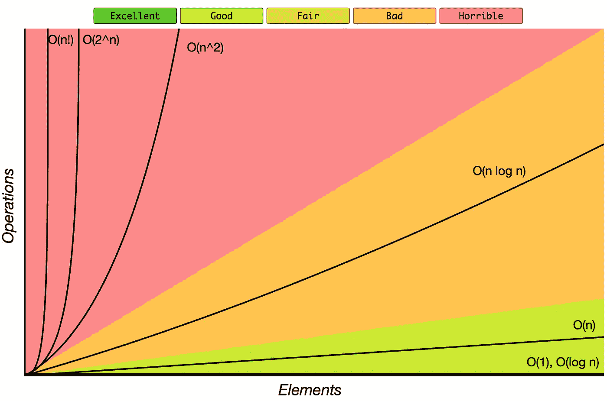

# JavaScript 中的算法和数据结构

> 原文：<https://itnext.io/algorithms-and-data-structures-in-javascript-a71548f902cb?source=collection_archive---------1----------------------->

读者你好！我最近在 GitHub 上发布了 [**JavaScript 算法和数据结构**](https://github.com/trekhleb/javascript-algorithms) 知识库，其中收集了在 ES6 JavaScript 中实现的经典算法和数据结构，并附有解释和进一步阅读材料和 YouTube 视频的链接。还有 [**算法和数据结构**](https://www.youtube.com/playlist?list=PLLXdhg_r2hKA7DPDsunoDZ-Z769jWn4R8) YouTube 播放列表，其中包含该存储库中提到的所有视频，因此您可以去参加这个手工制作的在线学习课程:)

所以我猜你已经掌握了这个项目的主要思想— **帮助开发者学习和练习算法，并用 JavaScript** 来完成。

为了让这个过程更加顺畅，我试着为每个算法和数据结构添加了一些图形说明**,这样可以让算法背后的思想更容易理解和记忆。**

您还可以在 root README 文件中找到一些实用信息，这些信息在您学习时可能会很方便。以下信息:

*   **大 O 符号图** —快速查看 O(n！)或者说，O(n)
*   **一些最常用的大 O 符号列表及其性能比较**——了解 10 有多大！(是 3628800)
*   **数据结构操作复杂性** —不同数据结构的搜索、读取或插入速度有多快
*   **排序算法复杂度对照表** —帮助您根据自己的情况选择合适的排序算法

来源:[http://bigocheatsheet.com/](http://bigocheatsheet.com/)

所有代码都 100%被测试覆盖。这样做不仅是为了保持代码正确工作，也是为了给你一个每个算法或数据结构如何工作的例子，它们有什么基本操作(比如说堆的轮询)和什么是边界情况(如果图是有向的，该做什么)。

储存库还有一个**游乐场**。这只是一个小函数模板和空测试用例，将帮助您在克隆回购后立即开始测试或处理算法。

目前涵盖了以下数据结构:

*   链表
*   长队
*   堆
*   哈希表
*   许多
*   优先队列
*   特里
*   树(二叉查找树，AVL 树)
*   图形(有向和无向)
*   不相交集

在这些数据结构之上，有超过 50 种流行算法被实现。其中包括排序、搜索算法、图形/树/集合/字符串/数学相关算法。所有算法也按其范例分类:

*   **强力算法**——查看所有的可能性并选择最佳解决方案
*   **贪婪算法**——选择当前时间的最佳选项，不考虑未来
*   **分治算法**——将问题分成更小的部分，然后解决这些部分
*   **动态编程算法** —使用先前找到的子解决方案构建解决方案
*   **回溯算法**——类似于蛮力试图生成所有可能的解，但每次生成一个解时都要测试它是否满足所有条件，然后才继续生成后续的解。否则就走回头路，走上另一条寻找解决方案的道路

[**JavaScript 算法和数据结构**](https://github.com/trekhleb/javascript-algorithms) 存储库仍在积极开发中，更多的算法和数据结构即将推出。您也可以通过贡献您的代码和 web 已知算法的实现成为其中的一部分！

希望这个资源库对你有帮助！享受编码！

**仓库状态更新！**

哇！说我很惊讶等于什么都没说！真不敢相信！ [JavaScript 算法](https://github.com/trekhleb/javascript-algorithms)库是 GitHub 上**本周最热门库(截至 5 月 25 日)和本月****最热门库(截至 6 月 15 日)，峰值为每天 5 **000** 颗星！！！我很高兴你发现它很有用！**

每月统计数据:

 [## Oleksii Trekhleb (@Trekhleb) |推特

### Oleksii Trekhleb 的最新推文(@Trekhleb)。@EPAMSYSTEMS 的首席软件工程师。正在创建全堆栈…

twitter.com](https://twitter.com/Trekhleb)