# 有效解决动态连通性的算法

> 原文：<https://itnext.io/algorithms-to-efficiently-solve-dynamic-connectivity-9ad1d6c9c3c9?source=collection_archive---------4----------------------->


在[计算](https://en.wikipedia.org/wiki/Computing)和[图论](https://en.wikipedia.org/wiki/Graph_theory)中，**动态连接**结构是一种维护图的连接组件信息的结构。

它允许一个更大的*超集中的项目属于一个公共的 ***子集*** ，并有效地回答了问题*‘A 到 B 之间有连接路径吗？’**

*动态连接问题适用于许多真实世界的应用。社交网络中的朋友、数码照片中的像素、网络中的计算机、互联网上的网页、计算机芯片上的晶体管或变量名等价物(不同的变量指向同一个对象)都是动态连接的例子。*

*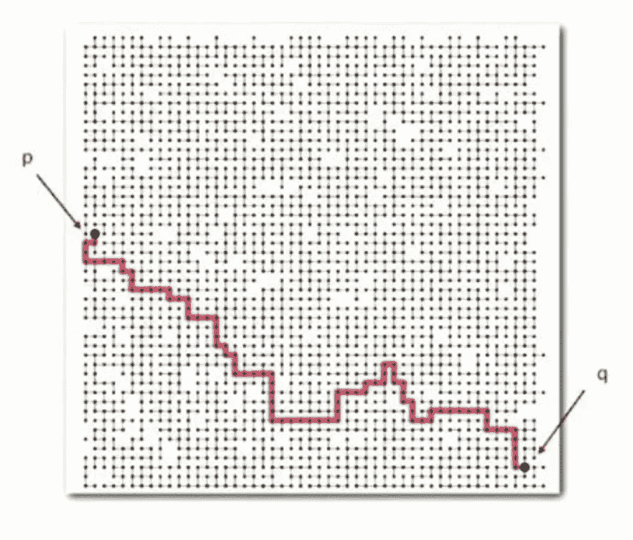*

*动态连接允许我们有效地回答问题***‘是否有一条路径连接 p 和 q？’在这种情况下，答案是肯定的。****

*动态连接引入了以下**抽象**:*

*   *一组对象。*
*   *一个`union`方法，允许你通过 用并集 ***替换包含两个项目的集合来 ***连接两个对象。*******
*   *一个`find`方法，允许您通过回答问题“两个对象是否在同一个集合中？”来确定 ***。****

*动态连接还引入了以下**假设**:*

*   **连接到*是**re flexive:**每个对象都是*始终连接到自身*。*
*   **连接到*是**s 对称:**如果 **p** 连接到 **q** ，那么 **q** 连接到 **p** 。*
*   **连接到*是**t 及物:**如果 **p** 连接到 **q** 并且 **q** 连接到 **r** ，那么 **p** 连接到 **r** 。*

*最后，动态连接断言人们可以从图中添加和删除项目，并且图可以变得非常大(因此标题为“动态”)。*

## *所以，我们的问题定义是:*

*有了正式的定义，让我们试着解决这个问题:*

**给定一个子集中大量相连的组件，我们如何设计一个有效的数据结构，使我们能够将大量的项目连接在一起(我们的* `*union*` *方法)，并有效地确定项目是否相连(我们的* `*find*` *方法)？**

# *★联合查找竞争者 1:快速查找*

***快速查找**被认为是解决联合查找问题的**急切**的方法。*

*在编程中，**快速查找**由两个数组表示:*

*—第一个数组是图中的项目集(大小为 **N** )。*

*—第二个数组是图中每个项目的一组整数 id(也是大小 **N** )。*

*快速查找保持不变，即所有连接的项目必须具有相同的 id[]值。*

```
***i    ** 0 1 *2 3 4* **5 6** 7 8 *9*
**id[i]** 0 1 *9 9* *9* **6 6** 7 8 *9**
```

**因为 id[0] = id[5] = id[6] = 6* 所以 0、5 和 6 是相连的*

**因为 id[2] = id[3] = id[4] = id[9] = 9* ，所以 2、3、4 和 9 相互连接*

*因此，我们的`find(p, q)`方法检查 p 和 q 是否有相同的 id。我们的`union(p, q)`方法(如果我们正在合并包含 p 和 q 的组件)，将需要把 id 为[p]的所有条目都改成 id[q]。*

```
***i    ** 0 1 *2* ***3*** *4* 5 **6** 7 8 *9*
**id[i]** 5 5 *9* ***9*** *9* 6 **6** 7 8 *9**
```

*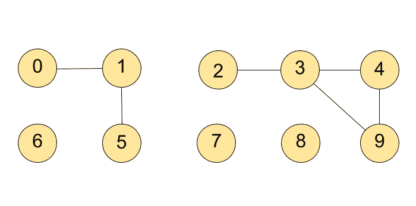*

*使用快速查找，如果我们合并上面的第 3 项和第 6 项，id[i] = 9(这是 3 的 id 值)的所有条目都需要更改为 6(这是 6 的 id 值)。这意味着我们需要更改 id[2]、id[3]、id[4]和 id[9]。*

*为此，`union(p, q)`需要扫描每个输入对的整个`id[]`数组。*

*这代表了这个算法的一个主要缺陷:许多值可能会改变，这意味着快速查找太慢。*

*例如，如果我们使用快速查找来合并 **1** 和 **6** ，如下所示，我们需要在`union`命令中更改总共 5 个 id 值。*

```
***i    ** 0 1 *2 3 4* 5 **6** 7 8 *9*
**id[i]** 5 5 ***5 5* *5*** 5 **5** 7 8 ***5****
```

*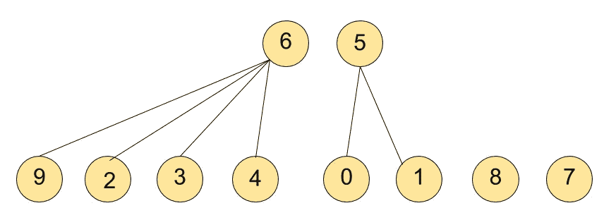*

*在合并 1 和 6 之前。*

*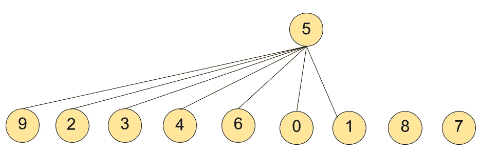*

*1 和 6 合并后。合并花费了**五个联合操作**。结论:快速查找算法中的联合操作可能意味着更新许多节点的 id 值，以将两个节点连接在一起。*

*…如果我们将 2 与 7 合并，可能会有八个 id 值更改。这意味着虽然`find`方法非常快(因此得名快速查找),但是`union`方法**太昂贵**:一个快速查找算法可能需要~MN 个步骤来处理 N 个对象上的 M 个联合命令。如果 M 和 N 很大，这将是不可接受的慢。*

*快速查找的 Java 实现*

# *题外话:测量算法性能*

*我们用来衡量 union-find 算法有效性的方法很简单:我们计算**数组访问**的次数，即数组条目被访问以进行读取或写入的次数。这种测量算法计算次数的方法允许我们对不同的算法进行“排序”或相互比较。以最少数量的读/写操作实现预期结果的算法被认为是最有效的。本质上，有效的算法是那些“聪明而不费力”的算法:它们最大限度地减少了通过数据结构迭代来读取和/或写入数据的需要，从而节省了计算时间和空间资源的利用。*

*算法研究是一门非常成熟的学科。得出的结论是，低效的算法根本无法扩展。与某些流行的观念相反，人们不能将计算机资源投入到一个低效的算法上，并希望它能在大量的数据上高效运行。为什么？拥有一台速度极快的计算机可能会让你解决一个比普通计算机所能解决的问题大 1000 倍的问题，但是如果所使用的算法效率低下，那么由此产生的时间和/或空间需求将会比普通计算机慢 1000 倍。这意味着随着所解决的问题**的增长**，低效的算法表现**更差**。*

> *问题越大，低效的算法就变得越慢。*

*在快速查找的情况下，我们的`union()`方法需要(n + 3)(n-1) ~ n^2
数组访问(称为 ***二次时间*** 算法)。现代计算机每秒可以处理数亿条指令，所以这组项目的成本并不显著，但如果有数百万或数十亿个潜在关联的项目要处理，这根本就行不通。*

*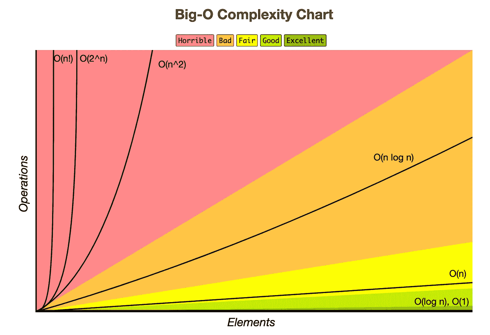*

*基于运算与元素的算法复杂度总结。从 https://www.bigocheatsheet.com/[取回](https://www.bigocheatsheet.com/)*

# *★联盟-寻找竞争者 2:快速联盟*

*好了，继续。我们的下一个竞争者，**快速联合**，被认为是解决联合查找问题的**懒惰**方法。*

*在编程中，快速查找由两个数组表示:*

*—第一个数组是图中的项目集(大小为 **N** )。*

*—第二个数组是图形中每个项目的一组整数 id(也是 size **N** )。*

*快速联合的比喻是一片树林。每个子集是一个**树**，包含指向一个**单根**的节点。*

*树节点的 id[]值包含到另一个项目的 id[]值的链接。这又指向另一个的 id[]值，依此类推。最终，当以这种方式跟踪链接的 id[]值时，我们会遇到一个 id[]值为**并指向自身**的项目。这是**根**。*

*两个项目被认为是在同一个组件**中，当且仅当这个过程引导它们到同一个根**。*

*因此,`union(p, q)`方法将根据链接找到 p 和 q 的根，然后通过将这些根中的一个链接到另一个来改变其中一个组件。选择重命名哪个组件是**任意的**。*

*综上，快速并集的解释是 id[i]是 I 的父。*

```
***i    ** 0 1 *2 3 4* 56 7 8 *9*
**id[i]** 2 2 *2 9* *0* 34 2 9 *9**
```

*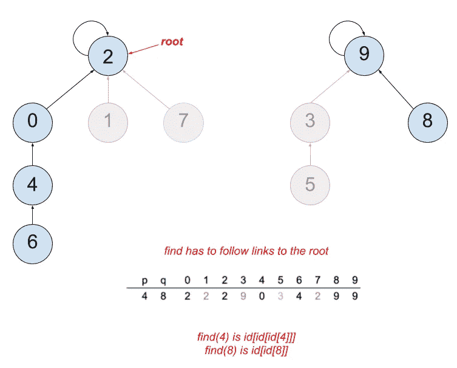*

*`find(p, q)`因此检查 p 和 q **是否有相同的根**。*

*`union(p, q)`将 q 的根的 id 设置为 p 的根的 id。因此，将 2 与 9 连接会产生以下 union 命令:*

```
***i    ** 0 1 *2 3 4* 56 7 8 *9*
**id[i]** 2 2 ***9*** *9* *0* 34 2 9 *9**
```

*这就是为什么它被称为快速联合:**只有一个值改变**！*

*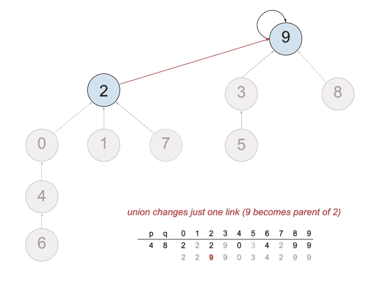*

*看看 quick-union，很明显它比 quick-find 更有效，因为 union 操作可能要快得多。*

*然而，我们的树有可能长得很高。这是因为我们可能会以**大量的项目都在同一个子集**中结束(视觉上，这将显示为长而高的树)。在这个场景中，我们的`find()`操作可能需要线性或二次时间，因为我们需要走很长的路来确定两个节点的公共根。*

*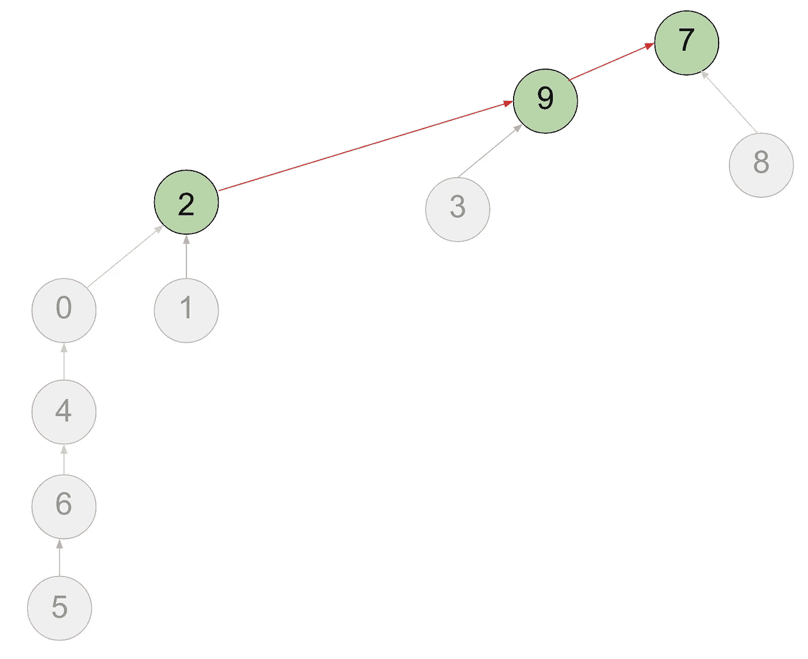*

*在这个例子中，**确定 5 和 7 是否连接，**我们的**查找**操作需要**六个**步骤，因为我们已经用快速联合算法生成了又长又高的树。当多个节点以这种方式连接时，可能会导致**查找操作**不可接受的缓慢性能。*

*我们的结论是快接接头**也太慢。***

*所以，总结一下我们现在的情况:**快速查找**有平的树，但是保持平的代价太大，因为`union`需要 N 步。**快速接头**更好，但有一个缺点:树会变高，这意味着`find`太贵，需要 N 步。对于庞大的数据集，两者都无法有效扩展。*

*快速联合的 Java 实现*

# *★联合查找竞争者 3:加权快速联合*

*幸运的是，对快速接头有一个简单的修改，允许我们保证长而高的树(因此昂贵的`find()`操作)不会发生。*

*对于`union()`方法，我们不是任意地将第二棵树连接到第一棵树，而是跟踪每棵树的大小，并且* **总是** *将较小的**树连接到较大的**树。这需要跟踪每棵树的节点数，但使算法更有效。由于 2^k 项目树的高度是 k，加权快速联合**保证了对数性能**。这使得它成为这里研究的三种算法中唯一适用于巨大实际问题的算法。对数算法为什么特别？假设我们引用的是以 2 为底的对数(最常见于处理二进制数据的算法)，这意味着如果我们将问题规模从 1，000 增加到 1，000，000(100 万)，我们算法中的数组访问操作的数量将从 10 增加到 20。如果我们将问题规模增加到 1，000，000，000(10 亿)，那么我们算法中的数组访问操作的数量将增加到 30。这是一个可扩展的算法！*

*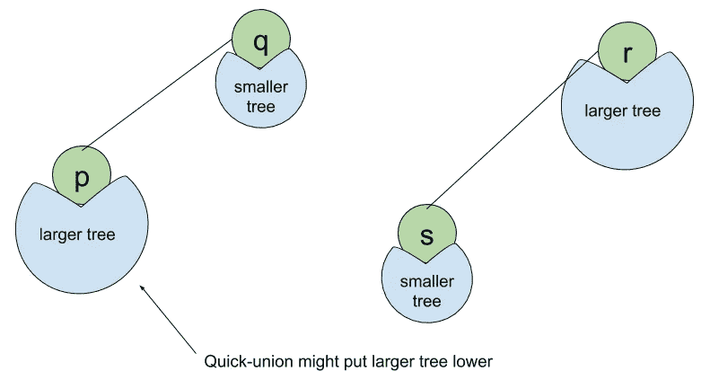**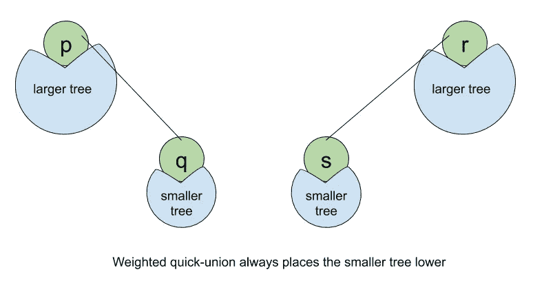*

*加权快速联合的 Java 实现*

# *证据就在测试中*

*让我们在实际场景中比较这三种联合查找算法。使用空格分隔的。txt 文件，包含 31，830 个已连接的号码(代表已连接组件的 id)。我遍历了整个数据集，在每次迭代中检查两个 id 是否已经连接，如果没有使用`union`命令来连接它们。我在数据集上使用了**快速查找**、**快速联合**和**加权快速联合**算法，并比较了各种算法联合数据所需的运行时间。从下面的截图来看，很明显加权快速联合是最快的。*

**

*一致决定赢家:加权快速联合*

# *一个实际的动态连接问题*

**问题:给定一个* ***社交网络*** *包含* ***n*** *成员和一个包含* ***m*** *时间戳的日志文件，在这些时间戳下，成对的成员形成友谊，设计一个算法来确定所有成员被连接的最早时间(即每个成员都是朋友的朋友的朋友的朋友……的朋友的朋友)。**

**假设日志文件按时间戳排序，友谊是等价关系。**

**你的算法的运行时间应该是****m log n****或者更好，并使用与* ***n*** *成比例的额外空间。**

*解决方案:我们将使用加权快速联合来解决这个问题。连接的朋友由管道分隔的字符串列表表示，这些字符串表示用户成为朋友的时间戳以及两个用户的 id 值。有 100 个(代表我们问题中的 ***n*** )用户，我在这 100 个用户之间创建了 2000 个随机连接的列表(代表我们问题中的 ***m*** )。*

*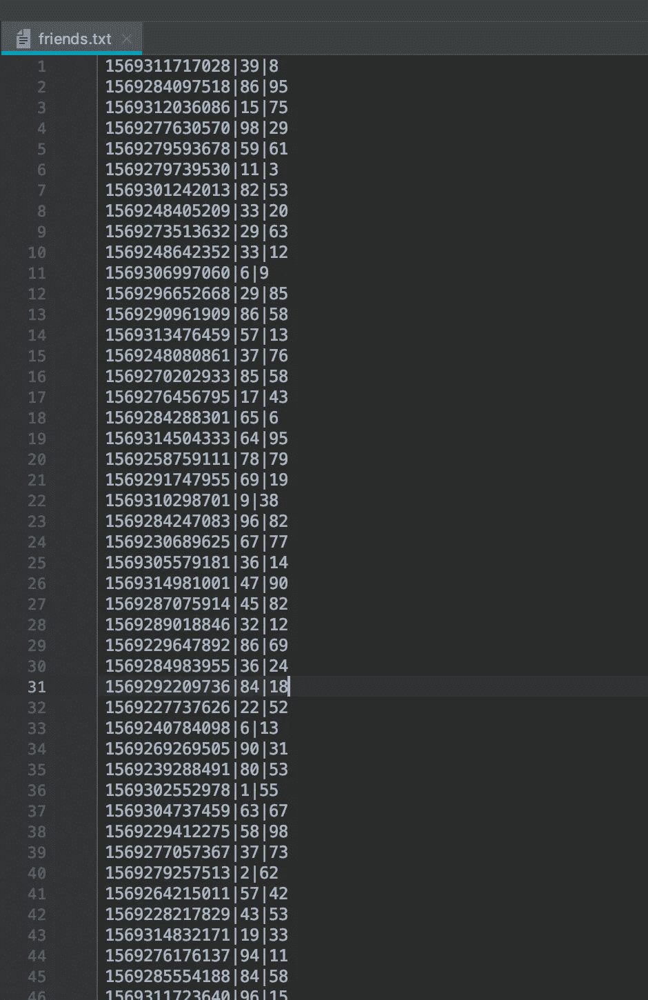*

*代码遍历 2000 个列表项，检查用户是否连接(使用`find`方法)，如果没有，连接它们(使用`union`方法)。在每次迭代结束时，它会检查不相交(非连接)成员的数量。如果非连通项的数量为零，我们就打破循环，因为现在我们知道每个成员都是朋友的朋友的朋友…朋友的朋友。*

# *参考*

*[](http://researchhubs.com/post/computing/algorithm-1/dynamic-connectivity.html) [## 动态连接

### 现在，我们讨论动态连通性问题，即 union find 的问题模型。想法是这样的。他们…

researchhubs.com](http://researchhubs.com/post/computing/algorithm-1/dynamic-connectivity.html) [](https://www.bigocheatsheet.com/) [## 了解你的复杂性！

### 你好。这个网页涵盖了计算机科学中常用算法的空间和时间复杂性。当…

www.bigocheatsheet.com](https://www.bigocheatsheet.com/)*