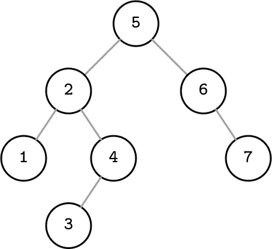
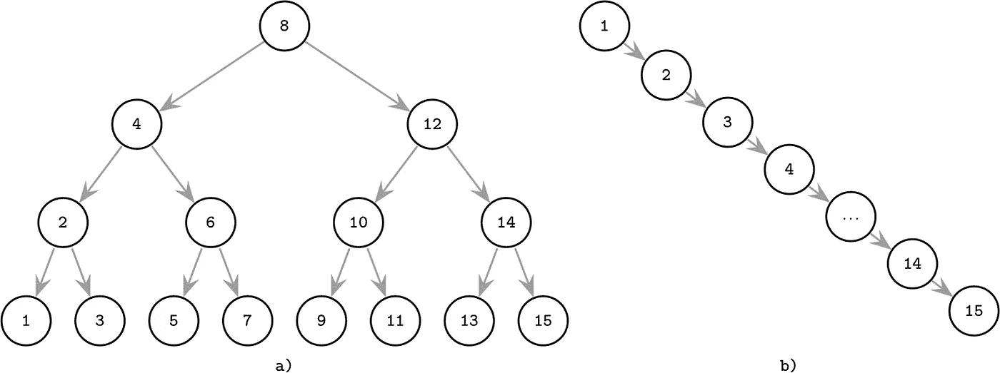
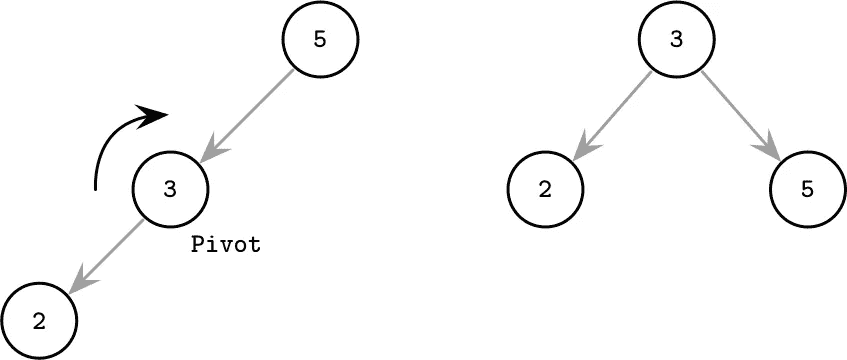
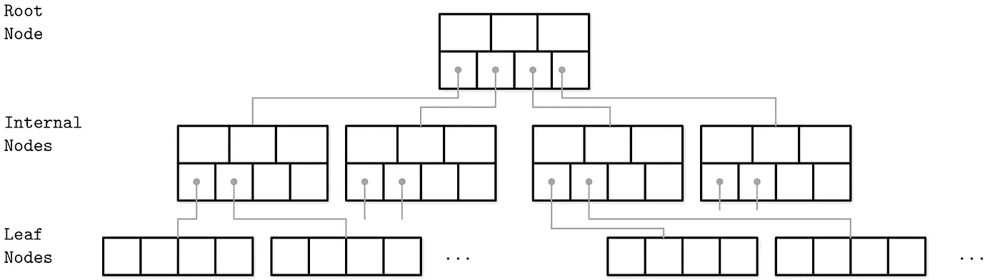
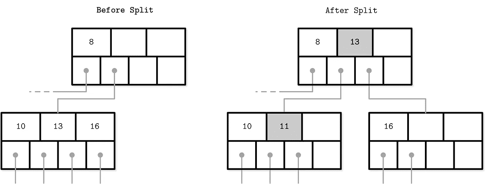
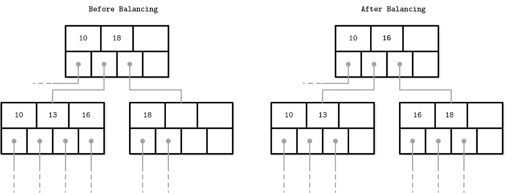
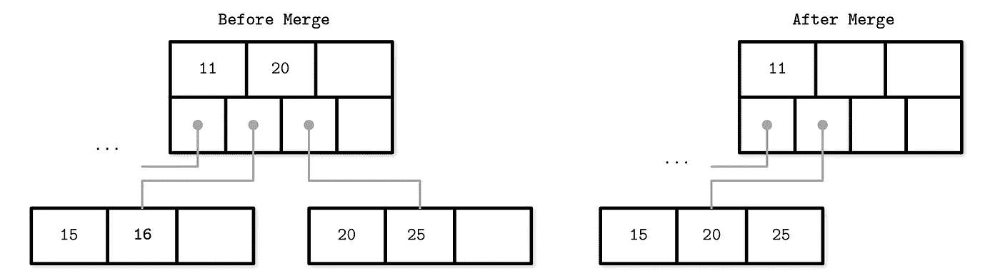

# 关于 B 树和数据库的一切

> 原文：<https://itnext.io/all-about-b-trees-and-databases-8c0697856189?source=collection_archive---------0----------------------->

## B 树如何增强您的数据库处理数据密集型工作负载的能力。

最近一直在看 [*数据库内部*](https://www.goodreads.com/book/show/44647144-database-internals) (Alex Petrov，2019)。这是一本关于数据库*存储引擎*实现的优秀书籍，存储引擎是数据库的组成部分，以高效可靠的方式从磁盘中存储和检索数据。这本书的一个重要部分讨论了各种 B 树数据结构的实现和优化。

b 树是数据库使用的最主要的数据结构。最著名的例子是 Postgres、Mysql 和 Oracle 数据库。在深入研究 B 树之前，我们应该首先关注二分搜索法树。

# 二叉树

二叉树是一种用于以有序方式存储数据的数据结构。树中的每个节点都由一个键、一个与该键相关联的值和两个指向子节点的指针(因此命名为 binary)来标识。规则是左侧子节点必须小于其直接父节点，右侧子节点必须大于其直接父节点。

这样，通过查看每个节点的值和相应的下降，我们可以很容易地找到元素。如果搜索到的值小于当前值，则下降到左边的子节点；如果更大，就下降到右边。

# 调整资金组合

当插入一个新元素时，我们需要找到正确的位置，并在那里插入一个新的节点。这可能会导致树失去平衡。在最坏的情况下，它可能看起来像右边的情况，类似于链表而不是树。

二叉树理想和最坏情况

在理想情况下，通过避免检查未选择的路径，跟随右侧或左侧节点平均将搜索复杂度降低一半。当有一个不平衡的树时，需要遍历更多的节点，这大大降低了搜索的速度。

从数学上讲，当寻找一个元素时，它在树形式上的复杂度为 O(log₂ N ),在链表形式上的复杂度为 O(N)。树越浅，搜索就越快。

树将被重新平衡，而不是在一个树枝上添加新元素并使其变长，而另一个树枝保持空白。如下所示，这是通过旋转节点来实现的，向左或向右。较小的项目在左边，较大的项目在右边的规则被保留，但是高度变小，使得搜索更快。

树旋转

# 磁盘限制

存储引擎必须将树提交到磁盘，以使数据库系统能够承受崩溃和断电。

数据以页帧的形式存储在磁盘上。数据连续存放在磁盘上，大小通常为 4kb(由底层 CPU 架构定义)。这是可以以编程方式写入或读取的最小数据量。

平衡搜索树不适合在磁盘上维护:

*   一个原因是地点。元素是按随机顺序输入的，因此不能保证节点彼此靠近，并且可能分布在不同的页面上，从而导致过多的磁盘访问。
*   第二个原因是树高。由于二叉树节点只有 2 个子节点，树的高度增长相对较快。对于每一级，我们必须比较并下降到下面的节点，依次是额外的磁盘访问。

磁盘访问是昂贵的，所以当设计驻留在磁盘上的数据结构时，它们必须保持最小。

# b 树

b 树是一种自平衡的树数据结构，它维护排序的数据并允许搜索，但它推广了二叉查找树，允许节点有两个以上的子节点。

更正式地说，每个节点都有介于 *k* 到 *2k* 之间的键-值对和 *k+1* 到 2 *k+1* 的子指针，除了根节点之外，它只有少至 *2* 的子指针，即使当 *k* 是一个大数字时也是如此。

b 树

通过解决前面的两个问题，b 树适用于存储系统。

*   每个节点的大小相当于一个磁盘页面。键、值和指针的总大小匹配 4kb。由于键和值在同一个磁盘页上彼此相邻，所以局部性增加了，因此需要更少的磁盘访问。
*   由于每个节点中有更多的子节点，树的高度变得更小(也称为更高的扇出)。

# 搜索、插入和删除

## 搜索

使用二分搜索法来搜索 B 树。该算法从根节点开始，遍历所有键，直到找到第一个大于搜索值的键。然后，我们使用相应的子指针下降到相关的子树，并重复这个过程，直到找到值。

b 树节点

范围扫描也是可能的，方法是找到扫描的起始键，然后跟踪兄弟指针，直到找到最后一个节点。这不是最佳选择，因为值分布在许多节点上。更好的方法是使用 B+树，它是 B-树的一种改进。

## 插入

插入是通过执行搜索并在正确的索引处插入值来完成的。如果节点有太多的值，插入可能会导致树失去平衡( *n* > *2k* )。

在这种情况下，将使用节点分割来平衡树。拆分是通过分配一个新的节点，将一半的键-值对转移到那里，并将它的第一个键和指向该节点的指针添加到父节点来完成的。如果它是一个非叶节点，那么拆分点之后的所有子指针也将被移动。

第一个键和相应的指针被移动到父项，从而增加了它的占用率。这可能会再次导致溢出，因此必须沿着树向上递归重复重新平衡。

b 树分裂

## 删除

删除时，定位目标节点和删除索引。移除后，一个节点会因为值太少而失去平衡( *n* < *k* )。可以通过合并节点或旋转来解决。

可以向右或向左旋转，这取决于哪个节点有备用项目。例如，右旋转是通过将分隔符从父节点复制到下溢节点的开始，并用其左兄弟节点的最后一个元素替换分隔符来完成的。当旋转非叶节点时，左兄弟的最后一个子指针被移动到不平衡节点的开始。当执行向左旋转时，采用类似的方法。

b 树旋转

如果没有兄弟节点可以腾出一个元素(有 *k* 个元素)，那么有缺陷的节点必须与一个兄弟节点合并。合并会导致父级丢失分隔符元素，因此父级可能会变得不足，需要重新平衡。再平衡可能会一直持续到根本。

b 树合并

# 摘要

这篇文章介绍了数据结构应该如何适应磁盘存储。我们首先解释了二叉树，以及它们为什么由于子树少和位置低而不适合磁盘。另一方面，B-tree 通过在每个节点中有更多的项，在磁盘上使键和值更近，树更浅来解决它。

然后，我们讲述了如何实现查找、插入和删除操作，并在它们失去平衡时使用拆分、合并和重新平衡来重新平衡它们，从而将树深度保持在最小。

亚历克斯·彼得罗夫和他的书**数据库内幕**功不可没。图片和我大部分关于 B 树的知识都来自他的书。

这个帖子的灵感来自于我用 Go 写的内存 B 树实现。可以去看看 [GitHub](https://github.com/amit-davidson/btree) 。