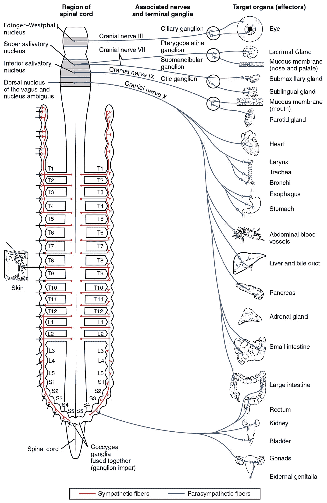
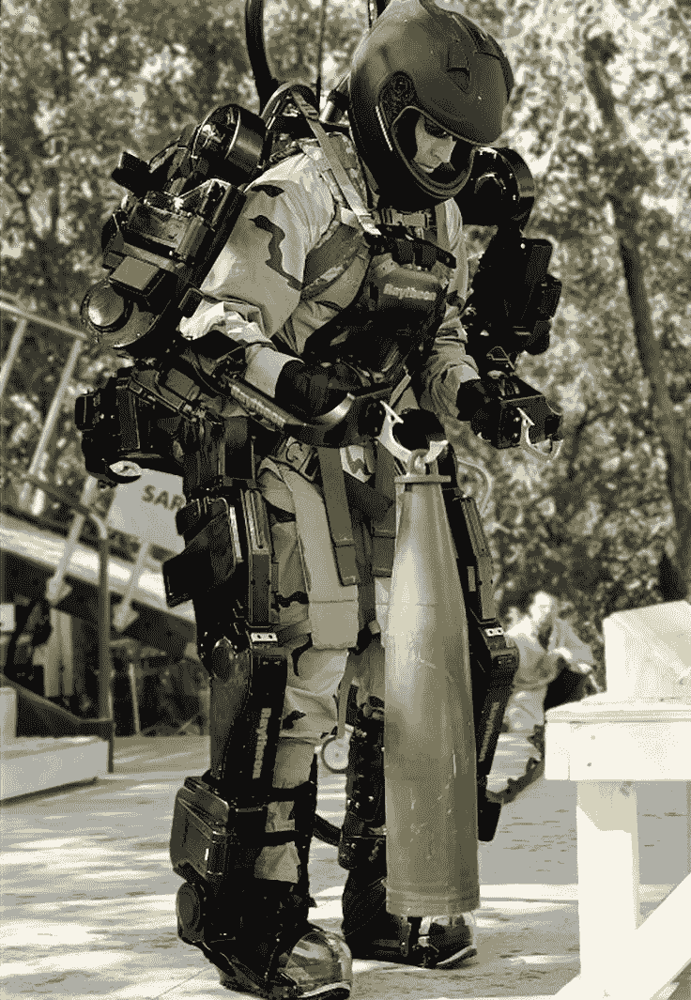
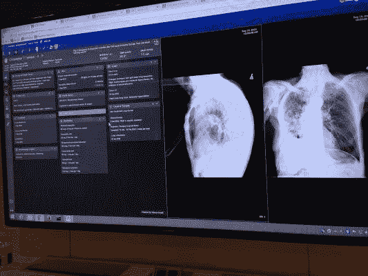
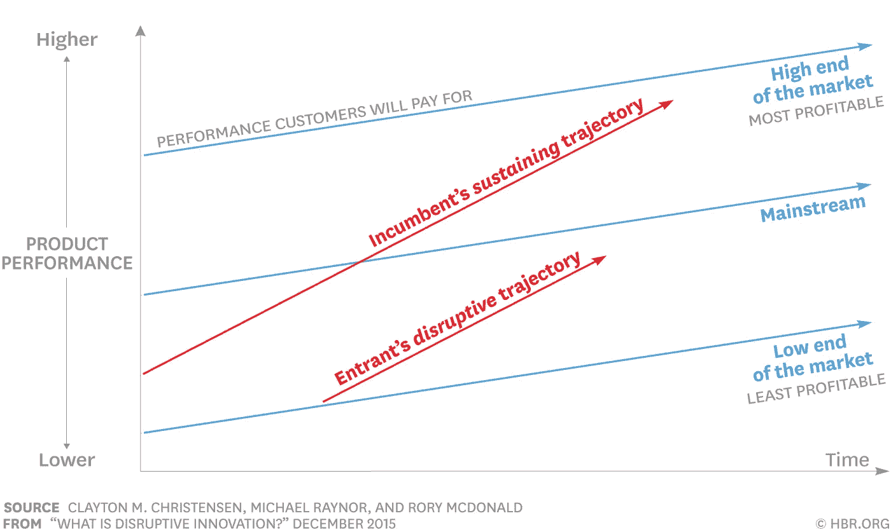

# 所有人工智能都始于“隐喻”

> 原文：<https://itnext.io/all-artificial-intelligence-ai-begins-as-a-metaphor-c6ad67b19fa4?source=collection_archive---------6----------------------->

每一个思想和感觉的本质都是不可交流的，被锁在个人灵魂和身体的不可渗透的密室里
——奥尔德斯·赫胥黎

> [*点击这里在 LinkedIn 上分享这篇文章*](/all-artificial-intelligence-ai-begins-as-a-metaphor-c6ad67b19fa4?utm_source=medium_sharelink&utm_medium=social&utm_campaign=buffer)

所有的软件，包括人工智能，都是从一种思想或者甚至是一种感觉开始的，而这种思想或者感觉实际上是不可传达的。然而，任何需要构建的复杂事物，都必须与负责构建的人沟通。这种交流是实现专业化和分工的效率所必需的。

## **所有软件都是从隐喻开始的**

当我在软件行业工作时，开发人员谈论“*统一隐喻*”并不罕见。在任何代码被编写出来之前，统一的隐喻被用来构思一些不可思议的东西。例如，一个“*计算机视觉*”应用程序并不像生物一样真正“看见”。然而，这个隐喻提供了一个基础，可以用来构思视觉过程中涉及的组件，并对这些组件的交互进行建模，因此可以构建一台计算机来获得对数字图像或视频的高级理解。

从工程的角度来看，一个统一的隐喻寻求实现模拟视觉系统可以完成的任务的自动化。*理解*在这种情况下意味着将视觉图像(视网膜的输入)转换成可以与其他过程交互并引发适当行动的世界描述。

为了理解计算机视觉系统是如何工作的，想象它执行一项功能，比如检测产品，可能会有所帮助。首先，传感器检测产品是否存在。如果有产品经过，传感器将触发摄像头捕捉图像，并触发光源突出关键特征。接下来，一个名为“ [**帧抓取器**](https://www.techopedia.com/definition/7300/frame-grabber) ”的数字化设备获取相机的图像，并将其转换为数字输出，然后存储在内存中，以便可以通过旨在模拟产品上执行的一些功能的算法进行操作和处理。

为了“处理图像”，算法必须执行几项任务。

*   首先，图像被渐变为简单的黑白格式。
*   接下来，基于与预定标准的比较，分析图像以识别缺陷和正确的组件。
*   最后，在对图像进行分析后，根据机器视觉算法与标准进行比较，产品通过或未通过检测。

[这个链接](http://nbviewer.jupyter.org/github/BVLC/caffe/blob/master/examples/00-classification.ipynb)包含了用于实例化算法的 Python 代码，这些算法只是简单地识别清晰的图片。可以进行身份识别的范围越大，系统接收到的图像越模糊，算法和使能代码就变得越复杂。

计算机是 [**电子机械机器**](https://en.wikipedia.org/wiki/Electromechanics) ，它们可以被构造来代表各种模拟功能，如视觉，使用指令调用计算。然而，为了让计算机表现得“像”人类，它们不仅需要像人类一样表现对刺激的反应，还需要像人类一样使用感情和社会结构或其他一些抑制性影响来限制这些反应。

# ***“我们不是会感觉的思考机器，我们是会思考的感觉机器*”**

# **――安东尼奥·r·达马西奥博士**

因此，虽然我们可能能够创建指令，使配备有适当传感器的计算机能够识别这张图像为“黑豹”，但我们还远远没有创建指令，使计算机能够“感受”人类在风景如画的湖泊周围散步时沿着孤立的道路遇到黑豹时可能感受到的恐惧。

人类因遭遇黑豹而产生的情感会产生自己的一系列反应，这些反应可能很难用计算机执行的任何指令来描述。人体 [**自主神经系统**](https://en.wikipedia.org/wiki/Autonomic_nervous_system) 是一种控制机制，主要在无意识状态下发挥作用，调节心率、消化、呼吸频率、瞳孔反应、排尿和性唤起。

自主神经系统神经支配

[**自主神经系统**](https://en.wikipedia.org/wiki/Autonomic_nervous_system) 是控制许多生物中所谓的“ [**战斗或逃跑反应**](https://en.wikipedia.org/wiki/Fight-or-flight_response) ”的主要机制，特别是人类，他们可以通过其大大脑的干预来介导反应。

然而，因为计算机是一个 [**电子机械系统**](https://en.wikipedia.org/wiki/Electromechanics) 它不太可能受到黑豹的伤害，所以它不需要像人类那样做出反应。在任何复杂的信息系统的开发中，真正的问题是“*它将被用于什么目的*？

它将被用于识别威胁还是仅仅用于绕过障碍物？用途几乎是无限的。例如，计算机视觉可以与一套服装一起使用，通过计算机技术增强穿着者的能力，如雷神公司和洛克希德·马丁公司已经开发的计算机技术。像这样的网络服可能会改变未来步兵战争的游戏规则。它们都包括某种类型的计算机视觉系统，以增强人类用户的视觉能力。

像这样的网络服将显著增加普通前线士兵的力量、携带能力和寿命。未来的变体可以假设是过去 50 年科幻小说的实现，它提供了自己类型的统一隐喻。

统一隐喻的一个缺点是，它们可能会过度简化将隐喻转化为可操作的工作系统所需的工程的复杂性。

目前几乎所有的机器智能本质上都是一种预测技术。这意味着支持隐喻“*机器智能*”的软件统计地评估输入，并基于作为参数包含在相关算法/代码中的一组目标或目的来预测最佳行为。

语言翻译是机器智能的一种。它们可以是琐碎的，或多或少可以被机械化。另一方面，好的"*解释*"就不那么规范了，通常需要一些人工输入。人类干预的原因是因为在不同解释之间充当“桥梁”的概念“是抽象的，并且比仅仅一套字典条目更难以形式化，在语言中的不同表达也是如此。

# ***“…人工智能不会取代放射科医生。然而，那些使用人工智能的放射科医生将取代那些不使用人工智能的放射科医生。***

# **——**[**贝塔兰·梅斯科博士**](http://medicalfuturist.com/)

Regina Barzilay 是麻省理工学院的教授。在与马萨诸塞州总医院的合作中，Barzilay 博士现在正在应用她在人工智能和机器学习方面的专业知识来改善癌症诊断和治疗。她提出了一些问题，比如计算机是否能够比人类目前能够更早地检测出乳房 x 光照片中的乳腺癌迹象，以及机器学习是否能够让医生利用所有关于患者的海量数据来做出更个性化的治疗决策。

与 Barzilay 博士一样，哈佛医学院和贝斯以色列女执事医疗中心的病理学家 Andy Beck 博士和麻省理工学院和加州理工学院培养的计算机科学家 Aditya Khosla 也在通过图像进行癌症诊断。他们正在训练计算机搜索数字载玻片，并学习如何区分癌变细胞和非癌变细胞。

在 2016 年 4 月的一次挑战中，与计算团队承担相同任务的病理学家专家实现了约 3.5%的癌症检测错误率。Beck 的系统的错误率接近 7.5%，是竞争中最好的。贝克说，最有趣的是将计算机和病理学家结合在一起。

“在这个例子中，人类和人工智能的结合将专家的错误率降低了 85%，”贝克说。"这真是一个令人兴奋的发现。"因为“训练有素”的计算机会随着数据的增加而变得更加智能，人工智能技术也会随着时间的推移而改进。不久，贝克的系统就超越了人类专家。

很可能人工智能不会取代医生——它将增强医生找到护理病人所需的关键相关数据的能力，并以简洁、易于理解的格式呈现这些数据。当放射科医生调用胸部****扫描进行读取时，AI 将查看图像并立即识别潜在的发现——从图像中，还通过梳理与扫描的特定解剖结构相关的患者历史。****

********

****使用这些图像，IBM 的 Watson 检查了图像顺序，实际上“*看到了*”患者患有肺癌。然后，它提取了相关的既往检查、病历、心脏病学和肿瘤科信息。它还记录了最近的实验室数据，目前服用的药物。这些信息的汇集使医生对病人的状况有了更全面的了解，并有助于决定下一步的护理。****

****人工智能算法通过识别模式，类似于放射科医生一样“阅读”医学图像。人工智能系统使用大量的检查进行训练，以确定从 [**计算机断层摄影**](https://www.radiologyinfo.org/en/submenu.cfm?pg=ctscan) (CT)、磁共振成像(MRI)、超声波或核成像扫描的正常解剖结构是什么样子。然后用异常案例来训练 AI 系统的“*之眼*来识别异常，类似于计算机辅助检测软件(CAD)。****

# ******让事情尽可能简单******

****然而，与 CAD 不同的是，CAD 只是突出了放射科医生可能想要仔细检查的区域，“视觉使能”-与前几代 CAD 软件相比，AI 软件可以通过结合临床和视觉细节来提供更多的分析认知能力。****

********

****这是克莱顿·M·克里斯坦森教授著名的“颠覆性技术图表”。根据 Christensen 博士的观点**,**描述了一个过程，通过这个过程，一个**较小的公司**能够成功地挑战**现有的**企业。具体来说，当现有企业专注于为要求最苛刻(通常也是利润最高)的客户改进产品和服务时，它们会超越某些细分市场的需求，而忽略其他细分市场的需求。****

****随着人工智能系统纳入越来越敏感的计算机视觉收集的更详细的数据，它们可能会成为颠覆性技术，提供比选择使用人类视觉简单“阅读”x 射线的人类放射科医生更全面的信息。毕竟，使用模拟感官的人类可能很难跟上人工智能系统学习和了解的一切。“计算机视觉”的统一隐喻可能是放射学家使用技术的一种方式，正如阿尔伯特·爱因斯坦所建议的那样，那就是“*使事情尽可能简单，但不要更简单*****

****__________________________________________________________________****

******备注:******

1.  ****[https://www . Thomas net . com/articles/custom-manufacturing-fabring/machine-vision-systems](https://www.thomasnet.com/articles/custom-manufacturing-fabricating/machine-vision-systems)****
2.  ****[https://public.wsu.edu/~taflinge/biology.html](https://public.wsu.edu/~taflinge/biology.html)****
3.  ****[https://HBR . org/2016/11/the-simple-economics-of-machine-intelligence](https://hbr.org/2016/11/the-simple-economics-of-machine-intelligence)****
4.  ****[http://www . Olivia caramello . com/Unification/metaphorsanalogies . html](http://www.oliviacaramello.com/Unification/MetaphorsAnalogies.html)****
5.  ****[https://www . CNBC . com/2017/05/11/from-coding-to-cancer-how-ai-is-changing-medicine . html](https://www.cnbc.com/2017/05/11/from-coding-to-cancer-how-ai-is-changing-medicine.html)****
6.  ****[https://www . ITN online . com/article/how-人工智能-将改变-医疗-成像](https://www.itnonline.com/article/how-artificial-intelligence-will-change-medical-imaging)****
7.  ****克莱顿·M·克里斯坦森,《创新者的困境:当新技术导致大公司失败时》, 2016 年 1 月****

*****原载于 2018 年 2 月 26 日*[*neutec.wordpress.com*](https://neutec.wordpress.com/2018/02/26/all-artificial-intelligence-ai-begins-as-a-metaphor)*。*****