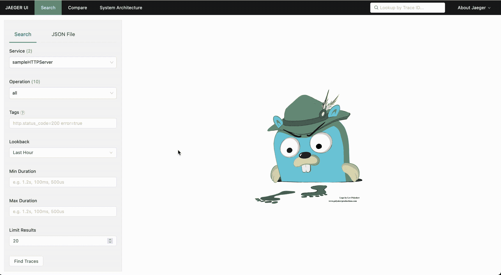
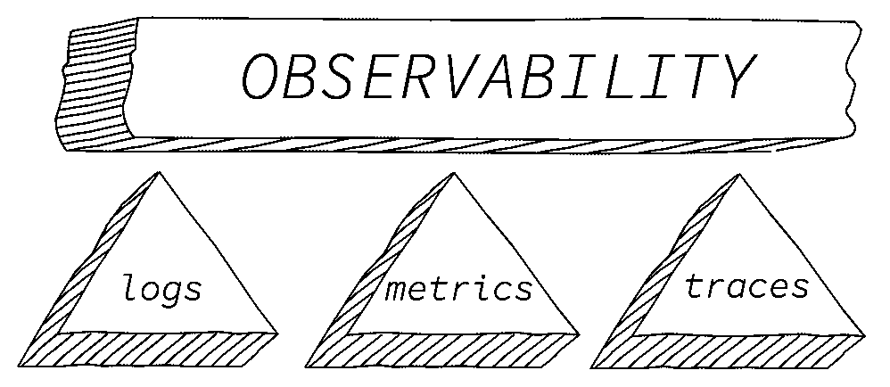
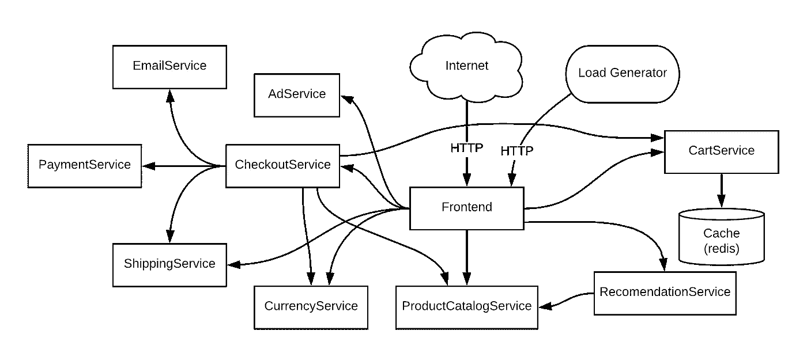
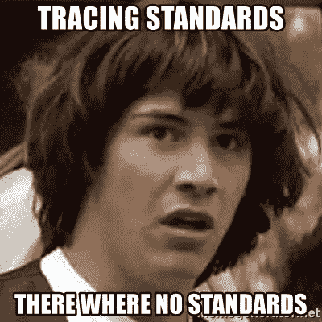
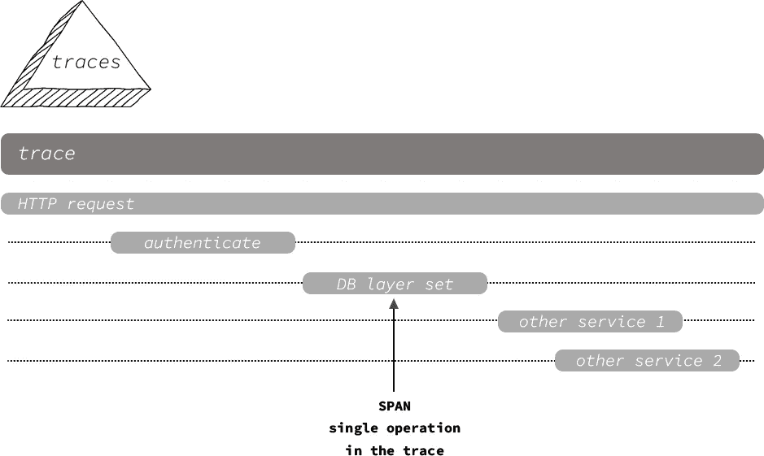
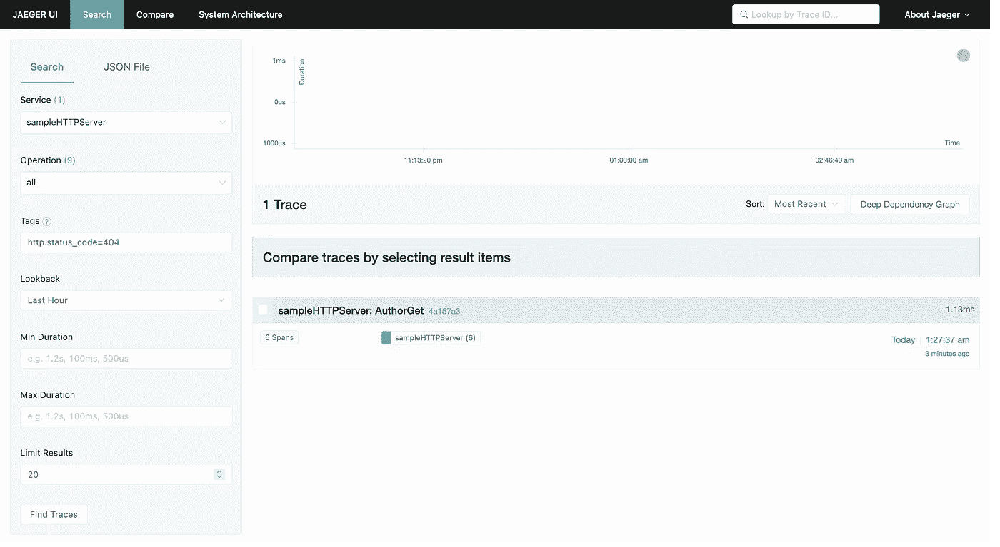
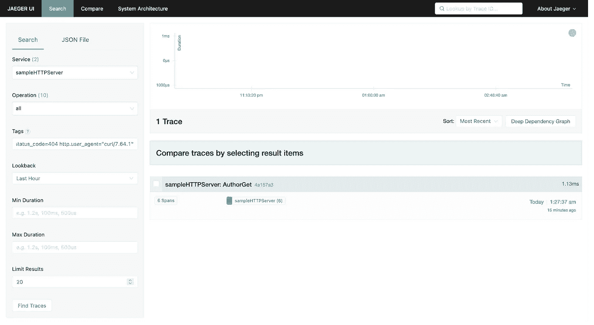
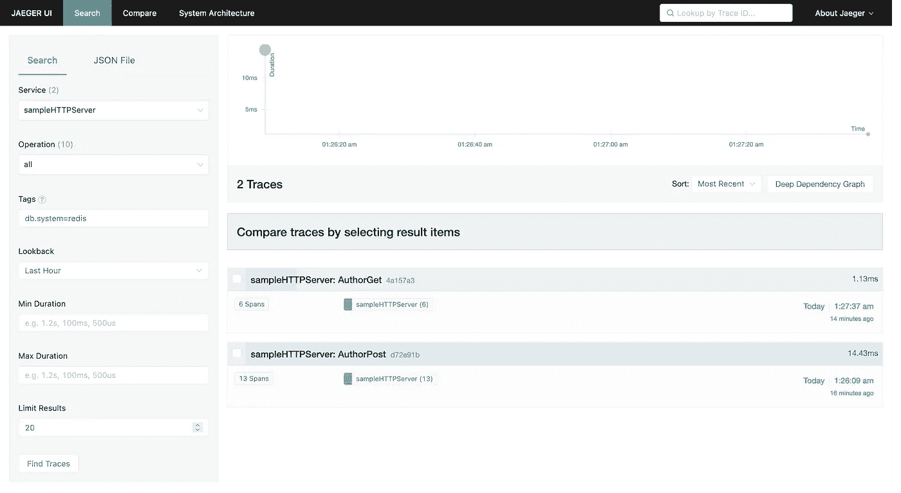

# 所有冰雹追踪:一个去，雷迪斯和耶格的故事

> 原文：<https://itnext.io/all-hail-tracing-a-go-redis-and-jaeger-tale-7904743d0fd?source=collection_archive---------2----------------------->



Jaeger 对我们的 HTTP 和 DB 服务生成的痕迹进行了可视化

本文是对 DevelopersBR 组织的[会议](https://www.meetup.com/pt-BR/DevelopersBr/events/279237414/)的补充，旨在涵盖分布式跟踪的一些基础知识，以及如何使用 open telemetry observability framework 工具来应用它。

为了让事情更实际，我们将创建一个 Golang HTTP 应用程序，它使用 Redis 后端，并依赖 Jaeger 来接收和可视化跟踪。将此视为黄带整体难度，但所有专业水平都可以利用它来学习或记住重要概念。

如果你想直接跳到行动，完整的容器化演示可以在[https://github . com/Filipe Costa 90/open telemetry-go-http-sample](https://github.com/filipecosta90/opentelemetry-go-http-sample)查阅，如下所示:

```
git clone github.com/filipecosta90/opentelemetry-go-http-sample
cd opentelemetry-go-http-sample
make build-docker
make start-docker
```

请务必查看[https://opentelemetry.io/docs/go/](https://opentelemetry.io/docs/go/)以获取更多参考和示例。

# 1)在开始行动之前，介绍一些分布式跟踪的基础知识

在实际应用跟踪之前，让我们先了解一下可观测性、opentelemetry 和分布式跟踪的一些基础知识。

## 什么是可观测性？



可观察性的三大支柱

**您可以使用不同的工具和不同的方式来实现可观察性，但是独立于可观察性解决方案，它们都分为三个主要的垂直领域——度量、日志和分布式跟踪。具体到这篇博文和演讲，我们将重点讨论后者。**

## OpenTelemetry 在可观测性工作中处于什么位置？

特别关注追踪支柱:

> **分布式跟踪是一种由跟踪工具实现的方法，用于跟踪、分析和调试跨多个软件组件的事务。**
> [https://www.w3.org/TR/trace-context/#problem-statement](https://www.w3.org/TR/trace-context/#problem-statement)



在线精品微服务演示应用，由 11 个不同语言编写的微服务组成。谷歌用这个应用程序来演示像现在已经过时的 OpenCensus 这样的技术的使用。

可以想象，在多供应商环境中，这导致了互操作性问题，例如:



*   由于没有共享的唯一标识符，不同跟踪供应商收集的跟踪无法相互关联。意味着从头到尾都没有关联。
*   不能确保特定于供应商的元数据在系统交换之间得到保留。
*   云平台供应商、中介和服务提供商无法真正保证支持跟踪上下文传播，因为没有标准可循。

这就是像 CNCF 的 OpenTelemetry 及其前身 OpenTracing(出现于 2016 年)这样的项目对促进数据收集标准化至关重要的地方。多亏了它们，我们现在可以利用一种普遍认可的格式来交换跟踪上下文传播数据——称为跟踪上下文。您可以在 https://www.w3.org/TR/trace-context/#design-overview 的[跳转到 W3C 跟踪上下文定义。](https://www.w3.org/TR/trace-context/#design-overview)

OpenTelemetry [多库](https://oreil.ly/GpGD5)包括一系列规范，以及各种语言的 API 和参考实现，[包括](https://oreil.ly/vSO7k) go。

## 用 OpenTelemetry 跟踪的概念？



上图中的图表代表了一个样本跟踪。跟踪是链接范围的集合，是跟踪中最小的工作单元。

正如您所看到的，跟踪跨越了几个服务边界，从应用程序层一直到数据库层，以及请求在系统中流动时所涉及的任何单个服务或组件。

与每个 span 相关联的是一个 span 上下文，它是一组全局唯一标识符，表示每个`span`都是其中一部分的唯一请求。一个`span`提供了请求、错误和持续时间(红色)度量，可用于调试可用性和性能问题，并包含关于每个操作的元数据，如名称、开始和结束时间戳、属性、事件和状态。

可以通过检查跨度的根来检索请求的整个端到端延迟。

## 开放式遥测跟踪约定

OpenTelemetry 提供了一个描述公共属性的模式，以便后端可以轻松地解析和识别相关信息。为了规范化您的数据并提高其效用，在编写测量时理解这些约定非常重要。

为跟踪定义了以下语义约定:

*   [通用](https://github.com/open-telemetry/opentelemetry-specification/blob/master/specification/trace/semantic_conventions/span-general.md):通用的语义属性，可以用来描述不同种类的操作。
*   [HTTP](https://github.com/open-telemetry/opentelemetry-specification/blob/master/specification/trace/semantic_conventions/http.md):HTTP 客户端和服务器的跨度。
*   [数据库](https://github.com/open-telemetry/opentelemetry-specification/blob/master/specification/trace/semantic_conventions/database.md):SQL 和 NoSQL 客户端调用的跨度。
*   RPC/RMI :远程过程调用的跨度(例如 gRPC)。
*   [消息传递](https://github.com/open-telemetry/opentelemetry-specification/blob/master/specification/trace/semantic_conventions/messaging.md):与消息传递系统(队列、发布/订阅等)交互的跨度。).
*   [FaaS](https://github.com/open-telemetry/opentelemetry-specification/blob/master/specification/trace/semantic_conventions/faas.md) :跨越功能即服务(如 AWS Lambda)。

# 2)创建一个简单的 Golang REST API 来测试跟踪

在本节中，我们将使用位于[https://github . com/Filipe Costa 90/open telemetry-go-http-sample](https://github.com/filipecosta90/opentelemetry-go-http-sample)的示例代码。

开始应该很简单:

```
git clone github.com/filipecosta90/opentelemetry-go-http-sample
cd opentelemetry-go-http-sample# spin the web server, redis, and jaeger
make start-docker
```

现在我们来解释一下它的内容。

为了测试跟踪概念，我们将创建一个简单的 REST API，它将公开端点以允许访问和操作关于“作者”的信息。我们的简单 API 将允许的操作有:

*   **创建**新作者，以响应在`/author/{id}`的有效帖子请求；
*   **响应于在`/author/{id}`的有效 PUT 请求，更新**现有作者；
*   **响应于在`/author/{id}`的有效 GET 请求，通过作者标识符获取现有作者信息；**

此外，

*   为了保存我们的作者信息，我们将使用 Redis 作为我们的存储层。要连接到它，我们将使用 go-redis 客户端。
*   为了处理 HTTP 请求路由，将它们匹配到各自的处理程序，我们将使用`gorilla/mux`包。

## 定义我们的作者信息结构

为了尽可能简单，每个作者将有一个相关的作者姓名、用户名和一个关于他自己的部分，可以映射到下面的`Author`结构。

```
// The Author struct represents the data in the JSON/JSONB column.
// We can use struct tags to control how each field is encoded.
type Author struct {
   Name     string `json:"Name"`
   Username string `json:"Username"`
   About    string `json:"About"`
}
```

现在我们知道了我们想要保存的关于作者的信息，让我们检查一下如何保存这些信息。

## 将我们的作者状态存储在外部数据库中:Redis

如上所述，我们将使用 Redis 来持久化我们的作者数据，并且在我们的作者属性和我们的持久层(Redis)之间有一个直接的映射，我们将使用 Redis 散列。你可以在 https://redis.io/topics/data-types-intro[阅读更多关于 redis 数据类型的内容。](https://redis.io/topics/data-types-intro)

旋转 web 服务器的同一个 bash 命令也旋转 Redis，所以现在让我们只关注 Redis，在讨论 Author struct 和我们的存储层之间的映射时，通过连接它使事情变得更实际:

```
# spin the web server, redis, and jaeger
make start-docker
redis-cli
```

每个作者将与 Redis 中的一个`author:<id>`键相关联，在内部将字符串属性名映射到字符串值，即`Name`、`Username`和`About`。如果你跟着做，即使不看 go 代码，我们也可以模拟我们将在 Redis 中用来存储和检索作者数据的预期命令。即:

## **创建新作者，以响应** `**/author/{id}**`的有效帖子请求

对`/author/{id}`的 POST 请求将映射到 Redis 中的`HSET`命令。更实际的情况是，如果您请求创建一个 id 为 1、姓名为“John Doe”、用户名为“john.doe”、关于部分为“Redis Geek”的作者，这将映射到以下 HSET 命令:

```
127.0.0.1:6379> hset author:1 Name "John Doe" Username "johndoe" About "Redis Geek"(integer) 3
```

## **响应于** `**/author/{id}**`的有效上传请求，更新现有作者

更新将映射到几乎相同的 Create request/redis 命令流，只是我们可以对特定属性进行部分更新。

如果您请求更新一个 id 为 1 的作者，将它的 About 部分改为“DevelopersBR Redis Geek”

```
127.0.0.1:6379> hset author:1 About "DevelopersBR Redis Geek"(integer) 0
```

## **响应于在** `**/author/{id}**`的有效 GET 请求，通过作者标识符获取现有作者信息

在`/author/{id}`的 GET 请求将映射到一个不同的 redis 命令，即 HGETALL，它返回存储在 Redis 键的所有字段和值。

如果我们想获得 id 为 1 的 John Doe 作者的最新信息，那么对`/author/1`的 get 请求将映射到下面的 Redis 命令并回复

```
127.0.0.1:6379> hgetall author:11) "Name"2) "John Doe"3) "Username"4) "johndoe"5) "About"6) "DevelopersBR Redis Geek"
```

# 从 API 规范到正确的 go 代码

如果您检查我们的示例 repo，您会注意到只有`author.go`、`main.go`、`storage.go`和`routes.go`包含我们整个应用程序所需的 go 逻辑。

```
opentelemetry-go-http-sample % tree .
.
├── author.go
├── main.go
└── routes.go
└── storage.go
```

上述每个文件在我们的应用程序中都有不同的职责:

*   `author.go`，包含我们的作者业务逻辑，以及作者 struct 如何映射到/从不同的序列化格式；[【GH 代码在此】](https://github.com/filipecosta90/opentelemetry-go-http-sample/blob/main/author.go)
*   `routes.go`，包含三个请求路由逻辑，将 URL 路径映射到处理程序；[【GH 代码在此】](https://github.com/filipecosta90/opentelemetry-go-http-sample/blob/main/routes.go)
*   `storage.go`，包含存储层逻辑，能够在外部数据库中存储我们的作者状态:Redis 这是以一种 DB 不可知的方式构建的，因此如果您决定使用另一个 DB，这将是除了在`main.go`中设置的连接之外唯一需要更改逻辑的文件。[【GH 代码在此】](https://github.com/filipecosta90/opentelemetry-go-http-sample/blob/main/storage.go)
*   `main.go`，包含能够连接到多个软件组件(在我们的例子中，Redis 和 Jaeger)的初始化、配置和抽象层。[【GH 代码在此】](https://github.com/filipecosta90/opentelemetry-go-http-sample/blob/main/main.go)

## 关于我们的`main.go`以及我们为什么添加以下服务器结构的进一步说明:

```
type server struct {
   client *redis.Client
   router *mux.Router
}
```

出于一系列原因，必须尽可能地将业务逻辑从外部组件中抽象出来:

*   更改底层路由器实现细节不应该影响您的应用程序逻辑代码。也就是说，如果将来我们从`gorilla/mux`转换到`DefaultServeMux`或任何其他的 web 工具包，你应该能够这样做，而不需要改变你的应用程序逻辑 go 文件。
*   这同样适用于 DB 层组件。如果将来我们决定使用另一个 Redis 客户机，甚至是一个完全不同的 DB，您的路由器代码和业务逻辑代码就不必更新它们的输入。

这就是为什么我们将所有非业务组件打包在服务器类型中，然后我们可以在服务管道的所有阶段使用它们，同时保持它们的领域非常紧密。

同样，我们已经使用了一些 redis-cli 命令来实际测试我们的 redis 数据建模，我们现在可以通过向我们新定义的 API 发送一些 HTTP 请求来测试整个 REST API 和 Redis 流。
假设您已经通过运行`make start-docker`让 web 服务器在端口 7777 上运行，让我们使用 curl 添加一个新作者:

```
# spin the web server, redis, and jaeger
make start-docker # create a new Author
$ curl -X POST -d "{\"Name\":\"Filipe\", \"Username\":\"filipecosta90\", \"About\":\"Redis Geek\"}" http://localhost:7777/author/2{"Name":"Filipe","Username":"filipecosta90","About":"Redis Geek"}# update one of it's properties
$ curl -X PUT -d "{\"Name\":\"Filipe Oliveira\"}" http://localhost:7777/author/2{"Name":"Filipe Oliveira","Username":"filipecosta90","About":"Redis Geek"}
```

现在，我们已经做好了所有的设置，并正确地解释了如何开始在 Go 中记录跟踪数据。

# 3)在 Go 中跟踪

## 如何在 Go 中使用 OpenTelemetry 记录跟踪数据？

为了在 OpenTelemetry 中创建和管理跨度，OpenTelemetry API 提供了`tracer`接口。该对象负责跟踪您流程中的活动`span`,并允许您对其执行操作，例如添加属性、事件，并在它跟踪的工作完成时结束它。

在实践中，可以从示踪剂提供者处获得示踪剂。

在我们的示例中，我们将使用 Jaeger 作为我们的跟踪提供者，并遵循 Jaeger [godoc](https://pkg.go.dev/go.opentelemetry.io/otel/exporters/trace/jaeger#NewExportPipeline) 来利用`NewExportPipeline()`方法，该方法使用跟踪提供者的推荐设置来建立完整的导出管道。为了简化设置过程，我们将 otel 设置打包成一种叫做`initTracer()`的方法。下面的要点关注它，它是项目中 [main.go](https://github.com/filipecosta90/opentelemetry-go-http-sample/blob/main/main.go) 文件的一部分。

正如您在上面所注意到的，除了设置跟踪提供程序之外，我们还:

*   **出于演示目的，定义 100%的跟踪采样率:**鉴于任何给定进程的跟踪开销都与单位时间内创建的跟踪数量成比例，对于高吞吐量的在线服务，保持较低的采样率非常重要。过去，谷歌每 1024 个候选人收集 1 个采样轨迹，这意味着 0.1%的采样率。[【第 4.4 节短小精悍的纸张】](https://static.googleusercontent.com/media/research.google.com/en//archive/papers/dapper-2010-1.pdf)。一个更高级的选择是考虑“基于尾部”的采样方法，这种方法在做出采样决定之前分析整个轨迹，从而确保保留“重要的轨迹”。我们将在后续文章中关注“基于尾部”的采样。
*   **最后，分布式跟踪需要上下文传播** —这意味着跟踪可以扩展到单个流程之外。为此，我们需要每个服务都知道调用者的跟踪，并且我们调用的每个服务都需要知道它也包含在跟踪中。为了在 go 中做到这一点，我们利用了`TextMapPropagator()`方法，该方法将横切关注点值作为字符串键/值对注入和提取到载体中，该载体在客户端(注入器)和服务器(提取器)上跨流程边界带内传播。

## go-redis 客户端的自动检测

正如官方 opentelemetry 文档中所述，自动仪器指的是您没有编写的仪器代码。OpenTelemetry for Go 通过许多流行的框架和库周围的包装器和助手函数来支持这一过程，在已知的仪器包中是通过`[github.com/go-redis/redis/v8/redisext](https://github.com/go-redis/redis/blob/v8.0.0-beta.5/redisext/otel.go)`包的`go-redis`。

在我们的 Redis 连接设置过程中，我们只需添加如下的`[redisotel.TracingHook{}](https://github.com/go-redis/redis/blob/v8.0.0-beta.5/redisext/otel.go)`:

```
func initRedis(address string) *redis.Client {
   redisClient := redis.NewClient(&redis.Options{
      Addr: address,
   })
   redisClient.AddHook(redisotel.TracingHook{})
   return redisClient
}
```

## 让我们用 Jaeger 追踪并可视化它？

为了测试我们的跟踪 HTTP API，并验证我们的跟踪是从我们的应用程序 go code 和 go-redis instrumentation 正确生成和发出的，并到达分布式跟踪后端(Jaeger)，我们将再次使用 docker-compose 脚本。

为了让事情变得更有趣，如果您记得在一个跟踪中，每个 span `span`提供请求、错误和持续时间(红色)度量，让我们也做一些不好的请求 HTTP 调用来尝试一下。

如果你已经有了`make start-docker`，你可以跳过下面这组命令的第一行。

```
# spin the web server, redis, and jaeger
make start-docker# create a new Author
$ curl -X POST -d "{\"Name\":\"Gopher\", \"Username\":\"gopher.tracing\", \"About\":\"Go Geek\"}" http://localhost:7777/author/3# will result in 400 bad request
curl -X POST [http://localhost:7777/author/4](http://localhost:7777/author/4)# will result in 404 Not Found
curl -X GET [http://localhost:7777/author/4](http://localhost:7777/author/4)
```

## 我们终于可以用耶格来可视化痕迹了

在浏览器中，导航到 [http://localhost:16686](http://localhost:16686) 以访问 Jaeger UI。

**1)搜索 404 未找到请求痕迹**

1.1)在搜索面板中，确保选择了 **sampleHTTPServer** 服务。将操作视为全部。将标签设置为`http.status_code=404`,并点击 Find Traces 按钮。您应该看到以下内容:



**2。)搜索专门针对一个用户代理的 400 个不良请求跟踪**

2.1)在搜索面板中，确保选择了 **sampleHTTPServer** 服务。将操作视为全部。将标签设置为`http.status_code=404 http.user_agent=”curl/7.64.1”`并点击查找轨迹按钮。您应该看到以下内容:



**3。)搜索 go-redis 仪器相关标签**

2.1)在搜索面板中，确保选择了 **sampleHTTPServer** 服务。将操作视为全部。将标签设置为`db.system=redis`并点击 Find Traces 按钮。您应该看到以下内容:



## 最后的想法

在前面几节之后，您应该对分布式跟踪的任务、范围和实现示例有了基本的了解。

然而，重要的是要强调跟踪本身并不能完成工作。跟踪应该作为指标分析的补充，因为这些应该给出应用程序性能的完整图像，而跟踪将使您能够解释为什么那些全局指标会达到那个状态。
举个简单的例子:

> *通过查看跟踪报告，您应该无法计算并分析应用程序的 99%延迟，因为您没有生成系统聚合状态的总数据——因为我们以 1/1000、1/10000 甚至更小的跟踪率对应用程序请求进行采样。*

**然而**，尽管单独的整体度量不能(或者至少更难)容易地解释为什么会出现性能问题，但是跟踪确实在解释为什么会出现总体问题(或者如果我们使用基于尾部的采样，甚至是某一类问题)方面显示出了它的价值，假设我们保留了所有参与软件组件的完整请求集，包括您构建或使用的组件。

作为结束语，我强烈推荐奥斯汀·帕克、丹尼尔·斯普恩霍、乔纳森·梅斯、本·西格曼和丽贝卡·艾萨克斯的《实践中的分布式跟踪》[](https://www.oreilly.com/library/view/distributed-tracing-in/9781492056621/)****。****