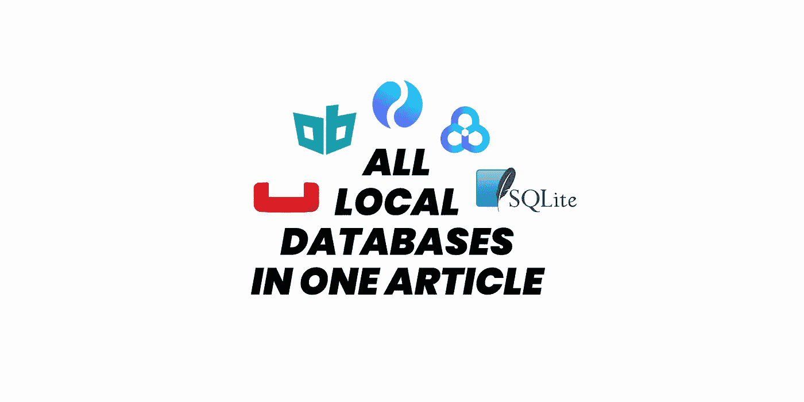

# 一篇文章中的所有 Flutter 本地数据库

> 原文：<https://itnext.io/all-local-databases-in-one-article-be65621c934a?source=collection_archive---------1----------------------->

## 我已经研究本地数据库两个月了，以下是我的浅见。

## 我将评估 4 种类型的包

*   **Key-Value** :只存储基本的原始数据
*   **SQL** :关系数据库——表格
*   **No-SQL** :非关系数据库— JSON
*   **以安全为中心**:敏感数据存储

# 键值

# [共享 _ 偏好](https://pub.dev/packages/shared_preferences)

这是一个来自 flutter dev 团队的包，所以它是其中最可靠的包。

## 赞成的意见

*   简单可靠。

## 骗局

*   不如竞争对手快
*   不支持监听更改(流)
*   不支持加密
*   不支持多隔离

# [获取 _ 存储](https://pub.dev/packages/get_storage)

GetX 的存储包作者。

## 赞成的意见

*   速度极快
*   流向更改

## 骗局

*   不太可靠(没有很好的支持)
*   它在长弦上不能正常工作
*   不支持加密
*   不支持多隔离

 [## 如何在本地保存您的数据

### 在本文中，我将教您如何使用 get_storage 包将数据持久化到本地存储中

iisprey.medium.com](https://iisprey.medium.com/how-to-save-your-data-locally-20e75561674f) 

# [蜂巢](https://pub.dev/packages/hive)

## 赞成的意见

*   相当快
*   成熟稳重
*   流向更改
*   支持加密
*   支持存储复杂对象

## 骗局

*   还不支持多隔离

 [## 颤振保存数据到本地存储与蜂房 NoSQL 数据库包

### Hive 是一个用纯 Dart 编写的轻量级、速度极快的键值数据库。

itnext.io](/flutter-save-data-to-local-storage-with-hive-nosql-database-package-8a0de834f313) 

# 否-SQL

# [对象框](https://pub.dev/packages/objectbox)

## 赞成的意见

*   快得要命
*   全文搜索支持
*   GUI 应用程序(您可以轻松地可视化您的数据库)
*   高级关系和查询支持

## 骗局

*   还没有网络支持
*   不支持加密

 [## Dart/Flutter 中最快的本地数据库

### ObjectBox 凭借其性能和自动同步选项改变了游戏规则

itnext.io](/the-fastest-local-database-in-dart-flutter-a65ff5b29fee) 

# 会计准则专家组

是和`hive`同一个作者的包。可以想到的是 Hive 的包改进版。

## 赞成的意见

*   快得要命
*   全面的网络支持
*   支持多条目索引、查询修饰符、JSON 等。
*   异步。并行查询操作和多隔离支持
*   全文搜索支持
*   GUI 应用程序(您可以轻松地可视化您的数据库)

## 骗局

*   尚不支持数据同步[和](https://github.com/isar/isar/issues/2)
*   不支持加密

 [## 会计准则专家组简明指南

### Hive 的改进版本，在 Flutter/Dart 中是 ObjectBox 的最佳竞争者

itnext.io](/a-minimalist-guide-to-isar-ee43c1e51a85) 

# [森巴斯特](https://pub.dev/packages/sembast)

## 赞成的意见

*   不如竞争对手快
*   加密支持
*   可以在`sqflite`上工作

## 骗局

*   不支持复杂对象(或地图)
*   非交叉隔离安全
*   不支持数据同步吗

# [cbl](https://pub.dev/packages/cbl)

这是 CouchBase Lite 的一个非官方包。

## 赞成的意见

*   相当快
*   JSON 的 SQL 查询
*   可观察量
*   数据同步
*   全文搜索
*   同步和异步支持
*   加密支持

## 骗局

*   不像竞争对手那样容易使用
*   没有网络支持

# [境界](https://pub.dev/packages/realm)

## 赞成的意见

*   相当快
*   使用方便
*   官方包裹

## 骗局

*   尽管如此，在测试版，这就是为什么仍然缺乏许多功能
*   没有网络支持

# 结构化查询语言

# [sqflite](https://pub.dev/packages/sqflite)

## 赞成的意见

*   相当成熟稳定
*   高度可靠

## 骗局

*   没有网络支持
*   不支持复杂对象(或地图)
*   非交叉隔离安全
*   不支持并发事务。

# [漂流](https://pub.dev/packages/drift)(原名[系泊](https://pub.dev/packages/moor))

SQLite 的改进版本(不是 sqflite)

## 赞成的意见

*   快速、稳定、可靠
*   支持 SQL 和 Dart 查询
*   支持 DAO(数据访问对象)
*   支持查询流
*   支持多隔离
*   支持所有平台
*   支持加密

# [楼层](https://pub.dev/packages/floor)

## 赞成的意见

*   支持 SQL 和 Dart 查询
*   支持 DAO(数据访问对象)
*   支持查询流

## 骗局

*   没有网络支持，
*   不支持加密
*   非交叉隔离安全(因为它依赖于`sqflite`包)

# 以安全为中心

# [flutter_secure_storage](https://pub.dev/packages/flutter_secure_storage)

## 赞成的意见

*   支持所有平台
*   相当安全可靠

# [生物识别 _ 存储](https://pub.dev/packages/biometric_storage)

## 赞成的意见

*   **生物锁**支持**生物锁**
*   支持所有平台
*   相当安全可靠

# 奖金

# [本地存储](https://pub.dev/packages/localstorage)

只是一个简单的基于 JSON 文件的 flutter 存储。(很可爱也很简单，但我觉得我用不着那个)

# 我的个人书库

*   键值→ `hive`
*   NoSQL → `isar`
*   SQL →我不用 SQL:)(只是个人喜好。不要误会我的意思，这并不坏。我就是不喜欢)
*   安全→ `flutter_secure_storage`或`biometric_storage`(仅需要生物识别时)

实际上还有更多选择，但我只报道了我所经历的！如果我做错或遗漏了什么，请通知我。

你可以从这里检查其他人！

 [## Flutter Gems 的持久存储包——Flutter 的精选包指南

### 颤振中的持久存储包。颤振宝石是一个策划包装指南颤振功能…

fluttergems.dev](https://fluttergems.dev/persistent-storage/) 

## 感谢您的阅读！

我试图创造尽可能简单的例子。希望你喜欢。

如果你喜欢这篇文章，请点击👏按钮(你知道你可以升到 50 吗？)