# 10 分钟内你能学到的关于故事书的一切

> 原文：<https://itnext.io/all-you-can-learn-about-storybook-in-10-minutes-1e75d601e2c?source=collection_archive---------4----------------------->

什么是故事书？

S *torybook 是一款开源工具，用于独立开发 React、Vue、Angular 等 UI 组件。它使构建令人惊叹的 ui 变得有条理和高效。*


好吧，但是我为什么要用故事书呢？— *(1 分钟)*

开发可重用的 UI 组件并不像你想象的那么简单。一个主要的挑战是记录你的组件，这样另一个开发人员/团队将能够理解组件是如何工作的，以及如何为新的功能定制它们。

**Storybook 将帮助你:**
——在同一个地方呈现组件的不同状态
(例如:启用或禁用的按钮，不同的颜色和大小)
——写出道具和变奏的细节。
(讲述您的组件的故事)
-针对不同的设备尺寸测试设计
-审核可访问性

**从前—** *(2 分钟)*

在这个演示中，我将向你展示如何用 React 来使用 Storybook，但是如果你愿意，你也可以使用你最喜欢的框架。

首先，我们需要创建一个新的 react 项目:

```
*npx create-react-app storybook-demo-app*
```

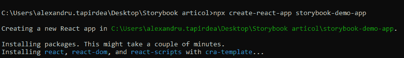

现在您应该有了一个基本的 React 项目:


我们可以将故事书添加到我们的项目中

```
npx sb init
```

这将为您创建两个文件夹:

a)。故事书

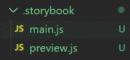

js 是一个配置文件，它告诉 Storybook 要打开哪些字段和使用哪些插件。我们稍后会谈到插件，但是现在你可以考虑像比萨饼的额外配料这样的插件。

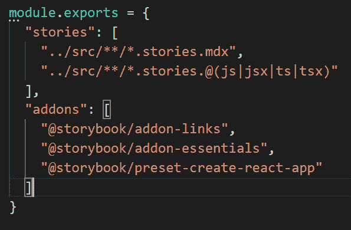

B) src>stories
它包含一些按钮和标题组件的演示故事。

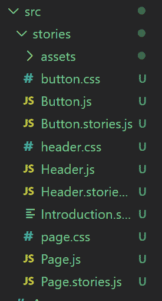

**让故事开始—** *(4 分钟)*

我知道你想运行应用程序，看看会发生什么。神奇的词是:

```
**npm run storybook**
```

在左侧，您应该可以看到所有组件:

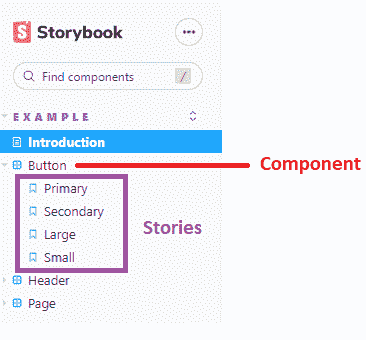

让我们选择第一个故事—主要按钮

这就是故事书的力量。您可以同时查看组件和编辑道具，而无需编写任何代码。

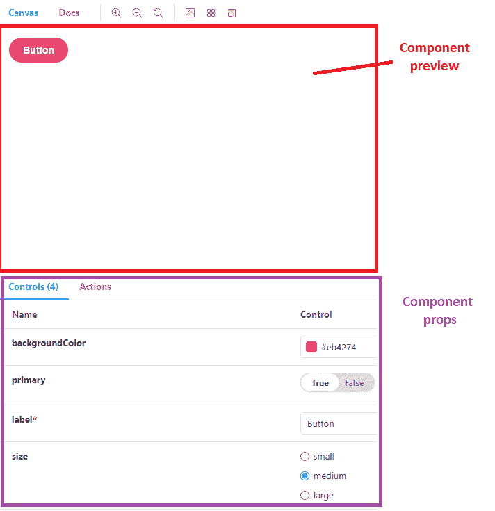

您也可以将模式从 Canvas 更改为 Docs 并查看文档。当您想要添加更多关于组件使用方式的细节时，这非常有用。

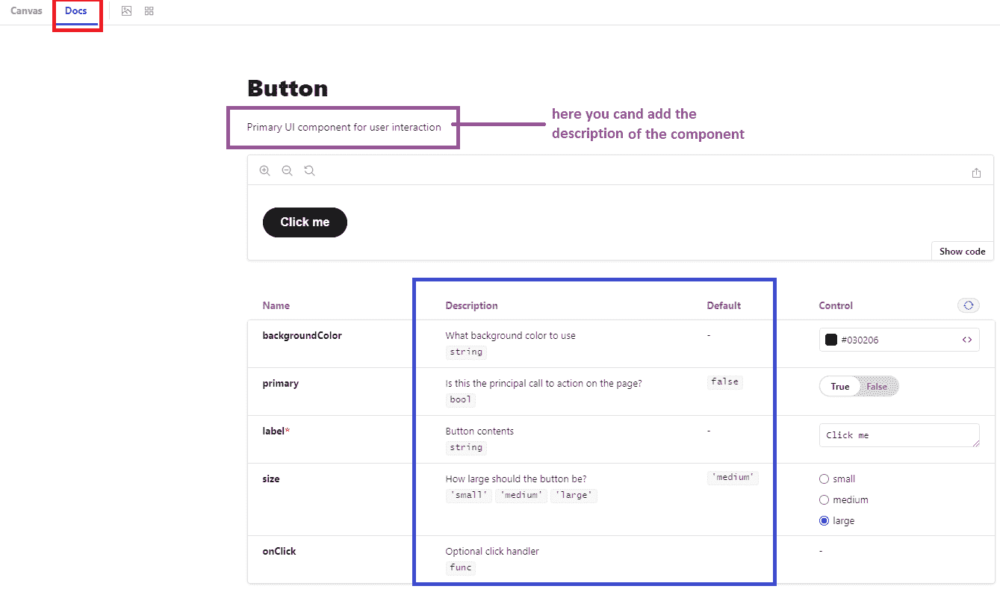

**让我们用代码战斗:**

对于每个组件，我们将有两个文件，一个包含代码，另一个包含所有的故事。

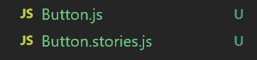

让我们先看看故事，然后再讨论组件代码。

首先，我们需要导入我们的主角。在这种情况下，故事的主人公就是“巴顿”。

```
import React from 'react';import { Button } from './Button';export default {title: 'Example/Button',component: Button,argTypes: {backgroundColor: { control: 'color' },},};
```

然后我们要做的就是用不同的道具来渲染按钮。
在我们的例子中，一个按钮的大小为“大”，另一个按钮的大小为“小”。

```
const Template = (args) => <Button {...args} />; export const Large = Template.bind({});Large.args = {size: 'large',label: 'I am a LARGE button',};export const Small = Template.bind({});Small.args = {size: 'small',label: 'I am a SMALL button',};
```

仅此而已。我们有了前两个故事。

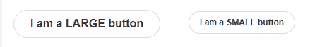

等等，这就是所有的东西？故事书怎么知道创建道具表和文档？

很神奇:)嗯，也不尽然。

为了理解它是如何工作的，我们应该看看代码。
答案是道具类型:

```
Button.propTypes = {/*** Is this the principal call to action on the page?*/primary: PropTypes.bool,* How large should the button be?*/size: PropTypes.oneOf(['small', 'medium', 'large']),};
```

和默认道具

```
Button.defaultProps = {primary: false,size: 'medium',};
```

Storybook 它足够聪明，能够理解组件的类型并相应地创建控件。

所以 primary:bool 会变成一个有真/假的按钮。不仅如此，它还将添加注释作为描述，并添加 defaultProps 中的默认值

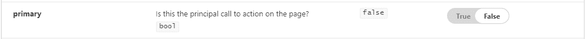

**什么是插件，如何使用？——***(2 分钟)*

有时你需要额外的配料来做披萨，好消息是有很多故事书插件。

您可以在这里找到它们:

[https://storybook.js.org/addons](https://storybook.js.org/addons)

让我们一起安装一个辅助插件:
[https://storybook.js.org/addons/@storybook/addon-a11y/](https://storybook.js.org/addons/@storybook/addon-a11y/)

神奇的词是:

```
npm install @storybook/addon-a11y
```

npm 安装插件后，你需要手动添加它

*。故事书> main.js*

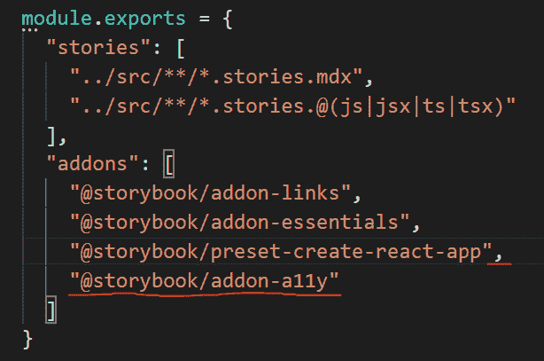

我命令您使用以下命令再次运行该应用程序

```
*npm run storybook*
```

现在，您将看到一个带有可访问性的新选项卡，以及可访问性检查的结果

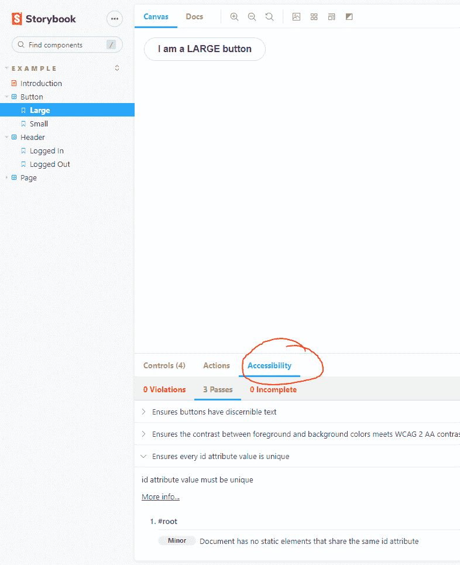

**故事的结局？—** *(1 分钟)*

T21:差远了，但我答应给你 10 分钟，这个故事应该是 10 分钟左右。我要求你安装一个不同的插件，看看它对你有什么用处。

这是我第二篇关于媒体的文章，非常感谢你的反馈。请在评论中告诉我这篇文章是否有用，以及你想在 10 分钟内学到什么。