# 你需要知道的关于 Chrome 扩展的一切

> 原文：<https://itnext.io/all-youll-ever-need-to-know-about-chrome-extensions-ceede9c28836?source=collection_archive---------0----------------------->


听起来很有希望？希望如此！在这篇文章中，我将试图揭开开发 Chrome 扩展时你需要知道的一切。我确信在阅读完这篇文章后，您将能够很容易地开发自己的扩展，而不会有太多的麻烦。有许多事情要谈，所以让我们直接开始吧。

# 基本概念

当我们想到一个扩展(也称为插件)时，我们有时会想到谷歌浏览器工具栏右上角的图标。大多数人可能记得，当你点击这个图标时，通常会出现一个漂亮的弹出窗口。实际上，这只是扩展的一部分。扩展是由三(3)个独立部分组成的生态系统:

1.  当你点击工具栏中的图标时，你看到的**弹出**。
2.  在现有网站上运行的**内容脚本**。
3.  在谷歌浏览器后台运行的**后台脚本**。

名字不是随便起的，就是这么叫的。这三(3)个部分彼此完全独立，服务于完全不同的目的。我知道这还不能说明什么，但是坚持住。我可以向您保证，在本文结束时，您将会有一个完整的了解。让我们一个一个地检查一下:

## 弹出窗口

正如我之前提到的,**弹出窗口,**,仅仅是你点击图标与插件交互时看到的 UI。

> 实际上，它只是一个典型的网站

是的，没错，它只是一个普通的网站，唯一的区别是它从 Chrome 获得有限的资源。你可以在网站上做任何你想做的事情；写 CSS，使用 React，执行 AJAX 请求等。网站和 Chrome 扩展弹出窗口的唯一区别是，它需要注册为扩展弹出窗口。为此，你只需要添加一个名为 *manifest.json.* 的额外文件，通过添加和配置它，你的网站就可以作为插件运行了。

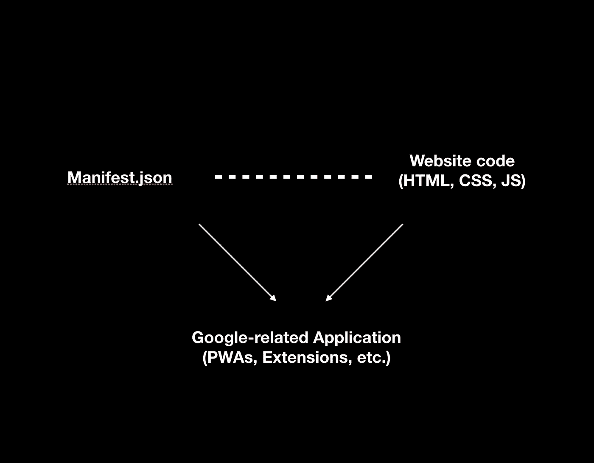

弹出的是你的网站代码+ manifest.json

*manifest.json* 是 Google 为了配置您的扩展(以及其他)而读取的内容。为了演示，选择任意目录并创建一个简单的 HTML 文件，文件名为*index.html*:

```
<html>
  <body>
    <h1>Hello world</h1>
  </body>
</html>
```

接下来，在同一个目录下，创建一个 *manifest.json* 文件，并填充以下基本内容:

```
{
  "name": "My plugin",
  "version": "0.0.1",
  "description": "This is the full description of the plugin",
  "manifest_version": 2
}
```

我们还没有做任何与扩展相关的事情。我们所做的只是创建了一个 HTML 和一个清单，其中只陈述了我们项目的一些信息。现在是时候将我们的项目标记为 Chrome 扩展了。编辑 manifest.json 并添加以下几行:

```
{
  "name": "My plugin",
  "version": "0.0.1",
  "description": "This is the full description of the plugin",
  "manifest_version": 2,
  **"browser_action": {
    "default_popup": "./index.html",
    "default_title": "Open the popup",
    "default_icon":"./image.png"
  }**
}
```

***browser_action*** 键实质上翻译成“给我我需要的信息，以便创建一个扩展扩展弹出窗口”。我们告诉 Google“当用户点击扩展图标(***【default _ icon】)***，向他们显示一个弹出窗口，其内容可以在***default _ popup****中找到。*此外，当他们悬停在扩展的图标上时，向他们显示在***default _ title***下找到的文本。现在我们剩下要做的就是将插件加载到浏览器中。我们有两种方法:

## **1。自动通过 Chrome 商店**

导航到商店中的插件页面，然后点击“安装插件”(类似于 Google Play)

> 对生产部署有用

## **2。手动浏览 chrome://extensions 页面**

通过选择“Load unpacked ”,加载包含我们工作的文件夹

> 对当地发展有用

或者，打包(压缩)文件，然后通过选择单个压缩文件来选择“加载打包”

> 有助于与他人分享工作

我们商店里还没有，所以我们要用手动的方式。我们将遵循第一种方法，我们将加载我们工作的“解包”版本，通过向 google 指示我们的文件所在的文件夹。

在谷歌浏览器上导航至`chrome://extension`。

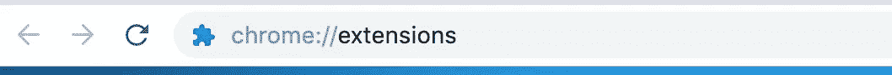

从那里，打开开发者模式(右上角的开关)。


点击右上角的“Load unpacked”按钮。

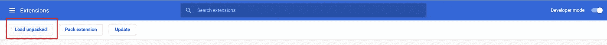

选择包含 2 个文件的文件夹(外加一个图标图像)。

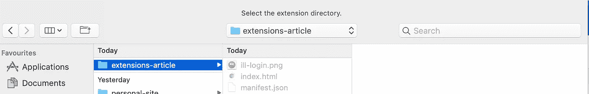

如果一切顺利，你应该会在主页和工具栏上看到你的插件。

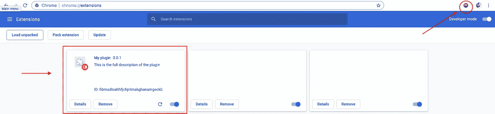

现在，如果您单击工具栏图标，您应该会看到我们添加的 HTML:

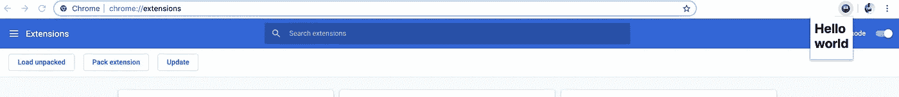

恭喜你。您已经成功创建了一个小插件！现在你可能会认为这只是一个“你好世界”，但不要被骗了。这是一个功能齐全的网站。你可以在一个典型的网站上做任何你通常会做的事情。你可以让*index.html*加载 javascript 文件、css 文件、字体等。如果愿意，您可以在其中创建一个 React 应用程序。字面意思，任何东西！有一点要知道，每次你关闭它，就好像你关闭了一个网站的标签。存储在内存中的所有内容都会丢失，就像网站刷新后会发生的情况一样。毕竟是网站啊！

那么，为什么我们首先要有一个弹出窗口呢？它主要是为你的用户提供一个用户界面。它为插件提供了一个很好的与用户互动的方式，这样用户就可以对某些事情进行输入/反馈。有趣的是，插件的核心功能通常不存储在那里，因为那是由**内容脚本**或**后台脚本**来处理的。

## 内容脚本

这些是添加到网站顶部的 CSS 和 JS 文件。这意味着你可以在网站上添加额外的文件，就好像它们是由最初的开发者自己添加的一样。你见过一些扩展是如何操纵你在页面中看到的东西的吗？他们就是这么做的！他们只是添加了额外的Javascript 和/或 CSS。您可以添加任意数量的额外文件，只要您在清单中指定它们。

为了展示他们的能力，我们将修改我们之前的例子，并给它一些额外的功能。把所有谷歌网站的背景颜色都改成红色，这看起来并不好玩，所以我们就这么做吧。创建一个 *content.css* 文件，并向其中添加以下代码:

```
body {
  background-color: red !important;
}
```

另外，为什么不写一些 javascript 呢？让我们创建一个 *content.js* 文件，并确保每次用户单击页面中的任何位置时，都会显示一个警告:

```
document.addEventListener('click', () => alert('Click occurred!'));
```

最后，让我们将这两个文件注册为**内容脚本**。为此，我们需要指定将这些脚本“添加到”哪些网站。这是通过“*matches”*键完成的，这是一个正则表达式模式，可以让你针对任何网站，从每一个网站到特定的网站。在我们的例子中，我们希望向所有以**google.com**结尾的网站注册我们的内容脚本。为此，让我们更改我们的 *manifest.json* 并添加以下代码:

```
{
  "name": "My plugin",
  "version": "0.0.1",
  "description": "This is the full description of the plugin",
  "manifest_version": 2,
  "browser_action": {
    "default_popup": "./index.html",
    "default_title": "Open the popup",
    "default_icon":"./image.png"
  },
  **"content_scripts": [
    {
      "js": ["content.js"],
      "css": ["content.css"],
      "matches": ["https://*.google.com/*"]
    }
  ]**
}
```

点击插件卡中的刷新图标，重新加载插件，可在`chrome://extensions`下找到:

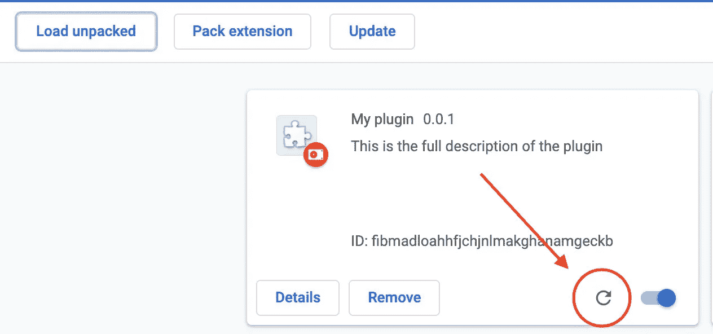

清单更新后刷新插件数据

现在，试着打开 google.com。您应该会看到类似这样的内容:

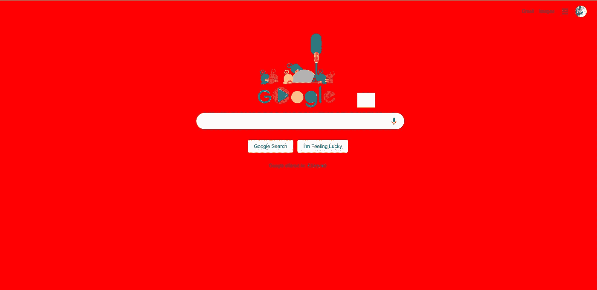

CSS 内容脚本的修改

如果你试图点击任何地方，你应该看到一个可怕的警告弹出:

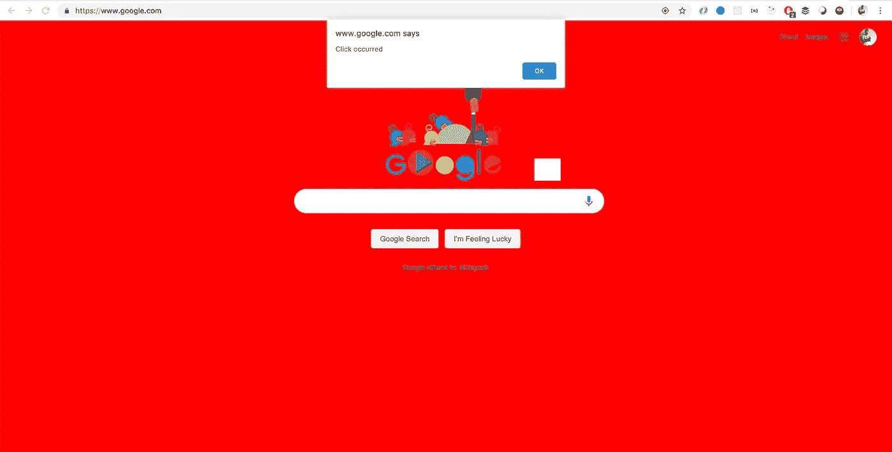

JS 内容脚本的修改

我知道这很愚蠢，但请从全局来看。你可以添加任何你想要的东西到任何你想要的网站。您可以在网站的 DOM 元素上安装 React 应用程序，并在现有网站旁边运行您自己的 React 应用程序！这些脚本会在网站打开后立即加载，并保持活动状态，直到相应的标签关闭。把它们想象成网站会自己加载的普通脚本。

## 后台脚本

让我们暂时忘记我们正在处理的虚拟扩展，假设我们想要同步用户已经下载到远程 repo 的所有文件。我们需要一个脚本来持续监控 Chrome 的下载，但是我们应该把它放在哪里呢？我们不会把它放在内容脚本中，因为它只会在特定页面加载时加载。我们也不会把它放在弹出窗口中，因为它的脚本只在你打开弹出窗口时运行，一旦你关闭弹出窗口就停止运行。嗯，这是后台脚本的工作。

这些 JS 脚本运行在页面的上下文之外，但是在浏览器的上下文之内。当你安装插件时，它们被激活**一次**，并且——只要插件保持安装——只要它们至少注册了一(1)个监听器，它们就保持活动状态。后台脚本停止运行的唯一方式是如果它真的没有任何事情可做。如果你让它监视或监听什么，它会一直在后台运行，耐心等待...呃，有点吓人。

后台脚本是 Chrome Extension 生态系统中最稳定的部分，因为它们不容易被“突然杀死”。内容脚本和弹出窗口中的脚本的生命周期取决于相应的网站和弹出窗口。相反，后台脚本依赖于您的扩展，因此只要它保持安装状态，脚本就会以守护程序的方式在后台运行。

为了试探一下，我们先创建一个文件 *background.js* ，并向其中添加一个简单的警告:

```
alert('Hello from background script!');
```

现在让我们通过调整 *manifest.json* 来确保在我们的扩展中将它注册为后台脚本，如下所示:

```
{
  "name": "My plugin",
  "version": "0.0.1",
  "description": "This is the full description of the plugin",
  "manifest_version": 2,
  "browser_action": {
    "default_popup": "./index.html",
    "default_title": "Open the popup",
    "default_icon":"./image.png"
  },
  "content_scripts": [
    {
      "js": ["content.js"],
      "css": ["content.css"],
      "matches": ["https://*.google.com/*"]
    }
  ],
  **"background": {
    "scripts": ["background.js"]
  }**
}
```

现在，如果我们刷新插件(就像上一个例子)，你应该会立即看到一个警告。

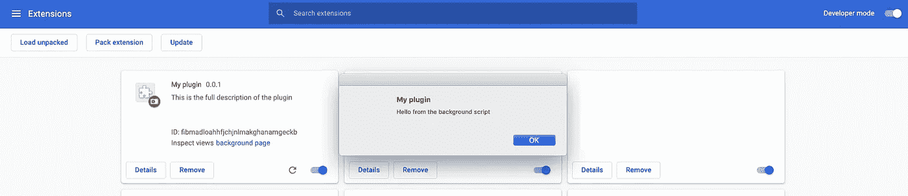

后台脚本的激活

正如我们之前提到的，一旦安装了扩展，后台脚本就会被激活**一次。如果您停用&重新激活插件(通过上面截图中可见的开关)，您将再次看到此警报。**

# 把所有的放在一起

如前所述，我们的生态系统有三个部分:弹出窗口、内容脚本和后台脚本。让我们确保我们做对了:

*   **弹出:**插件的自定义 UI。你可以定义 HTML，CSS，JS，弹出相关的图片。它的行为完全像一个典型的网站。每当你切换弹出窗口，就好像你在刷新一个网站！(即数据被重置)
*   **后台脚本:**每个扩展安装**时在后台运行一次的 JS 脚本集合。**用于配置&设置，我们只声明一次&不想关闭或重置(全局监听器等)。).
*   **内容脚本:**添加到网站代码中的脚本集合，就好像它们是网站自带的一样。可以访问 DOM 中的所有内容。对于以任何方式与页面的 DOM 交互都很有用。

一个插件必须注册**至少**其中之一，否则它一开始就没有理由成为一个插件。尽管所有这些部分都是可选的(例如，您可能不需要弹出窗口，因为您不想公开任何接口)，但仍然必须声明其中的至少一个(1)。

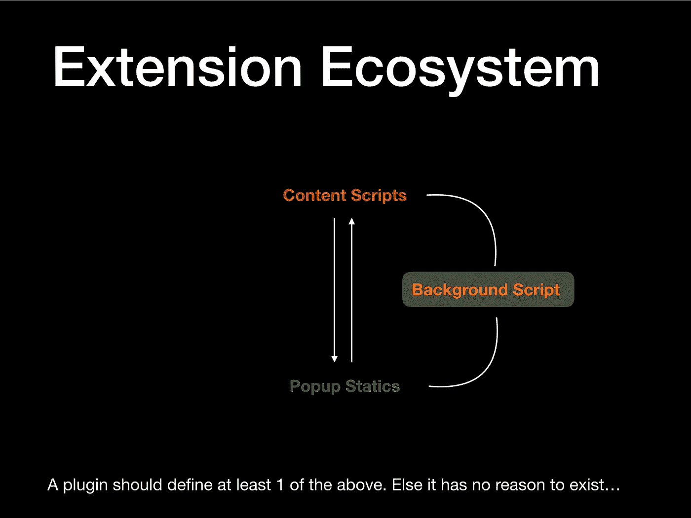

所有这三个独立的部分都生活在他们自己的小世界里。它们是完全沙箱化的，彼此不了解，因此不能直接**访问彼此。相反，它们依靠 Chrome 定义的一组 API 来交换信息。如果您曾经使用过 web workers，您可能已经看到过，其中主&工作线程通过消息**相互通信。**这里有大量的 API(确切地说是 63 个),我们不可能涵盖所有的，但是我会确保我浏览了核心的 API，因为我很少发现自己使用任何其他的 API，除非我正在构建一些非常具体的东西。**

# Chrome APIs

正如上面提到的，它们为你的扩展提供了一种让 Chrome 为你做事情的方式。你可以询问用户的标签，访问他们的下载，他们的浏览历史，等等。除了一些例外，每个 API 都有一个特定的权限。权限注册在 *manifest.json* 中，是一种告诉用户“嘿，我的插件将要访问这个、这个和那个”的方式。这类似于原生应用程序的工作方式，其中许多应用程序在下载时需要访问特定的 API，如相机。如果你没有指定某个 API 的权限，Google 现在会允许你使用。

## 消息传递(运行时)API

这是一个广泛的范围，包含了扩展生态系统中用于消息交换的所有方法，并且不需要任何权限。目前有两种不同的方式将消息从分机的一部分发送到另一部分:

1.  **一次性**消息请求(把它们想象成一个 HTTP 请求)
2.  **长期存在的**连接(把它们想象成一个 websocket)

第一个向您想要的任何目标发送一次性消息，类似于在 DOM 中触发的事件。对于每个请求消息，都可以有一个可选的响应消息，这就是为什么我将它与典型的 HTTP 请求相关联。

```
// send a message
chrome.runtime.sendMessage({ greeting: 'hello '}, response => 
  console.log(response.farewell)
});// respond to a message
chrome.runtime.onMessage.addListener(request,sender, sendResponse => 
  if (request.greeting === 'hello') {
    sendResponse({ farewell: 'goodbye' })
  }
});
```

不幸的是，如果你是垃圾邮件，那么走这条路不是很有效。相反，您可以选择第二个选项，创建一个可以随意向其发送垃圾邮件的端口。它可以处理大量流量，但不幸的是，它没有提供响应消息的机制。因此，如果你依赖于一个回应，那么第一个选择就是要走的路。

```
// connect to a custom channel/port
const port = chrome.runtime.connect({ port: 'foo' });// push a message to the channel
port.sendMessage({ greeting: 'hello' });// react to the message (can't respond back!)
port.onMessage.addListener(request => {
  if (request.greeting === 'hello') {
    console.log('received a hello message');
  }
});
```

当目标是背景脚本或弹出窗口时，`chrome.runtime`就可以了。你可以在它的[文档页面](https://developers.chrome.com/extensions/runtime)找到你可能需要的所有信息。不幸的是，如果您的目标是内容脚本，那么您需要指定您希望哪个选项卡接收此消息。为了找到您想要的选项卡(例如，在我们之前的示例中包含“google.com”的选项卡)，您必须利用 tabs API。

## 标签 API

tabs API 允许你与 chrome 窗口打开的所有标签进行交互。您可以查询当前活动的标签，强制标签后退/前进，打开，关闭，缩放等。这是一个非常强大的 API，这就是为什么它的大多数方法都需要在 *manifest.json* 中设置`"tabs"`权限。你可以在它的[对应的 API 文档页面](https://developers.chrome.com/extensions/tabs)中找到你需要的所有信息。

让我们重新看看我们最初的例子，我们把谷歌页面的背景颜色设置为红色。想象一下，我们想要调整它，以便允许用户选择背景颜色。我们想让他们选择通过弹出 UI 来指定它，然后从内容脚本中读取他们的选择。为此，我们需要同时使用消息传递和标签 API。简而言之，我们将允许用户通过输入字段输入颜色，当他们单击“应用”按钮时，我们将向所有加载了“google.com”的选项卡的内容脚本发送包含所选颜色的一次性消息。听起来很有趣？同样，最有可能不是…

我们需要做的第一件事是请求读取用户标签的权限:

```
{
  "name": "My plugin",
  "version": "0.0.1",
  "description": "This is the full description of the plugin",
  "manifest_version": 2,
  "browser_action": {
    "default_popup": "./index.html",
    "default_title": "Open the popup",
    "default_icon":"./image.png"
  },
  "content_scripts": [
    {
      "js": ["content.js"],
      "css": ["content.css"],
      "matches": ["https://*.google.com/*"]
    }
  ],
  "background": {
    "scripts": ["background.js"]
  },
  **"permissions": [
    "tabs"
  ]**
}
```

然后，让我们修改我们弹出窗口的*index.html*来容纳前面提到的输入&按钮:

```
<html>
  <body>
    <input id="colour-input" type="text" />
    <button id="colour-submit-btn">Apply</button> <script src="./popup.js" />
  </body>
</html>
```

让我们也创建一个 *popup.js* 来处理按钮的点击:

```
document
.querySelector('#colour-submit-btn')
.addEventListener('click', () => { // read the colour that the user has selected
  const colour = document.querySelector('#colour-input').value; // get all the google tabs and send a message to their tabs 
  chrome.tabs.query({ url: 'https://*.google.com/*' }, tabs => {
    tabs.forEach(tab => 
      chrome.tabs.sendMessage(tab.id, { colour } )
    );
  });});
```

最后，让我们在内容脚本中处理消息。然后，让我们修改 *content.js* 来处理我们的自定义一次性消息:

```
chrome.runtime.onMessage.addListener(request => {
  if (request.colour) {
    document.body.style.backgroundColor = request.colour;
  }
});
```

我们都准备好了！在我们刷新插件之前，让我们清除 *content.css* 和 *background.js、*中的所有内容**和**，因为我们不再需要它们了。现在刷新和繁荣:

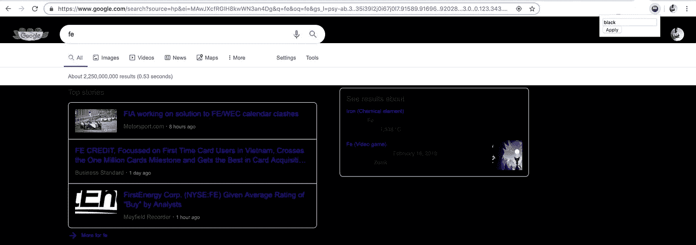

用户通过弹出窗口的输入选择了“黑色”作为背景色

它真他妈的管用！请注意，如果我们刷新页面，我们的更改不是持久的。这是因为我们的内容脚本只对消息做出反应，但是在启动时，我们不会从弹出窗口向它发送任何消息。理想情况下，我们希望将选择存储在某个地方，以便内容脚本可以读取它，并在加载时应用它。为此，我们将利用存储 API。

## 存储 API

存储 API 是 Chrome 的“localstorage”版本，但以异步方式实现。无论何时你想跨会话存储一些东西，以便整个插件生态系统能够阅读**，**那么这应该是你的首选。如果你想知道，这两个内容脚本&都有自己的本地存储，但是由于它们是沙箱化的，它们不能访问彼此的实例。目前有两(2)个版本的存储 API: **本地**和**同步:**

1.  **local** 将数据存储到本地实例 Chrome(你的 PC)中，不依赖于任何用户。
2.  **sync** 将数据存储在“云中”,并将它们绑定到当前的 Gmail 帐户。这些数据可以在你登录的任何电脑上使用。

两者都有完全相同的 API，选择什么取决于你的需求。这个 API 非常简单，给你:`get`、`set`、`remove`、`clear`和一个`onChanged`监听器。你可以在文档中阅读所有相关内容[。要使用存储 API，您需要将*“storage”*权限添加到您的 *manifest.json.*](https://developer.chrome.com/apps/storage)

记住这一点，让我们继续使用它来存储用户的偏好。每次用户选择一种颜色，我们都会将它保存在 Chrome 的存储器中(本地版本)。然后，一旦内容脚本启动，我们将尝试从之前的会话中恢复背景颜色。

让我们对我们的 *manifest.json 做如下修改:*

```
{
  "name": "My plugin",
  "version": "0.0.1",
  "description": "This is the full description of the plugin",
  "manifest_version": 2,
  "browser_action": {
    "default_popup": "./index.html",
    "default_title": "Open the popup",
    "default_icon":"./image.png"
  },
  "content_scripts": [
    {
      "js": ["content.js"],
      "css": ["content.css"],
      "matches": ["https://*.google.com/*"]
    }
  ],
  "background": {
    "scripts": ["background.js"]
  },
  "permissions": [
    "tabs",
 **"storage"**  ]
}
```

然后保存用户的选择，只要用户选择一种新颜色，就添加下面的代码:

```
document
.querySelector('#colour-submit-btn')
.addEventListener('click', () => {// read the colour that the user has selected
  const colour = document.querySelector('#colour-input').value;**// Store the user's data
chrome.storage.local.set({ colour });**// get all the google tabs and send a message to their tabs 
  chrome.tabs.query({ url: 'https://*.google.com/*' }, tabs => {
    tabs.forEach(tab => 
      chrome.tabs.sendMessage(tab.id, { colour } )
    );
  });});
```

最后，修改 *content.js* 以从存储值启动:

```
**chrome.storage.local.get('colour', (response) => {
  if (response.colour) {
    document.body.style.backgroundColor = response.colour;
  }
});**

chrome.runtime.onMessage.addListener(request => {
  if (request.colour) {
    document.body.style.backgroundColor = request.colour;
  }
});
```

就是这样！您现在可以持久化数据。

# 结束语

这篇文章的目的是让你对 Chrome 插件的底层基础设施感到舒适。我希望你记住的是，在一天结束的时候，一个扩展就像一个不同的&孤立的脚本的集合，你可以彼此协调。实现这一点的核心 API 是标签、消息和存储，但 Chrome [有许多不同的 API](https://developers.chrome.com/extensions/api_index)。我鼓励你用 1 分钟的时间快速阅读他们的描述，因为你可以用它们来构建非常有趣的东西。希望你现在在创建自己的插件时更加自信，我会非常乐意回答你的任何问题。

感谢坚持到最后！

*附:(1)确保通过* `*chrome://extensions*` *页面禁用或删除插件，因为背景颜色的变化会立即让你生气。*

如果你想知道的话，devtools 扩展只是一个弹出菜单，但是有不同的用户界面。适用于 popup 的规则也适用于 devtools，只是您在 manifest.json 中的不同键下注册了它的 HTML

***P . S③。*👋 ***嗨，我是*** [***阿盖洛斯***](https://aggelosarvanitakis.me) ***！如果你喜欢这个，可以考虑在 twitter 上关注我，并与你的开发者朋友分享这个故事😀*****