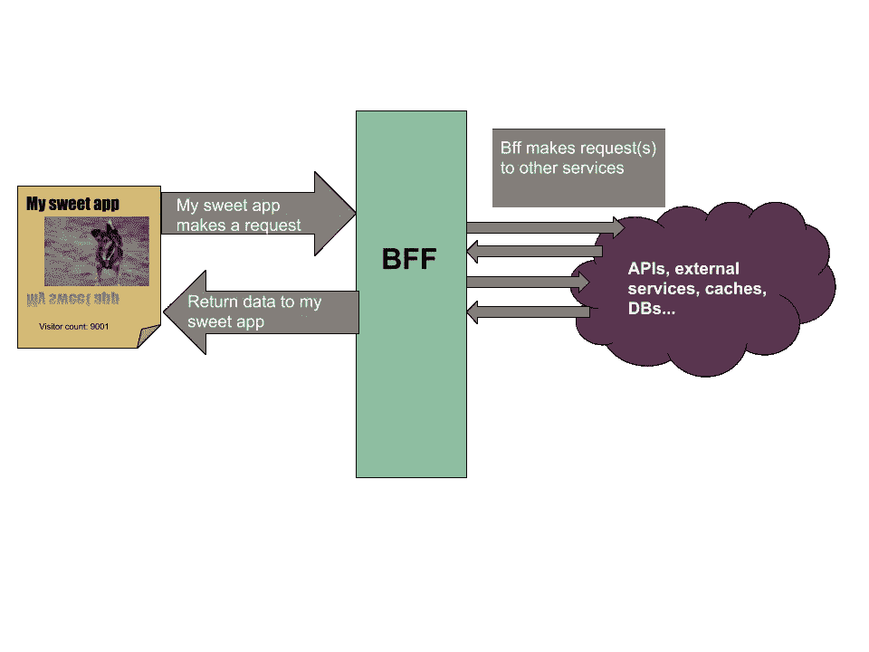

# 永远有一个最好的朋友

> 原文：<https://itnext.io/always-have-a-bff-e25b4794826d?source=collection_archive---------1----------------------->

为什么你应该(总是)有一个前端后端

好吧，好吧——永远不意味着永远。但实际上，后端对前端的模式是每个人都应该使用的，并且很容易跳过。但是前端有后端应该意味着很少的前期工作，可以带来一系列未来的好处。

# 什么是 BFF？

前端的后端(BFF)是为客户端应用程序提供服务的服务器。从某种意义上说，每个 web 应用程序都需要类似这样的东西作为资产的起点，但是这种模式并不局限于 web 应用程序。

BFF 模式的示例

注意，BFF 最简单的形式就是为你的其他 API 提供一个代理服务器。即使使用简单的代理服务器，我们也已经可以从该模式中获得潜在的好处。

例如，通过首先将所有内容发送到代理服务器，这意味着您不必向外部公开您的 API。隐藏实现细节会使某些人更难协调攻击(尽管从长远来看，通过隐藏来实现安全性并不是可行的防御措施)。它还会立即为您提供一个地方，在您可能超载的 API 之外开始缓存或速率限制请求。对于服务于许多客户的 API 来说，拥有一个快速关闭阀可以避免整个世界陷入火海。

# 但是这样不会增加延迟吗？

简单的答案是肯定的，但长的答案是否定的。

在客户端应用程序和它所请求的服务之间放置代理服务器会增加延迟。发出 HTTP 请求(或者你正在使用的任何东西)是有开销的。但是如果您只是转发请求和响应，那么这应该是微不足道的开销，而且几乎肯定还有其他瓶颈。就像一些开发人员搞砸了一个 webpack 配置，而你却在开发模式下发布 React。(谁会这么做。不是我👀)

但是构建 BFF 允许您智能地批量调用其他后端并一次返回所有数据，或者转换成更方便的表示。这对于 2G 或 3G 网络上的客户端非常有用，在这些网络上，仅建立连接就需要几秒钟(或更长时间)。你不希望他们发出几十个并发请求，[其中并发也可以被浏览器](https://stackoverflow.com/questions/985431/max-parallel-http-connections-in-a-browser)限制。

再加上前面提到的缓存，您应该能够显著提高客户端应用程序的性能。这些好处不仅限于 web 应用程序。没有规定说你不能为你的本地或桌面应用程序设置单独的后端。你甚至可以为 android 和 ios，或者平板电脑和手机(或者可折叠手机)提供不同的后端。)，所有这些都可能以不同的方式向用户呈现数据，因此对获取数据有不同的要求。

你可能已经猜到了，但是如果你有一个应用程序在做服务器端渲染，那么这意味着你需要一个 BFF 来完成。SSR 可能适合您的应用程序，也可能不适合，但它是一个很好的优化客户端的例子，即“改为在服务器上进行”。

# 关注点分离

这里重要的一点是，它允许您将前端需求与后端关注点分开。web 应用程序不同于远程 API，前端通常会发现转换从服务器获取的数据很有用。这也让我们获得了四人帮的深层魔力。

> **编程到一个“接口**”，而不是一个“实现”。— [设计模式](https://en.wikipedia.org/wiki/Design_Patterns)

BFF 充当客户端代码的一种接口。如何在 BFF 背后实现这一点与您的客户端应用程序无关。事实上，让您的客户端应用程序知道更少的 API 结构将使它对这些 API 的变化更有弹性。你可以控制在你的服务器上运行什么，但是通常很难控制你的客户端在运行什么*，尤其是在本地环境中。*

以计费系统为例。你允许人们保存他们的信息，这样他们以后就可以像任何文明的电子商务网站一样轻松地再次付款。保存用户的账单信息有什么意义？嗯，它可能包括支付工具，如信用卡和帐单地址。这很好，您创建了一个 API 来存储账单信息。

后来你意识到，除了账单信息之外，地址真的很有用。它们可能是送货地址，或法定地址，或者可能是您的产品使用的地址。在这一点上，你意识到让一个处理地址管理的 API*与处理支付工具的 API*分开会非常方便。因为您已经编写了一个 BFF，所以您可以进行重写，在后端交换实现，并且您所有的旧客户端将继续工作🚀。

## 错误处理

次要的一点是，这也允许您更好地处理 UI 错误。我个人的经验是，服务器错误往往是冗长的，对于决定向用户显示什么不是很有用。通常情况下，您可能会有 50 个不同的服务器错误，所有这些错误都表明在调试警报和凌晨 2 点时非常有趣和有用，但它们可能都会导致完全相同的用户体验。通过将后端用于前端，您可以将客户端代码的预期简化为一个已知的错误子集，并处理 BFF 上的映射。

总结一下，考虑投入时间来确保您的客户端应用程序没有直接调用 API。这样做为将来的优化和不那么痛苦的迁移打开了大门，这可以随着项目复杂性的增加而提高速度。