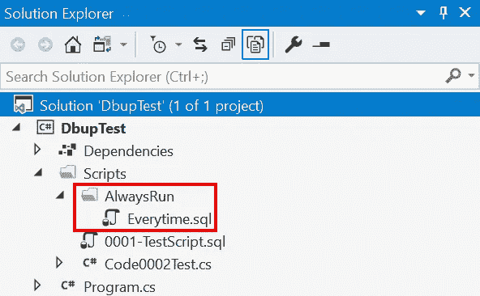

# 始终使用 DbUp 运行迁移

> 原文：<https://itnext.io/always-run-migrations-with-dbup-7ea88c31ee82?source=collection_archive---------4----------------------->

在本文中，我们将介绍如何使用 DbUp 在每次运行时运行特定的迁移，而不是只运行一次。如果您是 DbUp 的新手，可以看看下面的帖子，看看示例项目是如何达到当前状态的。

[使用 DbUp 进行数据库迁移](https://elanderson.net/2020/08/database-migrations-with-dbup/)
[使用 DbUp 进行基于代码的数据库迁移](https://elanderson.net/2020/08/code-based-database-migrations-with-dbup/)


## 区分始终运行

获得应该每次都运行的迁移的关键之一是能够将它们与应该只运行一次的迁移区分开来。这可以在文件名级别完成，也可以通过将所有始终运行的文件放在特定目录中来完成。这个示例使用目录方法，但是文件方法的工作方式基本相同。在示例项目中，在现有的**脚本**目录下，我添加了一个 AlwaysRun 目录。我还在这个目录中添加了一个示例脚本，这样我们可以验证它是否在每次运行时都被执行。在示例中，该文件被命名为 **Everytime.sql** 。



基于以上内容，当 DbUp 正在处理时，它会将 **Everytime.sql** 视为 **DbupTest。scripts . always run . every time . SQL**。

## 过滤掉总是运行

现在，我们有了一种方法来确定我们希望始终运行的迁移，我们需要将它们从现有的升级过程中筛选出来，这样它们就不会包含在已执行迁移的日志中。在 DbUp 中，该日志被称为日志。设置如何定位迁移的扩展方法，在我们的示例中是**withscriptsbembeddedinassembly**或**WithScriptsAndCodeEmbeddedInAssembly**，可以提供一个过滤器，我们将使用该过滤器排除 **AlwaysRun** 目录中的迁移。以下代码是安装了过滤器的升级程序。

```
var upgrader =
    DeployChanges.To
                 .SqlDatabase(connectionString)
                 .WithScriptsAndCodeEmbeddedInAssembly(Assembly.GetExecutingAssembly(),
                                                       f => !f.Contains(".AlwaysRun."))
                 .LogToConsole()
                 .Build();

var result = upgrader.PerformUpgrade();
```

## 执行始终运行迁移

既然我们已经调整了我们的原始升级程序以排除 AlwaysRun 目录中的迁移，我们需要一些东西来执行 always run 迁移。为了实现这一点，我们添加了第二个升级程序，该升级程序被过滤为总是运行脚本。关于这个第二升级程序的第二个真正重要的地方是它使用了一个 **NullJournal** 。 **NullJournal** 阻止脚本的执行被记录，这导致它们总是运行。在上述代码之后插入了以下代码。突出显示的位指出过滤器和空日志。

```
if (result.Successful)
{
    var alwaysRunUpgrader =
        DeployChanges.To
                     .SqlDatabase(connectionString)
                     .WithScriptsAndCodeEmbeddedInAssembly(Assembly.GetExecutingAssembly(),
                                                           f => f.Contains(".AlwaysRun."))
                     .JournalTo(new NullJournal())
                     .LogToConsole()
                     .Build();

    result = alwaysRunUpgrader.PerformUpgrade();
}
```

以下是完整的 **Main** 函数，以防上面的代码没有给出足够的上下文来说明代码应该如何组合在一起。

```
static int Main(string[] args)
{
    var connectionString =
        args.FirstOrDefault()
        ?? "Server=localhost; Database=WideWorldImporters; Trusted_connection=true";

    var upgrader =
        DeployChanges.To
                     .SqlDatabase(connectionString)
                     .WithScriptsAndCodeEmbeddedInAssembly(Assembly.GetExecutingAssembly(),
                                                           f => !f.Contains(".AlwaysRun."))
                     .LogToConsole()
                     .Build();

    var result = upgrader.PerformUpgrade();

    if (result.Successful)
    {
        var alwaysRunUpgrader =
            DeployChanges.To
                         .SqlDatabase(connectionString)
                         .WithScriptsAndCodeEmbeddedInAssembly(Assembly.GetExecutingAssembly(), 
                                                               f => f.Contains(".AlwaysRun."))
                         .JournalTo(new NullJournal())
                         .LogToConsole()
                         .Build();

        result = alwaysRunUpgrader.PerformUpgrade();
    }

    if (!result.Successful)
    {
        Console.ForegroundColor = ConsoleColor.Red;
        Console.WriteLine(result.Error);
        Console.ResetColor();
#if DEBUG
        Console.ReadLine();
#endif                
        return -1;
    }

    Console.ForegroundColor = ConsoleColor.Green;
    Console.WriteLine("Success!");
    Console.ResetColor();

    return 0;
}
```

## 包扎

有了上面的更改，我们现在有了一个可以运行正常迁移、基于代码的迁移和始终运行迁移的项目。无论您决定采用哪种类型的数据库变更管理，在某种源代码控制系统中进行变更都会非常有帮助。

更多关于 DbUp 日志的信息，请查看[官方文件](https://dbup.readthedocs.io/en/latest/more-info/journaling/)。

*原载于*[](https://elanderson.net/2020/08/always-run-migrations-with-dbup/)**。**