# 针对 ECS 上的容器化应用程序的 Amazon ECR 跨帐户访问

> 原文：<https://itnext.io/amazon-ecr-cross-account-access-for-containerized-applications-on-ecs-fb88f8f2e988?source=collection_archive---------1----------------------->

*此* [*post*](https://garystafford.medium.com/amazon-elastic-container-registry-ecr-cross-account-access-for-ecs-2f90fcb02c80?source=your_stories_page-------------------------------------) *有一个 2021 年 4 月的更新版本，它使用* [*AWS CLI 版本 2*](https://docs.aws.amazon.com/cli/latest/userguide/install-cliv2.html) *命令进行 ECR 和 Docker 映像的更新版本。请参考这个更新的帖子。*

最近，有人问我一个问题，关于与另一个 AWS 帐户共享一个 AWS 帐户的[Amazon Elastic Container Registry](https://aws.amazon.com/ecr/)(ECR)中的 Docker 图像，该帐户正在使用 [AWS Fargate](https://aws.amazon.com/fargate/) 部署到[Amazon Elastic Container Service](https://aws.amazon.com/ecs/)(ECS)。答案相对简单:使用 [ECR 存储库策略](https://docs.aws.amazon.com/AmazonECR/latest/userguide/RepositoryPolicyExamples.html)来允许跨账户访问拉取图像。然而，魔鬼总是在*实现*细节。构建 ECR 存储库策略可能取决于您的特定架构、部署工具选择和帐户访问方法。在这篇简短的帖子中，我们将探索一个常见的架构场景，该场景需要配置 ECR 存储库策略来支持跨 AWS 帐户共享图像。

# 介绍

我经常遇到两种情况，需要在多个 [AWS 账户](https://aws.amazon.com/account/)之间共享基于 ECR 的 Docker 图像。在第一个场景中，供应商希望与他们的客户安全地共享 Docker 映像。许多流行的容器安全性和可观察性解决方案都是以这种方式运行的。

下面，我们看到一个应用平台由三个容器组成的例子。集装箱的两个图像来自客户自己的 ECR 存储库(*右侧*)。第三个容器的图像来自其供应商的 ECR 注册表(*左侧*)。

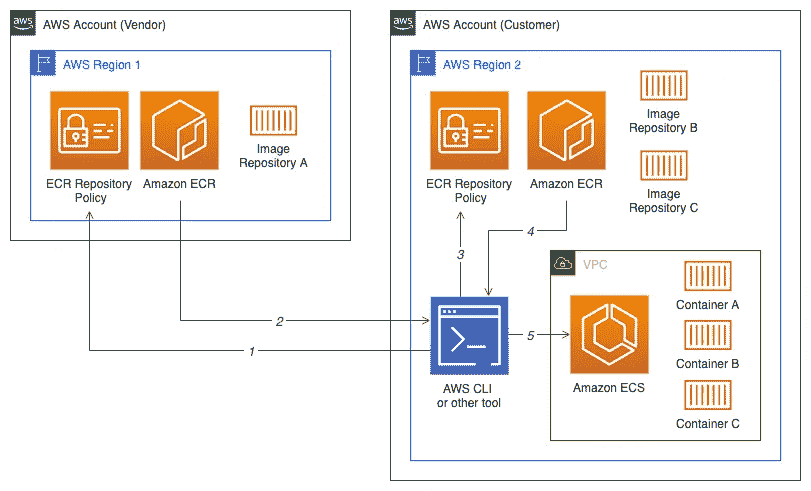

在第二个场景中，企业操作多个 AWS 帐户，以在环境和职责之间创建逻辑安全边界。第一个 AWS 帐户包含企业的可部署二进制资产，包括 ECR 映像存储库。企业有额外的帐户，每个帐户对应一个应用程序环境，例如开发、测试、试运行和生产。需要从每个环境(单独的 AWS 帐户)访问存储库帐户中的 ECR 映像，通常需要跨越多个 AWS 区域。

下面，我们看到一个例子，其中部署的应用程序平台由三个容器组成，其中所有的映像都来自 ECR 存储库(*左侧*)。映像被拉入生产帐户，以部署到 ECS ( *右侧*)。

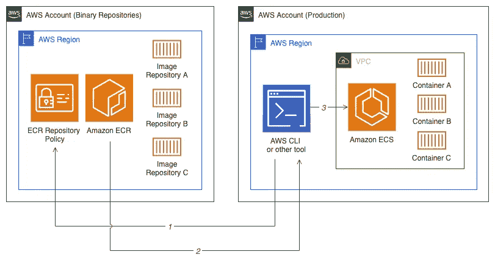

在本帖中，我们将探讨第一个场景，一个希望与客户安全共享 Docker 映像的供应商。我们将演示如何使用 ECR 存储库策略，在 AWS 帐户之间共享图像，以用于 Docker Swarm 和 ECS 与 Fargate。为了实现这个场景，我们将使用我已经创建的现有应用程序，一个 RESTful 的、基于 HTTP 的 NLP(自然语言处理)API，由三个 Golang 微服务组成。边缘服务`nlp-client`与`rake-app`服务和`prose-app`服务通信。

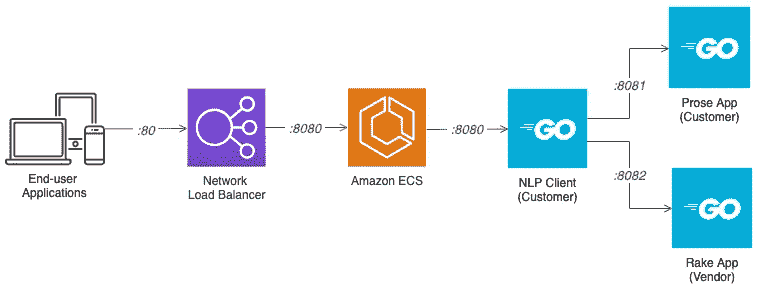

演示中的场景是，客户已经开发了基于`nlp-client`和`prose-app`容器的服务，作为其 NLP 应用程序的一部分。他们没有开发自己的 [RAKE](https://github.com/afjoseph/RAKE.Go) (快速自动关键词提取)算法的实现，而是以 Docker 镜像的形式从供应商那里获得了一个版本，即`rake-app`服务。

NPL API 公开了几个端点，可以通过`nlp-client`服务访问。端点对文本执行常见的 NLP 操作，如提取关键字、标记和实体。点击`/routes`端点，所有端点均可见。

```
[
  {
    "method": "POST",
 **"path": "/tokens",**    "name": "main.getTokens"
  },
  {
    "method": "POST",
 **"path": "/entities",**    "name": "main.getEntities"
  },
  {
    "method": "GET",
 **"path": "/health",**    "name": "main.getHealth"
  },
  {
    "method": "GET",
 **"path": "/routes",**    "name": "main.getRoutes"
  },
  {
    "method": "POST",
 **"path": "/keywords",**    "name": "main.getKeywords"
  }
]
```

# 要求

为了进行演示，您将需要两个 AWS 帐户，一个代表供应商，一个代表他们的一个客户。创建额外的 AWS 帐户相对简单，你需要的只是一个唯一的电子邮件地址(使用 Gmail 很容易)和一张信用卡。使用 [AWS 组织](https://aws.amazon.com/organizations/)可以使创建和管理多个帐户的任务变得更加容易。

我有目的地在每个客户中使用不同的 [AWS 区域](https://docs.aws.amazon.com/AmazonRDS/latest/UserGuide/Concepts.RegionsAndAvailabilityZones.html)来演示如何在 AWS 客户和区域之间共享 ECR 图像。你需要一个最新版本的 [AWS CLI](https://aws.amazon.com/cli/) 和 [Docker](https://hub.docker.com/?overlay=onboarding) 。最后，您需要对每个 AWS 帐户有足够的访问权限来创建资源。

# 源代码

演示的源代码包含在四个公共的 GitHub 存储库中。第一个存储库包含所有 CloudFormation 模板和 Docker Compose 堆栈文件，如下所示。

```
.
├── LICENSE
├── README.md
├── cfn-templates
│   ├── developer-user-group.yml
│   ├── ecr-repo-not-shared.yml
│   ├── ecr-repo-shared.yml
│   ├── public-subnet-public-loadbalancer.yml
│   └── public-vpc.yml
└── docker
└── stack.yml
```

其他三个 GitHub 存储库中的每一个都包含一个基于 Go 的微服务，它们共同组成了 NLP 应用程序。每个存储库还包含一个 Dockerfile 文件。

```
.
**├── Dockerfile**
├── LICENSE
├── README.md
├── buildspec.yml
**└── main.go**
```

克隆四个存储库所需的命令如下:

```
git clone --branch master \
    --single-branch --depth 1 --no-tags \
    https://github.com/garystafford/ecr-cross-account-demo.git 

git clone --branch master \
    --single-branch --depth 1 --no-tags \
    https://github.com/garystafford/nlp-client.git

git clone --branch master \
    --single-branch --depth 1 --no-tags \
    https://github.com/garystafford/prose-app.git

git clone --branch master \
    --single-branch --depth 1 --no-tags \
    https://github.com/garystafford/rake-app.git
```

我们将使用 [AWS CloudFormation](https://aws.amazon.com/cloudformation/) 在两个 AWS 帐户中创建必要的资源。对于客户帐户，我们还将使用 CloudFormation 创建一个 [ECS 集群](https://docs.aws.amazon.com/AmazonECS/latest/developerguide/ECS_clusters.html)和一个 [Amazon ECS 任务定义](https://docs.aws.amazon.com/AmazonECS/latest/userguide/task_definitions.html)。任务定义定义了 ECS 将如何使用 [AWS Fargate](https://aws.amazon.com/fargate/) 部署我们的应用程序，该应用程序由三个 Docker 容器组成。除了 ECS，我们还将创建一个 [Amazon 虚拟私有云](https://aws.amazon.com/vpc/) (VPC)来托管 ECS 集群和一个面向公众的第 7 层[应用负载平衡器](https://aws.amazon.com/elasticloadbalancing/application-load-balancer/) (ALB)来平衡我们基于 ECS 的应用。

在整篇文章中，我将使用基于云的集成开发环境(IDE)AWS cloud 9(T8)来使用 AWS CLI 执行所有 CloudFormation 模板。我还将使用 Cloud9 构建 Docker 映像并将其推送到 ECR 存储库。就个人而言，我发现使用 Cloud9 的独立实例，比使用我的本地工作站，Cloud9 更容易在多个 AWS 帐户和 [AWS 身份和访问管理(IAM)用户](https://docs.aws.amazon.com/IAM/latest/UserGuide/id_users.html)之间切换。方便的是，Cloud9 预装了本次演示所需的许多工具。

# 创建 ECR 存储库

在代表供应商的第一个 AWS 帐户中，我们将执行两个 CloudFormation 模板。第一个模板[developer-User-Group . yml](https://github.com/garystafford/ecr-cross-account-demo/blob/master/developer-user-group.yml)，创建开发 IAM 组和用户。Developer-01 IAM 用户将获得对供应商的`rake-app` ECR 库的明确访问权。我建议您将`DevUserPassword`参数的值改为更安全的值。

```
# change me
IAM_USER_PSWD=**T0pS3cr3Tpa55w0rD** 

aws cloudformation create-stack \
    --stack-name developer-user-group \
    --template-body file://cfn-templates/developer-user-group.yml \
    --parameters \
        ParameterKey=DevUserPassword,ParameterValue=${IAM_USER_PSWD} \
    --capabilities CAPABILITY_NAMED_IAM
```

下面，我们看到一个结果 CloudFormation 堆栈的例子，展示了新的开发 IAM 用户和组。

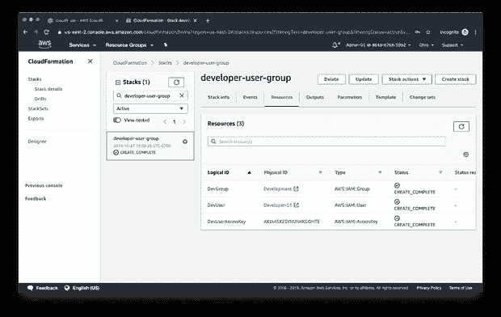

接下来，我们将执行第二个 CloudFormation 模板， [ecr-repo-shared.yml](https://github.com/garystafford/ecr-cross-account-demo/blob/master/ecr-repo-shared.yml) ，它将创建供应商的`rake-app` ECR 映像存储库。`rake-app`存储库将存放供应商的`rake-app` Docker 映像的副本。但是首先，让我们看看用于创建存储库的 CloudFormation 模板，特别是`RepositoryPolicyText`部分。这里我们定义了两个存储库策略:

*   `AllowPushPull`策略明确允许 Developer-01 IAM 用户将映像版本推送到 ECR 存储库中。我们从之前的 CloudFormation 堆栈输出中导入 Developer-01 IAM 用户的导出的 [Amazon 资源名称](https://docs.aws.amazon.com/general/latest/gr/aws-arns-and-namespaces.html) (ARN)。我们还允许 AWS CodeBuild 服务访问 ECR 库。这就是所谓的服务关联角色。在这篇简短的文章中，我们不会使用代码构建。
*   `AllowPull`策略允许客户的 AWS 帐户(`root`)中的任何人获取任何版本的映像。他们不能推，只能拉。当然，可以将跨帐户访问限制为特定客户的 IAM 实体和源 IP 地址的更细粒度集合。

注意`"ecr:GetAuthorizationToken"`的政策行动。稍后，当客户需要提取该供应商的映像时，该操作将允许客户的用户登录到供应商的 ECR 存储库并接收授权令牌。客户检索对指定的集装箱登记处 12 小时有效的令牌。

```
RepositoryPolicyText:
  Version: '2012-10-17'
  Statement:
    - Sid: AllowPushPull
      Effect: Allow
      Principal:
        Service: codebuild.amazonaws.com
        AWS:
          Fn::ImportValue:
            !Join [':', [!Ref 'StackName', 'DevUserArn']]
      Action:
        - 'ecr:BatchCheckLayerAvailability'
        - 'ecr:BatchGetImage'
        - 'ecr:CompleteLayerUpload'
        - 'ecr:DescribeImages'
        - 'ecr:DescribeRepositories'
        - 'ecr:GetDownloadUrlForLayer'
        - 'ecr:GetRepositoryPolicy'
        - 'ecr:InitiateLayerUpload'
        - 'ecr:ListImages'
        - 'ecr:PutImage'
        - 'ecr:UploadLayerPart'
    - Sid: AllowPull
      Effect: Allow
      Principal:
        AWS: !Join [':', ['arn:aws:iam:', !Ref 'CustomerAccount', 'root']]
      Action:
 **- 'ecr:GetAuthorizationToken'**        - 'ecr:BatchCheckLayerAvailability'
        - 'ecr:GetDownloadUrlForLayer'
        - 'ecr:BatchGetImage'
        - 'ecr:DescribeRepositories' *# optional permission*
        - 'ecr:DescribeImages' *# optional permission*
```

在执行下面的命令部署 CloudFormation 堆栈 [ecr-repo-shared.yml](https://github.com/garystafford/ecr-cross-account-demo/blob/master/ecr-repo-shared.yml) 之前，用您的伪客户的 AWS 帐户 ID 替换下面显示的`CustomerAccount`值。

```
# change me
CUSTOMER_ACCOUNT=**999888777666**REPO_NAME=rake-app 

aws cloudformation create-stack \
    --stack-name ecr-repo-${REPO_NAME} \
    --template-body file://cfn-templates/ecr-repo-shared.yml \
    --parameters \
        ParameterKey=CustomerAccount,ParameterValue=${CUSTOMER_ACCOUNT} \
        ParameterKey=RepoName,ParameterValue=${REPO_NAME} \
    --capabilities CAPABILITY_NAMED_IAM
```

下面，我们看到一个显示新 ECR 存储库的 CloudFormation 堆栈示例。

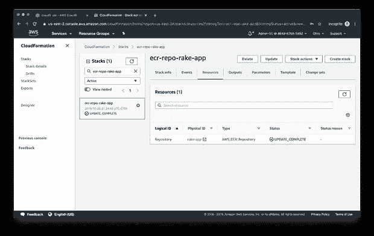

下面，我们看到 ECR 存储库策略在`rake-app`存储库的 Permissions 选项卡中被正确应用。第一个策略涵盖了 Developer-01 IAM 用户(称为 IAM 实体)和 AWS 代码构建(称为服务主体)。

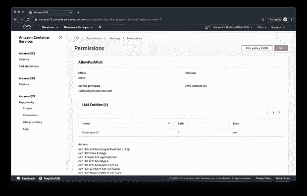

第二个策略包括客户的 AWS 帐户 ID。

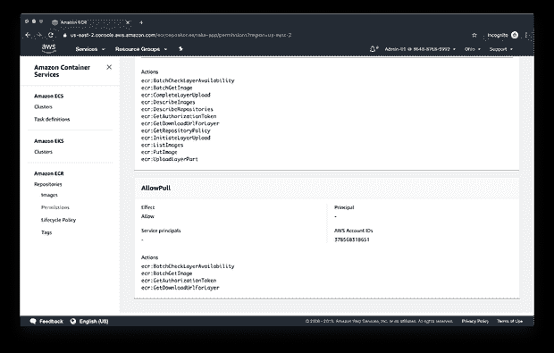

在客户的 AWS 帐户中重复此过程。首先是 CloudFormation 模板，[Developer-User-Group . yml](https://github.com/garystafford/ecr-cross-account-demo/blob/master/developer-user-group.yml)，包含开发 IAM 组和 Developer-01 用户。

```
# change me
IAM_USER_PSWD=**T0pS3cr3Tpa55w0rD** 

aws cloudformation create-stack \
    --stack-name developer-user-group \
    --template-body file://cfn-templates/developer-user-group.yml \
    --parameters \
        ParameterKey=DevUserPassword,ParameterValue=${IAM_USER_PSWD} \
    --capabilities CAPABILITY_NAMED_IAM
```

接下来，我们将执行第二个 CloudFormation 模板[ecr-repo-not-shared . yml](https://github.com/garystafford/ecr-cross-account-demo/blob/master/ecr-repo-not-shared.yml)两次，分别用于客户的两个 ECR 存储库`nlp-client`和`prose-app`。首先，让我们看看模板，特别是`RepositoryPolicyText`部分。在这个 CloudFormation 模板中，我们只定义了一个策略。与供应商的策略相同，`AllowPushPull`策略明确允许先前创建的 Developer-01 IAM 用户将映像版本推送到 ECR 存储库。不需要跨账户访问客户的两个 ECR 存储库。

```
RepositoryPolicyText:
  Version: '2012-10-17'
  Statement:
    - Sid: AllowPushPull
      Effect: Allow
      Principal:
        Service: codebuild.amazonaws.com
        AWS:
          Fn::ImportValue:
            !Join [':', [!Ref 'StackName', 'DevUserArn']]
      Action:
        - 'ecr:BatchCheckLayerAvailability'
        - 'ecr:BatchGetImage'
        - 'ecr:CompleteLayerUpload'
        - 'ecr:DescribeImages'
        - 'ecr:DescribeRepositories'
        - 'ecr:GetDownloadUrlForLayer'
        - 'ecr:GetRepositoryPolicy'
        - 'ecr:InitiateLayerUpload'
        - 'ecr:ListImages'
        - 'ecr:PutImage'
        - 'ecr:UploadLayerPart'
```

执行以下命令创建两个 CloudFormation 堆栈。堆栈使用相同的模板，不同的堆栈名称和`RepoName`参数值。

```
# nlp-client
REPO_NAME=nlp-client
aws cloudformation create-stack \
    --stack-name ecr-repo-${REPO_NAME} \
    --template-body file://cfn-templates/ecr-repo-not-shared.yml \
    --parameters \
        ParameterKey=RepoName,ParameterValue=${REPO_NAME} \
    --capabilities CAPABILITY_NAMED_IAM

# prose-app
REPO_NAME=prose-app 
aws cloudformation create-stack \
    --stack-name ecr-repo-${REPO_NAME} \
    --template-body file://cfn-templates/ecr-repo-not-shared.yml \
    --parameters \
        ParameterKey=RepoName,ParameterValue=${REPO_NAME} \
    --capabilities CAPABILITY_NAMED_IAM
```

下面，我们看到了两个 ECR 库的例子。

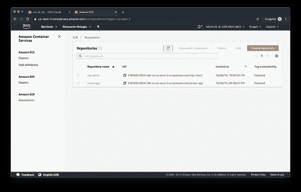

此时，我们在两个 AWS 帐户上有三个 ECR 存储库，每个都应用了适当的 ECR 存储库策略。

# 构建图像并将其推送到 ECR

接下来，我们将构建三个 NLP 应用程序映像，并将其推送到相应的 ECR 存储库中。要确认 ECR 策略是否正常工作，请以 Developer-01 IAM 用户身份登录，执行以下命令。请确保用伪供应商的 AWS 帐户和地区替换下面的变量值。我在整个代码中使用缩写 ISV(独立软件供应商)来表示供应商。

```
# change me
ISV_ACCOUNT=**111222333444**
ISV_ECR_REGION=**us-east-2**

aws ecr get-login-password --region ${ISV_ECR_REGION} \
| docker login --username AWS --password-stdin ${ISV_ACCOUNT}.dkr.ecr.${ISV_ECR_REGION}.amazonaws.com
```

以供应商的 Developer-01 IAM 用户身份登录，构建 Docker 映像并将其推送到`rake-app`存储库。Dockerfile 和 Go 源代码位于每个 GitHub 存储库中。通过 Go 和 Docker [的多阶段构建](https://docs.docker.com/develop/develop-images/multistage-build/)，我们将基于 [Scratch](https://hub.docker.com/_/scratch) ，仅使用编译后的 Go 可执行二进制文件，制作超小的 Docker 映像。在不到 10-20 兆字节的大小，推和拉这些 Docker 图像，甚至跨帐户，是非常快的。

```
docker build -t ${ISV_ACCOUNT}.dkr.ecr.${ISV_ECR_REGION}.amazonaws.com/rake-app:1.1.0 . --no-cachedocker push ${ISV_ACCOUNT}.dkr.ecr.${ISV_ECR_REGION}.amazonaws.com/rake-app:1.1.0
```

下面，我们看到来自供应商的 Developer-01 IAM 用户登录到`rake-app`存储库的输出。

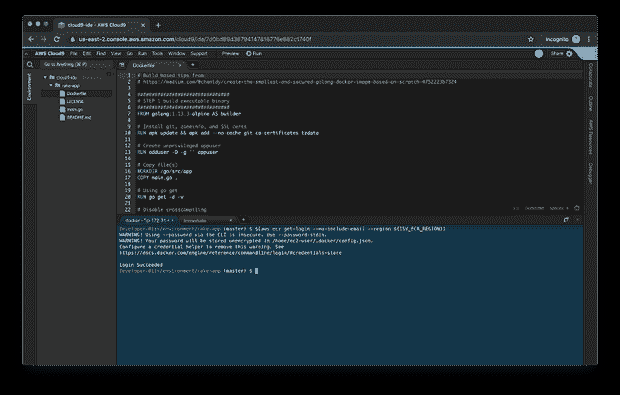

我们看到了供应商开发 IAM 用户构建的结果，并将 Docker 映像推送到`rake-app`存储库。

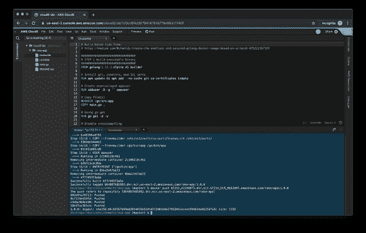

接下来，在作为客户的 Developer-01 IAM 用户登录后，构建 Docker 映像并将其推送到 ECR `nlp-client`和`prose-app`存储库。同样，请确保用您的伪客户的 AWS 帐户和首选地区替换下面的变量值。

```
# change me
CUSTOMER_ACCOUNT=**999888777666**
CUSTOMER_ECR_REGION=**us-west-2**

aws ecr get-login-password --region ${CUSTOMER_ECR_REGION} \
| docker login --username AWS --password-stdin ${CUSTOMER_ACCOUNT}.dkr.ecr.${CUSTOMER_ECR_REGION}.amazonaws.comdocker build -t ${CUSTOMER_ACCOUNT}.dkr.ecr.${CUSTOMER_ECR_REGION}.amazonaws.com/nlp-client:1.1.0 . --no-cachedocker push ${CUSTOMER_ACCOUNT}.dkr.ecr.${CUSTOMER_ECR_REGION}.amazonaws.com/nlp-client:1.1.0

docker build -t ${CUSTOMER_ACCOUNT}.dkr.ecr.${CUSTOMER_ECR_REGION}.amazonaws.com/prose-app:1.1.0 . --no-cachedocker push ${CUSTOMER_ACCOUNT}.dkr.ecr.${CUSTOMER_ECR_REGION}.amazonaws.com/prose-app:1.1.0
```

此时，三个 ECR 存储库中的每一个都有一个 Docker 映像推送给它们。

# 本地部署到 Docker Swarm

作为跨帐户 ECS 访问的简单演示，我们将从 Docker Swarm 开始。以客户的 Developer-01 IAM 用户身份登录，并使用项目中包含的 [Docker Swarm Stack](https://docs.docker.com/engine/swarm/stack-deploy/) 文件，我们可以在客户的帐户中创建并运行 NLP 应用程序的本地副本。首先，我们需要登录供应商的 ECR 存储库，以便从供应商的 ECR 注册表中提取映像。

```
# change me
ISV_ACCOUNT=**111222333444** ISV_ECR_REGION=**us-east-2** aws ecr get-login \
    --registry-ids ${ISV_ACCOUNT} \
    --region ${ISV_ECR_REGION} \
    --no-include-email
```

`aws ecr get-login`命令通过返回一个(非常长的)`docker login`命令作为响应(下面的*显示为*的缩写)来简化登录过程。根据 [AWS](https://docs.aws.amazon.com/AmazonECR/latest/APIReference/API_GetAuthorizationToken.html) ，为每个指定的注册中心返回的`authorizationToken`是一个 base64 编码的字符串，该字符串可以被解码并在`docker login`命令中用于向 ECR 注册中心进行认证。

```
docker login -u AWS -p eyJwYXlsb2FkI...joidENXMWg1WW0 \
    https://111222333444.dkr.ecr.us-east-2.amazonaws.com
```

将整个`docker login`命令复制、粘贴并执行回你的终端。下面，我们看到一个登录到供应商 ECR 存储库的预期终端输出的示例。

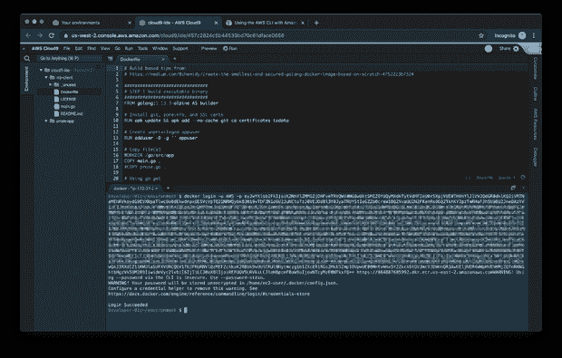

一旦成功登录到供应商的 ECR 存储库，我们将提取映像。如果您不确定，我们可以使用`docker describe-repositories`和`docker describe-images`列出您的 IAM 用户可以访问的跨帐户存储库和图像。

```
aws ecr describe-repositories \
    --registry-id ${ISV_ACCOUNT} \
    --region ${ISV_ECR_REGION} \
    --repository-name rake-app

aws ecr describe-images \
    --registry-id ${ISV_ACCOUNT} \
    --region ${ISV_ECR_REGION} \
    --repository-name rake-app

docker pull ${ISV_ACCOUNT}.dkr.ecr.${ISV_ECR_REGION}.amazonaws.com/rake-app:1.1.0
```

运行以下命令，您应该会看到我们的三个应用程序 Docker 映像。

```
docker image ls --filter=reference='*amazonaws.com/*'
```

下面，我们看到了一个从拉取图像并列出图像的预期终端输出的例子。

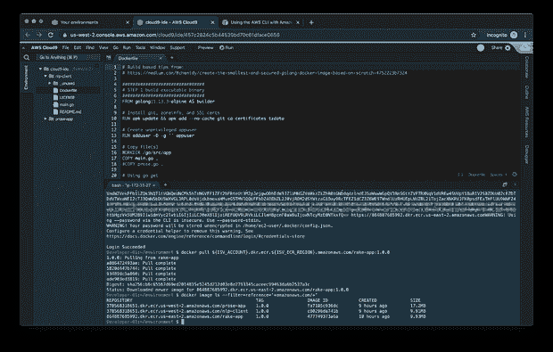

# 在本地构建 Docker 堆栈

接下来，构建 Docker Swarm 堆栈。Docker 合成文件 [stack.yml](https://github.com/garystafford/ecr-cross-account-demo/blob/master/stack.yml) 如下所示。注意图像的位置。

```
version: '3.7'

services:
  nlp-client:
    image: ${CUSTOMER_ACCOUNT}.dkr.ecr.${CUSTOMER_ECR_REGION}.amazonaws.com/nlp-client:1.1.0
    networks:
      - nlp-demo
    ports:
      - 8080:8080
    environment:
      - NLP_CLIENT_PORT
      - RACK_ENDPOINT
      - PROSE_ENDPOINT
      - API_KEY
  rake-app:
    image: ${ISV_ACCOUNT}.dkr.ecr.${ISV_ECR_REGION}.amazonaws.com/rake-app:1.1.0
    networks:
      - nlp-demo
    environment:
      - RAKE_PORT
      - API_KEY
  prose-app:
    image: ${CUSTOMER_ACCOUNT}.dkr.ecr.${CUSTOMER_ECR_REGION}.amazonaws.com/prose-app:1.1.0
    networks:
      - nlp-demo
    environment:
      - PROSE_PORT
      - API_KEY

networks:
  nlp-demo:

volumes:
  data: {}
```

执行以下命令将 Docker 栈部署到 Docker Swarm。同样，请确保用您的伪供应商和客户的 AWS 帐户和地区替换下面的变量值。此外，API 使用 API 密钥来保护所有三个服务中除了`/health`端点之外的所有公开端点。您应该将默认的 CloudFormation 模板的 API Key 参数更改为更安全的参数。

```
# change me
export ISV_ACCOUNT=**111222333444**
export ISV_ECR_REGION=**us-east-2**
export CUSTOMER_ACCOUNT=**999888777666**
export CUSTOMER_ECR_REGION=**us-west-2**export API_KEY=**SuP3r5eCRetAutHK3y**

# don't change me
export NLP_CLIENT_PORT=8080
export RAKE_PORT=8080
export PROSE_PORT=8080
export RACK_ENDPOINT=[http://rake-app:8080](http://rake-app:8080)
export PROSE_ENDPOINT=[http://prose-app:8080](http://prose-app:8080)

docker swarm init 
docker stack deploy --compose-file stack.yml nlp
```

您可以使用以下命令检查部署是否成功:

```
docker stack ps nlp --no-trunc docker container ls
```

下面，我们看到一个预期终端输出的例子。

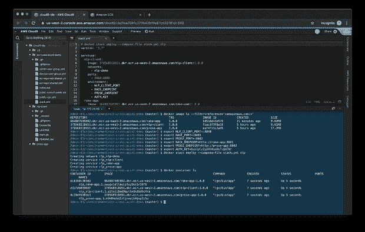

有了 Docker 栈，可以直接在`localhost:8080`上打`nlp-client`服务。Fargate 要求任务中的每个容器都有唯一的静态端口，与此不同，使用 Docker，我们可以选择在同一个端口上运行所有的容器，而不会发生冲突，因为只有`nlp-client`服务公开端口`:8080`。此外，与 ECS 不同，堆栈前没有负载平衡器，因为我们的群中只有一个节点，因此每个微服务只有一个容器实例。

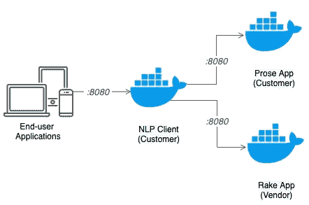

为了测试图像是否被成功提取以及 Docker 栈是否正在运行，我们可以对任何 API 端点执行一个 [curl](https://curl.haxx.se/) 命令，比如`/keywords`。下面，我使用 [jq](https://stedolan.github.io/jq/) 来打印 JSON 响应负载。

```
#change me
API_KEY=**SuP3r5eCRetAutHK3y**

curl -s -X POST \
    "http://localhost:${NLP_CLIENT_PORT}/keywords" \
    -H 'Content-Type: application/json' \
    -H "X-API-Key: ${API_KEY}" \
    -d '{"text": "The Internet is the global system of interconnected computer networks that use the Internet protocol suite to link devices worldwide."}' | jq
```

产生的 JSON 负载应该类似于下面的输出。这些结果表明`nlp-client`服务已经成功到达，并且随后能够与`rake-app`服务通信，后者的容器映像来自供应商的 ECR 存储库。

```
[
    {
        "candidate": "interconnected computer networks",
        "score": 9
    },
    {
        "candidate": "link devices worldwide",
        "score": 9
    },
    {
        "candidate": "internet protocol suite",
        "score": 8
    },
    {
        "candidate": "global system",
        "score": 4
    },
    {
        "candidate": "internet",
        "score": 2
    }
]
```

# 创建 Amazon ECS 环境

虽然在本地使用 Docker Swarm 是理解跨帐户 ECR 访问如何工作的一种很好的方式，但它不是在 AWS 平台上部署容器化应用程序的典型用例。更多的时候，你可以使用亚马逊 ECS、[亚马逊弹性 Kubernetes 服务](https://aws.amazon.com/eks/) (EKS)，或者企业版的第三方编排器，比如 [Docker Enterprise](https://www.docker.com/products/docker-enterprise) 、 [RedHat OpenShift](https://www.openshift.com/) 或者 [Rancher](https://rancher.com/products/rancher) 。

使用 CloudFormation 和 Amazon 提供的一些非常方便的 [CloudFormation 模板](https://github.com/aws-samples/ecs-refarch-cloudformation)作为起点，我们将为我们的应用程序创建一个完整的 ECS 环境。首先，我们将使用 [public-vpc.yml](https://github.com/garystafford/ecr-cross-account-demo/blob/master/public-vpc.yml) 模板创建一个 VPC 来容纳 ECS 集群，并创建一个面向公众的 ALB 来呈现基于 ECS 的应用程序。

```
aws cloudformation create-stack \
    --stack-name public-vpc \
    --template-body file://public-vpc.yml \
    --capabilities CAPABILITY_NAMED_IAM
```

接下来，我们将使用[public-subnet-public-load balancer . yml](https://github.com/garystafford/ecr-cross-account-demo/blob/master/public-subnet-public-loadbalancer.yml)模板创建 ECS 集群和 Amazon ECS 任务定义。同样，任务定义定义了 ECS 将如何使用 [AWS Fargate](https://aws.amazon.com/fargate/) 部署我们的应用程序。Amazon Fargate 允许您运行容器，而不必管理服务器或集群。没有要管理的 EC2 实例！呜！下面，在 CloudFormation 模板中，我们看到`TaskDefinition`资源的`ContainerDefinitions`部分，包含三个容器定义。请注意这三个图像及其 ECR 位置。

```
ContainerDefinitions:
  - Name: nlp-client
    Cpu: 256
    Memory: 1024
    Image: !Join ['.', [!Ref AWS::AccountId, 'dkr.ecr', !Ref AWS::Region, 'amazonaws.com/nlp-client:1.1.0']] 
    PortMappings:
      - ContainerPort: !Ref ContainerPortClient
    Essential: true
    LogConfiguration:
      LogDriver: awslogs
      Options:
        awslogs-region: !Ref AWS::Region
        awslogs-group: !Ref CloudWatchLogsGroup
        awslogs-stream-prefix: ecs
    Environment:
      - Name: NLP_CLIENT_PORT
        Value: !Ref ContainerPortClient
      - Name: RACK_ENDPOINT
        Value: !Join [':', ['http://localhost', !Ref ContainerPortRake]] 
      - Name: PROSE_ENDPOINT
        Value: !Join [':', ['http://localhost', !Ref ContainerPortProse]] 
      - Name: API_KEY
        Value: !Ref ApiKey
  - Name: rake-app
    Cpu: 256
    Memory: 1024
    Image: !Join ['.', [!Ref VendorAccountId, 'dkr.ecr', !Ref VendorEcrRegion, 'amazonaws.com/rake-app:1.1.0']] 
    Essential: true
    LogConfiguration:
      LogDriver: awslogs
      Options:
        awslogs-region: !Ref AWS::Region
        awslogs-group: !Ref CloudWatchLogsGroup
        awslogs-stream-prefix: ecs
    Environment:
      - Name: RAKE_PORT
        Value: !Ref ContainerPortRake
      - Name: API_KEY
        Value: !Ref ApiKey
  - Name: prose-app
    Cpu: 256
    Memory: 1024
    Image: !Join ['.', [!Ref AWS::AccountId, 'dkr.ecr', !Ref AWS::Region, 'amazonaws.com/prose-app:1.1.0']] 
    Essential: true
    LogConfiguration:
      LogDriver: awslogs
      Options:
        awslogs-region: !Ref AWS::Region
        awslogs-group: !Ref CloudWatchLogsGroup
        awslogs-stream-prefix: ecs
    Environment:
      - Name: PROSE_PORT
        Value: !Ref ContainerPortProse
      - Name: API_KEY
        Value: !Ref ApiKey
```

执行以下命令，使用 CloudFormation 模板创建 ECS 集群和 Amazon ECS 任务定义。

```
# change me
ISV_ACCOUNT=**111222333444**
ISV_ECR_REGION=**us-east-2**
API_KEY=**SuP3r5eCRetAutHK3y**aws cloudformation create-stack \
    --stack-name public-subnet-public-loadbalancer \
    --template-body file://public-subnet-public-loadbalancer.yml \
    --parameters \
        ParameterKey=VendorAccountId,ParameterValue=${ISV_ACCOUNT} \
        ParameterKey=VendorEcrRegion,ParameterValue=${ISV_ECR_REGION} \
        ParameterKey=AuthKey,ParameterValue=${API_KEY} \
    --capabilities CAPABILITY_NAMED_IAM
```

下面，我们看到了一个来自 CloudFormation 管理控制台的预期输出示例。

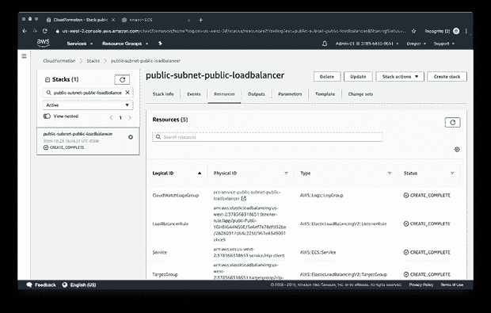

CloudFormation 模板默认不启用 [CloudWatch 容器洞察](https://docs.aws.amazon.com/AmazonCloudWatch/latest/monitoring/ContainerInsights.html)。Insights 从您的容器化应用程序中收集、汇总和总结指标和日志。要启用洞察，请执行以下命令:

```
aws ecs put-account-setting --name "containerInsights" --value "enabled"
```

# 确认交叉账户政策

如果前面的步骤一切顺利，我们现在应该有一个 ECS 集群运行我们的容器化应用程序，包括从供应商的 Docker 映像构建的容器。下面，我们看到了管理控制台中显示的 ECS 群集示例。

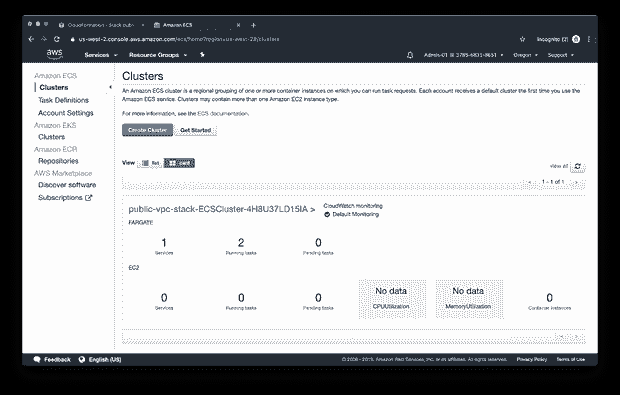

在 ECR 集群中，我们应该观察到一个正在运行的 [ECS 服务](https://docs.aws.amazon.com/AmazonECS/latest/developerguide/ecs_services.html)。根据 AWS，Amazon ECS 允许您在 Amazon ECS 集群中同时运行和维护指定数量的任务定义实例。这叫做服务。

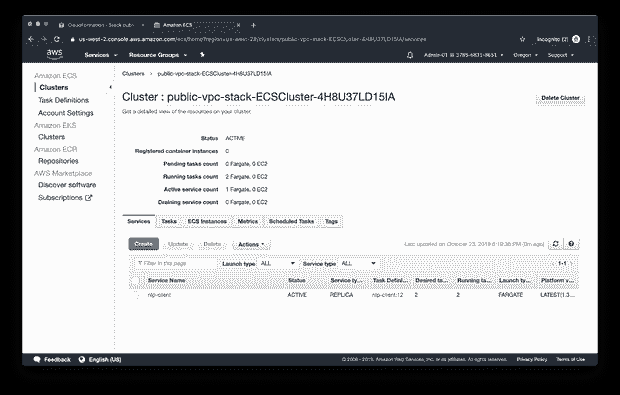

我们在 ECS 上运行每个容器的两个实例，因此在一个服务中有两个任务副本。每个任务在不同的[可用性区域](https://docs.aws.amazon.com/AWSEC2/latest/UserGuide/using-regions-availability-zones.html)中运行其容器，以获得高可用性。

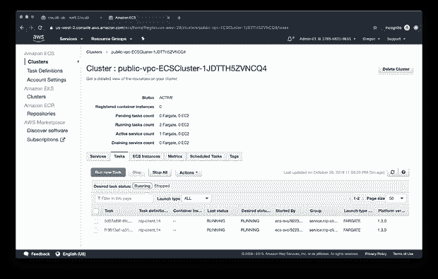

深入研究该服务，我们应该注意到与新 VPC 相关联的新 ALB、两个公共子网和相应的安全组。

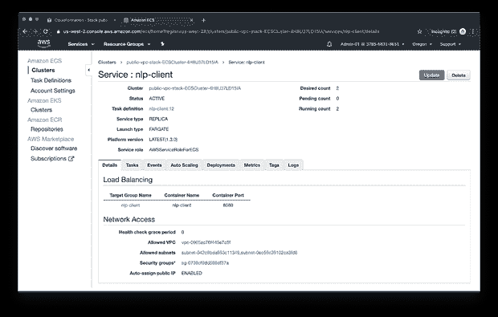

切换到 Task Definitions 选项卡，我们应该可以看到您的任务的详细信息。请注意组成应用程序的三个容器。请注意，两个位于客户的 ECR 存储库中，一个位于供应商的 ECR 存储库中。

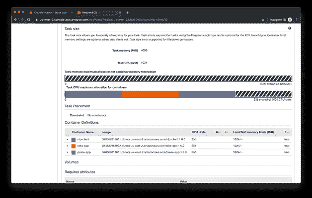

再深入一点，我们将看到每个容器定义的细节，包括从 ECR 传递到容器的环境变量，以及在容器中运行的实际 Go-binary。

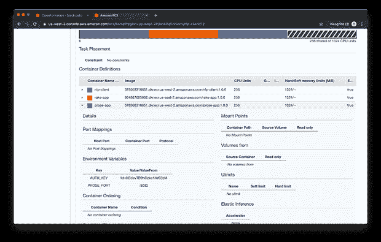

# 在 ECS 上实现我们的应用

在我们之前的 Docker Swarm 示例中，curl 命令是针对`/localhost`发出的，而现在我们在基于 ECS 的应用程序前面有了面向公众的应用程序负载平衡器(ALB)。我们将需要使用您的 ALB 的 DNS 名称作为主机，以在 ECS 上运行我们的应用程序。DNS 地址(记录)可以从负载平衡器管理控制台获得，如下所示，或者从`public-vpc` CloudFormation 堆栈的输出选项卡获得

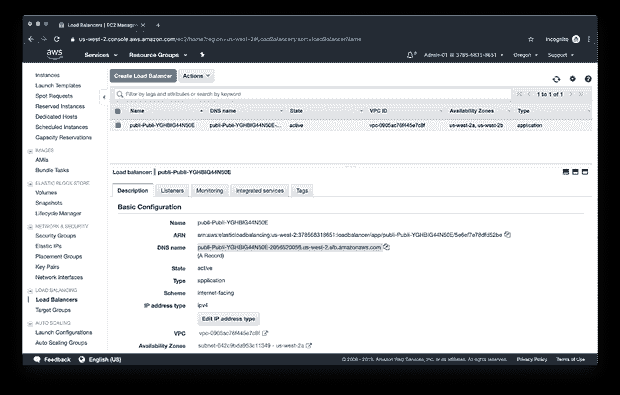

早期 Docker Swarm 示例和 ECS 的另一个不同之处是端口。虽然边缘服务`nlp-client`运行在端口`:8080`上，但是 ALB 充当反向代理，将请求从 ALB 上的端口`:80`传递到`nlp-client`容器实例的端口`:8080`(实际上，[共享运行任务的 ENI](https://aws.amazon.com/blogs/compute/task-networking-in-aws-fargate/) )。为了简洁起见，我没有为 ALB 设置自定义的 DNS 名称，也没有像在生产中那样为 HTTPS 设置。

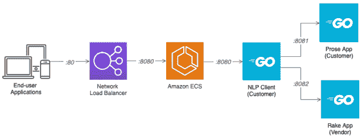

为了测试我们部署的 ECS，我们可以使用像`curl`或 [Postman](https://www.getpostman.com/) 这样的工具来测试 API 的端点。下面，我们看到一个针对`/tokens`端点的 POST，使用的是 Postman。不要忘记，您将需要添加 Auth，即“X-API-Key”标题键/值对。

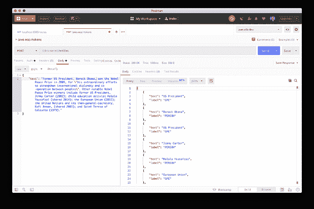

# 清理

要清理演示的 AWS 资源和 Docker 堆栈，请在适当的 AWS 帐户中运行以下脚本。重要的是，与 S3 类似，在删除存储库之前，您必须首先删除 ECR 存储库中的所有 Docker 映像，否则您将收到一个 CloudFormation 错误。这包括`untagged`图像。

```
# customer account only
aws ecr batch-delete-image \
    --repository-name nlp-client \
    --image-ids imageTag=1.1.0

aws ecr batch-delete-image \
    --repository-name prose-app \
    --image-ids imageTag=1.1.0

aws cloudformation delete-stack \
    --stack-name ecr-repo-nlp-client

aws cloudformation delete-stack \
    --stack-name ecr-repo-prose-app

aws cloudformation delete-stack \
    --stack-name public-subnet-public-loadbalancer

aws cloudformation delete-stack \
    --stack-name public-vpcdocker stack rm nlp # vendor account only
aws ecr batch-delete-image \
    --repository-name rake-app \
    --image-ids imageTag=1.1.0

aws cloudformation delete-stack \
    --stack-name ecr-repo-rake-app # both accounts
aws cloudformation delete-stack \
    --stack-name developer-user-group
```

在前一篇文章中，我们看到了多个 AWS 帐户如何共享基于 ECR 的 Docker 图像。根据您使用的部署工具，如 AWS CodeBuild、AWS CodeDeploy 或 AWS Elastic Beanstalk，ECR 存储库策略的配置有所不同和限制。AWS 在他们的文档中很好地提供了一些例子，包括[亚马逊 ECR 仓库策略例子](https://docs.aws.amazon.com/AmazonECR/latest/userguide/RepositoryPolicyExamples.html)和[亚马逊弹性容器注册基于身份的策略例子](https://docs.aws.amazon.com/AmazonECR/latest/userguide/security_iam_id-based-policy-examples.html)。

*本文表达的所有观点都是我个人的，不一定代表我现在或过去的雇主或他们的客户的观点。*

*原载于 2019 年 10 月 28 日*[*http://programmaticponderings.com*](https://programmaticponderings.com/2019/10/28/amazon-ecr-cross-account-access-for-containerized-applications-on-ecs/)*。*