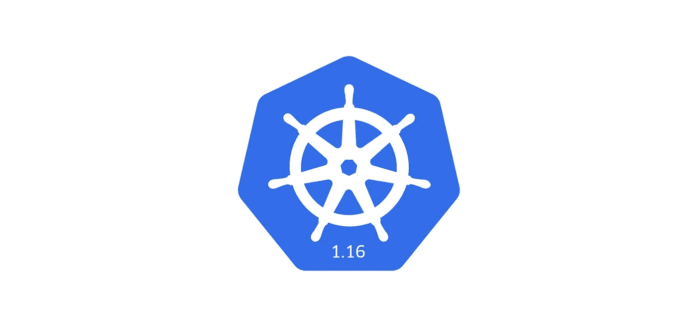
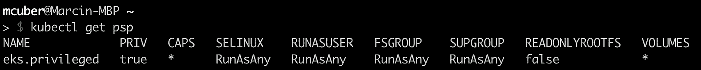
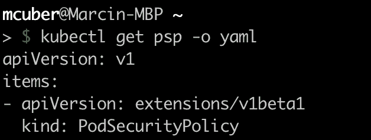
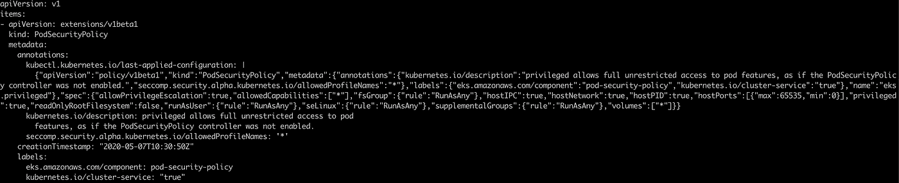
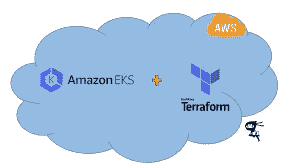
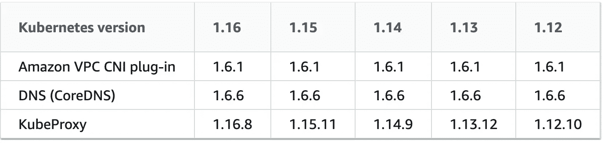

# 亚马逊 EKS 从 1.15 升级到 1.16 的旅程

> 原文：<https://itnext.io/amazon-eks-upgrade-journey-from-1-15-to-1-16-4f48c7b6e512?source=collection_archive---------1----------------------->

*EKS 控制平面升级到 1.16 版本的流程和注意事项*



# 概观

AWS 最近发布了对[亚马逊 Kubernetes 服务 1.16](https://aws.amazon.com/about-aws/whats-new/2020/04/amazon-eks-now-supports-kubernetes-version-1-16/) 的支持。在该版本中，有大量的更改需要检查或更新。在这篇文章中，我将介绍一些在考虑升级 EKS 之前必须检查和升级的服务。

# Kubernetes 1.16 特性

当然，Kubernetes 发展很快，有新的功能和缺陷修复。主要的新功能包括:

*   [音量大小调整支持](https://kubernetes-csi.github.io/docs/volume-expansion.html)
*   [Windows GMSA](https://kubernetes.io/docs/tasks/configure-pod-container/configure-gmsa/)
*   [服务负载平衡器的终结器保护](https://kubernetes.io/docs/tasks/access-application-cluster/create-external-load-balancer/#garbage-collecting-load-balancers)现在处于测试状态。
*   可扩展性机制[自定义资源定义](https://kubernetes.io/docs/concepts/extend-kubernetes/api-extension/custom-resources/)和[准入 webhooks](https://kubernetes.io/docs/reference/access-authn-authz/extensible-admission-controllers/) 现已普遍可用。
*   一个新的注释:`service.beta.kubernetes.io/aws-load-balancer-eip-allocations`在服务类型`LoadBalancer`上可用，为网络负载平衡器分配一个弹性 IP 地址。

如果您需要更多信息，请访问 [Kubernetes 项目发布说明](https://github.com/kubernetes/kubernetes/blob/master/CHANGELOG/CHANGELOG-1.16.md)。

# Kubernetes 1.16 突破

真正的突破性变化实际上与过时的 API 有关。1.16 版已停止为以下产品提供服务:

1.  不再提供**扩展/v1beta1** API 版本中的网络策略。所有网络策略都需要使用**networking.k8s.io/v1.**
2.  **扩展/v1beta1** API 版本中的 PodSecurityPolicy 不再适用。需要使用 API 版本 **policy/v1beta1** 。这一点对于 EKS 的顾客来说尤其重要。
3.  不再提供**扩展/v1beta1** 和**应用/v1beta2** API 版本中的 DaemonSet。您必须迁移到使用 **apps/v1** API 版本。此外，规范定义中还有一些重要的变化:删除了
    *`spec.templateGeneration`
    *`spec.selector`是必需的，并且在创建后不可更改
    * `spec.updateStrategy.type`现在默认为`RollingUpdate`(这最终被修复，在以前的 API 版本`extensions/v1beta1`中默认为`OnDelete`，这没有任何意义)。
4.  不再提供**扩展/v1beta1** 、**应用/v1beta1** 和**应用/v1beta2** API 版本中的部署。您必须迁移到使用 **apps/v1** API 版本。
    此外，规格定义也有变化:
    * `spec.rollbackTo`被删除
    * `spec.selector`现在是必需的，创建后不可更改；使用现有模板标签作为无缝升级的选择器
    * `spec.progressDeadlineSeconds`现在默认为`600`秒(在`extensions/v1beta1`中默认为无截止日期)
    * `spec.revisionHistoryLimit`现在默认为`10`(在`apps/v1beta1`中默认为`2`，`extensions/v1beta1`中默认为保留全部)
    * `maxSurge`和`maxUnavailable`现在默认为`25%`(在`extensions/v1beta1`中默认为`1`)
5.  不再提供 **apps/v1beta1** 和 **apps/v1beta2** API 版本中的 StatefulSet。您必须转到 **apps/v1** API 版本。
    另外，规格定义也有变化:
    * `spec.selector`现在是必需的，创建后不可更改
    * `spec.updateStrategy.type`现在默认为`RollingUpdate`(在`apps/v1beta1`中默认为`OnDelete`，这又没有意义了)
6.  不再提供**扩展/v1beta1** 、**应用/v1beta1** 和**应用/v1beta2** API 版本中的副本集。使用 **apps/v1** API 版本。
    此外，规格定义也有变化:
    * `spec.selector`现在是必需的，创建后不可更改

以上是所有值得一提的大变化，以及在升级 EKS 控制平面到 1.16 之前需要注意的一切。现在，我将展示我通常在集群内部运行的服务，这些服务可能需要在升级之前进行检查。

## 达蒙塞特

1.  kube 代理
2.  aws-node ( [亚马逊-vpc-cni-k8s](https://github.com/aws/amazon-vpc-cni-k8s) )
3.  印花布节点
4.  AWS-节点终止处理器(处理现场中断)
5.  newrelic-infra(对 kubernetes 的监测)

## 部署

1.  coredns
2.  聚类自动缩放器
3.  外部 dns
4.  度量-服务器
5.  kube-状态-度量
6.  入口控制器
7.  重装机
8.  外部秘密
9.  印花布-香蒲和印花布-水平-自动缩放

以上所有组件都必须检查，以确保使用新的 API 版本。我在升级与`spec.selector`相关的内容时发现了错误，所以记得将该字段添加到所有 yaml 定义中。

举个简单的例子，要将一个旧的部署转换成 apps/v1，可以运行:`kubectl convert -f ./deployment.yaml --output-version apps/v1`这对于 daemonsets 来说也是一样的。

我会使用完全相同的过程来检查和升级 StatefulSet。我不太喜欢在 Kubernetes 中使用 StatefulSet，所以我干脆不使用它们。

关于复制集，我使用利用复制集的部署。因此，我没有任何有效的服务示例。然而，同样的原则也适用于部署的情况。

网络策略非常简单，只需要将 API 版本升级到**networking.k8s.io/v1.**此处不再添加任何内容。

## PodSecurityPolicy

PodSecurityPolicy 或简称 PSP 可能是需要升级的最重要的组件。这在您使用默认的 EKS PSP 时尤其重要，该 PSP 是在集群创建期间部署的，名为“eks.privileged”。注意，你不需要在升级前重新部署默认的 PSP。如果你使用的是你自己的 PSP，它更安全，也更严格，只需为它们更新 API 版本。



PSP 可能是 Kubernetes 中最难理解的概念之一，许多人只是简单地将默认的 PSP 留在 EKS 上。

仔细看看它，你会发现它使用的是旧版本的 API。



升级这个资源是绝对必须的！这里有一些模板，你可以简单地复制并应用到你的文件名中。

```
apiVersion: policy/v1beta1
kind: PodSecurityPolicy
metadata:
  name: eks.privileged
  annotations:
    kubernetes.io/description: 'privileged allows full unrestricted access to
      pod features, as if the PodSecurityPolicy controller was not enabled.'
    seccomp.security.alpha.kubernetes.io/allowedProfileNames: '*'
  labels:
    kubernetes.io/cluster-service: "true"
    eks.amazonaws.com/component: pod-security-policy
spec:
  privileged: true
  allowPrivilegeEscalation: true
  allowedCapabilities:
  - '*'
  volumes:
  - '*'
  hostNetwork: true
  hostPorts:
  - min: 0
    max: 65535
  hostIPC: true
  hostPID: true
  runAsUser:
    rule: 'RunAsAny'
  seLinux:
    rule: 'RunAsAny'
  supplementalGroups:
    rule: 'RunAsAny'
  fsGroup:
    rule: 'RunAsAny'
  readOnlyRootFilesystem: false
```

值得澄清的是，在应用新 API 版本的默认 PSP 后，它仍然会显示旧版本的 API，因为 PSP 仍然是扩展 API 的一部分。但是，注释中的 apiVersion 包含正确的版本，所以您可以开始了。



完成所有必要的步骤后，您终于可以将控制平面和工作节点升级到 EKS 1.16 了。

## 使用 terraform 升级



我个人使用 terraform 来部署和升级我的 EKS 集群。下面是 EKS 集群资源的一个例子。

```
resource "aws_eks_cluster" "cluster" {
  enabled_cluster_log_types = ["audit"]
  name                      = local.name_prefix
  role_arn                  = aws_iam_role.cluster.arn
  version                   = "1.16" vpc_config {
    subnet_ids              = flatten([module.vpc.public_subnets, module.vpc.private_subnets])
    security_group_ids      = []
    endpoint_private_access = "true"
    endpoint_public_access  = "true"
  } encryption_config {
    resources = ["secrets"]
    provider {
      key_arn = module.kms-eks.key_arn
    }
  } tags = var.tags
}
```

## 升级 EKS 控制平面后

请记住升级建议用于 EKS 1.16 的核心部署和默认设置。



以上只是 AWS 的推荐。您应该考虑将所有组件升级到 1.16 版本。它们可能包括:

1.  印花布节点
2.  聚类自动缩放器
3.  kube-状态-度量
4.  印花布-香蒲和印花布-水平-自动缩放

# 摘要

**升级到 1.16 之前**

*   更改您的 YAML 文件以引用新的 API。
*   更新定制集成和控制器以调用新的 API。
*   确保您使用任何第三方工具的更新版本，如入口控制器、连续交付系统和其他调用新 API 的工具。

要轻松检查集群中不推荐使用的 API，请确保启用了`audit` [控制平面日志](https://docs.aws.amazon.com/eks/latest/userguide/control-plane-logs.html)，并将`v1beta`指定为事件过滤器。

如果你对 EKS 的整个 terraform 设置感兴趣，你可以在我的 github->[https://github . com/marcincuber/eks/tree/master/terra form-AWS](https://github.com/marcincuber/eks/tree/master/terraform-aws)上找到它

希望这篇文章很好地汇总了所有关于升级 EKS 的重要信息，它将帮助人们加快他们的任务。

享受 Kubernetes！！！