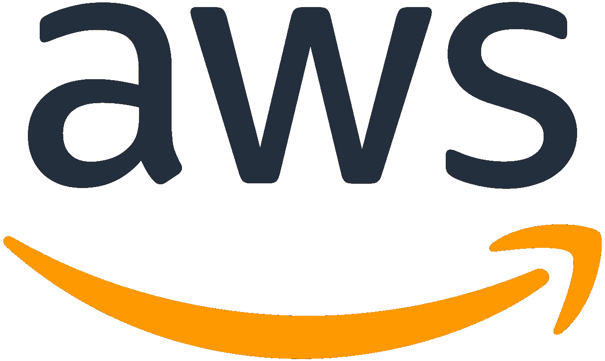

# [2020 年 11 月 25 日]亚马逊 Kinesis 中断——我们能学到什么？

> 原文：<https://itnext.io/amazon-kinesis-outage-what-can-we-learn-1f0aec6cac7b?source=collection_archive---------3----------------------->

## 软件工程

## 从最近的亚马逊 Kinesis 故障中可以帮助我们建立更好的系统。不要咆哮！

最近的 AWS 中断发生在我可以想象的可能是 AWS 和亚马逊一年中最繁忙的时候，因为黑色星期五周和 AWS re:Invent 2020 即将到来。

而且，对于依赖 AWS 构建其解决方案和消费者服务的许多其他企业来说，这可能是一年中最忙的时候。

另一个主要的云服务中断来袭，互联网崩溃。最近，我们已经看到 AWS、Microsoft Azure 或 Google Cloud 等主要云提供商出现了多次云服务中断。

随着业务在云中诞生，或者越来越多地迁移到公共云平台，消费者服务中断的风险随着时间的推移越来越高。

等等，什么？难道云不应该提供更多的可伸缩性、可用性、耐用性、可靠性和安全性吗？

嗯，是的。而且，云提供商在满足这些参数的数字方面做得很好。但是，不幸的是，由于越来越多的在线企业和服务依赖于云服务，一次这样的停机的累积影响如此之大，以至于这样的停机几乎被认为是不可接受的。

随着更好的过程控制到位，这种影响的程度可能会随着时间的推移而降低，或者可靠性可以提高，但是*系统故障是不可避免的*。

# 那么，我们能学到什么呢？

这种中断引起的愤怒是很容易理解的。但是，让我们花一点时间来理解满足 AWS 这种规模的系统和平台的可用性要求所需的复杂性和工程魔法。

出于对 AWS 工程的尊重，让我们克制所有的咆哮，并借此机会从中学习最好的东西。

> 那么，作为 AWS 的局外人，我们能从最近的中断中学到什么呢？此外，它如何帮助我们思考和规划，以避免我们在云平台和服务之上构建的解决方案/服务中断？

让我们看看 AWS 的事后总结报告。

AWS 一直在发布各种大修的事后总结报告，这有助于更好地理解导致大修的事件链、灭火措施以及确保火灾不会复燃。

这是报告的链接—

 [## 事后总结

### 以下是影响 AWS 服务可用性的主要服务事件的事后总结…

aws.amazon.com](https://aws.amazon.com/premiumsupport/technology/pes/) 

如果你在西半球，你可能听说过的最后一次重大 AWS 中断是 2017 年 S3 的中断，这对各种业务产生了重大影响。

最有可能的是，你可能已经错过了随后的两次停电，因为它们发生在东京和首尔的东半球 AWS 区域。一个是相对较短的持续时间，另一个是半天的中断。

然而，自动气象站 2020 年 11 月 25 日的 Kinesis 停电是自 S3 停电以来的一次重大停电。

> 为什么会出现如此严重的中断？

简而言之，这是由于长期受到影响的服务和业务数量。

如果您还没有阅读下面的报告，请花些时间阅读。接下来的部分是基于这份报告和我们可以从中得到的线索。

 [## 北弗吉尼亚(US-EAST-1)地区亚马逊运动事件综述

### 我们想为您提供一些关于发生在北部的服务中断的附加信息…

aws.amazon.com](https://aws.amazon.com/message/11201/) 

# 我的主要收获

## #1.在选择合适的灭火器之前，先确定起火点

当系统故障和寻呼机响时，工程师们很容易投入灭火行动。但是，在处理火灾之前，了解火灾的类型至关重要。

在以*开始的段落中，“太平洋标准时间上午 5:15，第一次警报开始响起，原因是在放置和获取 Kinesis 记录时出现错误……”*，提到了可能导致问题的多个可能选项，因此有多个选项来缓解/解决问题。

AWS 提到—

> 虽然领先的候选人(一个似乎造成内存压力的问题)看起来很有希望，但如果我们错了，我们会将恢复时间增加一倍，因为我们需要应用第二个修复并重新启动。

正是在这样的十字路口，我们需要更深入地了解根本原因，以选择正确的解决途径。

一旦确定了线程容量问题的根本原因，而不是最初认为的与内存压力有关，解决方法就变得非常清楚了。

AWS 向前端服务器群添加额外配置以在危机中快速收集额外见解的能力堪称典范。这是我们在设计系统时应该努力达到的系统状态。

如果没有这种精确的洞察力，我们将面临更长的停机和恢复时间的风险。在为工作选择合适的灭火器之前，了解火灾的类型是非常重要的。

## #2.回滚计划并不总是按计划进行

基于根本原因与线程容量限制有关的事实，我认为这种情况不会被视为回滚计划场景的一部分。虽然我可能是错的！

尽管如此，在事故期间，回滚计划可能不会按计划进行。重要的是，我们要保持敏捷，不断创新和设计替代计划。这需要对我们管理和运行的系统有深刻的理解。

关键是，在服务中断期间，要预料到所有意想不到的情况，并准备好快速有效地处理它。

## #3.对反模式保持开放的心态

我们遇到的关于计算(读取 EC2)扩展能力的一个设计原则是，拥有一个具有较小配置的更大的 EC2 实例群(如果可行),而不是拥有一个具有较大配置的更小的实例群。这主要是为了在发生灾害时最大限度地减小爆炸半径和对可用容量的影响。

作为 Kinesis 中断期间解决策略的一部分，短期内采用了以下反模式，这有助于控制混乱。

> 在很短的时间内，我们将转向更大的 CPU 和内存服务器，减少服务器的总数，从而减少每台服务器跨机群通信所需的线程数。

尽管这看起来像是一种反模式，但关键是，我们需要适应并开放地实现在特定情况下工作良好的策略。

## #4.基于单元的架构的重要性

基于单元的架构是最小化爆炸半径的关键设计策略。

引用报告中的话—

> 我们正在将前端服务器缓存移至专用设备群。我们还将把一些大型的 AWS 服务，比如 CloudWatch，转移到一个独立的、分区的前端设备上。从中期来看，我们将大大加快前端车队的细胞化，以匹配我们在后端所做的工作。单元化是我们用来隔离服务中失败的影响，并保持服务的组件(在这种情况下，是分片映射缓存)在之前测试和运行的范围内运行的一种方法。这已经在 Kinesis 的前端舰队中进行，但不幸的是，这项工作意义重大，尚未完成。除了允许我们在一致且经过充分测试的总线程消耗范围内运行前端之外，细胞化还将为未来任何未知的扩展限制提供更好的保护。

考虑到对基于单元的架构的支持，看到 AWS 仍然致力于架构的单元化有点令人惊讶。但是，好消息是，变化已经开始了。

如果你对分布式系统架构感兴趣，请听一听 Peter Vosshall 的 re:Invent 2018 演讲，如果你还没有这样做的话。我肯定你会喜欢它的！

本次演讲深入探讨了 AWS 如何使用基于单元的架构来控制爆炸失效半径。

另一个有趣的相关话题是“洗牌分块”。我强烈推荐阅读这篇文章[https://AWS . Amazon . com/builders-library/workload-isolation-using-shuffle-sharding/](https://aws.amazon.com/builders-library/workload-isolation-using-shuffle-sharding/)。

## #5.多云不是答案 42

每当出现云服务中断时，围绕把所有鸡蛋放在一个篮子里的担忧就会增长；到处都有推文和帖子在鼓吹多云战略。

虽然它可以帮助解决许多其他问题，但它真的有助于像 Kinesis 中断这样的场景吗？

很有可能，不会。即使在某些情况下确实如此，管理这样的体系结构也可能不划算。

想象一下万一发生 Kinesis 或 S3 故障时的多云故障转移。现在，假设我们想要进行故障转移，并让 Google Cloud Pub/Sub 或 Azure Event Hub 在 Kinesis 停止服务时开始接收数据。

实现它需要什么？我将让您想象实现的复杂性，从兼容性问题、数据湖、容量、吞吐量差异等等开始。而且，这只是其中一项服务！

## #6.尽最大努力避免级联故障

这次停机影响了多个 AWS 服务— *CloudWatch、Cognito、AutoScaling、Lambda、EventBridge、Elastic Container Service (ECS)和 Elastic Kubernetes Service (EKS)以及服务健康仪表板*。

在存在多个上游/下游依赖关系的分布式系统中，级联故障会很快失去控制。级联故障会使分布式系统陷入瘫痪，除非它们的设计能够承受这样的故障。

为了加剧停机情况，可能会突然出现不可预见的问题，如潜在的错误出现、调优配置不够好、阈值变得有害而不是有益，等等。

在设计我们的系统时，我们需要警惕这样的潜在风险，并尽最大努力整合所有可能的最佳实践。其中一些可能是断路器、抖动、指数后退、速率限制等。

## #7.保持所有故障保险功能

报告中另一个有趣的引用如下—

> 虽然这种方法如预期的那样有效，但在事件的早期阶段，我们在使用该工具发布到服务运行状况仪表板时遇到了一些延迟，因为对于我们的支持操作员来说，它是一种更加手动且不太熟悉的工具。

由此可见，即使是看似微不足道的练习，也是如此。

在这种情况下，与整体中断相比，服务健康仪表板状态更新延迟可能并不重要。

但是，将所有手动步骤记录在操作手册中并定期进行练习是至关重要的。尽管是手动的，但保持技能的锋利和不生锈是必要的。

我们必须保持所有自动防故障装置的功能！

*免责声明:以上观点为个人观点，结论基于事件总结报告，不涉及 AWS 的系统和流程。*

*关注我上*[*LinkedIn*](https://www.linkedin.com/in/bideep/)*，*[*Twitter*](https://twitter.com/bbideep)*。*

[*在*](https://bbideep.medium.com/subscribe) *上订阅更多此类帖子。*