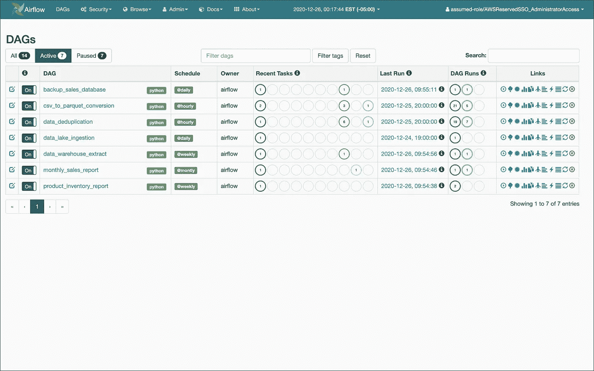
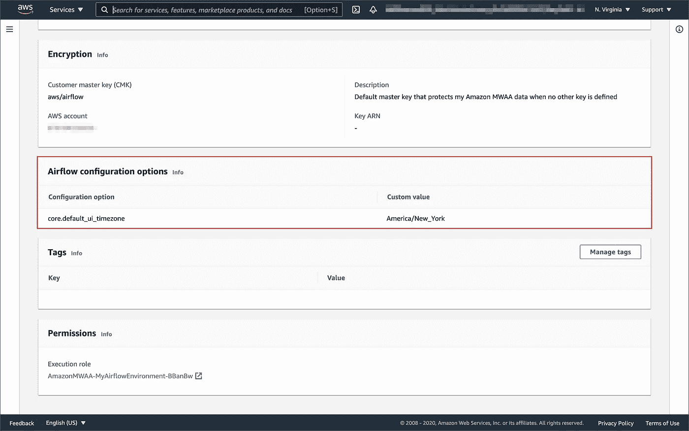
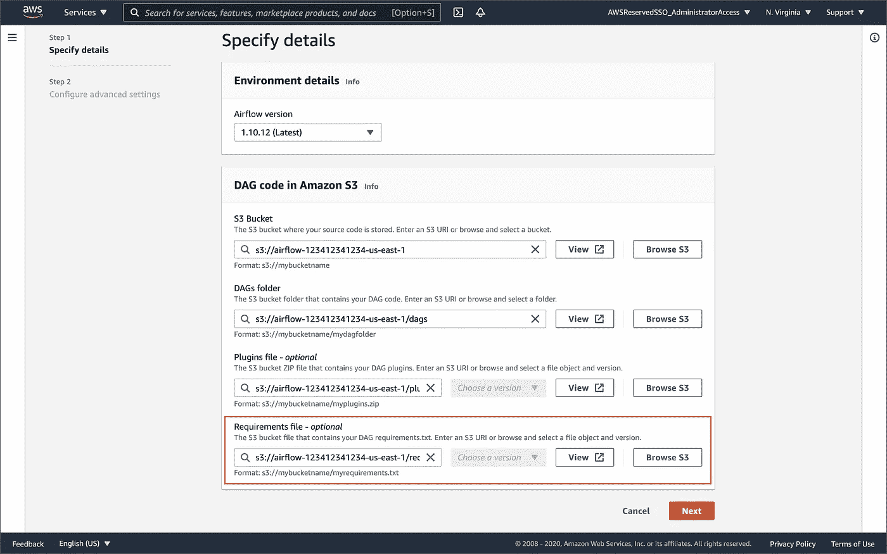

# Amazon 管理的 Apache Airflow 工作流—配置

> 原文：<https://itnext.io/amazon-managed-workflows-for-apache-airflow-configuration-77db7fd633c5?source=collection_archive---------1----------------------->

## 了解亚马逊 MWAA 的配置选项

# 介绍

对于任何不熟悉 Amazon Managed Workflows for Apache Airflow(Amazon MWAA)的人，尤其是那些习惯于管理自己的 Apache air flow 平台的人，Amazon MWAA 的配置可能一开始看起来有点像黑盒。这篇简短的帖子将探索亚马逊 MWAA 的配置——如何检查和修改它。我们将使用 Airflow DAGs 来查看 MWAA 环境的`airflow.cfg`文件、环境变量和 Python 包。

## 亚马逊 MWAA

[Apache Airflow](https://airflow.apache.org/) 是一个流行的开源平台，旨在调度和监控工作流。根据[维基百科](https://en.wikipedia.org/wiki/Apache_Airflow)的说法，Airbnb 于 2014 年创建了 Airflow，以管理该公司日益复杂的工作流程。项目从一开始就做开源，成为 2016 年 [Apache 孵化器](https://incubator.apache.org/)项目，2019 年顶级 Apache 软件基础项目。

随着亚马逊 MWAA 于 2020 年 11 月发布[公告](https://aws.amazon.com/blogs/aws/introducing-amazon-managed-workflows-for-apache-airflow-mwaa/)，AWS 客户现在可以专注于开发工作流自动化，而将气流管理留给 AWS。亚马逊 MWAA 可以作为 [AWS 步骤函数](https://aws.amazon.com/step-functions/)的替代品，用于 AWS 上的工作流自动化。

亚马逊 MWAA 服务可以使用 AWS 管理控制台，以及使用最新版本的 [AWS SDK](https://boto3.amazonaws.com/v1/documentation/api/latest/reference/services/mwaa.html) 和 [AWS CLI](https://awscli.amazonaws.com/v2/documentation/api/latest/reference/mwaa/index.html) 的[亚马逊 MWAA API](https://docs.aws.amazon.com/mwaa/latest/userguide/mwaa-actions-resources.html) 获得。关于亚马逊 MWAA 的更多信息，请阅读我的上一篇文章，[使用 Apache Airflow 在亚马逊 EMR 上运行 Spark 作业](/running-spark-jobs-on-amazon-emr-with-apache-airflow-2e16647fea0c)。



Apache 气流用户界面

# 源代码

这篇文章中引用的 Dag 可以在 GitHub 上获得。使用这个`git clone`命令，下载这篇文章的 [GitHub 库](https://github.com/garystafford/aws-airflow-demo)到你的本地环境。

```
git clone --branch main --single-branch --depth 1 --no-tags \
    https://github.com/garystafford/aws-airflow-demo.git
```

# 访问配置

## 环境变量

环境变量是 MWAA 环境配置的重要组成部分。有多种方法可以检查环境变量。您可以使用 Airflow 的`BashOperator`来简单地调用命令`env`，或者使用`PythonOperator`来调用 Python 迭代器函数，如下所示。项目中包含一个示例 DAG，`[dags/get_env_vars.py](https://github.com/garystafford/aws-airflow-demo/blob/main/dags/get_env_vars.py)`。

DAG 的`PythonOperator`将迭代 MWAA 环境的环境变量，并将它们输出到任务的日志中。下面是一个示例任务日志的片段。

## 气流配置文件

根据[气流](https://airflow.apache.org/docs/apache-airflow/1.10.12/howto/set-config.html)，`airflow.cfg`文件包含[气流的配置](https://airflow.apache.org/docs/apache-airflow/1.10.12/configurations-ref.html#)。您可以编辑它来更改任何设置。第一次运行 Apache Airflow 时，它会在您的`AIRFLOW_HOME`目录中创建一个`airflow.cfg`配置文件，并将这些配置作为环境变量附加到您的环境中。

亚马逊 MWAA 没有在环境的 Apache Airflow UI 中公开`airflow.cfg`。虽然不能直接访问，但是可以查看`airflow.cfg`文件。配置文件位于您的`AIRFLOW_HOME`目录下，`/usr/local/airflow`(默认为`~/airflow`)。

有多种方法可以检查您的 MWAA 环境的`airflow.cfg`文件。您可以使用 Airflow 的`PythonOperator`来调用读取文件内容的 Python 函数，如下所示。该函数使用`AIRFLOW_HOME`环境变量来定位和读取`airflow.cfg`。项目中包含一个示例 DAG，`[dags/get_airflow_cfg.py](https://github.com/garystafford/aws-airflow-demo/blob/main/dags/get_airflow_cfg.py)`。

DAG 的任务将读取 MWAA 环境的`airflow.cfg`文件，并将其输出到任务的日志中。下面是一个示例任务日志的片段。

## 定制气流配置

虽然 AWS 没有在您的环境的 Apache Airflow UI 中公开`airflow.cfg`，但是您可以直接在亚马逊 MWAA 控制台中更改默认的 Apache Airflow 配置选项，并继续使用`airflow.cfg`中的所有其他设置。亚马逊 MWAA 控制台中更改的配置选项被转换为环境变量。

要定制 Apache 气流配置，请直接在亚马逊 MWAA 控制台上更改默认选项。选择**编辑**，在**气流配置选项**菜单中添加或修改配置选项和值，然后选择**保存**。例如，我们可以将 Airflow 的[默认时区](https://airflow.apache.org/docs/apache-airflow/1.10.12/configurations-ref.html#default-ui-timezone) ( `core.default_ui_timezone`)更改为`America/New_York`。



亚马逊 MWAA 的气流配置选项

MWAA 环境更新后(这可能需要几分钟时间)，通过重新运行 DAG 来查看您的更改。请注意下面显示的日志片段的第 2 行和第 6 行中的新配置项。配置项单独出现(`AIRFLOW__CORE_DEFAULT__UI_TIMEZONE`)，也是`AIRFLOW_CONFIG_SECRETS`字典环境变量的一部分。

## 使用 MWAA API

我们还可以使用 [MWAA API](https://awscli.amazonaws.com/v2/documentation/api/latest/reference/mwaa/index.html) 进行配置更改。例如，要更改默认的 Airflow UI 时区，请使用 AWS CLI 调用 MWAA API 的`update-environment`命令。包括`--airflow-configuration-option`参数，将`core.default_ui_timezone`键/值对作为 JSON blob 传递。

要查看环境的配置，请结合使用`get-environment`命令和`jq`。

下面，我们看到了一个输出示例。

## Python 包

气流是用 Python 写的，工作流是通过 Python 脚本创建的。Python 包是 MWAA 环境配置的重要组成部分。根据[文档](https://docs.aws.amazon.com/mwaa/latest/userguide/working-dags-dependencies.html)，一个“额外包”是一个 Python 子包，它不包含在 Apache Airflow base 中，安装在您的 MWAA 环境中。作为设置 MWAA 环境的一部分，您可以在气流 S3 桶中指定`requirements.txt`文件的位置。使用`requirements.txt`文件安装额外的包。



亚马逊 MWAA 环境的配置

有多种方法可以检查您的 MWAA 环境中已安装的 Python 包和版本。您可以使用 Airflow 的`BashOperator`来调用命令`python3 -m pip list`。项目中包含一个示例 DAG`[dags/get_py_pkgs.py](https://github.com/garystafford/aws-airflow-demo/blob/main/dags/get_py_pkgs.py)`。

DAG 的任务会将所有 Python 包和包版本的列表输出到任务日志中。下面是一个示例任务日志的片段。

# 结论

理解您的亚马逊 MWAA 环境的`airflow.cfg`文件、环境变量和 Python 包对于正确的气流平台管理都很重要。这篇简短的帖子了解了更多关于亚马逊 MWAA 的配置——如何使用 DAGs 检查它，以及如何通过亚马逊 MWAA 控制台修改它。

本博客代表我自己的观点，不代表我的雇主亚马逊网络服务公司的观点。所有产品名称、徽标和品牌都是其各自所有者的财产。