# 亚马逊网络服务(AWS) —无服务器架构

> 原文：<https://itnext.io/amazon-web-services-aws-serverless-architecture-2c14369aa66b?source=collection_archive---------5----------------------->

## 初学者设置全栈应用程序的完整教程


在 [Unsplash](https://unsplash.com/s/photos/server?utm_source=unsplash&utm_medium=referral&utm_content=creditCopyText) 上[科学高清](https://unsplash.com/@scienceinhd?utm_source=unsplash&utm_medium=referral&utm_content=creditCopyText)拍摄的照片

当我第一次开始学习 AWS 时，我认为它是黑暗魔法。每当我触及这个话题时，有太多的东西需要学习，以至于我立即停下来，不知道如何继续。

这就是为什么我创建了这个使用 AWS 创建全栈应用程序的分步教程。在本教程之后，我们将有一个前端，一个与数据库对话的后端，以及一个 API。

有几种与 AWS 通信的方式，在本教程中，我们将使用服务 web 控制台。**网络控制台是用户友好的网络应用**，让用户管理和设置 AWS 服务。对我来说，学习 AWS 感觉有点势不可挡，因为许多教程都使用 AWS CLI。AWS CLI 是一个命令行工具，与 web 控制台做同样的事情。如果你打算花很多时间使用 AWS，我建议你使用 AWS CLI，但是 web 控制台提供了一个更容易的学习曲线。

## 什么是 AWS 和无服务器？

AWS 是亚马逊运营的云基础设施即服务(Cloud IaaS)平台。这个云提供服务来帮助开发者在云中执行计算。这意味着，作为用户，你可以设置一项服务，例如网页。然后网页由云运行，也由云管理。

所以当你读到无服务器，并不意味着没有服务器。对于用户来说，不涉及任何服务器。用户(开发人员)不需要服务器来运行和执行他们的代码，这一切都由云中的服务器来完成。

**把它想象成租车**，你付钱使用别人的服务器，他们处理服务。

根据 [AWS](https://aws.amazon.com/getting-started/deep-dive-serverless/?e=gs2020&p=build-a-web-app-five) 使用无服务器方法的原因如下。

*   **无服务器管理** —无维护，无管理
*   **扩展** —当应用需要更多内存或吞吐量时，会自动扩展应用。
*   **为价值付费** —只为您使用的东西付费。
*   **自动化高可用性** —应用程序在提供高容错能力的环境中运行。

## AWS —入门

首先要做的是[注册](https://portal.aws.amazon.com/billing/signup?nc2=h_ct&src=header_signup&redirect_url=https%3A%2F%2Faws.amazon.com%2Fregistration-confirmation#/account)一个 AWS 账户。您将需要提供一个信用卡账单，**有一个免费层的费用为 0 美元，**所以不要担心。

AWS 提供许多不同的服务，每个服务都有其独特的功能。我们将逐步介绍一些基本服务。

## AWS Amplify —建立一个静态网站

我们将从使用 [AWS Amplify](https://aws.amazon.com/amplify/hosting/) 服务开始。这是一种用于托管静态网站的服务。它的酷之处在于，我们可以将它连接到一个 Git 存储库，这意味着它将托管该存储库上的任何静态网站。

当您访问 AWS 控制台时，您需要以 root 用户身份登录，并提供您作为 root 用户使用的电子邮件。这个选项存在的原因是，一个组织中可能有许多人需要访问同一个云服务。在本教程中，我们不会过多介绍 IAM，但它是一个用户访问服务。


为 AWS 控制台设置 root 用户。

**重要注意事项在继续之前，请始终更改我们将使用的每个服务的地区。**如果您在俄勒冈地区创建了一项服务，那么只有在您更改为俄勒冈的情况下，您才能看到您的服务。我看到很多关于这个的问题，“我所有的工作都没了”。很多时候，他们在错误的地区工作。可以在每个服务的右上角更改区域。


AWS 区域—一个常见的错误是忘记切换服务中使用的区域。

我们需要从建立一个新的存储库开始，登录 [GitHub](http://www.github.com) 并创建一个新的存储库。
在开发机器上创建一个名为 aws-programming-with-percy 的新目录，并创建一个名为 index.html 的新 HTML 文件。index.html 的名字很重要。我们还将初始化目录中的 GitHub 存储库。

```
mkdir aws-programming-with-percy
touch index.html
git init 
git remote add origin [https://github.com/percybolmer/aws-programming-with-percy.git](https://github.com/percybolmer/aws-programming-with-percy.git)
```

打开 index.html，把下面的要点抄进去。

index.html 一个超级简单的静态网站欢迎我们。

保存您的 index.html 并将其推送到存储库。

```
git add .
git commit -m "Added index.html"
git push origin master
```

更新后，访问 AWS 上的[放大控制台](https://us-west-2.console.aws.amazon.com/amplify/home?region=us-west-2#/)。你应该会受到一个温暖人心的闪屏的欢迎。按下**开始**按钮，或向下滚动进入开始部分。

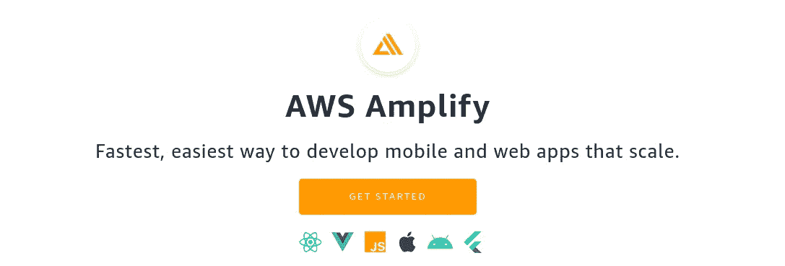

AWS 在开始时放大问候

将有两个报价开始，我们想使用交付选项。

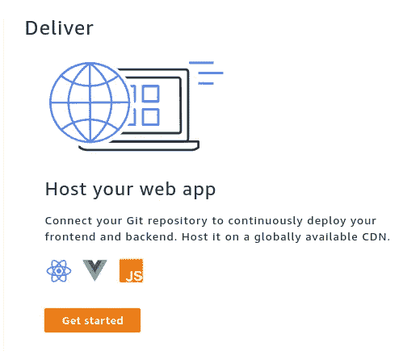

交付——在 AWS Amplify 上托管 git 存储库的选项

在下一个询问您如何提供代码的屏幕中选择 GitHub。

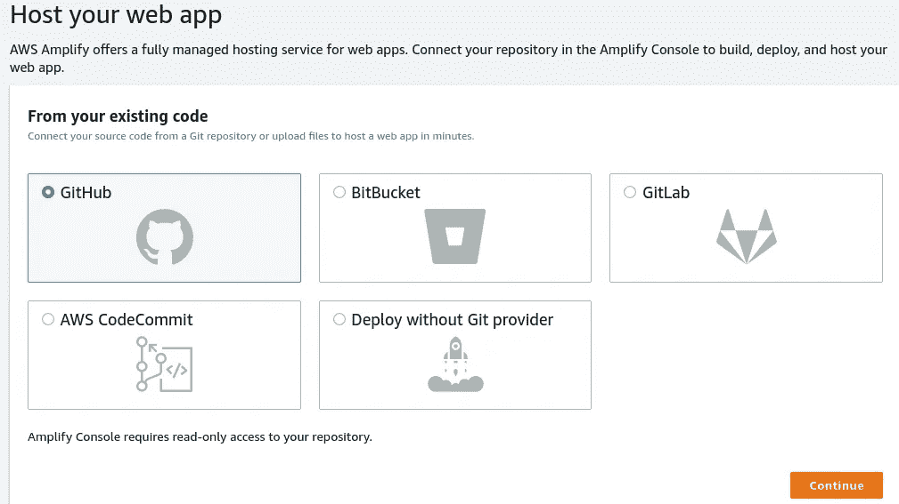

AWS 中可用的代码提供程序。我们将使用 GitHub。

AWS Amplify 将需要访问您的 GitHub，如果您在同一个浏览器上登录，您应该会看到 OAuth 屏幕。我们会信任 AWS，接受他们。按下绿色的“授权 aws-amplify-console”。

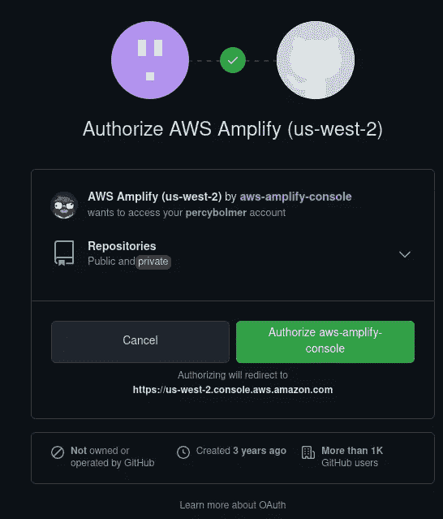

OAuth 是必需的，AWS 将需要访问存储库。

您应该回到 AWS Amplify，在这里我们可以设置使用什么存储库。**确保您选择了我们刚刚创建的包含 index.html**的存储库，还选择了正确的分支。如果你按照我的例子，它应该是主，如果你没有指定主，那么它也可以是主要的。

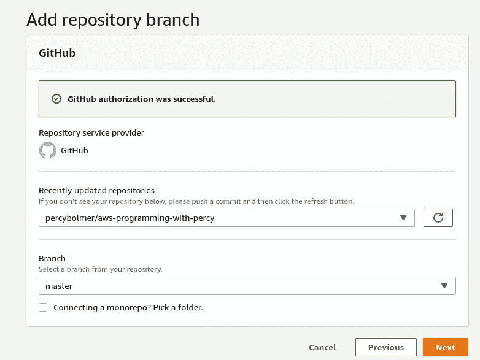

AWS 放大器选择一个储存库和分支到主机。

接下来，我们可以设置构建设置。在这个简单的用例中，我们还没有任何构建设置，所以现在就让它这样吧。但是在这里你可以设置如何构建项目，定制 docker 图像和环境变量。

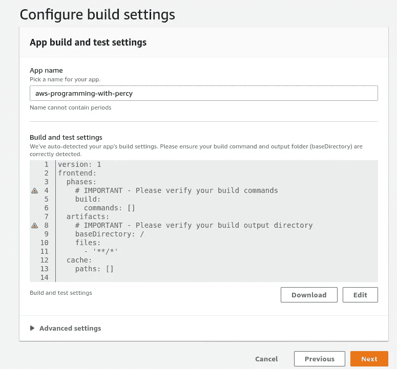

AWS Amplify 中的构件设置—设置构件和 docker 设置等。

按下一步，您将看到一个摘要屏幕。

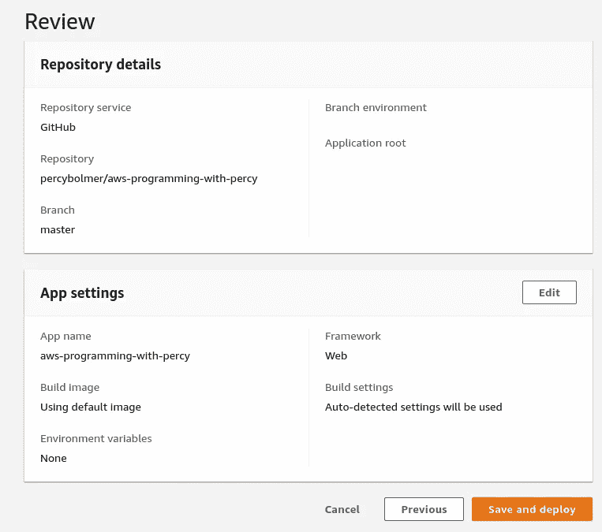

部署前的 AWS 放大摘要屏幕

按“保存并部署”。AWS Amplify 将开始加载，它现在正在构建您的应用程序。

完成后，您将被重定向到一个管理仪表板，我们可以在那里配置网站。

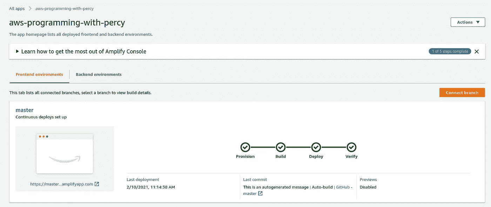

AWS Amplify dashboard 用于我们刚刚部署的网站。

在底部有一个链接，你可以点击查看网站，我们现在有一个活的网站。注意，它使用的是 AWS 生成的子域。您可以将其更改为您的自定义域。我们现在不会这样做，我没有自定义域，我们仍在学习诀窍。

点击链接，确保一切正常。

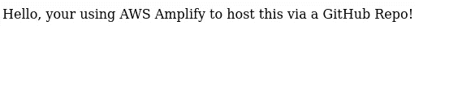

使用 Percy 网站编程——由 AWS Amplify 托管，从 GitHub 存储库中提取网站

太好了，那很简单，对吧？我们现在知道如何用 AWS Amplify 托管一个网站。确保在 Amplify 控制台中导航，看看它有哪些不同的工具和可能性。

Amplify 的一些好特性是

*   监控—这允许您监控站点流量、访问日志和设置警报。
*   自定义标头—这允许您向所有请求添加 HTTP 标头。
*   域名管理——这允许你绑定一个自定义域名到网站，也为你解决了 HTTPS 问题。
*   admin UI——构建应用后端的可视化界面，完全公开，我还没用过这个。

一个简单的网站并不能让我们走得很远？我们继续吧。

## AWS Lambda —您的 AWS 后端和代码执行器

接下来将实现一个 [AWS Lambda](https://aws.amazon.com/lambda/?nc2=h_ql_prod_fs_lbd) 。另一个服务，让我们基于某些触发器运行代码。我不得不说，在我敢于尝试之前，我已经听了很久关于 AWS Lambda 的讨论。只是发生了太多的黑魔法让我害怕。如果我能开发出像这样一半好的软件，我会非常高兴。

AWS Lambda 是一个无服务器解决方案，允许您基于特定事件执行代码。对于作为客户的你来说，Amazon 提供服务器并以一种供应和管理的方式运行你的代码。

> AWS Lambda 是一种无服务器计算服务，允许您运行代码，而无需配置或管理服务器、创建工作负载感知集群扩展逻辑、维护事件集成或管理运行时。有了 Lambda，您几乎可以为任何类型的应用程序或后端服务运行代码——所有这些都无需管理— [AWS Lambda](https://aws.amazon.com/lambda/?e=gs2020&p=build-a-web-app-two)

首先打开 [AWS Lambda 控制台。](https://us-east-2.console.aws.amazon.com/lambda/home?region=us-east-2#/functions)点击右上角，更改您正在使用的区域。我住在瑞典，所以我把我的时间定在了斯德哥尔摩。

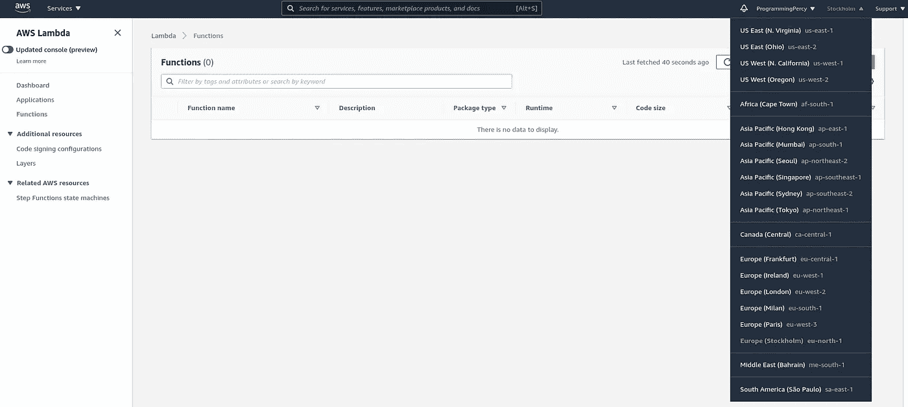

AWS Lambda 控制台开始屏幕—更改区域以匹配您的位置。

我们目前没有任何函数，所以让我们从创建一个函数开始。按下“创建功能按钮”。

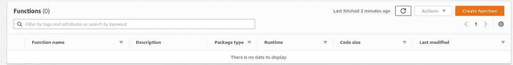

AWS Lambda 控制台—目前没有功能。

有四种选择。您可以从头开始构建代码，使用预先构建的蓝图，上传 docker 映像，或者浏览 [AWS 无服务器应用程序库](https://aws.amazon.com/serverless/serverlessrepo/)。

要上传 docker 图像，它必须是[亚马逊 ECR](https://aws.amazon.com/ecr/) 的一部分。ECR 是他们的 Docker 存储库。

我将继续从头开始创建一段代码，这将是一个名为 Greeter 的函数，它向用户打印 Hello。我将使用 Golang 作为我的编程语言。

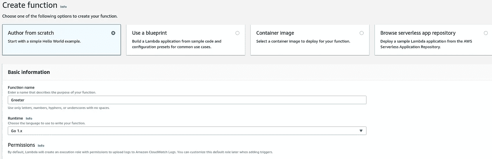

使用 Golang 从头开始创建 AWS Lambda

遗憾的是，AWS Lambda 不支持 Go 浏览器中的代码编辑器。如果你使用的是支持的语言，在函数代码部分会有一个代码编辑器。如果使用 Go，我们必须上传一个包含我们想要的代码的. zip 文件。我们将构建一个向用户问好的简单函数。

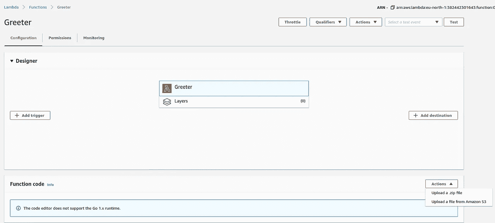

AWS Lambda 函数视图—我们使用函数代码操作来上传包含代码的. zip 文件。

我将创建一个新的 Golang 项目，并创建一个简单的 main.go 文件。main.go 文件将包含一个名为 GreetVisitor 的函数，该函数将获取访问者的姓名并问候他们。

AWS Lambda——一个超级基本的 Lambda 函数示例。

接下来，我们需要初始化一个 go 模块，并从中构建一个二进制文件，我们还需要压缩这个二进制文件，这样我们就可以在 AWS Lambda 中执行它。

```
go mod init Greeter
go get github.com/aws/aws-lambda-go/lambda
GOOS=linux go build -o Greeter main.go
zip Greeter.zip Greeter
```

这些命令将下载所需的 aws-lambda-go 包，并将我的程序编译成一个名为 Greeter 的二进制文件。然后，我将欢迎压缩成一个 zip 文件。获得 zip 文件后，返回 AWS Lambda 控制台。再次找到**功能代码**部分，选择操作并上传 zip。

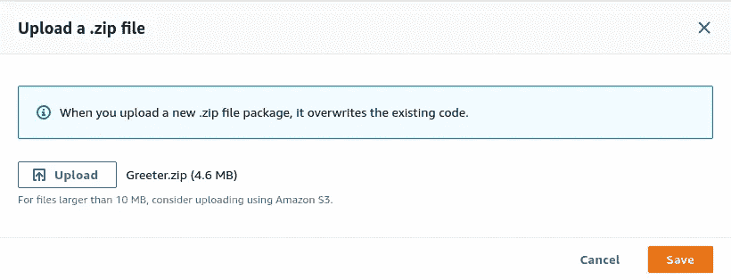

AWS Lambda —我将 Greeter.zip 上传到我的欢迎函数中

另外，找到**运行时设置，**我们需要编辑函数应该运行的二进制文件。将处理程序名设置为我们编译的二进制文件的名称，在我的例子中是 Greeter。

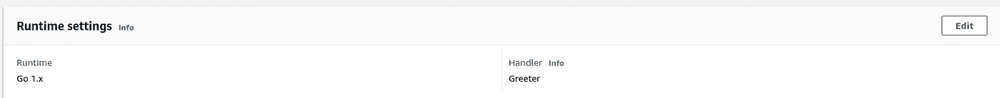

AWS Lambda —配置为运行欢迎二进制文件的功能。

让我们试试代码是否能如预期的那样工作。我们知道，如果该函数接收到一个用户，它将打印用户的姓名。滚动到 AWS Lambda 控制台中欢迎功能仪表板的顶部，找到一个下拉菜单，上面写着“选择一个测试事件”。我们将配置一个测试事件，以确保该功能正常工作。

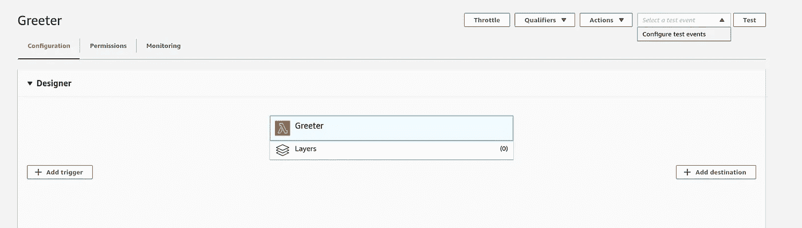

AWS Lambda——为函数设置测试用例很容易

我们会发现一个对话框，允许我们创建测试输入，并将其传递给我们编写的函数。在我的例子中，我将使用 hello-world 模板并修改 JSON 输入以匹配我们的用户结构。

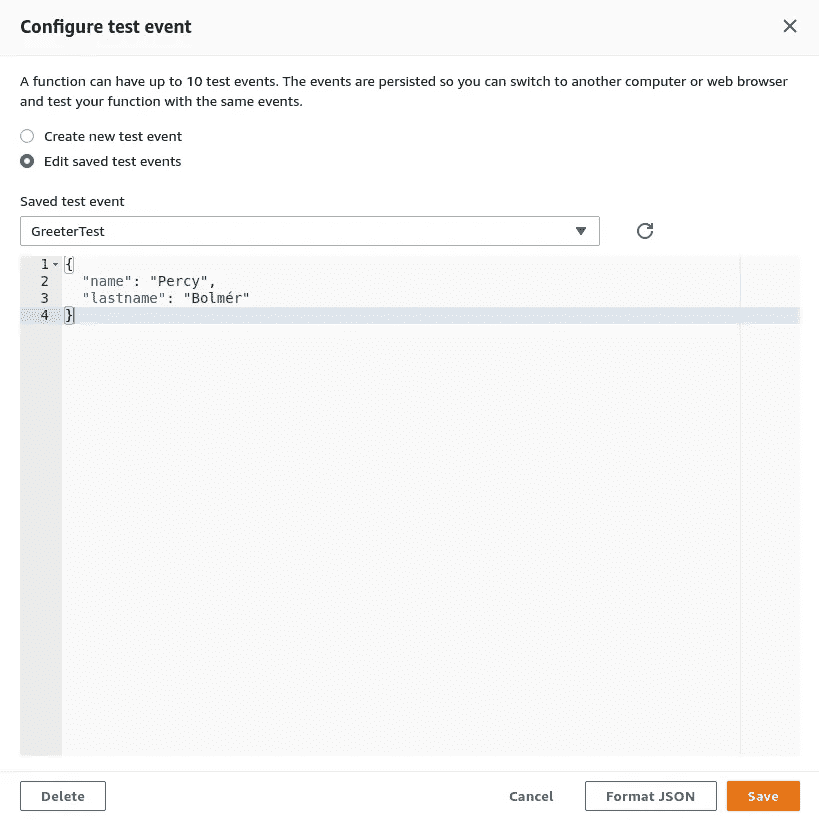

AWS Lambda——测试欢迎界面中的用户输入

完成后按 Create，然后在选择新创建的测试后单击右上角的“测试”按钮。

在我的图片中，你可以看到输出，因为它是迎接我。

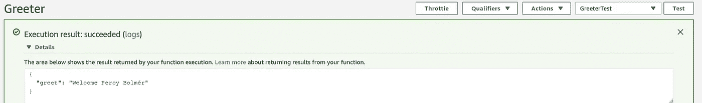

AWS Lambda —我已经选择了我的欢迎测试，并按下测试按钮来执行它。输出似乎正确

太好了，我们可以执行自定义代码。然而，这并不能帮助我们的网站。他们之间没有联系。

## AWS API 网关 Lambda 和 Amplify 之间的 RESTful API

Amazon API Gateway 是一种服务，它提供了一种在我们的其他应用程序前面插入 API 的方法。你可以在 AWS 网站上阅读关于 [API 网关](https://aws.amazon.com/api-gateway/)的内容。可以把它看作是我们的 Amplify 和 Lambda 服务之间的通信器。

> Amazon API Gateway 是一个完全托管的服务，使开发人员可以轻松地创建、发布、维护、监控和保护任何规模的 API。API 充当应用程序从后端服务访问数据、业务逻辑或功能的“前门”。

让我们从访问 [API 网关控制台](https://console.aws.amazon.com/apigateway/main/apis?region=us-east-1)开始。不要忘记像我们在其他服务中所做的那样切换区域。

根据您想要创建的网关，网关将为您提供一些选项。我们将继续使用 REST API。选择在未标记为私有的 REST API 上构建。

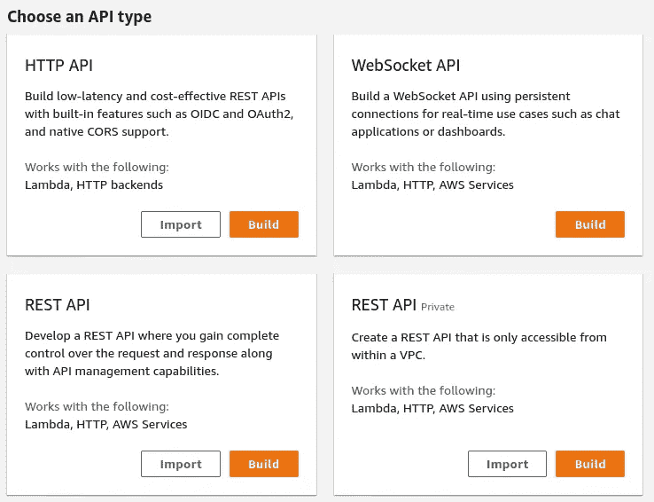

AWS 网关—创建多种 API 的选项

创建 API 后，他们将为我们生成一个示例 API。快速阅读这个 API 可以很好地了解可以做什么。

选择“新 API”并为该 API 设置一个 API 名称。我们还将选择端点类型。根据 AWS 指南，对于拥有广泛地理分布客户的网站，建议使用 Edge Optimized。设置配置后，按下蓝色的**创建 API** 按钮。

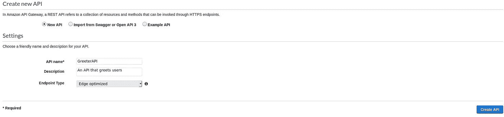

AWS 网关—生成一个名为 GreeterAPI 的新 REST API。

我们将看到一个视图，显示 API 当前拥有的所有方法。我们还没有任何方法，所以它将是空的。我们将从创建一个新方法开始，选择**动作**下拉菜单和**创建方法。**

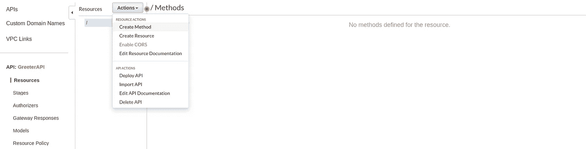

AWS 网关—为 API 创建新方法。

它将生成一个新的下拉列表，我们可以在其中选择要使用的 HTTP 方法。我们希望我们的端点监听帖子。

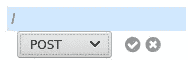

选择 HTTP Post 作为要使用的端点方法

我们将看到一个新的屏幕，允许我们配置当 POST 到达端点时会发生什么。我们将希望执行我们之前创建的 lambda 函数，因此选择 **Lambda 函数作为集成类型。**
我们还需要输入 Lambda 函数的名称，在我的例子中，我将其命名为 Greeter。不要忘记点击蓝色闪亮的保存按钮。

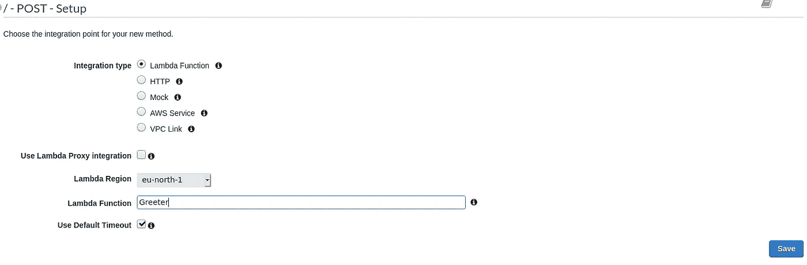

AWS 网关—设置在 HTTP 端点上执行的 Lambda 函数。

它会提示您是否允许调用 lambda 函数。取消是没有意义的，我们希望这是允许的，所以接受吧。

我们将看到 API 端点的可视化。它在左侧向我们展示了客户端，以及请求是如何被传输到我们的 Lambda Greeter 上，然后作为响应返回的。


AWS 网关 API 的可视化

让我们单击客户机上的 TEST 按钮，并发出一个测试请求，以确保它正在工作。我们可以很容易地添加一个 JSON 请求，并在浏览器中测试它。我已经测试过了，看起来我得到了正确的问候。

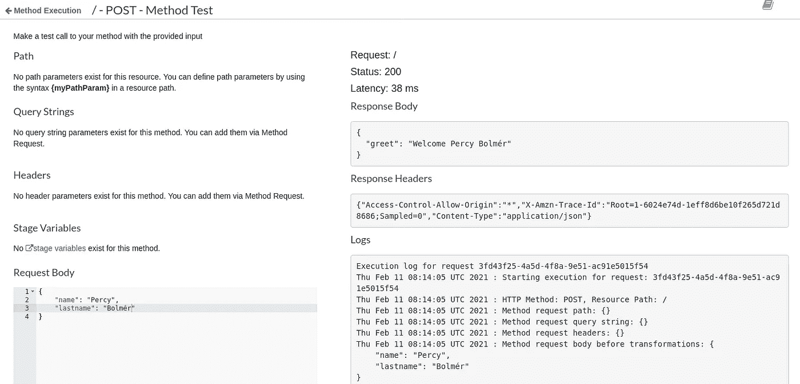

AWS 网关—简化端点测试。

还有一件事要做，就是启用 CORS。如果你不知道 CORS 是什么，我建议你读一下[CORS 是什么？](https://medium.com/@baphemot/understanding-cors-18ad6b478e2b)巴尔托什·什切青斯基[的一篇漂亮文章](https://medium.com/u/a5f578f5b81a?source=post_page-----2c14369aa66b--------------------------------)。在这种情况下，它允许来自任何地区的请求通过网关，这是我们想要的。

选择发布端点并转到**动作**下拉菜单。有一个选项叫做**启用 CORS。**

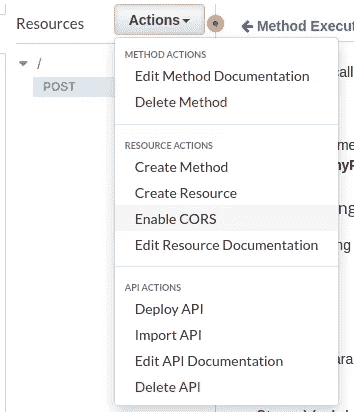

AWS 网关—启用 CORS 轻而易举。

选择它将打开一个带有几个选项的表单。对于本教程，只是让它保持原样，并按下蓝色的“启用 CORS 和替换现有的 CORS 标题”

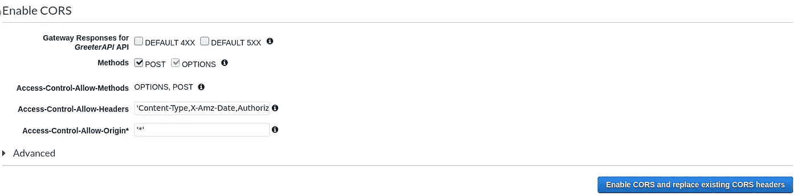

AWS 网关— CORS 可通过自定义标题进行高度定制。

将提示您将要应用的更改摘要，接受它们。

下一步是部署 API。再次进入**动作**下拉菜单。并找到部署 API 选项。

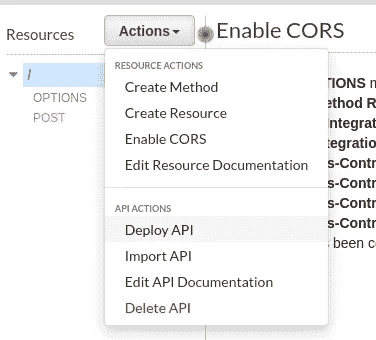

AWS 网关—通过简单的按键部署 API

按下 Deploy API 将显示一个表单，要求我们命名 API。我已经命名了我的发展。


AWS 网关—命名 API

现在，您将从“资源”选项卡移至“阶段”选项卡。开发阶段有大量的设置，我们不会在本指南中涉及它们。

我建议保存调用 URL，这是我们将找到 API 的 URL。它位于开发阶段编辑器的顶部。

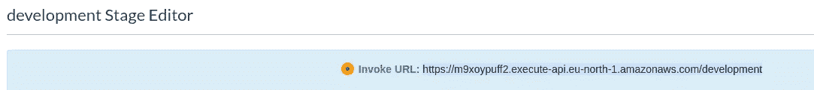

AWS 网关—为我们生成了调用 API 端点的 URL。

所以我们现在有了一个运行 Amplify 的前端，一个运行 Lambda 的后端和一个 API。但我们还没有一起使用它们，我们将改变它，以便网站可以接受名字和姓氏，并问候任何填写表格的人。我们还将创建一个用于 lambda 的数据库。

## 自动气象站 dynamo db——NoSQL 数据库

我们将使用的下一个服务是 [Amazon DynamoDB。](https://aws.amazon.com/dynamodb/?trk=ps_a134p000006pavYAAQ&trkCampaign=acq_paid_search_brand&sc_channel=PS&sc_campaign=acquisition_ND&sc_publisher=Google&sc_category=Database&sc_country=ND&sc_geo=EMEA&sc_outcome=acq&sc_detail=amazon%20dynamodb&sc_content=DynamoDB_e&sc_matchtype=e&sc_segment=495122367971&sc_medium=ACQ-P|PS-GO|Brand|Desktop|SU|Database|DynamoDB|ND|EN|Text|xx|EU&s_kwcid=AL!4422!3!495122367971!e!!g!!amazon%20dynamodb&ef_id=Cj0KCQiApY6BBhCsARIsAOI_Gjay2uhSZfAVgAP3_ZXXZgg3BFi7wjPyoUmOcBi99AT9dMrc2zHSU-4aAnHrEALw_wcB:G:s&s_kwcid=AL!4422!3!495122367971!e!!g!!amazon%20dynamodb)这是一个键值数据库，可以在我们的 AWS 基础设施内部使用。

> Amazon DynamoDB 是一个键值和文档数据库，在任何规模下都能提供一位数的毫秒级性能。— [AWS DynamoDB](https://aws.amazon.com/dynamodb/?trk=ps_a134p000006pavYAAQ&trkCampaign=acq_paid_search_brand&sc_channel=PS&sc_campaign=acquisition_ND&sc_publisher=Google&sc_category=Database&sc_country=ND&sc_geo=EMEA&sc_outcome=acq&sc_detail=amazon%20dynamodb&sc_content=DynamoDB_e&sc_matchtype=e&sc_segment=495122367971&sc_medium=ACQ-P|PS-GO|Brand|Desktop|SU|Database|DynamoDB|ND|EN|Text|xx|EU&s_kwcid=AL!4422!3!495122367971!e!!g!!amazon%20dynamodb&ef_id=Cj0KCQiApY6BBhCsARIsAOI_Gjay2uhSZfAVgAP3_ZXXZgg3BFi7wjPyoUmOcBi99AT9dMrc2zHSU-4aAnHrEALw_wcB:G:s&s_kwcid=AL!4422!3!495122367971!e!!g!!amazon%20dynamodb)

我们将使用数据库来存储用户。首先访问 [DynamoDB 控制台](https://eu-north-1.console.aws.amazon.com/dynamodb/home?region=eu-north-1#gettingStarted:)。

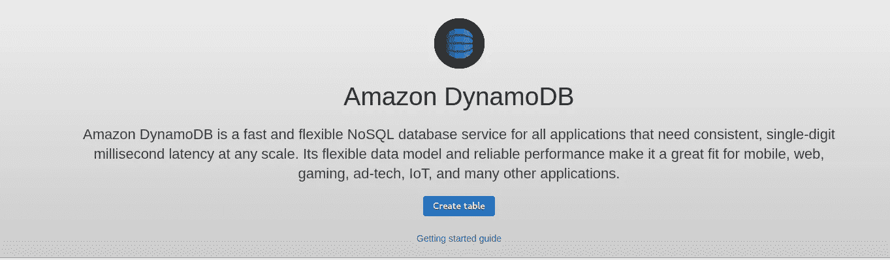

AWS — DynamoDB 一个易于实现的数据库

选择 Create table 并在表单中填写所需的配置。我们需要命名该表并设置一个主键。我将它命名为 Users，并将使用一个 ID 作为主键。

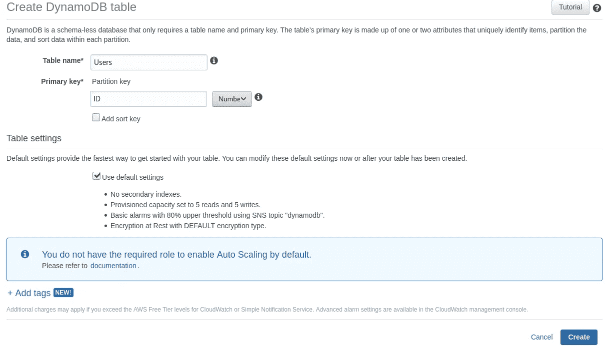

AWS DynamoDB —创建一个表并对其进行配置。

一旦创建了表，您将看到一个新视图，您可以在其中进一步配置和修改表。让我们保持简单，复制**亚马逊资源名称** (ARN)。它位于底部**的**工作台细节**内。**


AWS DynamoDB —以后需要使用 ARN

数据库启动了，但是我们不能连接到它，除非我们允许 Lambda 函数访问。再次打开 [AWS Lambda 控制台](https://eu-north-1.console.aws.amazon.com/lambda/home?region=eu-north-1)，进入欢迎功能。导航到欢迎界面中的**权限**选项卡。然后我们将**单击执行角色**字段中的链接。

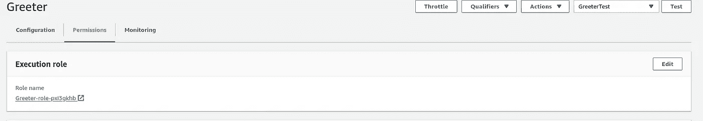

AWS Lambda —执行角色，一个我们可以编辑访问的地方

您将获得一项名为**身份和访问管理(IAM)** 的新服务。我不会涵盖它的所有细节，我会留给好奇的人，你可以在这里阅读。我们将向欢迎者角色添加一个新的内嵌策略。这可以通过点击**添加内联策略**来完成。

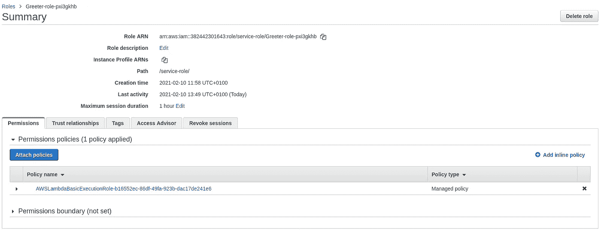

AWS IAM —向欢迎者角色添加新的内嵌策略

出现新屏幕时，按下**JSON 字段继续。你可以使用可视化编辑器，但我觉得它不可靠。JSON 简单快捷。**


AWS IAM —允许服务通过 IAM 相互联系。

复制下面的要点并将其插入到 JSON 字段中，但是记住**用 DynamoDB 表中显示的 ARN** 替换整个资源字段。

JSON IAM 中提供的配置，不要忘记替换资源字段。

插入 JSON 后，按下“**审查政策**按钮。系统将提示您一个字段，要求您为策略命名。输入一个易于记忆和理解的名称。完成后按下**创建策略**。

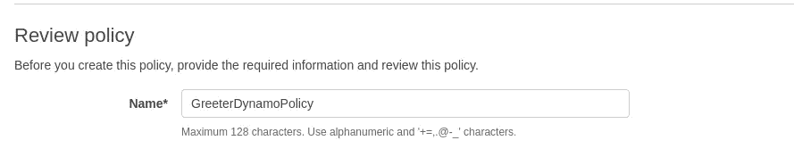

AWS IAM —命名策略

一旦完成，我们就允许 Lambda 访问数据库。我们仍然需要更新 lambda 代码，以便它可以对数据库做任何事情。

我们现在将更新欢迎应用程序中的 main.go 代码，如下所示。我们将使用的代码非常简单，只会将任何用户推入数据库，没有重复检查或任何东西。让我们专注于学习 AWS 中的诀窍，而不是学习坚实的软件工程。

main.go lambda 已更新，可在数据库中存储问候的用户。

不要忘记重新构建二进制文件并将其压缩。

```
GOOS=linux go build -o Greeter main.go
zip Greeter.zip Greeter
```

现在给你一个小小的阅读喘息的机会，由你来重复我们之前上传 Lambda 的步骤。这可能是一次有用的训练。进入 AWS Lambda 控制台，选择欢迎功能并上传新的 ZIP 文件。重新运行欢迎测试。

如果一切顺利，你应该会成功迎接。然后，您可以返回 DynamoDB 控制台，查看插入的数据。按下**开始搜索后，可在项目选项卡内查看数据。**

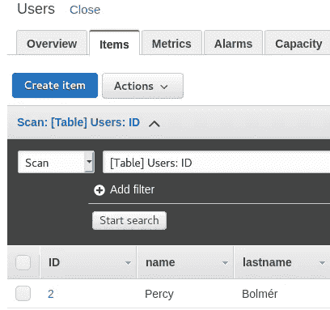

AWS DynamoDB —运行测试后，数据库应该注册了一个项目。

太好了，现在我们有一个数据库也在运行。剩下的就是对 web 应用程序进行一个小的更新来调用 API 网关。

## AWS Amplify —调用 API

在我们开始修改代码之前，有一个小生活帮如果你打算坚持使用网络控制台，现在就在你的浏览器中创建一个书签文件夹。您会注意到 AWS 中有许多不同的服务。

我们需要更新 HTML 来包含一个小的 javascript 片段。javascript 将向 API 网关发送一个请求。API 托管在我告诉您保存的调用 URL 上。如果您不记得了，您可以在 [AWS API 网关中找到它。](https://console.aws.amazon.com/apigateway/main/)调用 URL 可以在我们之前创建的开发阶段中找到。

在更新后的代码中，我们将使用常规的 javascript [获取](https://javascript.info/fetch)。它将向我们的网关 API 发出 HTTP 请求，我们将把响应打印到显示问候的文本区域。

index.html 展示了我们如何从网站上调用 API

当我们更新存储库时，可能需要几秒钟或几分钟才能更新网站。由于我们启用了持续部署，Amplify 将自动检测存储库中的变化。您可以在 Amplify web 控制台内部看到它是否已部署，在屏幕截图中，您可以看到它在检测到更新的存储库后正在重建我的网站。

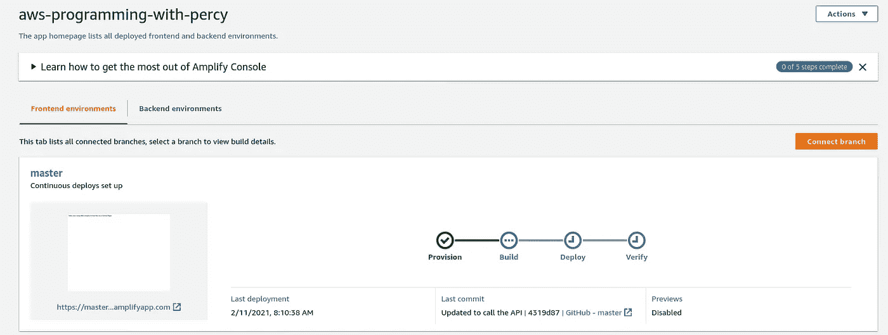

AWS Amplify —只要我们推送至存储库，网站就会自动更新。

验证为绿色后，您可以访问该网站的网址，您应该能够输入用户名和姓氏，文本区将添加问候。如果您访问 DynamoDB，您还应该看到该表用输入进行了更新。

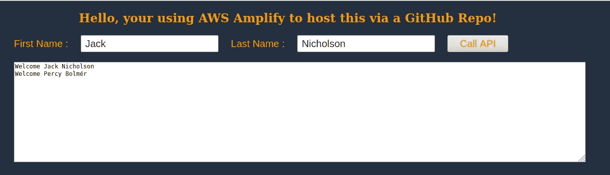

全栈网站完成-向输入姓名的用户显示问候

## 简短回顾

我们使用 AWS Amplify 来托管静态网站。
该网站有一个 POST 表单，可以向 AWS Gateway 发送请求。
网关 API 确保请求看起来正确，并将其转发到 AWS Lambda。
Lambda 是我们可以运行定制代码的地方。Lambda 连接到数据库 DynamoDB。


照片由[雷·轩尼诗](https://unsplash.com/@rayhennessy?utm_source=unsplash&utm_medium=referral&utm_content=creditCopyText)在 [Unsplash](https://unsplash.com/s/photos/fireworks?utm_source=unsplash&utm_medium=referral&utm_content=creditCopyText) 上拍摄

恭喜你！现在，您已经有了一个包含前端、后端、API 和数据库的 web 应用程序，并且正在运行。

我希望这篇教程对你有用。记住，如果你想了解更多，AWS 网站[上还有更多教程。](https://aws.amazon.com/getting-started/?nc2=h_ql_le_gs_rc)

另外，如果您想在向您的服务器收取任何费用之前**关闭您的 AWS 帐户，请确保在** [**账单**](https://console.aws.amazon.com/billing/home?#/account) **底部关闭您的帐户。或者禁用任何手动运行的服务。**

**现在，走出去，AWS！**