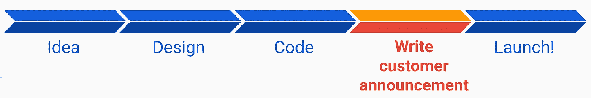

# 亚马逊并不是什么秘密武器

> 原文：<https://itnext.io/amazons-not-so-secret-weapon-54a089536dfb?source=collection_archive---------1----------------------->

## 逆向工作的魔力:真实世界案例研究

我在亚马逊工作的 11 年间，见证了公司从 3000 名工程师发展到 60000 名工程师，股票从 40 美元增长到 3000 美元(拆分前)。从各方面来看，这都是一个天文数字的增长。这是一次疯狂的旅行。

有时候有人问我:*什么是* ***秘制酱*** *？*

我真的不认为有什么“秘密”酱。一切都在那里，让你一目了然。杰夫·贝索斯无情的商业头脑。紧张的工作环境过度关注分娩，毫无歉意地削减脂肪。亚马逊的[领导原则](https://www.amazon.jobs/en/principles)塑造了招聘、解雇、商业决策甚至日常对话的方式。但最重要的是，**亚马逊从客户的角度出发**。我之前的一篇博客提到了这一点(“[讲故事的重要性](https://link.medium.com/C6UJ4Ghaqlb)”)。

我在亚马逊工作期间的职业发展在某种程度上反映了亚马逊的发展。我以 SDE 二世的身份进来，对自己非常不自信；在担任首席工程师六年并塑造了亚马逊测试其软件的许多方式后离开。职业发展的很大一部分也是由于逆向工作。

你可能会问，这种神奇的“逆向工作”是什么？

很简单。事实上，看似简单。

大多数软件工程师的工作方式是线性的，他们有了一个想法，就写下一份庞大的设计文档，与同事一起审阅，一旦获得批准，他们就开始编写代码。最后，当产品功能完善时，他们会写一份面向客户的公告，然后推出他们的产品，向全世界发布公告。

亚马逊的想法不同。在你写你的代码之前，在你写你的设计之前，实际上，在你真正考虑你可能遇到的所有技术障碍之前，你应该写客户声明。您与您的同事、利益相关者、客户一起审查它，以保持一致。然后，你的技术设计从它向后工作。

就这么简单？

是啊。

但是我断言颠倒事情发生的顺序会改变一切。这并不意味着更多的工作:无论如何你都要写客户公告！

一个好的客户公告告诉我**什么、****为什么**和**如何、**，它根本没有谈论实施细节。通常是这样的格式*“我们很高兴发布 X。在 X 之前，我们的客户因为 a、b、c 而苦苦挣扎。现在有了 X，我们的客户更高兴了，因为 d、e、f。要开始使用 X，请这样做:……”*

也许你非常喜欢阅读技术设计文档，你会发现很容易消化一份 34 页的文档。但对我来说，阅读技术设计文档消耗了巨量的**认知负荷**。我是一个传统的人，实际上打印文档，在办公室找一个舒适的地方，拿起一支红笔和一支荧光笔，煞费苦心地构建我自己的提议架构的思维地图。我们的大脑往往有有限的认知负荷，而我的在 34 页中的第 11 页就耗尽了。然后，我不情愿地抓起一杯咖啡，强迫自己通过其余的权力。

当我阅读面向客户的公告时，发生在我身上的事情是什么和为什么让我兴奋。他们激发它。现在我很好奇:这位工程师将如何在技术方面实现这一点？我被迷住了。我是一个被俘虏的观众。在这 34 页的技术垃圾中，我似乎有永无止境的认知负荷，因为，该死的，我真的很好奇。我的脑海中已经有了一个思维地图，让设计的各个部分更加自然。

不过，还会发生一些别的事情。

**用标准“线性”流程构建的产品的实际形状*不同于逆向构建的产品的形状*。**

# 我的真实世界的例子

回到 2012 年，我正在处理一个小问题。亚马逊的流量每年都在翻倍，更糟糕的是，我们有几天(黑色星期五，网络星期一)流量是平时的 3 倍。总是有架构瓶颈潜伏在后台，等待在最糟糕的时刻出现。我们需要在整个公司范围内更广泛地进行负载和性能测试。而且，我已经建立了技术来帮助工程师做到这一点。但是现在我需要想出如何出售它。

# 产品形状，如果我线性工作

一些软件公司(比如谷歌)有一个 monorepo，一个单一的、巨大的代码仓库，每个人的代码都在那里，每个人都在开发头部版本。这使得开始使用别人的库变得很容易。另一方面，Amazon 有数千个小的服务范围闭包，称为版本集。您不能在您的版本集之外编译代码:这是将您与公司其他人隔离的一种方式。您可以准确地控制哪些库位于您的版本集中(以及它们的版本)。这对于某些事情来说很好(控制爆炸半径，更简单的发布过程)，对于其他事情来说就不那么好了(共享代码)。

如果我想向你出售一个库，它存在于我的版本集中，你需要把它放到你的版本集中。这有一堆迫在眉睫的问题。[1]当你把我的库从我的版本集带入你的版本集，就把我所有的依赖(包括可传递的)都带入了你的版本集，所以现在你的更臃肿了。[2]如果我的库使用的是 dependency-3.2，而你的代码使用的是 dependency-3.1，那么在接下来的两个小时里，你将陷入依赖解析的地狱。[3]你带来了我的库的一个特定版本，所以除非你在 cadence 上导入新版本，否则你永远不会得到新的特性和错误修复，[4]哦，顺便说一句，每次你刷新我的库来解决#3，你又有问题#1 和#2 了。

这是 2012 年亚马逊自动售货图书馆的现状，所以如果我没有逆向工作，我会遵循这个模式。这是解决当前问题的自然技术方案。

但是客户体验会是怎样的呢？

作为一个想要采用这个库的亚马逊人，我会首先把它带到我的版本集中。这是一个手动过程，包括访问内部网站，找到您的版本集，单击添加按钮，找到库，等待一会儿，然后同步我的源代码本地副本，构建并意识到这个愚蠢的库给我的版本集带来了 10 亿个新的依赖项，其中 7 个与我已经拥有的版本不同。我会花一整天的时间来协调所有这些库中的版本。

然后第二天，我必须找到一种方法来运行这个东西。我必须编写某种调用库的 main()，修改我的构建文件，以便它导出一个命令行 runnable，并在本地进行一些特别的测试。

但最终我想在亚马逊生产网络上运行这个东西，而不是在我的机器上。因此，我将不得不创建一个环境来部署 main()，这又涉及到一堆手动步骤和一些等待事情发生的时间。这将消耗第 3 天和第 4 天的时间。

到了第 5 天，我可能已经将一个可执行文件部署到生产环境中，可以运行负载测试。但那只是骨架，基础设施。然后我不得不去写一些代码，以一种对我的产品有意义的方式来实际使用这个库。这会消耗掉第二周的时间。

如果你好奇的话，我写了一篇更技术性的文章，深入探讨了所有这些噩梦[在这里](https://link.medium.com/W0TiyswJFkb)。

# 产品形状，逆向工作

我知道工程师们被*激励*去负载测试他们的产品，但是我也知道他们非常忙。他们没有太多的时间去做一个基本的负载测试。花上几天的时间在基础设施上，仅仅是为了安装一个工具，会让人失去动力，所以安装是我可能会失去大部分客户的地方。

**入职客户体验需要几分钟，而不是几周。**你去了一个 UI，说给我加载环境基础设施，可能提供一点点信息，瞬间就有了。

从那以后，我设想了一种体验，作为一个库供应商，我通过 Amazon 的部署系统提供一个官方的、可生产部署的、现成的父环境。父级已经有了一个带有 main()的可执行文件，它完成了引导特定于产品的测试代码所需的所有样板文件。你所需要做的就是点击一个按钮来创建一个子节点。子环境将在您的硬件上运行您的命令行。因为我利用了官方部署系统，我得到了一些免费的东西，比如当父环境更新时，所有子环境都会自动刷新，所以我可以保证我的所有客户都能及时获得错误修复和新功能。

**我不知道如何从技术角度解决这个问题**，但一旦我清楚地表达出来，我毫无疑问地知道这是我需要逆向工作的经历，我痴迷于让它发生。起初这似乎是不可能的，因为在 *Java 中，很难调用一段运行时闭包与你的运行时闭包不同的代码。*

“线性”方法很简单:客户将我的库放入他们的版本集中，然后一起编译。事情在编译时整齐地联系在一起，就像上帝的意图一样。**“向后工作”**方法意味着现在我的代码，从我的版本集中编译，需要引导客户代码，在不同的版本集中编译，*在运行时，而不是编译时*。我开始研究 Java 如何加载类，并了解了 JVM 的一个相当模糊和未知的特性:在同一个进程中可以有多个类加载器来提供隔离。所以我可以在一个类加载器中加载我的库，在另一个类加载器中加载客户代码。但是这也意味着如果同一个类由两个类装入器装入，你不能将其中一个转换成另一个。我为我的客户提供了一个接口类来实现与库的交互，但是 Java 拒绝将我的类加载器中的版本转换为他们的类加载器中的版本，即使它是完全相同的类。那么，我如何让我的代码跨类加载器与客户代码对话呢？所以我继续深入兔子洞，学习了 JVM 的其他一些相当晦涩的特性来解决这个问题:反射和注释。[我在这里写了这个解决方案的更技术性的描述](https://link.medium.com/W0TiyswJFkb)，所以如果这引起了你的兴趣，请阅读它。

Java 类加载器、反射、注释，以及 JVM 这些晦涩的特性实际上是如何工作的底层细节——这些都是我在“正常生活”中可能从未遇到过的事情我找到他们是因为我痴迷于提供特定的客户体验，并试图找到一种技术解决方案来实现这一点。

# 事情结果如何

在类加载器、反射和注释之间，我能够提供优雅的客户体验，基础设施的大部分复杂性都被抽象掉了。您只需将接口包引入您的版本集，创建一个官方负载测试环境的子环境，并且可以在几分钟内启动并运行。

最终，[图书馆被亚马逊](https://www.linkedin.com/feed/update/urn:li:activity:6803488029819449344/?updateEntityUrn=urn%3Ali%3Afs_feedUpdate%3A%28V2%2Curn%3Ali%3Aactivity%3A6803488029819449344%29#:~:text=2014%E2%80%932015%3A%20How,15%20min%20read)的数千种服务使用，甚至在十年后的今天，它还被用来确保 AWS 服务、Amazon.com 网站、Alexa 和 Kindle 等的可用性。

我可以把这种增长归因于很多因素。纯粹是运气不好。在正确的时间拥有正确的技术。成为亚马逊负载和性能测试的坚定支持者。对工程师的教育非常慎重。建立正确的战略伙伴关系。获得主要领导人的支持。*但它如此发展的主要原因是它将完成一项任务的时间从几周缩短到了最多几天。如果没有，其他事情都无关紧要。我煞费苦心地分析了人们在完成一项任务时的每一点辛苦，我痴迷于通过自动化来消除它。这是整个项目的基本原则。*

最让我着迷的是**如果我只是线性工作，在遇到技术障碍时绕过它们，而不是预先设想一个理想的客户体验，并因此受到启发，促使我想出创造性的方法来处理这些技术障碍，产品的形状会完全不同**。

所以现在球在你的球场上。了解更多——网上有数百篇描述逆向工作的文章和书籍，以及亚马逊的 PRFAQ 流程(亚马逊逆向工作的方式)。试试看。它不必是一个“合适的”PRFAQ(我花了几年时间和几十轮无情的反馈，才学会如何写一个可以带到 SVP 的 pr FAQ)。您可以从半页或一页的客户公告描述开始。在你写你的设计或者写一行代码之前这样做。你可能会发现你所制造的产品的形状是多么的不同。你的顾客会因此感谢你。