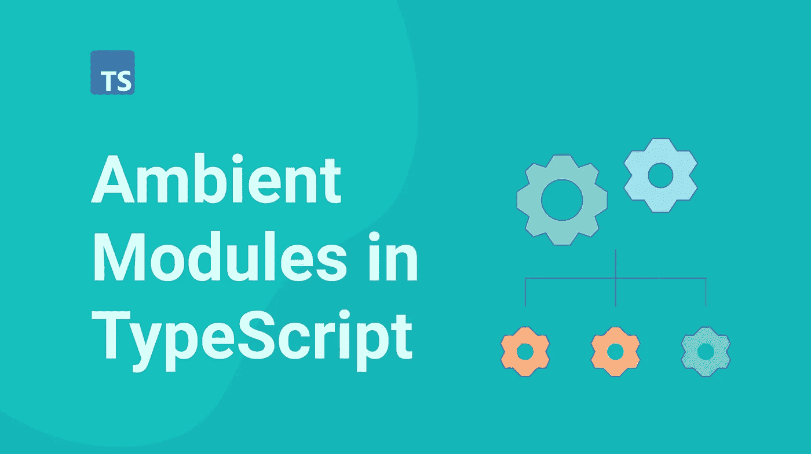
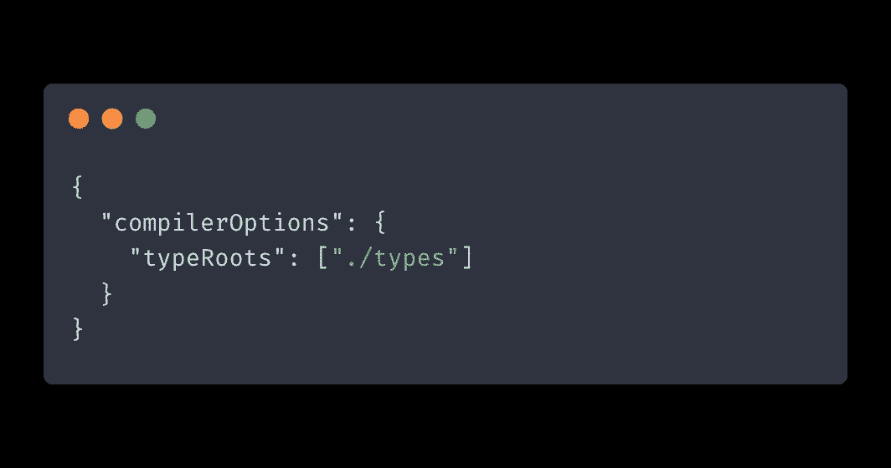
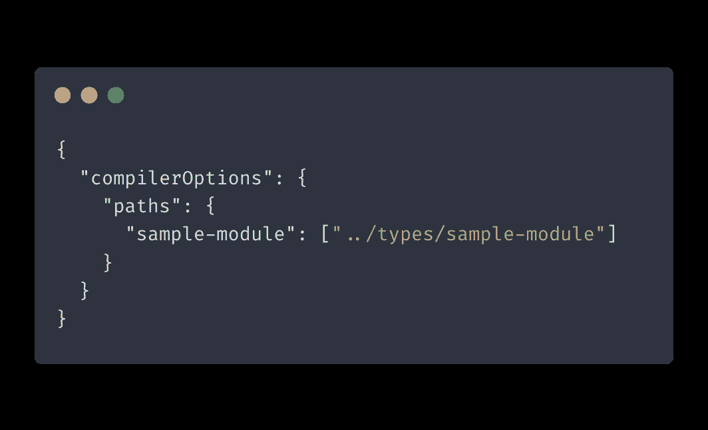
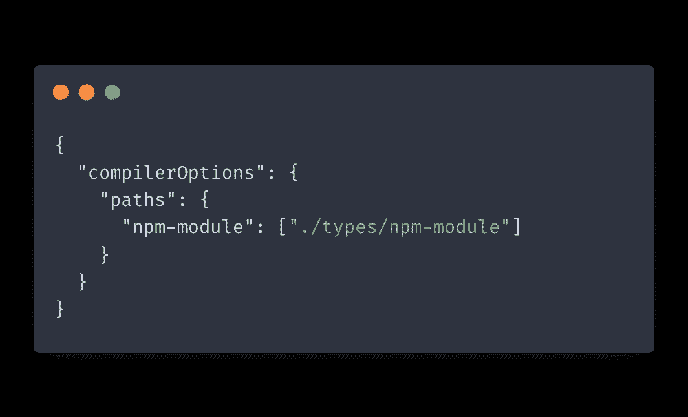
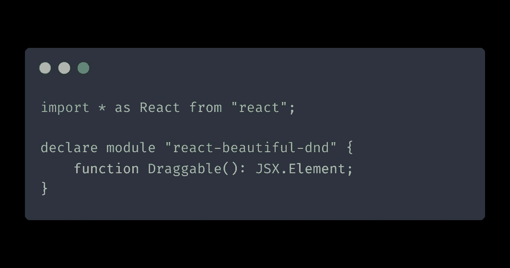
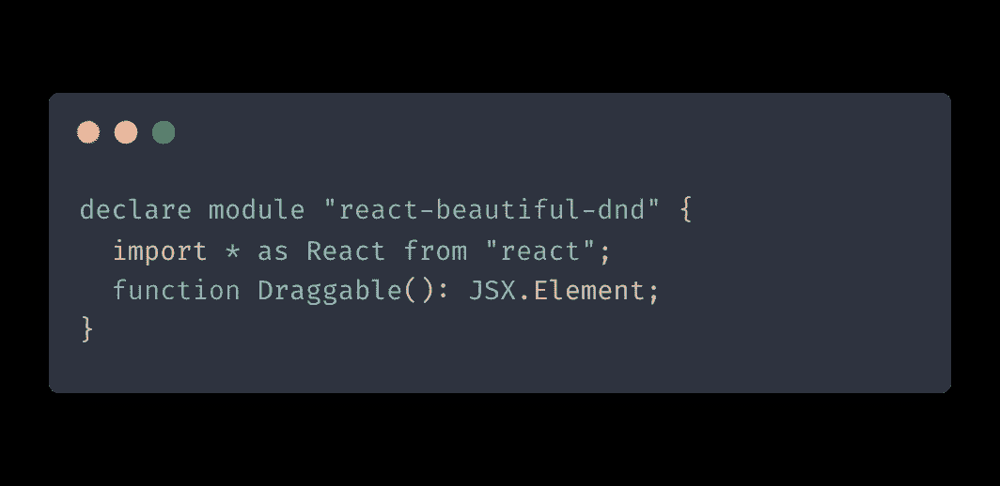

# TypeScript 中的环境模块:它们是什么以及如何使用它们

> 原文：<https://itnext.io/ambient-modules-in-typescript-what-they-are-and-how-to-work-with-them-8eed3e95441f?source=collection_archive---------4----------------------->

在这篇文章中，我们将探索 TypeScript 中的环境模块。我们将介绍什么是环境模块，如何使用它们，以及使用它们时的一些注意事项和技巧。

# 什么是环境模块？

环境模块是一个 TypeScript 特性，它允许导入用 JavaScript 编写的库，并无缝、安全地使用它们，就像用 TypeScript 编写一样。

环境声明文件是描述模块类型但不包含其实现的文件。环境声明文件不是透明的，所以它们不会被转换成 JavaScript。它们纯粹用于类型安全和智能感知。它们遵循`d.ts`文件格式。

TypeScript 生态系统包含数千个这样的环境声明文件，您可以通过 [DefinitelyTyped](https://github.com/DefinitelyTyped/DefinitelyTyped/tree/master/types) 获得这些文件。DefinitelyTyped 是一个包含由 TypeScript 社区提供和维护的声明文件的存储库。

如果你曾经在你的项目中使用这样的命令安装过类型:
`npm install --save-dev @types/node`

那你肯定用过 Typed。

流行的 JavaScript 库的大多数类型都存在于明确的类型中。然而，如果您有一个 JavaScript 库，它的类型是 DefinitelyTyped 所缺少的，那么您总是可以为它编写自己的环境模块。

不必为外部库中的每一行代码都定义类型，只需为您正在使用的部分定义即可。

# 如何使用环境模块

在 TypeScript 中使用声明模块主要有三种方式:
-使用三斜杠指令导入声明。
-配置`tsconfig`文件中的`typeRoots`字段。
-配置`tsconfig`文件中的`paths`字段。

三斜线指令是一个带有 XML 标记的单行注释，指示编译器在编译过程中包含附加文件。通常是这样的:
`/// <reference path="../types/sample-module/index.d.ts" />`

**注意:单斜线指令必须位于文件的顶部。**如果你把它放在`import`语句下面，它将被视为常规注释。

`tsconfig`文件中的 [typeRoots](https://www.typescriptlang.org/tsconfig#typeRoots) 字段用于指定包含声明文件的目录。编译器将在这些目录中搜索要包含在编译过程中的 TypeScript 声明文件。

**注意:您指定的目录是相对于** `**tsconfig**` **文件的位置。**

`tsconfig`文件中的[路径](https://www.typescriptlang.org/tsconfig#paths)字段指定了 TypeScript 应该根据您提供的 regex 模式查找 TypeScript 文件的特定路径。

# 使用环境模块时的提示:

## 使用路径将自定义类型定义添加到项目中。

如果您想为一个有自己类型定义的模块使用您定制的类型定义，您可以通过添加一个调整到`paths`来覆盖编译器选项。

因此，TypeScript 将使用来自自定义模块的类型，而不是外部库提供的类型。

## 你如何申报你的进口商品很重要

为第三方库创建 TypeScript 定义时，将所有导入声明放在模块声明中非常重要。

否则，您的声明模块将被视为一个[增强](https://isamatov.com/typescript-module-augmentation/)，并且您的自定义类型将不会被注册。

以上都不行。相反，您需要在模块内部声明您的导入:

## 使用简写环境声明快速修复您的类型

如果你不想花时间创建声明来使用第三方库代码，你可以使用[速记模块声明](https://github.com/Microsoft/TypeScript-Handbook/blob/master/pages/Modules.md#shorthand-ambient-modules)来代替。
`declare module "sample-module";`

当使用简写的环境声明时，从该模块的所有导入都将是类型`any`。

# 结论

在这篇文章中，我们讨论了什么是环境模块以及如何使用它们。我们还列出了一些使用它们的技巧。希望这篇文章对你有帮助！

如果你想获得更多的网络开发、反馈和打字技巧，可以考虑在 Twitter 上关注我，在那里我分享我学到的东西。
快乐编码！

*原载于 2022 年 1 月 10 日 https://isamatov.com**的* [*。*](https://isamatov.com/typescript-ambient-module/)