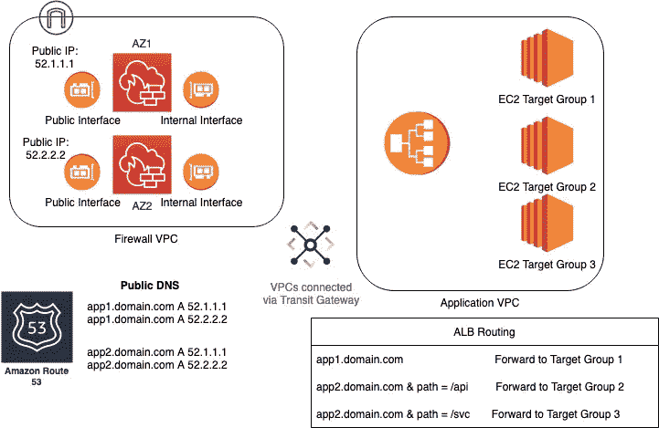
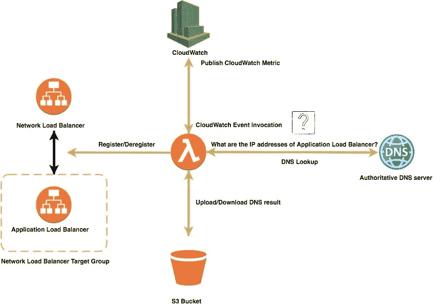
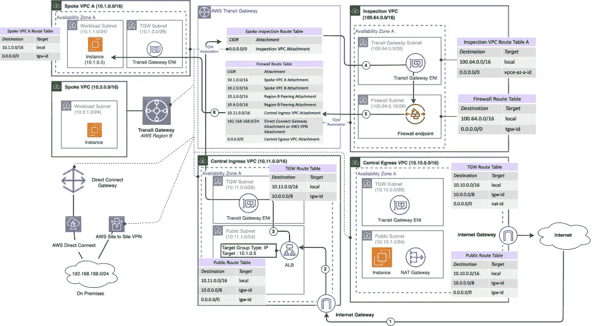
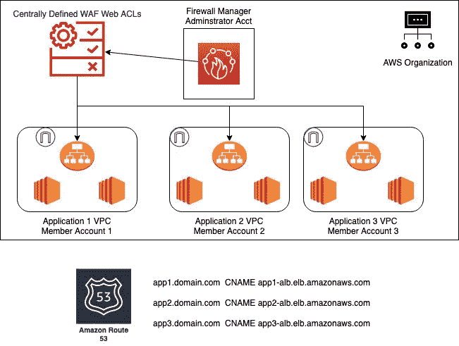

# 脖子上的负担

> 原文：<https://itnext.io/an-albatross-around-the-neck-a8894edde21?source=collection_archive---------3----------------------->

## **克服与 AWS ALB 和 WAF 的集成挑战，确保符合 NIST 800–53 标准的环境**

Back 2021 年 9 月，AWS 宣布了网络负载平衡器的一项新功能——能够添加应用负载平衡器作为网络负载平衡器的直接目标。从表面上看，这对客户来说是一个巨大的胜利:NLBs 和 ALBs 有两个完全不同的用例及特性集，这使得应用程序可以同时利用这两者。我不会一一列举比较它们，因为互联网上已经有数百篇这样的文章了(链接到 [AWS 比较](https://aws.amazon.com/elasticloadbalancing/features/?nc=sn&loc=2&dn=1))。这一新特性的主要原因是为了适应 ALB 没有静态 IP 地址的事实——它们是随机变化的；而 NLB 具有静态 IP。

这导致了许多与安全服务的集成问题——主要是防火墙和网络地址转换。常见的模式是:

有时，防火墙前面会有一个应用程序负载平衡器，奇怪地称为 ALB 三明治，带有一个公共 ALB 和一个内部 ALB(这将有助于限制防火墙上所需的接口和 IP 数量，因为您可以基于第 7 层路由将流量转发到防火墙上的不同端口，并将流量发送到其最终目的地)。我从来没有真正理解为什么这个架构模式被命名为 ALB 三明治。火鸡三明治外面没有火鸡...

1.  发往 app1.domain.com 的流量将被转发到某个基于 DNS 循环的防火墙上的公共接口(在防火墙术语中有时称为“不可信”接口)。
2.  防火墙将根据其规则检查数据包。
3.  防火墙会以 NAT 为目标，即将目标 IP 地址从防火墙的公共接口更改为应用 VPC 中内部应用负载平衡器的 IP 地址，然后相应地对其进行路由。

但是，正如我们已经确定的那样，ALB IPs 将在某个时候发生变化。这将始终破坏 NAT，从而破坏您的应用程序—防火墙不是反向代理—您不能 NAT 到 FQDN，只能 NAT 到 IP 地址。

这给客户留下了三个选择:

1.  AWS 发布了一个解决方案(如果 AWS 在这个新的 ALB 目标类型下使用这样的东西，我不会感到震惊)。

[https://AWS . Amazon . com/blogs/networking-and-content-delivery/using-AWS-lambda-to-enable-static-IP-addresses-for-application-load-balancers/](https://aws.amazon.com/blogs/networking-and-content-delivery/using-aws-lambda-to-enable-static-ip-addresses-for-application-load-balancers/)

1.  向 DNS 查询 ALB 使用的 IP 地址。将结果(新 IP 列表)上传到 S3 存储桶。
2.  调用[describe-target-health](https://docs.aws.amazon.com/cli/latest/reference/elbv2/describe-target-health.html)API 操作来获取当前注册到 NLB 的 IP 地址列表(注册列表)。
3.  下载以前的 IP 地址列表(旧列表)。如果这是 Lambda 函数的第一次调用，那么这个 IP 地址列表是空的。
4.  将新列表发布到 Lambda 函数的 CloudWatch Logs 日志流。这可以在以后用于搜索 ALB 使用的 IP 地址。
5.  更新跟踪内部 ALB IP 地址数量的 CloudWatch 指标(在第一次调用时创建)。此指标显示自上次运行以来更改了多少 IP 地址。如果您想跟踪一段时间内您的负载平衡器拥有多少个 IP 地址，这很有用。您可以通过将 CW_METRIC_FLAG_IP_COUNT 设置为“false”来禁用它。这是一个 CloudWatch 指标的示例，显示 ALB 的 IP 地址数量从 20 个变成了 24 个，然后又变成了 28 个。
6.  向 NLB 注册在新列表中但在旧列表或注册列表中缺失的 IP 地址。
7.  注销旧列表中新列表中没有的 IP 地址。

**2。许多防火墙供应商了解了 ALB 的这一“特性”,并在他们的防火墙中内置了类似的功能。您将提供 ALB 的 FQDN，防火墙将按计划(例如，每 30 秒)查询 DNS，然后将 DNS 查询返回的 IP 地址存储为在 NAT 中使用的实际值。我们已经在几十个 AWS 环境中无缝地实现了这一点。**

**3。使用一个运行 cron 的自定义脚本来完成以上任务——仅在您的防火墙不支持“FQDN NAT”或者您不想引入 AWS 出于任何原因提供的 NLB 和 Lambda cron 作业时使用。**

# 下面是我的抱怨:

如果这个额外的 NLB 的唯一目的是为我的 ALB 提供一个静态 IP，为什么我必须支付全价？我不要求它是免费的—我完全理解 NLB 正在使用资源并向客户提供功能。我本人非常感谢 AWS 能够推荐客户在实施本[链接](https://aws.amazon.com/blogs/networking-and-content-delivery/deployment-models-for-aws-network-firewall/)的图 11 中概述的类似架构时使用这一新的 NLB-ALB 目标集成。我们的计划是使用应用了 AWS WAF 的中央入口 ALB，并使用 IP 目标模式将流量转发到另一个 VPC 的内部 NLB 后面的资源。(无耻之徒，我们还利用了我在博客中写的关于的 [cdk-nwfirewall CDK 构造来简化 AWS 网络防火墙)。](/cdk-once-more-unto-the-breach-f2673cf219a6?source=your_stories_page)

这是图 11 的副本，因此您不必单击链接——尽管在我的架构中，我将 VPC 检查和 VPC 中央出口结合在一起。

但是我跑题了。对于大型工作负载而言，网络负载平衡器的成本可能是一笔不小的费用，我们估计，在客户的 ALB 前安装这种 NLB 每年会额外花费 300-500 美元，这样我们就可以获得静态 IP。这不是一个令人望而却步的巨大成本，但向客户解释他们的成本只是上涨了，这一点也不好玩。

**我想看到的:**

我希望 NLB 能以折扣价出售，如果它只是用来展示 ALB 的话——比方说 50%的折扣。显然，如果 NLB 也有标准的 EC2 目标，我不指望有折扣。然而，对于客户来说，支付全价来绕过 AWS 引入的设计限制似乎是一种惩罚，并且会给环境带来额外的复杂性。即使在我上面提到的架构中，仅使用 AWS 本地服务，如果您的应用程序中需要第 7 层路由并希望将其托管在中央 WAF 之后，也需要这一额外的层。我知道还有其他体系结构可以消除对 NLB 的需求，但它们并不总是一个选项，例如，如果您通过防火墙管理器部署 WAF，以集中管理应用于组织中所有应用程序负载平衡器的 Web ACLs，则托管应用程序负载平衡器的帐户必须由组织来管理。

在这种架构中，我们不需要通过单个 ALB 集中控制流量并转发到静态 IP 目标，但所有应用程序帐户都必须在 AWS 组织中。

我们的情况并非如此，我们本质上是向我们的客户提供防火墙即服务，他们仍然拥有自己的应用程序帐户，他们只是希望有人来配置和管理符合 NIST 标准的边界保护。

我要补充的是，该功能确实与 Global Accelerator 有一些重叠，因为它们都向 ALBs 提供静态 IP——尽管 Global Accelerator 仅适用于公共 IP。由于引擎盖下发生的路由魔术，我可以调和全球加速器的成本。支持这一点所需的资源当然值得额外的成本。

警告:请不要使用公共 NLB 来代替使用全局加速器。Global accelerator 使用边缘位置将您的应用流量传送到 AWS 的主干网络(世界第八大奇迹？？)更快，而不是让流量穿过整个互联网到达您的公共 IP。

Matthew 是领先的 AWS 网络安全合作伙伴 stackArmor 的高级解决方案总监，该公司为希望满足合规框架安全要求的客户设计定制解决方案:FedRAMP、NIST 800 系列、PCI-DSS、国防部 SRG、HIPAA、FISMA、FIPS 140–2(和 3)等。StackArmor 提供了一个经过 AWS 审核的解决方案，可以加速 FedRAMP ATO 的运行并降低 40%以上的成本。