# 角度偏移的另一种方法

> 原文：<https://itnext.io/an-alternate-way-to-angular-migration-c7932cf05a1b?source=collection_archive---------0----------------------->

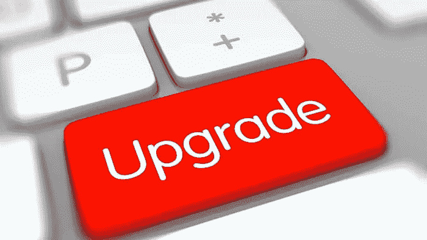

是时候升级你的 AngularJS 应用程序了

这篇博文是我在第一次[角度雅典聚会](https://www.meetup.com/Angular-Athens/)上的演讲的一部分，题目是**从大口到角度 CLI 和超越**。它描述了使用专注于工具和开发工作流程的方法将 **AngularJS** 应用程序迁移到 **Angular** 的过程。它主要针对那些使用**gupp**作为开发和构建工具，并希望用 **Angular CLI** 来替代它的项目。

> 本文并不试图详细解释升级过程，而是如何解决迁移问题，以便您和您的团队可以直接完成升级过程。它提示您如何迁移到新的 Angular，同时在升级期间运行和部署您的应用程序。

你可以在这里[找到演示的幻灯片](https://github.com/angularathens/1st-meetup-from-gulp-to-angularcli/blob/master/From%20Gulp%20to%20Angular%20CLI%20and%20beyond.pdf)和在[这个](https://github.com/bampakoa/angular-athens-demo) GitHub 仓库中找到完整的源代码。代码被组织在分支中，每个分支代表迁移过程中的一个步骤，这样您就可以跟随了。`[master](https://github.com/bampakoa/angular-athens-demo/tree/master)`分支是起点，`[final](https://github.com/bampakoa/angular-athens-demo/tree/final)`分支包含升级完成后的代码。

# 故事

我目前正在做的 [Plexscape](https://www.plexearth.com/) 的主要产品之一是一个授权 web 应用程序，其代码库大约为 3000 LOC，是用 AngularJS 构建的。在我演讲的时候，应用程序正在使用最新版本的框架， **1.6.10** 。在 Angular 发布版本 **2.0** 之后，我们决定是时候升级我们的应用程序了。

我们开始用官方 Angular 文档的[升级指南](https://angular.io/guide/upgrade)进行实验，它使用的是 **SystemJS** 。这个过程并不简单，需要我们进行大量的编码来设置它(没有足够的样板文件)。与此同时，Angular CLI 已经开始发布其第一个 **beta** 版本。我们决定推迟升级过程，等待 Angular CLI 的首次发布，因为我们的目的是向 Angular 生态系统靠拢。

为了简单起见，下面在一个演示 AngularJS 应用程序的上下文中描述我们升级应用程序的步骤。

# 应用程序

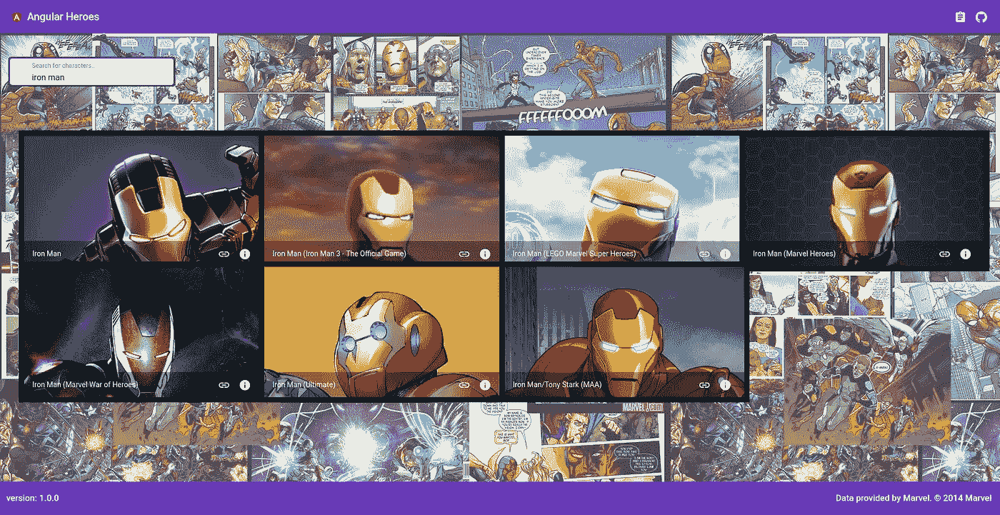

棱角分明的英雄

该应用程序名为[**Angular Heroes**](https://angular-superheroes.firebaseapp.com/)**，使用[漫威 API](https://developer.marvel.com/) 提供漫威人物数据库的基本搜索功能。由[角铁](https://angularjs.org/) 1.6.9 和[角铁材料](https://material.angularjs.org) 1.1.7 制成。**

**它使用[大口](https://gulpjs.com/)进行建造、缩小和捆扎。所有第三方库都是通过[凉亭](https://bower.io/)安装的。项目的结构在很大程度上受到了以下存储库的启发:**

*   **[斜角样式指南](https://github.com/johnpapa/angular-styleguide/blob/master/a1/README.md)**
*   **[模块化(ng-demos)](https://github.com/johnpapa/ng-demos/tree/master/modular)**
*   **[吞咽模式](https://github.com/johnpapa/gulp-patterns)**

**在开发过程中，Lite-server 被用作首选 Web 服务器。**

**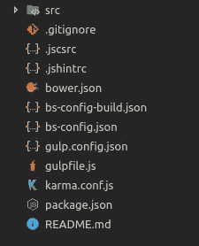**

**项目结构**

**项目的根文件夹由用于测试、服务和构建应用程序的各种配置文件以及包含所有应用程序资产(JS、CSS、images)的`src`文件夹组成。**

**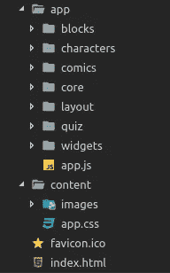**

**src 文件夹的内容**

**`src`文件夹进一步细分为两个子文件夹:一个名为`app`,包含被分成模块的 Javascript 文件，另一个名为`content`,用于 CSS 文件和图像。**

# **[步骤 1](https://github.com/bampakoa/angular-athens-demo/tree/step-1) :移动到角度**

**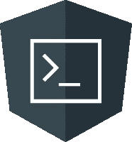**

**角度 CLI**

**我们的第一个目标是在流程的早期改变工具链，并通过集成 Angular CLI 向 Angular 生态系统靠拢。我们需要首先使用 npm 安装它。打开一个终端，执行以下命令进行全局安装:**

```
$ npm install -g @angular/cli@1.7.4
```

**安装后，使用 CLI 创建一个新的空白应用程序:**

**`$ ng new my-app`**

**我们可以通过两种方式将我们的代码带入新的 Angular 环境:将我们的文件复制到新创建项目的`app`目录中，或者将新创建项目中的所有文件复制到我们当前的项目中。任何一种方式都是有效的。**

**然后，我们可以删除`lite-server`配置和大多数 gulp 任务，因为从现在开始，我们将使用 Angular CLI 进行服务、构建和捆绑。**

> **我们还不打算删除`[*templateCache*](https://github.com/bampakoa/angular-athens-demo/blob/step-1/gulpfile.js#L8)`任务，因为我们仍然需要一种方法在升级期间处理 AngularJS 代码中的模板。请注意，我们可能有副本，因为角度组件的模板将包含在 CLI 的最终包和模板缓存中。**

**任何静态资产，比如图像，都被移动到新项目的`assets`文件夹中，全局 CSS 样式被复制到`styles.css`文件中。**

**应用程序和第三方库资产路径从`index.html`文件中移除，并在`.angular-cli.json`文件的适当部分中定义。最后，我们将 Angular CLI 配置文件的`main`属性设置为`app.js`来定义应用程序的起点。**

**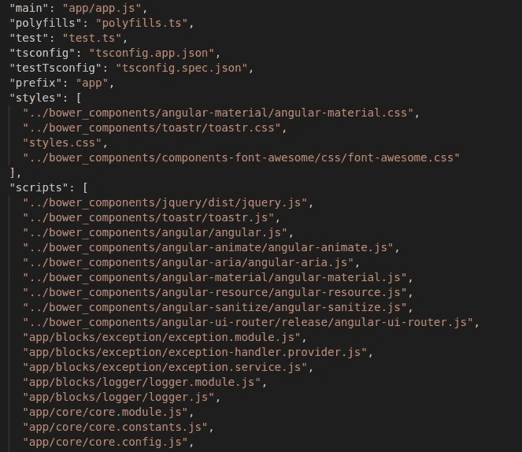**

**Angular CLI 配置摘录**

# **[第二步](https://github.com/bampakoa/angular-athens-demo/tree/step-2):进入打字稿**

**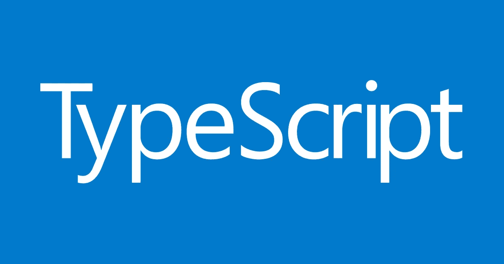**

**以打字打的文件**

**在这一步中，我们将使用 Typescript 替换 Javascript，这一过程将帮助我们在开发的早期发现 bug。**

**集成 Typescript 的最简单方法是重命名所有 Javascript 文件(*。js)转换为 Typescript (*。ts)。这也是为 AngularJS 和第三方库安装**类型**并开始在我们的代码中使用 ES6 语句的最佳时机，例如`let`、`const`和**箭头函数**。我们需要在`tsconfig.app.json`文件的`compilerOptions`中设置`typeRoots`属性，以便 Typescript 编译器可以识别安装的类型。**

```
"typeRoots": [
  "../node_modules/@types"
]
```

> **使用类型后，您可能会遇到来自`*tslint*`的错误。如果您愿意，可以在继续之前尝试纠正这些错误。请注意，如果不这样做，项目仍然会成功构建。**

**此时，我们可以对 AngularJS 代码进行适当的修改，以便从类型安装中受益。**

**将所有 AngularJS 组件和服务转换为 ES6 类并导出。**

> **如果您使用`vm`符号来声明 AngularJS 控制器，您可以用`$ctrl`来替换它，这是 AngularJS 1.5.0 和更高版本的内置特性。**

**在任何使用变量`angular`的地方声明它，让`tslint`编译器高兴。**

```
declare var angular: angular.IAngularStatic;
```

**向服务和组件添加类型。**

> **一个好的做法是在任何地方添加类型，即使你没有类型。您可以将它声明为`any`,这将作为一个提醒，以便稍后填充缺少的类型(只需搜索`any`关键字😃).**

**为实现某些接口方法(如`$onInit`)的组件或服务添加`implements`关键字。**

**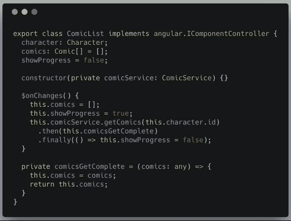**

**ComicList 组件实现$onChanges 方法**

**我们现在可以移除`bower`并从`npm`安装包依赖项。然后，我们将能够使用来自`app.ts`文件的 **RequireJS** 来加载库和应用程序源。**

**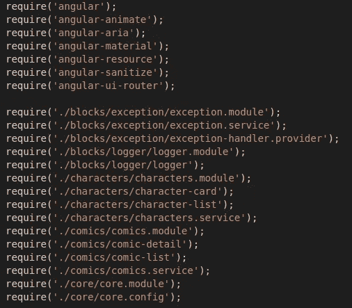**

**app.ts 文件摘录**

> **当使用 RequireJS 导入路径时，记得从 Angular CLI 配置文件的`scripts`部分删除路径。**

# **[步骤 3](https://github.com/bampakoa/angular-athens-demo/tree/step-3) :作为混合应用的引导**

**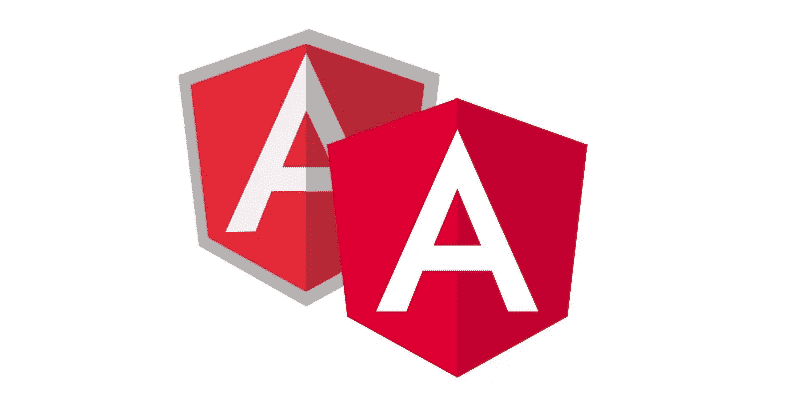**

**角度/角度混合模式**

**我们这一步的目标是让两个框架(AngularJS 和 Angular)以混合模式一起运行。然后，我们将能够在不中断应用程序功能的情况下逐渐移除 AngularJS。**

**为了将我们的应用程序引导为混合应用程序，我们首先需要安装`@angular/upgrade` npm 包。安装包后，我们创建主角度应用模块`AppModule`并导入`UpgradeModule`。**

**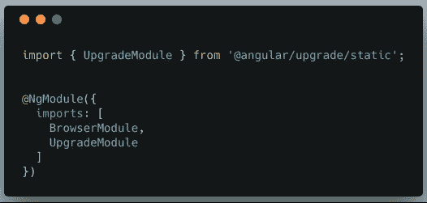**

**导入升级模块**

**我们从**index.html**中移除`ng-app`指令，并实现`ngDoBootstrap`方法。**

**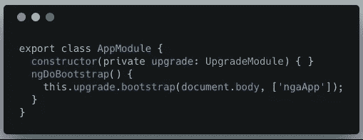**

**实现 ngDoBootstrap**

**最后，我们创建将成为应用程序入口点的`main.ts`文件，并在`.angular-cli.json`文件中更改相关的`main`属性。请注意，我们使用`setAngularJSGlobal`方法，因为 AngularJS 是使用 RequireJS 延迟加载的(它在`window`对象上不可用)。**

**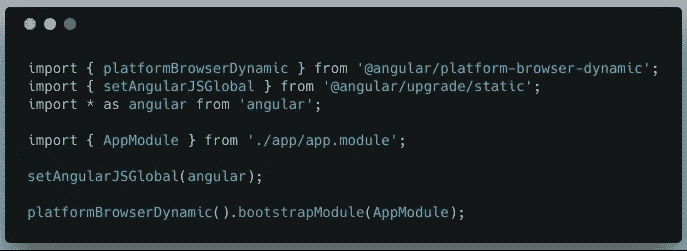**

**主入口点文件**

# **[步骤 4](https://github.com/bampakoa/angular-athens-demo/tree/step-4) :配置和错误处理**

**在这一步中，我们将使用**环境**文件来存储应用程序设置，并且我们将创建一个自定义`ErrorHandler`来处理未被显式捕获的全局错误。**

**环境文件可以在项目根目录的`environments`文件夹中找到，并且是从 Angular CLI 自动创建的，你可以在这里找到更多信息[。在每个文件中，我们定义了漫威 API 的 url 和开发者密钥，以及应用程序的其他配置设置，如标题和当前版本。](https://github.com/angular/angular-cli/wiki/stories-application-environments)**

**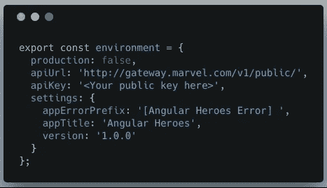**

**环境. ts**

**我们需要实现`ErrorHandler`接口的`handleError`方法来创建一个定制的错误处理程序。该方法将负责捕捉错误，并将其发送给`logger`服务进行进一步处理。**

**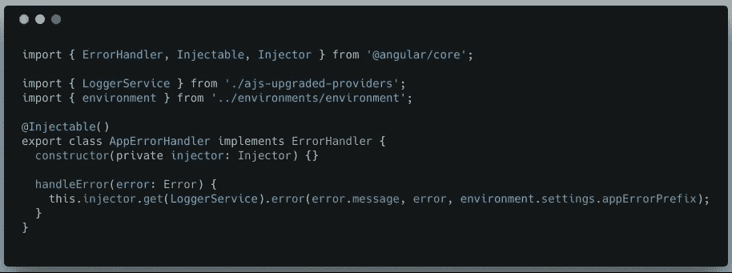**

**app-错误处理程序. ts**

**AngularJS 上下文中的 logger 服务需要升级，以便可以在自定义错误处理程序中使用。我们可以直接升级它，但是不能从已经使用它的 AngularJS 组件中访问它。为此，我们将在一个单独的文件中创建日志服务的升级版本。**

> **创建这样一个文件是一个很好的实践，它将包含您需要在 Angular 中使用的每个 AngularJS 服务的升级版本。**

**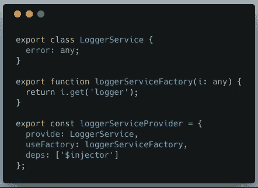**

**ajs-升级的提供者. ts**

> **注意使用`*Injector*`来获得升级的日志服务。这是必要的，因为`ErrorHandler`类是在引导 AngularJS 部分之前被实例化的，因此 AngularJS `$injector`还没有被创建。**

# **[第五步](https://github.com/bampakoa/angular-athens-demo/tree/step-5):升级服务**

**这个步骤描述了升级`core`模块的服务的过程，比如我们之前描述的`logger`服务，以及第三方库，比如用于 HTTP 数据访问的`angular-resource`。**

**回想一下上一步，我们为每个框架维护了两个版本的日志服务。我们现在将只保留有角度的那个，并将其导入各自的`CoreModule`。**

**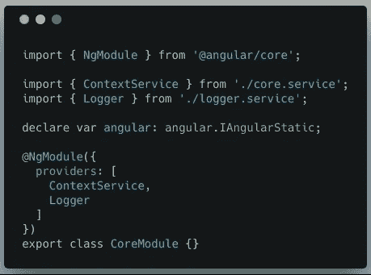**

**核心.模块. ts**

**我们安装了`@angular/http`，这是 Angular 的新 HTTP 客户端。我们将`HttpClientModule`导入主应用模块，所有使用`HttpClient`的服务都被转换成 Angular 并降级，因为仍然有 AngularJS 组件使用它们。**

**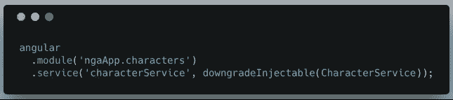**

**characters.service.ts**

> **如果您不是一次升级所有的数据访问服务，而是使用 HTTP 拦截器，那么您可以在升级过程中保留它们。**

**最后，我们用 AngularJS 模块定义在同一个文件中为每个特征模块创建角度模块，除了我们将在下一步升级的`widgets`和`layout`。**

****

**字符.模块. ts**

# **[步骤 6](https://github.com/bampakoa/angular-athens-demo/tree/step-6) :升级组件**

**该步骤描述了升级应用程序组件和第三方库(如 AngularJS Material)的过程。**

**我们安装`@angular/material` npm 包并创建一个单独的模块`AppMaterialModule`来导入和导出角形材料组件。**

> **这是一个很好的实践，因为想要使用角形材料组件的特征模块将只需要导入该模块。**

**我们升级了`widgets`模块，并将相应的文件夹重命名为`shared`，以符合 Angular 官方风格指南。我们也可以开始升级功能模块的 AngularJS 组件。**

> **我通常更喜欢自下而上地首先升级子组件，以便在过程的早期尽可能多地消除依赖性。**

**我们将`layout`模块重构为一个单独的组件，即`AppComponent`，因为不需要太多代码来将它保持为一个独立的模块。**

> **如果你的布局组件足够大，你可以把它们移到`core`模块，因为它们在应用程序启动时只会被使用一次。**

**我们目前使用`ui-router` npm 包来处理应用程序中的路由。我们不想麻烦升级它，因为这是一个很大的工作量。因此，我们在`ajs-upgraded-providers.ts`文件中创建了一个升级版本的`$state`服务，以便在角度上下文中使用它，并创建一个定制的角度指令来模拟`ui-sref`指令的行为。**

****

> **您可以直接在 HTML 元素中设置`*href*`属性，而不是创建自定义指令，但是这种方法更容易测试。**

# **[第七步](https://github.com/bampakoa/angular-athens-demo/tree/step-7):升级路由器**

**路由机制的升级是一个复杂的过程。理想的场景是让`ui-router`(或者您用于路由的任何库)和 Angular router 在这个过程中一起运行。**

> **我建议将路由升级留到所有组件和服务都完成升级之后**

**网上有文章和路由库文档指南描述了如何实现这一点，所以我就不赘述了。主要取决于代码库有多大，以及您是否决定在升级过程中保持应用程序的部署。在这种情况下，由于代码库很小，我们一次性升级了它。**

**我们安装`@angular/router` npm 包并重构所有组件，以使用`routerLink`指令，而不是我们在上一步中创建的自定义指令。最后，我们升级`AppComponent`并在 Angular 中引导它。**

# **再见安古拉吉斯**

****

**再见，谢谢你**

**我们终于准备好完全移除 AngularJS。到目前为止，它为我们提供了良好的服务，但现在是时候继续使用闪亮的新 Angular 了。**

**我们现在可以安全地从项目中删除以下内容:**

*   **吞咽**
*   **`ajs-upgraded-providers.ts`文件**
*   **`UpgradeModule`**
*   **`ngDoBootstrap`的实施**

**此外，不需要降级组件/服务，我们也不需要在`main.ts`文件中全局导入 AngularJS。**

**就是这样！我们完了！我们的应用程序现在运行在纯角度。**

**我希望这篇文章对你和你的团队有用，因为它帮助了我。你喜欢用什么方法升级 Angular？请在下面的评论中告诉我！**