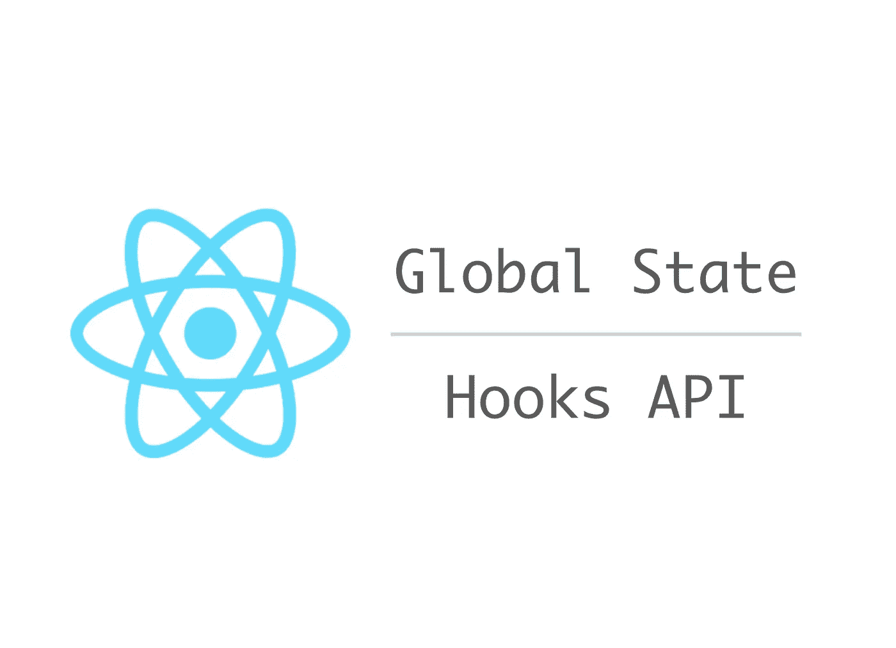

# React Hooks API 是 React Redux 的替代方法(适用于 JavaScript 和 TypeScript)

> 原文：<https://itnext.io/an-alternative-to-react-redux-by-react-hooks-api-for-both-javascript-and-typescript-c5e9a351ba0b?source=collection_archive---------0----------------------->

React 钩子很牛逼。



## 动机

每个人都对新的 React Hooks API 感到兴奋。我也是。一直在思考如何管理全局状态，Hooks API 似乎很有前途。对了，我很喜欢 Redux，但是不太喜欢 react-redux a.k.a `connect`。初学者用起来太复杂了。例如，重新选择/记忆是一个很难解释的概念。我的建议是构建一个全局状态，这样`mapStateToProps`只需要选择状态的一部分，不需要任何逻辑。如果你真的可以自由地构造一个全局状态，你可以让它选择状态的直接属性，这意味着“一个深度”。

## 我的图书馆

考虑到这一点，我一直在开发一个用于管理全局状态的库。

[](https://github.com/dai-shi/react-hooks-global-state) [## 戴式/反应钩式-全局-状态

### 钩子 API 反应的简单全局状态。通过创造一个新的世界，为 Dai-Shi/react-hooks-global-state 的发展作出贡献

github.com](https://github.com/dai-shi/react-hooks-global-state) 

该库中的全局状态是由项目组成的对象。例如:

```
const state = {
  name: 'foo',
  age: 23,
  hobbies: ['reading', 'videogaming'],
  scores: { stageA: 3, stageB: 7, stageC: 2 },
};
```

这种状态由 4 项组成(姓名、年龄、爱好、分数)。每一项都有一个值，它不仅可以是基元值，也可以是数组或对象。您可以连接到每个项目，以便在值更新时得到通知，但不是对象树中的深层值。

这个库最近支持一个用于更新状态的 reducer。因此，您可能会认为它是 React 的 Redux 的替代品。也许是，也许不是。你们自己会看到的。

## 示例代码

您定义一个全局状态并导出一些方法，如下所示。

```
import { createStore } from 'react-hooks-global-state';

type Action =
  | { type: 'increment' }
  | { type: 'decrement' }
  | { type: 'setFirstName', firstName: string }
  | { type: 'setLastName', lastName: string }
  | { type: 'setAge', age: number };

export const { GlobalStateProvider, dispatch, useGlobalState } = createStore(
  (state, action: Action) => {
    switch (action.type) {
      case 'increment': return {
        ...state,
        counter: state.counter + 1,
      };
      case 'decrement': return {
        ...state,
        counter: state.counter - 1,
      };
      case 'setFirstName': return {
        ...state,
        person: {
          ...state.person,
          firstName: action.firstName,
        },
      };
      case 'setLastName': return {
        ...state,
        person: {
          ...state.person,
          lastName: action.lastName,
        },
      };
      case 'setAge': return {
        ...state,
        person: {
          ...state.person,
          age: action.age,
        },
      };
      default: return state;
    }
  },
  {
    counter: 0,
    person: {
      age: 0,
      firstName: '',
      lastName: '',
    },
  },
);
```

如果你不熟悉 TypeScript，不要被`Action`类型所困扰。`createGlobalState`的第一个参数是一个 reducer，如果你用过 Redux 的话应该看起来很熟悉。将所需的初始全局状态传递给第二个参数。如果你喜欢，你可以用`combineReducers`。注意`createGlobalState`的结果被导出。

您需要用`GlobalStateProvider`包装您的顶层组件，以附加一个保存全局状态的上下文。

```
import * as React from 'react';

import { GlobalStateProvider } from './state';

import Counter from './Counter';
import Person from './Person';

const App = () => (
  <GlobalStateProvider>
    <h1>Counter</h1>
    <Counter />
    <Counter />
    <h1>Person</h1>
    <Person />
    <Person />
  </GlobalStateProvider>
);

export default App;
```

下面是如何在组件中使用计数器。

```
import * as React from 'react';import { dispatch, useGlobalState } from './state';

const increment = () => dispatch({ type: 'increment' });
const decrement = () => dispatch({ type: 'decrement' });

const Counter = () => {
  const [value] = useGlobalState('counter');
  return (
    <div>
      <span>Count: {value}</span>
      <button type="button" onClick={increment}>+1</button>
      <button type="button" onClick={decrement}>-1</button>
    </div>
  );
};export default Counter;
```

这应该很容易。`dispatch`和`useGlobalState`是从以前的文件中导入的。两个回调被定义并使用`dispatch`。你可能想知道为什么我们的`dispatch`有点全球化。这当然减少了代码隔离，但是这允许在组件之外定义动作。如果我误解了什么，请纠正我。我们也可以在另一个上下文中提供`dispatch`和类似`useDispatch`的东西。

包括 Person 组件在内的其余代码可以在存储库中找到:[https://github . com/Dai-Shi/react-hooks-global-state/tree/master/examples/06 _ reducer](https://github.com/dai-shi/react-hooks-global-state/tree/master/examples/06_reducer)

您可以通过以下方式运行该示例:

```
git clone [https://github.com/dai-shi/react-hooks-global-state.git](https://github.com/dai-shi/react-hooks-global-state.git)
npm install
npm run examples:reducer
```

然后，在浏览器中打开 [http://localhost:8080](http://localhost:8080) 。

## 重要注意事项

React Hooks API 还没有发布，这个库仍然是一个实验。欢迎反馈，以改善图书馆。我想知道许多人正在尝试类似的事情，如果可能的话，我想得到一些想法。

## 变更日志

*   *【2018–11–04】:首发。*
*   *【2018–11–08】:跟随库 API 变化，让例子更直观。*
*   *【2018–11–12】:基于上下文 API 再次改变库 API。*