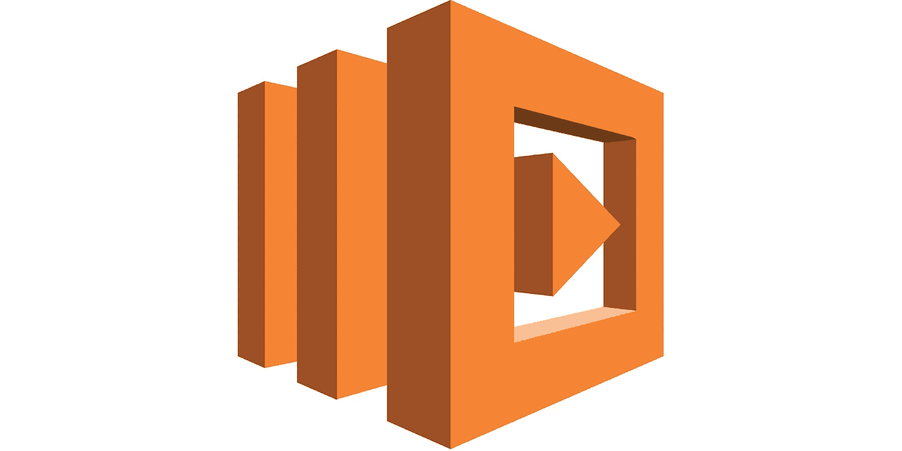
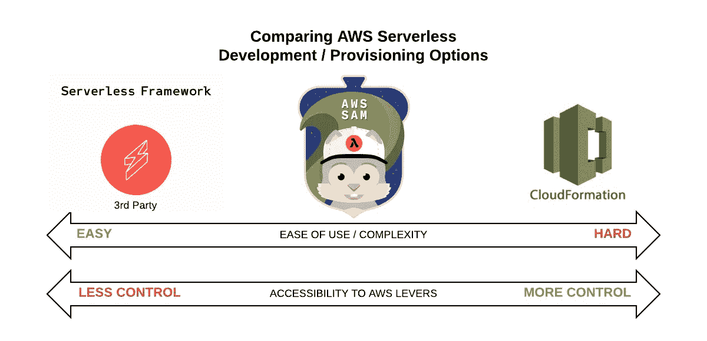
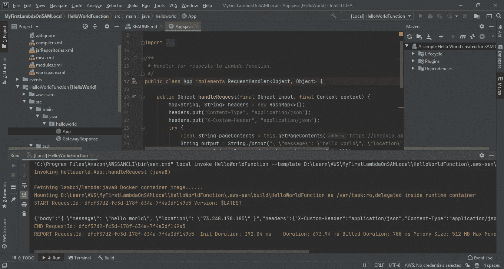

# AWS Lambda 无服务器之旅-第 1 部分-什么，为什么以及如何开始？

> 原文：<https://itnext.io/an-aws-lambda-serverless-journey-part-1-what-why-and-how-do-i-get-started-7a9f2d60ddbb?source=collection_archive---------5----------------------->

自动气象站λ

# 什么

如果你还没有听说过无服务器这个词，并且你在 IT 世界里或者在 IT 世界附近，那么你一定是把头埋在沙子里了！术语*无服务器*用于描述无需配置服务器即可运行的应用程序或基于云的服务。在云竞赛中，像 AWS 提供的那些服务，使公司不必根据估计的流量或使用情况购买物理计算机资源，并在数据中心管理它们以运行它们的应用程序。然而，开发应用程序的范例仍然与内部应用程序构建非常相似(尽管要快得多)。首先，您需要提供一个服务器(在云中)，然后构建您的应用程序并将其部署在该服务器或服务器集群上。迁移到云的好处是，如果您低估或高估了应用程序对计算资源的需求，云为您提供了一种快速响应应用程序使用需求的方式(弹性地——想象橡皮筋拉伸和收缩以适应需求)。您的应用程序可以根据一组配置向上或向下扩展，并且您的应用程序可以神奇地跟踪一个指标，例如 CPU 利用率。也就是说，如果 CPU 利用率达到 75%以上，那么另一台服务器会自动神奇地添加到应用集群来处理负载。“功能即服务”将这种反应能力向前推进了一步。

*功能即服务*是计算领域的最新发展，旨在将计算空闲时间尽可能降至零。这(至少在我看来)类似于微积分对 0 概念的渐近方法，但是是关于计算空闲时间的。传统的内部解决方案有最多的空闲时间，通过自动扩展的云中弹性计算证明可以减少未使用的服务器上的空闲时间，而 F-a-a-S 希望使其接近于零。这意味着计算资源(函数)对“事件”做出反应。这可能包括一些客户端调用 api、完成一个作业或者将一个文件上传到 s3 存储桶。一旦函数完成处理，它就会立即关闭。

> 您只需为您使用的计算机付费。

“Lambda”是 AWS 的*功能即服务*产品，早在 2014 年就已经首次亮相。依我拙见，它相当漂亮。作为一名 Java 开发人员，我最近花了大量的时间[在 AWS 平台](https://www.linkedin.com/pulse/micro-degrees-role-quality-certifications-brave-new-world-mitul-patel)上获得认证，我开始用 Lambda“做点什么”。但是在深入研究 Lambda 的方法之前，我想先了解一下*功能即服务或* F-a-a-S 的原因。

# 为什么

**使用 F-a-a-S 的利弊:**

*   您根本不需要调配和管理任何服务器
*   水平缩放是为您管理的，并通过为您的函数接收的每个事件启动一个新的进程来实现。根据过去对流量的估计来确定应用程序的规模并不一定代表未来的需求。有了 F-a-a-S，你就没有这个问题了。
*   如前所述，您只需为您使用的内容付费
*   函数可以用所有最流行的语言编写(在本系列中我将使用 Java)。
*   F-a-a-s 简化了部署。只需将您的代码上传到您的函数中，您就(大部分)完成了。
*   减少了开发运维人员维护部署环境的需求(不要误解我的意思，我并不主张裁员，尤其是在现在这个时候)

使用 F-a-a-S 的缺点:

*   生活中的大多数事情都有约束。例如，AWS Lambda 上的函数有 15 分钟的执行时间限制(在撰写本文时)。这意味着 AWS 上的 F-a-a-S 不适合长时间运行的函数。AWS 上给定帐户中每个区域所有函数的默认并发限制是 1，000。如果你决定将组织中的每一个应用程序都重写为 Lambda 函数(并且只有一个帐户),你可能会遇到问题！
*   您的应用程序必须是无状态的，并且不是所有的应用程序类型都适合 F-a-a-S。添加 x +y。这对于所有调用都是一样的。它对请求加法的人一无所知，也不在乎。RESTful API 是 F-a-a-S 的一个很好的候选。在 AWS 平台上，有很多情况下 Lambda 函数是计算的好选择。
*   存在供应商锁定的可能性。如果有一天你决定从 AWS(或另一家厂商)中解脱出来怎么办？你能把你的代码库带走吗？在其他地方会有用吗？如果您使用了正确的技术或框架，答案是肯定的，我将在本系列的第 2 部分中谈到这一点。
*   事情从来没有看起来那么简单(生活中的大多数事情也是如此)！崔琰在这里对λ定价的细微差别进行了令人敬畏的深入探究[。他是曼宁出版社出版的《生产就绪无服务器》一书的作者。](https://blog.binaris.com/lambda-pricing-pitfalls/)

# **该如何**

如果你像我一样，对开始在 AWS Lambda 上做一些无服务器开发感兴趣，但不知道从哪里开始，你不可避免地会开始“像疯子一样搜索”。你可能会遇到的第一件事是 AWS SAM 主页，或者更有可能是 serverless.com 的 T2 网站。).像我一样，如果你第一个到达 serverless.com，并且是一个勤奋的人，你可能已经喝了他们的清凉饮料，开始干了起来。这没有错。不过，在我开始之前，我想更好地了解一下全局(就像我对大多数事情做的那样)。经过一些研究，这是我开始明白。

Cloudformation (CFN)是 AWS 的基础设施即代码产品，允许您在文本文件中指定您希望在 AWS 平台上创建和/或更新的内容。yaml)并且通过命令行中的几个简单命令，您得到了您所要求的(假设您正确地创作了您的基础设施代码 yaml 模板…如果您不知道您在做什么，这是一个很大的假设)。为了加快那些对*开发*和*部署*无服务器应用感兴趣的人的学习曲线，AWS 在 2016 年末推出了 SAM(无服务器应用模型)。到 2018 年 4 月，它已经被亚马逊开源。这导致第三方创建了几个框架，包括迄今为止最著名的无服务器框架(serverless.com)。这些框架是作为 SAM 的抽象而编写的。Cloudformation 是 AWS 上*部署*的核心，SAM Serverless 通过固执己见的配置和简化向最终用户隐藏了一些血淋淋的细节，然后你在互联网上找到的任何第三方框架都是开源 SAM 框架之上的抽象。

> 为了理解所有这些，我创建了一个漂亮的小图表，类似于 AWS 喜欢用来分析或比较和对比各种事物的图表。

正如您所看到的，在这个心理练习中被认为重要的两个方面是部署中的易用性/复杂性以及对 AWS 杠杆的可访问性(即，对您正在部署的资源的细粒度控制)。

> 事情越简单，你的控制就越少，控制越多，围绕部署的活动就变得越复杂。

在这种分析中，有两件事情交织在一起，即开发和部署。Cloudformation 严格来说是一种在 AWS 上供应(部署)资源的方法，而 SAM 和位于 AWS SAM 之上的第三方框架允许您进行开发和部署。

对我(和你的组织)来说，从一开始就学习如何在已经专有的平台(AWS)上使用像无服务器框架这样的第三方工具没有什么意义。我的意思是，在被另一方的解决方案束缚住和/或确定有绝对的需求之前，要知道你要做什么。对于像这样的个人冒险来说，影响是很小的，但是对于您的组织来说，在框架选择上的仓促决定可能会产生长期的影响。

> 就像《夺宝奇兵》和《圣杯》一样……如果你必须选择的话。明智地选择。

我决定和 SAM 一起进行快速本地开发，一旦我的项目在本地运行，我将开发 CloudFormation 模板，将其部署到 AWS。我希望能够完全控制资源调配的各个方面，以便最终能够自动化开发运维。我用的是 Java。你问为什么是 Java？因为我是一个 Java 开发者假人。AWS Lambda 使用 Java 的理由有很多[，不使用 Java 的理由很少(即冷启动)。我不打算在这里讨论这个问题。有一个不错的小](https://engineering.opsgenie.com/4-advantages-of-using-java-with-aws-lambda-21c0dc539de3)[帖子](https://engineering.opsgenie.com/4-advantages-of-using-java-with-aws-lambda-21c0dc539de3)报道了 Serhat 的话题，能给你一些提示吗？

# **让我们准备好战斗吧！**

就像在一场精彩的有奖比赛中，对第一轮的期待是它的一半。好吧，我们去追吧。我想介绍的最后一件事是设置您的本地开发工具包，使用 Java 进行本地 AWS Lambda 开发。

以下是您需要安装的内容:

1.  Java JDK 8 或 11(对于 AWS Lambda 上的 Java，您有 [2 种选择](https://docs.aws.amazon.com/lambda/latest/dg/lambda-runtimes.html)
2.  Git(如果您想运行示例 HelloWorld SAM 无服务器应用程序。它在幕后使用 Git 来下拉它需要的东西。如果你没有安装它，你会得到一个错误)
3.  Docker (SAM 拉下一个 Docker 镜像来运行你的无服务器 Lambda 代码。它被称为 lambci/lambda:java8 Docker 容器映像)
4.  专家
5.  AWS 帐户和用户(要使用)
6.  AWS CLI(确保配置并测试)和 [SAM CLI](https://docs.aws.amazon.com/serverless-application-model/latest/developerguide/serverless-sam-cli-install.html) (注意版本。如果您安装了旧版本的 AWS CLI，您将需要特定版本的 SAM CLI(我看到的错误告诉我，我需要 SAM CLI 版本< 0.40，即 0.39)。在 IntelliJ)中创建示例 Hello World 无服务器项目时，它会报错。您可以安装最新版本的所有程序，这样您就不用头疼了！我最终做到了。
7.  IntelliJ (>> Eclipse IMO)和用于 IntelliJ 的 AWS 工具包

> 运气好的话，谷歌搜索、视频观看、博客阅读等等。您应该能够自己安装所有的先决条件。

8.最后，去看这个来自马嘴 (AWS)的短视频[并跟随。我在他开始谈论在 IntelliJ 中创建 SAM 项目的确切时间链接了视频，以省去您不得不听他们闲聊的麻烦(不客气)。不要担心 IntelliJ 版本(正如他在视频中提到的)。我运行的是 IntelliJ IDEA 2020.1(终极版)Build #IU-201.6668.121，构建于 2020 年 4 月 8 日，她用](https://youtu.be/xbbkNVr27Is?t=282) [AWS Toolkit for IntelliJ](https://aws.amazon.com/intellij/) 发出了像小猫一样的咕噜声。如果一切顺利，你应该会在你的彩虹装置的最后看到这一桶金。

IntelliJ 中的 AWS SAM 无服务器项目

> 我希望有人能为我写一篇这样的文章。可惜没人知道，所以我自己解决了。

无论如何，我希望你发现这非常有用。

在本系列的第 2 部分[中，我们将探索 SAM 模板的剖析和我利用 SAM local 和 DynamoDB local 为一个简单(但并非微不足道)的 RESTful API 开发的项目。我们将详细介绍它，以及它与我编写的用于将应用程序部署到 AWS 的 Cloudformation 模板之间的区别。](https://medium.com/@mitulipatel/an-aws-lambda-serverless-journey-part-2-a-serverless-api-in-java-f713d8b80fc6)

直到下一次朋友。

米图尔