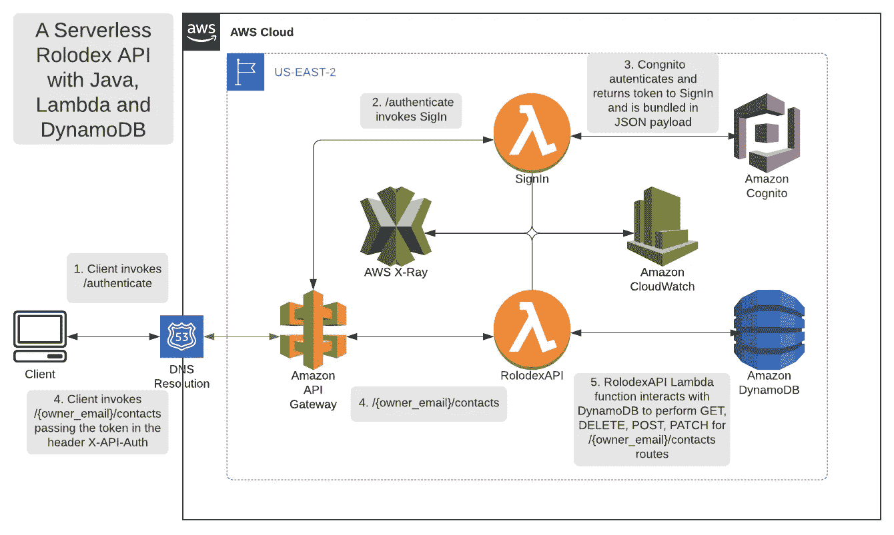
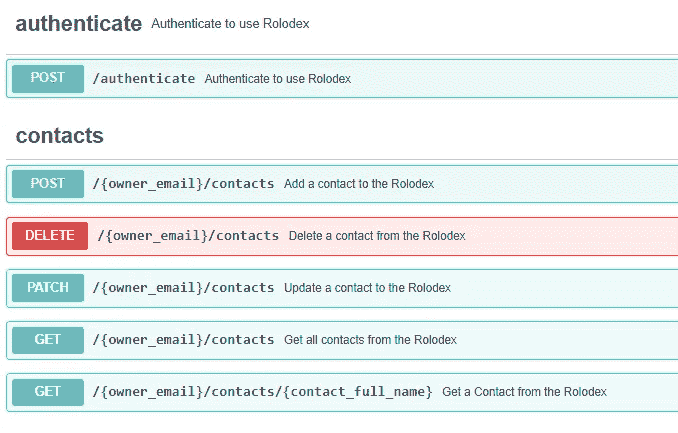
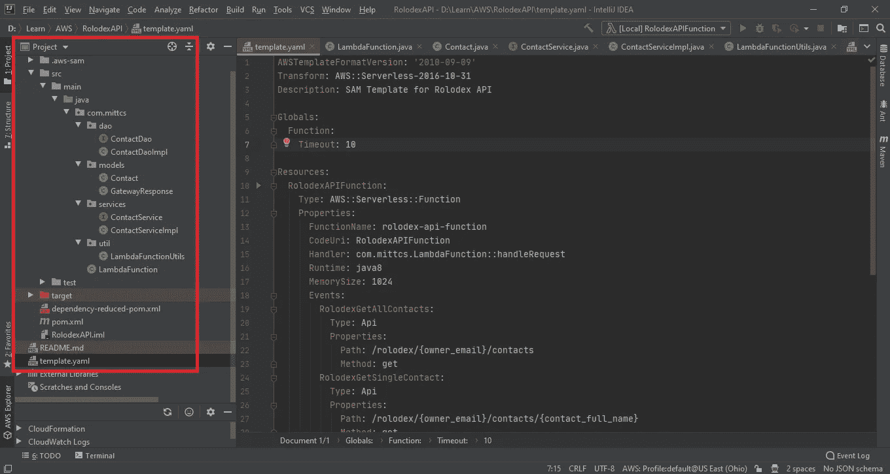
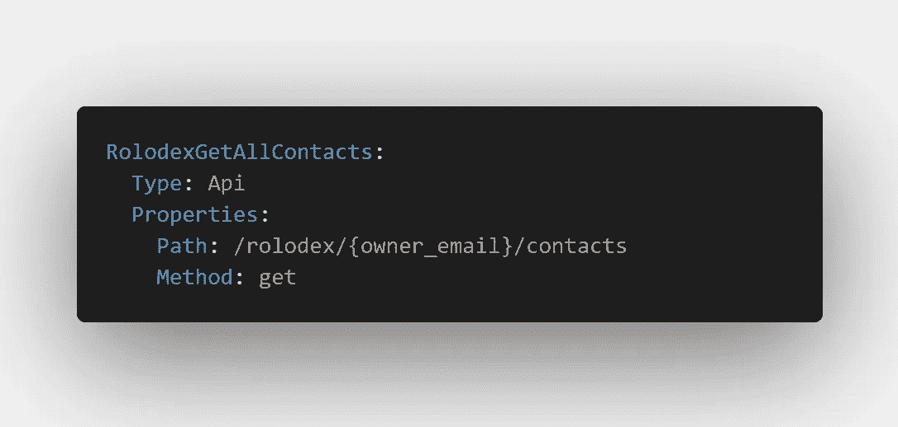
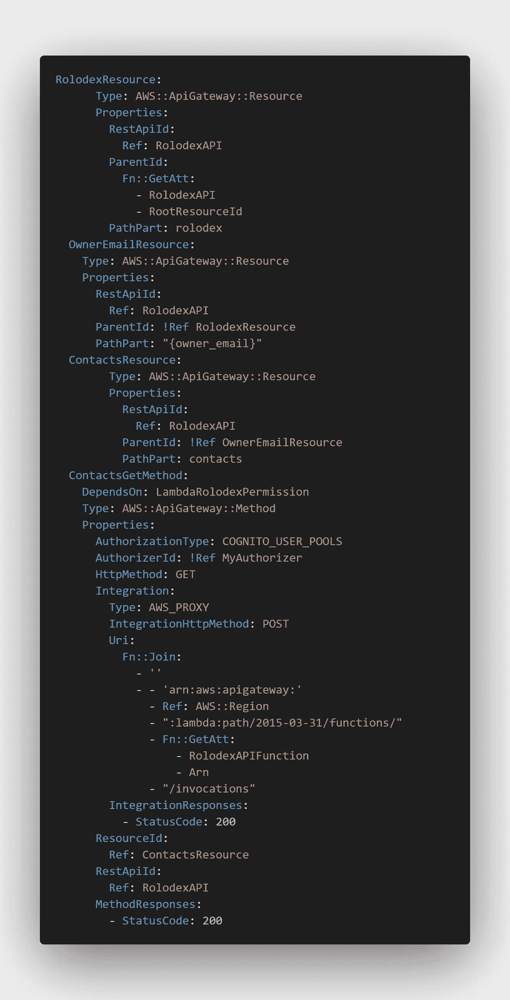
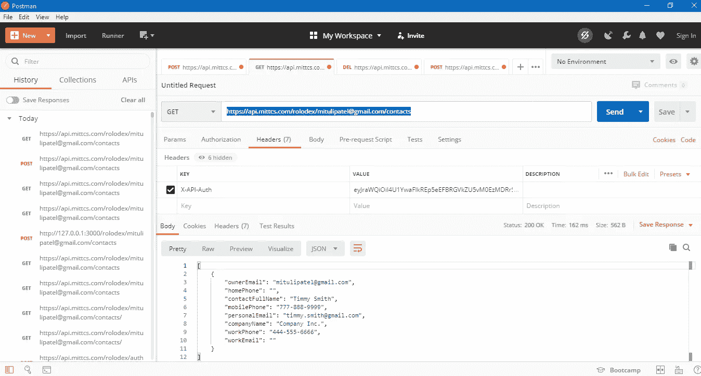

# AWS Lambda 无服务器之旅——第 2 部分——无服务器 API(Java 语言)

> 原文：<https://itnext.io/an-aws-lambda-serverless-journey-part-2-a-serverless-api-in-java-f713d8b80fc6?source=collection_archive---------4----------------------->


自动气象站λ

如果您还没有阅读本系列的第 1 部分，我通过回答以下问题提供了“无服务器的简史”[什么，为什么以及如何开始？](https://medium.com/swlh/an-aws-lambda-serverless-journey-part-1-what-why-and-how-do-i-get-started-7a9f2d60ddbb)，给这个部分做一个关卡集，会比较有技术含量一点。害怕非常害怕。开个玩笑，但是，如果你不是技术人员，抱歉，你可能想在下一段后离开。

# 关于无服务器这个词

术语*无服务器*对于一些技术人员来说有点陌生，因为事实上，在某个地方有一个服务器在运行你的代码。它恰好完全由云提供商管理。您只需设置一些配置，但无需担心配置实例或扩展(进/出)来满足您的使用需求。无论如何，我通常不会纠结于语义，尽管它们在很多情况下很重要，但在这种情况下并不那么重要。我的意思是，你宁愿对你的同事说，“看看这个！我在 AWS 上构建了这个非常酷的“非自我管理的应用程序”。这就像真的很酷，完全没有自我管理。”呃……是的，我也没有。它是无服务器的。

正如我所承诺的，我将带您浏览一个非常简单(但并非微不足道)的 API，它只使用了 DynamoDB local、Lambda local 和无服务器应用程序模型(SAM)。对于 AWS Toolkit for IntelliJ 和 SAM 使用 Java 进行本地开发的精彩实践介绍，请查看 Hiep Dinh 的文章以了解您的方位。在我在本系列的第 1 部分[中概述的安装之后，它就停止了。](https://medium.com/swlh/an-aws-lambda-serverless-journey-part-1-what-why-and-how-do-i-get-started-7a9f2d60ddbb)

> 在这里，我将重点介绍在本地对 API 进行基础设施即代码化的 SAM 模板，重点介绍一些 Java 代码，以便在完全不使用第三方框架的情况下理解 API 的结构，在 DynamoDB 上说几句话，并将简化的 SAM template.yaml 与其“等效的”CloudFormation 基础设施即代码进行比较和对比。这不是一步一步的操作方法。博客圈里有很多这样的人。相反，我将强调我的设计中一些更有趣的部分，从旅程中收集的见解和技巧，以及进一步调查的要点。

# 设计

下面的架构图代表了一个管理在线名片夹的 API。对于阅读这篇文章的年轻人来说，这只是一个用老人语言写的联系人列表。在使用 SAM 进行了本地开发，并在云形成(CFN)模板上做了一些额外的工作后，这就是我最终进行设计的地方。你可以看到它是一个完整的无服务器 AWS 服务的杂烩。别担心，我们将重点关注你在架构图右下方看到的东西，RoldexAPI Lambda 函数和 DynamoDB。



部署在 AWS 上的 Rolodex API 架构

Rolodex API 支持以下路线:



招摇过市的联系人路线

# 项目结构



Rolodex API 的 Java 项目结构+ template.yaml

AWS 无服务器项目只不过是一个 Maven 项目，增加了一个非常重要的 SAM 无服务器 *template.yaml* 文件。AWS 实验室想出了一个 [maven 原型](https://aws.amazon.com/blogs/developer/bootstrapping-a-java-lambda-application-with-minimal-aws-java-sdk-startup-time-using-maven/)，这是初始化新项目的首选方式。我的 RolodexAPI 项目包含一个名为 LambdaFunction 的 Java 类(它充当 API 的控制器/调度程序)，几个用于联系和所需网关响应的模型(用于 API 网关)，以及几个层，包括一个简单的服务层和数据访问层，它利用 AWS SDK for DynamoDB 进行 CRUD 操作。

**解剖一个 SAM 模板**

SAM 模板的文档可以在[这里](https://docs.aws.amazon.com/serverless-application-model/latest/developerguide/sam-specification-resources-and-properties.html)找到，我鼓励你在继续之前看一看。正如我在本系列的[第 1 部分](https://medium.com/swlh/an-aws-lambda-serverless-journey-part-1-what-why-and-how-do-i-get-started-7a9f2d60ddbb')中提到的，SAM 是对 CloudFormation 的抽象，而 *Transform* (如下所示)告诉 CloudFormation 在“sam deploy”期间用 SAM 规范处理这个 yaml 文件，这是用于将这个基础设施代码推送到 AWS 云平台的[超级简单 sam cli](https://aws.amazon.com/blogs/compute/a-simpler-deployment-experience-with-aws-sam-cli/) 命令。让我们快速浏览一下 *template.yaml* 的 *Resources* 部分中的一些内容。我加粗了感兴趣的项目。 *Resources 属性*指定了您想要创建的基础设施，在本例中是一个名为 rolodex-api-function 的 AWS::Serverless::Function。

```
AWSTemplateFormatVersion: '2010-09-09'
**Transform: AWS::Serverless-2016-10-31**
Description: SAM Template for Rolodex API

**Resources:**
  **RolodexAPIFunction:**
    **Type: AWS::Serverless::Function**
    Properties:
      **FunctionName: rolodex-api-function**
      CodeUri: RolodexAPIFunction
      **Handler: com.mittcs.LambdaFunction::handleRequest**
      Runtime: java8
      MemorySize: 1024
 **Events:
        RolodexGetAllContacts:
          Type: Api
          Properties:
            Path: /rolodex/{owner_email}/contacts
            Method: get** 
```

该 SAM 模板指定:

1.  一个 Lambda 函数(参见*型*中上面的 *yaml*
2.  API Gateway 中的 API(通过 *Events* 属性和 RolodexGetAllContacts 事件)隐式创建)
3.  Contacts API 中的一条路由，由Api 事件的 *Path* 属性中的“/Rolodex/{ owner _ email }/Contacts”定义。

Lambda 在一个*事件*驱动的模型上工作。在这种情况下，事件是与(隐式创建的)API 网关资源的交互，API 网关资源使用 GET Http 方法托管路由“/Rolodex/{ owner _ email }/contacts”。*处理程序*是当您在浏览器中或通过 Postman ping 端点时 Lambda 将调用的实际代码，交付给代码的*输入*或*有效负载*将属于*类型* Api(事件)。

如果您想将另一个路由添加到 API 以由函数处理，只需在函数的 *Events* 属性下添加另一个事件，如 RolodexGetSingleContact 中所示。它使用 pathParameter 'conact_full_name '指定单个联系人的检索。

```
RolodexGetSingleContact:
  Type: Api
  Properties:
    Path: /rolodex/{owner_email}/contacts/{contact_full_name}
    Method: get
```

API Gateway 生成的*事件*看起来有点像这样(作为地图的字符串表示)。

{ **httpMethod** =GET， **body** =null，**path**=/Rolodex/{ owner _ email }/contacts，**query string parameters**= null，**path parameters**= { owner _ email = mitulipatel @ Gmail . com }， **stageVariables** =null，**is base 64 encoded**= false }

我已经为你消除了很多噪音。使用上面图中显示的几个项目，我们可以开始使用 Java 构建 API。

# 请求处理程序代码

下面的代码概述了一种避免像 Spring 这样的第三方框架的方法。这是普通的 ole Java 和 AWS Lambda 提供的东西(比如上下文对象)。

LambdaFunction.java

我实现了函数的 RequestHandler 作为所有'/contacts '路由的控制器/调度器。我不认为这过于复杂，对于你的 API 的重点部分来说，这很好。如果 API 中有要由该函数处理的路由，而不是'/contacts '，例如'/companies '，那么您需要利用 API 事件中的 *path* 参数。然后，您可以在代码中使用 path 来分派/路由到正确的 *httpMethod* 处理程序，否则这里实现的“浅层开关”就足够了。

> 你为什么想要自己的控制器/调度员呢？

可能是因为性能的原因。在本系列的第 4 部分中，我将使用 [Spring Framework](https://github.com/awslabs/aws-serverless-java-container) 重新分解这个无服务器 API，然后做一些性能基准测试，看看是否有什么不同。我的直觉告诉我会有的(有时我的直觉告诉我也去吃，那样很棒)。AWS 实验室[表示](https://aws.amazon.com/blogs/opensource/java-apis-aws-lambda/)弹簧的组件扫描和其他因素可能会降低启动性能。显然，从开发的角度来看，开发自己的产品效率低下，而且你不能获得像 Spring 这样的框架给你带来的所有好处，但是出于性能原因，简单性*可能*会称雄。目前这纯粹是猜测。然而，当我有疑问时，我会回到脑海中的那个声音，“保持简单，愚蠢。”这通常会阻止我在为 YouTube 制作的电影“一个过度工程的奇怪案例”中扮演主角。

# DynamoDB

剩下的唯一一块拼图就是前面提到的。DynamoDB 是 AWS 对 MongoDB 和 Cassandra 的无服务器 NoSQL 版。AWS 通过提供[几种在本地使用的方法](https://docs.aws.amazon.com/amazondynamodb/latest/developerguide/DynamoDBLocal.html)，让入门变得超级容易。其中最简单的是下载一个运行在端口 8000 上的可执行 jar，但是您也可以轻松地下载并运行一个 docker 容器来托管您的本地 DynamoDB。

请注意，如果您通过可执行 jar 在您的主机上运行 DynamoDB，您将需要在您的主机文件中使用一点魔法，因为 SAM 在 Docker 容器中运行您的 Lambda 代码，也就是说，您将遇到一些名称解析问题。我刚帮你省了一个小时的故障排除时间。不过，不需要感谢。开玩笑，你最好为这个帖子鼓掌，否则。

下面描述的相当简单的 CFN yaml 块表示联系人表。

```
ContactsTable:
  Type: AWS::DynamoDB::Table
  Properties:
    TableName: !Join [ '', [ 'Contacts-', !Ref Stage] ]
    AttributeDefinitions:
      - AttributeName: owner_email
        AttributeType: S
      - AttributeName: contact_full_name
        AttributeType: S
    KeySchema:
      - AttributeName: owner_email
        KeyType: HASH
      - AttributeName: contact_full_name
        KeyType: RANGE
    ProvisionedThroughput:
      ReadCapacityUnits: 5
      WriteCapacityUnits: 5
```

我编写了 CFN 模板来支持创建代表不同环境的不同堆栈(使用名为 Stage 的模板变量，参见！上述 CFN 块中的 Ref 级)。无服务器环境设置是一个重要的面向 DevOps 的讨论，也不是没有争议，因为有几种方法可以利用 Lambda 环境变量和/或 API 网关阶段变量实现多个环境。Sergio Garcez 关于这个话题的精彩讨论可以在[这里](https://medium.com/@sgarcez/managing-multi-environment-serverless-architecture-using-aws-an-investigation-6cd6501d261e)找到。如前所述，我选择每个环境有一个表。有了更高级别的 DynamoDB Java API，以及像 *DynamoDBMapper* 和 *DynamoDBMapperConfig、*这样的类，即使像“Contacts”这样的 pojo 用默认表名进行了注释，在给定环境中动态覆盖要使用的表也是一个相对容易的过程。我已经分享了 Contact Dao 的实现，所以你可以看到这是如何实现的。

ContactDaoImpl.java

DynamoDB Java SDK 上的 AWS 文档非常好，可以很好地帮助您入门。

> 总的来说，我发现大多数 AWS 文档都写得很好，组织得很好。您可能会遇到过时的文档，因为一些服务正在以极快的速度发展，但这种情况非常罕见。

为你的应用程序做好 NoSQL 表设计超出了这篇文章的范围，所以我保持这个实现非常简单。NoSQL 的使用都与“访问模式”有关，即应用程序需要执行的查询类型。联系人表利用称为“所有者 _ 电子邮件”的字符串类型的散列关键字和称为“联系人 _ 全名”的字符串类型的排序关键字。这对于这个 API 的访问模式来说已经足够了。首先，将 maven 依赖项放入 pom.xml，如下所示。然后，您需要做的就是使用 DynamoDB SDK 的[注释类](https://docs.aws.amazon.com/amazondynamodb/latest/developerguide/DynamoDBMapper.Annotations.html)向 Contacts pojo 添加注释。

```
<dependency>
    <groupId>com.amazonaws</groupId>
    <artifactId>aws-java-sdk-dynamodb</artifactId>
    <version>1.11.743</version>
</dependency>
```

注释的模型和类 *DynamoDBMapper* 是你执行 CRUD 操作所需要的，如上面的*ContactDaoImpl.java*的 GitHub 要点所示。这个过程与您可能在 Spring Data JPA 或您选择的 ORM 中看到的没有什么不同。

# 比较 SAM I-a-C 和 CloudFormation I-a-C

几张图胜过千言万语。



API 路径“/Rolodex/{ owner _ email }/contacts”的 SAM I-a-C



API 路径'/Rolodex/{ owner _ email }/contacts '的 CFN I-a-C

正如你所看到的，在 CloudFormation 中简单地指定“/Rolodex/{ owner _ email }/contacts”的 API 路径很快就变得很严重。您必须指定 3 个*AWS::API gateway::Resource*块(对于路径的每个部分，即 *PathPart* ，确保 *ParentId* 设置正确，以及一个 *AWS::ApiGateway::Method* 块来获得您想要的东西，这还不包括这里没有显示的许多其他 CFN 块。作为一名开发人员，您可能会通过“sam deploy”来部署您的代码，看看它是否能在 AWS 上按预期工作。然而，可能需要具有更细粒度控制的更复杂的部署，这时您将转向 CloudFormation 提供的细粒度访问。在本系列的第 4 部分中，我将讨论使用这个参数化的 CFN 和 Code*系列服务来自动化这个 API 的构建和部署的开发运维。

# 最后

我还可以对更多的细节发表意见，但我开始让自己带着刚刚排放到周围空气中的所有二氧化碳入睡(你为什么不阻止我？).相反，我会给你一个展示我劳动成果的截图。这个无服务器 API 的惊人之处在于它是超级可扩展的(当然是收费的，但是你每月可以从 AWS 免费调用 100 万次 Lambda 函数),而且真的不需要任何操作人员来管理它！掌握如此巨大的权力让人感觉自己像是乔雷尔的儿子，但以一种更书呆子气的方式。



使用认证头到达 https://api.mittcs.com/rolodex/{owner_email}/contacts

希望你觉得这个超级有用。在本系列的下一期文章中，我将测试我最新的 AWS 认证，同时自动化这个无服务器 API 从提交到部署的开发过程。我希望你保持关注。

直到下次朋友们，

米图尔